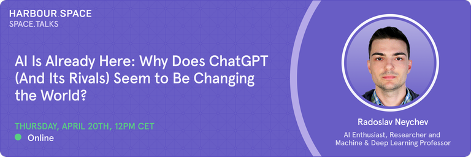

# Announcement

Hello Codeforces!

On [Thursday, April 20, 2023 at 20:35UTC+6](https://codeforces.com/https://www.timeanddate.com/worldclock/fixedtime.html?day=20&month=4&year=2023&hour=17&min=35&sec=0&p1=166) [Educational Codeforces Round 147 (Rated for Div. 2)](https://codeforces.com/contest/1821 "Educational Codeforces Round 147 (Rated for Div. 2)") will start.

Series of Educational Rounds continue being held as [Harbour.Space University](https://codeforces.com/https://harbour.space/) initiative! You can read the details about the cooperation between [Harbour.Space University](https://codeforces.com/https://harbour.space/) and Codeforces in the [blog post](//mirror.codeforces.com/blog/entry/51208).

This round will be **rated for the participants with rating lower than 2100**. It will be held on extended ICPC rules. The penalty for each incorrect submission until the submission with a full solution is 10 minutes. After the end of the contest, you will have 12 hours to hack any solution you want. You will have access to copy any solution and test it locally.

You will be given **6 or 7 problems** and **2 hours** to solve them.

The problems were invented and prepared by Adilbek [adedalic](https://codeforces.com/profile/adedalic "International Master adedalic") Dalabaev, Ivan [BledDest](https://codeforces.com/profile/BledDest "International Grandmaster BledDest") Androsov, Maksim [Neon](https://codeforces.com/profile/Neon "Candidate Master Neon") Mescheryakov and me. Also, huge thanks to Mike [MikeMirzayanov](https://codeforces.com/profile/MikeMirzayanov "Headquarters, MikeMirzayanov") Mirzayanov for great systems Polygon and Codeforces.

Good luck to all the participants!

Our friends at Harbour.Space also have a message for you:

*Hey Codeforces!*

*Are you curious about the latest AI advancements and how they impact our world? Do you want to know more about how AI-based methods, especially in Natural Language Processing, are revolutionizing the way we work and interact with technology?*

*Space.Talks Present: [Radoslav Neychev](https://harbour.space/faculty/radoslav-neychev/?utm_source=codeforces&utm_medium=partner&utm_campaign=&utm_content=radoslav_spacetalk), AI Enthusiast, Researcher, and Machine & Deep Learning Professor.*

*Radoslav, a top-tier data scientist with extensive experience in Deep Learning and Reinforcement learning techniques, is coming to our Harbour.Space Barcelona Campus to give a talk on this topic. If you can't make it there, you can join the conversation, as we will stream it live on our YouTube channel [here](https://codeforces.com/https://youtube.com/live/Hq_XEGt4TVQ).*

*In this Space.Talk, Radoslav will share his expertise on how AI is changing our everyday lives and why it's important for both technical and non-technical specialists to understand the basics of how AI works. Plus, he'll also answer important questions about AI research and its future implications.*

*Mark your calendar for Thursday, April 20th, at 12hrs CET, and join us for an engaging conversation. Whether you're an experienced tech expert or just starting to explore the world of coding, this talk is for you!*

*And remember that we are always looking for the best and brightest! If you want to learn from industry experts like Radoslav, check out the scholarships we are offering and build a brighter future with us!*

  [Learn more here →](https://scholarships.harbour.space/?utm_source=codeforces&utm_medium=partner&utm_campaign=&utm_content=radoslav_spacetalk) **UPD:** [Editorial is out](Tutorial.md) 

