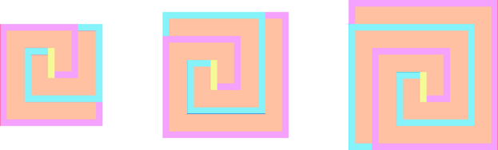

# Tutorial

[1822A - TubeTube Feed](../problems/A._TubeTube_Feed.md "Codeforces Round 867 (Div. 3)")

Idea: [diskoteka](https://codeforces.com/profile/diskoteka "Candidate Master diskoteka"), prepared: [Vladosiya](https://codeforces.com/profile/Vladosiya "Expert Vladosiya")

 **Tutorial**
### [1822A - TubeTube Feed](../problems/A._TubeTube_Feed.md "Codeforces Round 867 (Div. 3)")

This problem can be solved by going through all the options of the video that the Mushroom will choose to watch.

Let the Mushroom choose the i-th video. He can view it if a[i]+i−1 does not exceed t. Since he will have to spend i−1 a second scrolling the TubeTube feed and a[i] watching the video.

As an answer, it is enough to choose a video with the maximum entertainment value from the appropriate ones.

 **Solution**
```cpp
def solve():
    n, t = map(int, input().split())
    a = [int(x) for x in input().split()]
    b = [int(x) for x in input().split()]
    bst = -2
    for i in range(n):
        if i + a[i] <= t and (bst == -2 or b[bst] < b[i]):
            bst = i
    print(bst + 1)
 
 
t = int(input())
for _ in range(t):
    solve()
```
 **Rate the problem*** Didn't solve 


[*29*](https://codeforces.com/data/like?action=like "I like this")
* Good task 

 
[*254*](https://codeforces.com/data/like?action=like "I like this")
* Average task 

 
[*45*](https://codeforces.com/data/like?action=like "I like this")
* Bad task 

 
[*34*](https://codeforces.com/data/like?action=like "I like this")
[1822B - Karina and Array](../problems/B._Karina_and_Array.md "Codeforces Round 867 (Div. 3)")

Idea: [playerr17](https://codeforces.com/profile/playerr17 "Expert playerr17"), prepared: [playerr17](https://codeforces.com/profile/playerr17 "Expert playerr17")

 **Tutorial**
### [1822B - Karina and Array](../problems/B._Karina_and_Array.md "Codeforces Round 867 (Div. 3)")

In the problem, we are not required to minimize the number of deletions, so we will search for the answer greedily.

First, let's find two numbers in the array whose product is maximal. Note that the product of this pair of numbers will be the answer, since we can remove all elements from the array except this pair, then they will become neighboring.

It is easy to see that the product of a pair of positive numbers is maximal when both numbers in the pair are maximal. So we need to consider the product of the two largest numbers. But it's worth remembering that the product of two negative numbers is positive, so the product of the two smallest numbers is also worth considering. The answer to the problem will be the maximum of these two products.

To find the two largest and two smallest numbers, you can simply sort the array. The final asymptotics of the solution will be O(nlogn).

 **Solution**
```cpp
t = int(input())
 
for testCase in range(t):
    n = int(input())
    a = list(map(int, input().split(' ')))
    a.sort()
    print(max(a[0] * a[1], a[-1] * a[-2]))
```
 **Rate the problem*** Didn't solve 

 
[*3*](https://codeforces.com/data/like?action=like "I like this")
* Good task 

 
[*219*](https://codeforces.com/data/like?action=like "I like this")
* Average task 

 
[*50*](https://codeforces.com/data/like?action=like "I like this")
* Bad task 

 
[*14*](https://codeforces.com/data/like?action=like "I like this")
[1822C - Bun Lover](../problems/C._Bun_Lover.md "Codeforces Round 867 (Div. 3)")

Idea: [diskoteka](https://codeforces.com/profile/diskoteka "Candidate Master diskoteka"), prepared: [diskoteka](https://codeforces.com/profile/diskoteka "Candidate Master diskoteka")

 **Tutorial**
### [1822C - Bun Lover](../problems/C._Bun_Lover.md "Codeforces Round 867 (Div. 3)")

Let's separate the complex chocolate layer into three simple parts. 

  Note that the cyan and lilac parts can be turned into polylines with links of increasing length (1,2,3…), if the last link is 'straightene' so that it complements the penultimate one.Now it is not difficult to calculate the total length of the three parts.

The length of the light-yellow segment 1.

Length of the cyan polyline 1+2+⋯+n=n⋅(n+1)2.

Length of the lilac polyline 1+2+⋯+(n+1)=(n+1)⋅(n+2)2.

Total length of chocolate (n+1)⋅(n+2)2+n⋅(n+1)2+1=(n+1)⋅(n+2)+n⋅(n+1)2+1=2⋅(n+1)22+1=(n+1)2+1

 **Solution**
```cpp
#include <bits/stdc++.h>

using namespace std;

#define int long long

int32_t main() {
    int q;
    cin >> q;
    while (q--) {
        int n;
        cin >> n;
        cout << ((n + 1) * n) + n + 2 << "n";
    }
    return 0;
}
```
 **Rate the problem*** Didn't solve 

 
[*9*](https://codeforces.com/data/like?action=like "I like this")
* Good task 

 
[*163*](https://codeforces.com/data/like?action=like "I like this")
* Average task 

 
[*53*](https://codeforces.com/data/like?action=like "I like this")
* Bad task 

 
[*181*](https://codeforces.com/data/like?action=like "I like this")
[1822D - Super-Permutation](../problems/D._Super-Permutation.md "Codeforces Round 867 (Div. 3)")

Idea: [isosto](https://codeforces.com/profile/isosto "Candidate Master isosto"), [pavlekn](https://codeforces.com/profile/pavlekn "Master pavlekn"), prepared: [diskoteka](https://codeforces.com/profile/diskoteka "Candidate Master diskoteka")

 **Tutorial**
### [1822D - Super-Permutation](../problems/D._Super-Permutation.md "Codeforces Round 867 (Div. 3)")

Let k be the position of the number n in the permutation a, that is, ak=n, then if k>1, then b_k = (b_{k-1} + a_k) \mod n = b_{k-1} therefore, b is not a permutation, so k = 1. 

Now note that if n > 1 is odd, then b_n = (a_1~+~a_2~+~\dots~+~a_n) \mod n = (1 +2 +~\dots~+ n) \mod n= n \cdot\frac{(n + 1)}{2} \mod n = 0 = b_1. So there is no answer.

If n is even, then one possible example would be a = [n,~1,~n-2,~3,~n-4,~5,~\dots,~n - 1,~2], since then b = [0,~1,~n-1,~2,~n-2,~3,~n-3,~\dots,~\frac{n}{2}].

 **Solution**
```cpp
#include <bits/stdc++.h>

using namespace std;

int main() {
    int q;
    cin >> q;
    while (q--) {
        int n;
        cin >> n;
        if (n == 1) {
            cout << "1n";
            continue;
        }
        if (n % 2) {
            cout << "-1n";
        } else {
            for (int i = 0; i < n; ++i) {
                if (i % 2) {
                    cout << i << " ";
                } else {
                    cout << n - i << " ";
                }
            }
            cout << "n";
        }
    }
    return 0;
}
```
 **Rate the problem*** Didn't solve 

 
[*155*](https://codeforces.com/data/like?action=like "I like this")
* Good task 

 
[*282*](https://codeforces.com/data/like?action=like "I like this")
* Average task 

 
[*55*](https://codeforces.com/data/like?action=like "I like this")
* Bad task 

 
[*450*](https://codeforces.com/data/like?action=like "I like this")
[1822E - Making Anti-Palindromes](../problems/E._Making_Anti-Palindromes.md "Codeforces Round 867 (Div. 3)")

Idea: [pavlekn](https://codeforces.com/profile/pavlekn "Master pavlekn"), prepared: [pavlekn](https://codeforces.com/profile/pavlekn "Master pavlekn")

 **Tutorial**
### [1822E - Making Anti-Palindromes](../problems/E._Making_Anti-Palindromes.md "Codeforces Round 867 (Div. 3)")

If n is odd, then there is no solution, since s[(n + 1) / 2] = s[(n + 1) - (n + 1) / 2].

If n is even, then all symbols are split into pairs s[i], s[n + 1 - i]. Let's denote the number of occurrences of the symbol c as cnt[c].

Note that if cnt[c] > n / 2 for some c, then after applying the operations there will be a pair where both characters are equal to c, then it is impossible to make the string s anti-palindrome.

Otherwise, we will calculate k — the number of pairs, where s[i] = s[n + 1 - i], we will also find m — the maximum number of pairs, where s[i] = s[n + 1 - i] = c, for all characters c. Let x be a symbol for which the number of such pairs is equal to m. Note that ans\ge m, because in one operation the number of pairs where s[i] = s[n + 1 - i] = x cannot decrease by more than 1. Also note that ans \ge \lceil \frac{k}{2} \rceil, because for each operation we reduce the number of pairs where s[i] = s[n + 1 - i] by no more than 2. It turns out that ans = max(m, \lceil \frac{k}{2} \rceil), to show this, you can act greedily — until k > 0: 

* If k=m, then we find a pair s[i] = s[n + 1 - i] = x, since cnt[x] \le n / 2, then there is a pair where s[j] \ne x and s[n + 1 - j] \ne x. Then swap s[i] and s[j].
* Otherwise, find the pair s[i] = s[n + 1 - i] = x, and the pair s[j] = s[n + 1 - j] \ne x. Then swap s[i] and s[j].

It is not difficult to check that in both cases, max(m, \lceil k/2\rceil) will decrease by exactly 1, which means ans is achieved with this algorithm.

 **Solution**
```cpp
#include <bits/stdc++.h>

using namespace std;

void solve(int n, string & s) {
    if (n % 2 == 1) {
        cout << -1 << endl;
        return;
    }
    vector<int> cnt(26);
    for (int i = 0; i < n; ++i) {
        ++cnt[s[i] - 'a'];
    }
    for (int i = 0; i < 26; ++i) {
        if (cnt[i] * 2 > n) {
            cout << -1 << endl;
            return;
        }
    }
    int pairs = 0;
    vector<int> cnt_pairs(26);
    for (int i = 0; i * 2 < n; ++i) {
        if (s[i] == s[n - i - 1]) {
           ++pairs;
           ++cnt_pairs[s[i] - 'a'];
        }
    }
    for (int i = 0; i < 26; ++i) {
        if (cnt_pairs[i] * 2 > pairs) {
            cout << cnt_pairs[i] << endl;
            return;
        }
    }
    cout << (pairs + 1) / 2 << endl;
}

int32_t main() {
    int t;
    cin >> t;
    for (int _ = 0; _ < t; ++_) {
        int n;
        cin >> n;
        string s;
        cin >> s;
        solve(n, s);
    }
}
```
 **Rate the problem*** Didn't solve 

 
[*125*](https://codeforces.com/data/like?action=like "I like this")
* Good task 

 
[*315*](https://codeforces.com/data/like?action=like "I like this")
* Average task 

 
[*24*](https://codeforces.com/data/like?action=like "I like this")
* Bad task 

 
[*36*](https://codeforces.com/data/like?action=like "I like this")
[1822F - Gardening Friends](../problems/F._Gardening_Friends.md "Codeforces Round 867 (Div. 3)")

Idea: [playerr17](https://codeforces.com/profile/playerr17 "Expert playerr17"), prepared: [playerr17](https://codeforces.com/profile/playerr17 "Expert playerr17")

 **Tutorial**
### [1822F - Gardening Friends](../problems/F._Gardening_Friends.md "Codeforces Round 867 (Div. 3)")

Let's first calculate its depth for each vertex. Let for a vertex v its depth is depth[v]. All the values of depth[v] can be calculated by a single depth-first search.

We introduce several auxiliary quantities. Let for vertex v the values down_1[v], down_2[v] are the two largest distances to the leaves in the subtree of vertex v of the source tree. We will also introduce the value up[v] - the maximum distance to the leaf outside the subtree of the vertex v.

The values of down_1[v] and down_2[v] are easily recalculated by walking up the tree from the bottom and maintaining two maximum distances to the leaves.

Let p be the ancestor of the vertex v. Then to recalculate up[v], you need to go up to p and find the maximum distance to a leaf outside the subtree v. If the leaf farthest from p is in the subtree v, then you will need to take down_2[p], otherwise down_1[p].

For v, we define the maximum distance to the leaf, as dist[v] = max(down_1[v], up[v]).

Now let's calculate for each vertex v the cost of the tree if v becomes the root. It is not profitable for us to take extra steps, so the cost of operations will be equal to c\cdot depth[v]. Then the cost of the tree will be equal to the value of k\cdot dist[v] - c\cdot depth[v].

It remains to go through all the vertices, take the maximum of the tree values and get an answer. It is easy to see that such a solution works for O(n).

 **Solution**
```cpp
#include<bits/stdc++.h>

using namespace std;

struct Value {
    int64_t value = 0;
    int vertex = 0;
};

vector<vector<int>> nei;
vector<vector<int>> depth_vertex;
vector<int> depth;
vector<int> parent;

void dfs(int v, int p = -1, int cnt = 0) {
    depth_vertex[cnt].push_back(v);
    depth[v] = cnt;
    parent[v] = p;
    for (int u : nei[v]) {
        if (u == p) continue;
        dfs(u, v, cnt + 1);
    }
}

void solve() {
    int n, root = 1;
    int64_t k_wei, cost;
    cin >> n >> k_wei >> cost;

    nei.clear();
    nei.resize(n + 1);
    depth_vertex.clear();
    depth_vertex.resize(n + 1);
    depth.clear();
    depth.resize(n + 1);
    parent.clear();
    parent.resize(n + 1);

    for (int _ = 0; _ < n - 1; ++_) {
        int u, v;
        cin >> u >> v;
        nei[u].push_back(v);
        nei[v].push_back(u);
    }

    dfs(root);

    vector<pair<Value, Value>> down(n + 1);

    for (int tin = n; tin >= 0; --tin) {
        for (int v : depth_vertex[tin]) {
            for (int u : nei[v]) {
                if (u == parent[v]) continue;
                if (down[u].first.value + 1 > down[v].first.value) {
                    down[v].first.value = down[u].first.value + 1;
                    down[v].first.vertex = u;
                }
            }
            for (int u : nei[v]) {
                if (u == parent[v] || u == down[v].first.vertex) continue;
                if (down[u].first.value + 1 > down[v].second.value) {
                    down[v].second.value = down[u].first.value + 1;
                }
            }
        }
    }

    vector<int64_t> up(n + 1, 0);

    for (int tin = 1; tin <= n; ++tin) {
        for (int v : depth_vertex[tin]) {
            int p = parent[v];
            up[v] = up[p] + 1;
            if (down[p].first.vertex == v) {
                up[v] = max(up[v], down[p].second.value + 1);
            } else {
                up[v] = max(up[v], down[p].first.value + 1);
            }
        }
    }

    int64_t ans = -1'000'000'000'000'000'002;

    for (int v = 1; v <= n; ++v) {
        ans = max(ans, k_wei * max(up[v], down[v].first.value) - cost * int64_t(depth[v]));
    }

    cout << ans << endl;

}

int main()
{
    int t;
    cin >> t;
    for (int _ = 1; _ <= t; ++_) {
        solve();
    }
    return 0;
}
```
 **Rate the problem*** Didn't solve 

 
[*31*](https://codeforces.com/data/like?action=like "I like this")
* Good task 

 
[*264*](https://codeforces.com/data/like?action=like "I like this")
* Average task 

 
[*21*](https://codeforces.com/data/like?action=like "I like this")
* Bad task 

 
[*20*](https://codeforces.com/data/like?action=like "I like this")
[1822G1 - Magic Triples (Easy Version)](../problems/G1._Magic_Triples_(Easy_Version).md "Codeforces Round 867 (Div. 3)")

Idea: [pavlekn](https://codeforces.com/profile/pavlekn "Master pavlekn"), prepared: [pavlekn](https://codeforces.com/profile/pavlekn "Master pavlekn")

 **Tutorial**
### [1822G1 - Magic Triples (Easy Version)](../problems/G1._Magic_Triples_(Easy_Version).md "Codeforces Round 867 (Div. 3)")

Let M = \max {a_i}, obviously M\le 10^6, cnt[x] — the number of occurrences of the number x in the array a.

Separately, let's count the number of magic triples for b=1. The total number of such triples will be \sum_{i=1}^{n}{(cnt[a_i] - 1) \cdot (cnt[a_i] - 2)}.

Next, we will count b\ge 2. Note that a_i \cdot b \cdot b = a_k, so b \le \sqrt{a_k /a_i} \le \sqrt{M}. Thus, after sorting through all possible i from 1 to n, as well as all b\le\sqrt{M} and adding cnt[a_i\cdot b] \cdot cnt[a_i\cdot b\cdot b] to the answer, we get a solution for O(\sqrt{M}\cdot n).

 **Solution**
```cpp
#include <bits/stdc++.h>

using namespace std;

#define int long long

const int MAX_VAL = 1e6;

int cnt[MAX_VAL + 1];

int32_t main() {
    int t;
    cin >> t;
    for (int _ = 0; _ < t; ++_) {
        int n;
        cin >> n;
        vector<int> a(n);
        for (int i = 0; i < n; ++i) {
            cin >> a[i];
            ++cnt[a[i]];
        }
        int ans = 0;
        for (int i = 0; i < n; ++i) {
            ans += (cnt[a[i]] - 1) * (cnt[a[i]] - 2);
            for (int b = 2; a[i] * b * b <= MAX_VAL; ++b) {
                ans += cnt[a[i] * b] * cnt[a[i] * b * b];
            }
        }
        cout << ans << "n";
        for (int i = 0; i < n; ++i) {
            --cnt[a[i]];
        }
    }
    return 0;
}
```
 **Rate the problem*** Didn't solve 

 
[*29*](https://codeforces.com/data/like?action=like "I like this")
* Good task 

 
[*240*](https://codeforces.com/data/like?action=like "I like this")
* Average task 

 
[*19*](https://codeforces.com/data/like?action=like "I like this")
* Bad task 

 
[*29*](https://codeforces.com/data/like?action=like "I like this")
[1822G2 - Magic Triples (Hard Version)](../problems/G2._Magic_Triples_(Hard_Version).md "Codeforces Round 867 (Div. 3)")

Idea: [pavlekn](https://codeforces.com/profile/pavlekn "Master pavlekn"), prepared: [pavlekn](https://codeforces.com/profile/pavlekn "Master pavlekn")

 **Tutorial**
### [1822G2 - Magic Triples (Hard Version)](../problems/G2._Magic_Triples_(Hard_Version).md "Codeforces Round 867 (Div. 3)")

Let M = \max {a_i}, obviously M \le 10^9, cnt[x] — the number of occurrences of the number x in the array a.

Separately, let's count the number of magic triples for b=1. The total number of such triples will be \sum_{i=1}^{n}{(cnt[a_i] - 1) \cdot (cnt[a_i] - 2)}. Next, we will count b \ge 2. We will iterate over a_j, if a_j \ge M ^ \frac{2}{3}, then a_j \cdot b = a_k \le M, then b\le M^\frac{1}{3}. Otherwise, a_j \le M^\frac{2}{3}, since a_i \cdot b = a_j, then b is a divisor of a_j, which means it is enough to iterate as b the divisors of the number a_j, the divisors of such the numbers can be found for O(M^\frac{1}{3}), which means the total complexity will be O(n\cdot M^\frac{1}{3}) if you use the hash table cnt[x], or O(n\cdot M^\frac{1}{3}\cdot\log{n}) if you use std::map.

 **Solution**
```cpp
#include <bits/stdc++.h>

using namespace std;

typedef long long ll;

const int K = 1e6;
const int MAX_VAL = 1e9;

int32_t main() {
    int t;
    scanf("%d", &t);
    for (int _ = 0; _ < t; ++_) {
        int n;
        scanf("%d", &n);
        vector<int> a(n);
        map<int, int> cnt;
        for (int i = 0; i < n; ++i) {
            scanf("%d", &a[i]);
            ++cnt[a[i]];
        }
        ll ans = 0;
        for (int i = 0; i < n; ++i) {
            ans += (ll)(cnt[a[i]] - 1) * (cnt[a[i]] - 2);
        }
        for (auto el : cnt) {
            int num = el.first;
            int val = el.second;
            if (num > K) {
                for (int b = 2; b * num <= MAX_VAL; ++b) {
                    if (num % b == 0 && cnt.find(num / b) != cnt.end() && cnt.find(num * b) != cnt.end()) {
                        ans += (ll)(cnt[num / b]) * (cnt[num * b]) * val;
                    }
                }
            } else {
                for (int b = 2; b * b <= num; ++b) {
                    if (num % b == 0) {
                        if ((ll)num * b <= (ll)MAX_VAL && cnt.find(num / b) != cnt.end() && cnt.find(num * b) != cnt.end()) {
                            ans += (ll)(cnt[num / b]) * (cnt[num * b]) * val;
                        }
                        if (b * b != num) {
                            if ((ll)num * num / b <= (ll)MAX_VAL && cnt.find(b) != cnt.end() && cnt.find(num / b * num) != cnt.end()) {
                                ans += (ll)(cnt[b]) * (cnt[num / b * num]) * val;
                            }
                        }
                    }
                }
                if (num > 1 && (ll)num * num <= (ll)MAX_VAL && cnt.find(1) != cnt.end() && cnt.find(num * num) != cnt.end()) {
                    ans += (ll)(cnt[1]) * (cnt[num * num]) * val;
                }
            }
        }
        printf("%lldn", ans);
    }
    return 0;
}
```
 **Rate the problem*** Didn't solve 

 
[*58*](https://codeforces.com/data/like?action=like "I like this")
* Good task 

 
[*131*](https://codeforces.com/data/like?action=like "I like this")
* Average task 

 
[*10*](https://codeforces.com/data/like?action=like "I like this")
* Bad task 

 
[*54*](https://codeforces.com/data/like?action=like "I like this")
