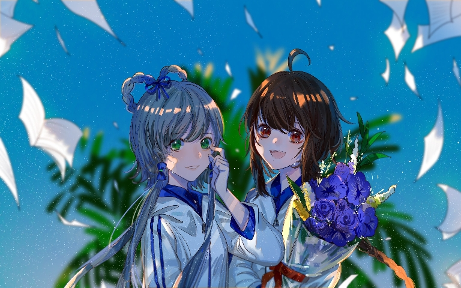

# Announcement_(en)

Hello Codeforces! （你好，代码部队）

We are glad to invite you to participate in [Codeforces Round 872 (Div. 1)](https://codeforces.com/contest/1824 "Codeforces Round 872 (Div. 1)") and [Codeforces Round 872 (Div. 2)](https://codeforces.com/contest/1825 "Codeforces Round 872 (Div. 2)") on [Monday, May 8, 2023 at 18:05UTC+6](https://codeforces.com/https://www.timeanddate.com/worldclock/fixedtime.html?day=8&month=5&year=2023&hour=15&min=5&sec=0&p1=166). **Please note the unusual start time.**

This round is rated for **all the participants**. You will be given 5 problems (one of which is divided into two subtasks) and 2 hours to solve them in each division. 

Assume you are [YuezhengLing](https://codeforces.com/profile/YuezhengLing "Grandmaster YuezhengLing"), and in this round, your best friend [LuoTianYi](https://codeforces.com/profile/LuoTianYi "Candidate Master LuoTianYi") will give you several problems to solve.

([LuoTianYi](https://codeforces.com/profile/LuoTianYi "Candidate Master LuoTianYi") is the left one and [YuezhengLing](https://codeforces.com/profile/YuezhengLing "Grandmaster YuezhengLing") is the right one)

We would like to thank:

 1. [RedLycoris](https://codeforces.com/profile/RedLycoris "Master RedLycoris"), [CrTsIr](https://codeforces.com/profile/CrTsIr "Grandmaster CrTsIr"), [Gyy_cj](https://codeforces.com/profile/Gyy_cj "Newbie Gyy_cj"), [SanweiTreap](https://codeforces.com/profile/SanweiTreap "International Master SanweiTreap") and [Atomic-Jellyfish](https://codeforces.com/profile/Atomic-Jellyfish "Grandmaster Atomic-Jellyfish") for writing the problems.
2. [Artyom123](https://codeforces.com/profile/Artyom123 "Grandmaster Artyom123") for coordinating the round.
3. [MikeMirzayanov](https://codeforces.com/profile/MikeMirzayanov "Headquarters, MikeMirzayanov") for great Codeforces and Polygon platforms.
4. [He_Ren](https://codeforces.com/profile/He_Ren "Legendary Grandmaster He_Ren"), [orzdevinwang](https://codeforces.com/profile/orzdevinwang "Legendary Grandmaster orzdevinwang") for our red suns testing the round.
5. [Qingyu](https://codeforces.com/profile/Qingyu "International Grandmaster Qingyu"), [zimpha](https://codeforces.com/profile/zimpha "Grandmaster zimpha"), [themoon](https://codeforces.com/profile/themoon "Grandmaster themoon"), [Crying](https://codeforces.com/profile/Crying "Grandmaster Crying"), [rui_er](https://codeforces.com/profile/rui_er "Grandmaster rui_er"), [Kevin114514](https://codeforces.com/profile/Kevin114514 "International Grandmaster Kevin114514"), [Lynkcat](https://codeforces.com/profile/Lynkcat "Grandmaster Lynkcat"), [lgswdn](https://codeforces.com/profile/lgswdn "Grandmaster lgswdn"), [FreshP_0325](https://codeforces.com/profile/FreshP_0325 "Grandmaster FreshP_0325"), [Umi](https://codeforces.com/profile/Umi "Grandmaster Umi") for red testing the round.
6. [KbltQaQ](https://codeforces.com/profile/KbltQaQ "Master KbltQaQ"), [LHQing](https://codeforces.com/profile/LHQing "Master LHQing"), [Forever_Pursuit](https://codeforces.com/profile/Forever_Pursuit "International Master Forever_Pursuit"), [NemanjaSo2005](https://codeforces.com/profile/NemanjaSo2005 "Master NemanjaSo2005"), [geospiza](https://codeforces.com/profile/geospiza "Master geospiza"), [Kohaku](https://codeforces.com/profile/Kohaku "Master Kohaku"), [maoweishou](https://codeforces.com/profile/maoweishou "Master maoweishou"), [welleyth](https://codeforces.com/profile/welleyth "Master welleyth"), [EasonTAO](https://codeforces.com/profile/EasonTAO "Master EasonTAO"), [Rushroom](https://codeforces.com/profile/Rushroom "Master Rushroom"), [Gheal](https://codeforces.com/profile/Gheal "Master Gheal"), [rsj](https://codeforces.com/profile/rsj "Master rsj") for orange testing the round.
7. [Error_Yuan](https://codeforces.com/profile/Error_Yuan "Candidate Master Error_Yuan"), [fishy15](https://codeforces.com/profile/fishy15 "Candidate Master fishy15"), [Lyrically](https://codeforces.com/profile/Lyrically "Candidate Master Lyrically"). [valeriu](https://codeforces.com/profile/valeriu "Candidate Master valeriu"), [yash_0402](https://codeforces.com/profile/yash_0402 "Candidate Master yash_0402"), [smokebellew](https://codeforces.com/profile/smokebellew "Candidate Master smokebellew") for purple testing the round.
8. [LRL65](https://codeforces.com/profile/LRL65 "Expert LRL65"), [ayhan23](https://codeforces.com/profile/ayhan23 "Expert ayhan23"), [Zhangxuyang](https://codeforces.com/profile/Zhangxuyang "Expert Zhangxuyang"), [Koful123](https://codeforces.com/profile/Koful123 "Expert Koful123"), [playerr17](https://codeforces.com/profile/playerr17 "Expert playerr17"), [AhmedEzzatG](https://codeforces.com/profile/AhmedEzzatG "Expert AhmedEzzatG") for blue testing the round.
9. [zhy137036](https://codeforces.com/profile/zhy137036 "Pupil zhy137036") for green testing the round.
10. [tibinyte](https://codeforces.com/profile/tibinyte "Newbie tibinyte") for gray testing the round.
11. [You](https://codeforces.com/profile/) for participating in this round.

**UPD: Scoring distribution:**

Div.1: 500 – (500+750) – 1750 – 2250 – 3000

Div.2: 500 – 1000 – 1500 – (1000+1250) – 2750

**UPD**: Editorial is available [here](Tutorial_(en).md)

**UPD**: **Winners**!

**Div 2:**

 * [Hex_10EFFB_](https://codeforces.com/profile/Hex_10EFFB_ "Expert Hex_10EFFB_")
* [cyfmd](https://codeforces.com/profile/cyfmd "Expert cyfmd")
* [sinsop90](https://codeforces.com/profile/sinsop90 "Specialist sinsop90")
* [Yuki__S2008](https://codeforces.com/profile/Yuki__S2008 "Expert Yuki__S2008")
* [gujialiang123](https://codeforces.com/profile/gujialiang123 "Expert gujialiang123")

**Div 1:**

 * [jiangly](https://codeforces.com/profile/jiangly "Legendary Grandmaster jiangly")
* [maroonrk](https://codeforces.com/profile/maroonrk "Legendary Grandmaster maroonrk")
* [huzhaoyang](https://codeforces.com/profile/huzhaoyang "International Grandmaster huzhaoyang")
* [Um_nik](https://codeforces.com/profile/Um_nik "Legendary Grandmaster Um_nik")
* [wangziji](https://codeforces.com/profile/wangziji "International Grandmaster wangziji")
