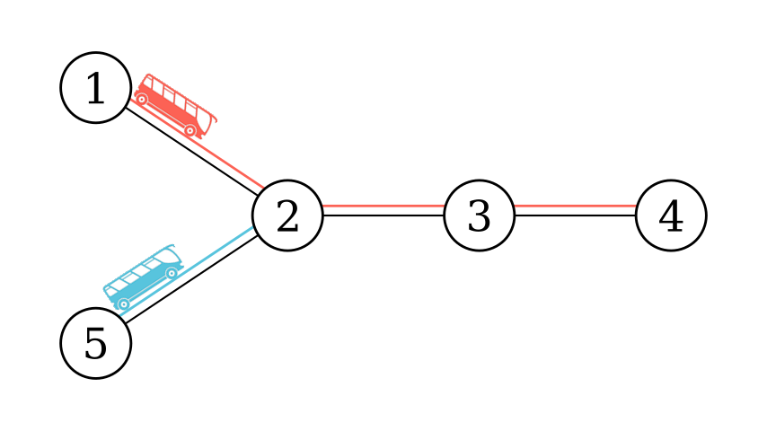
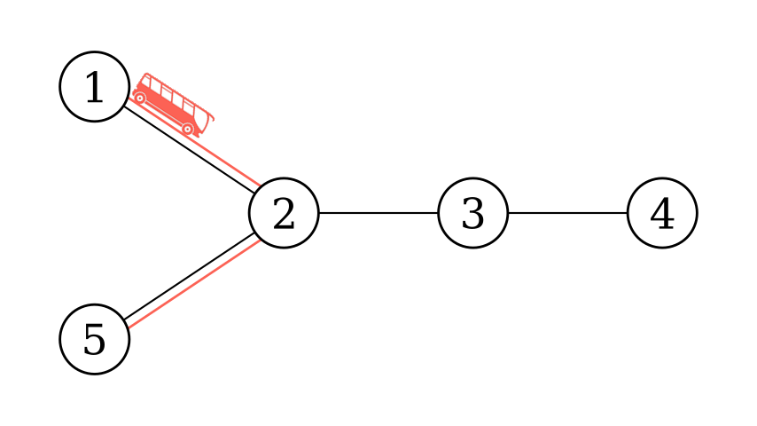
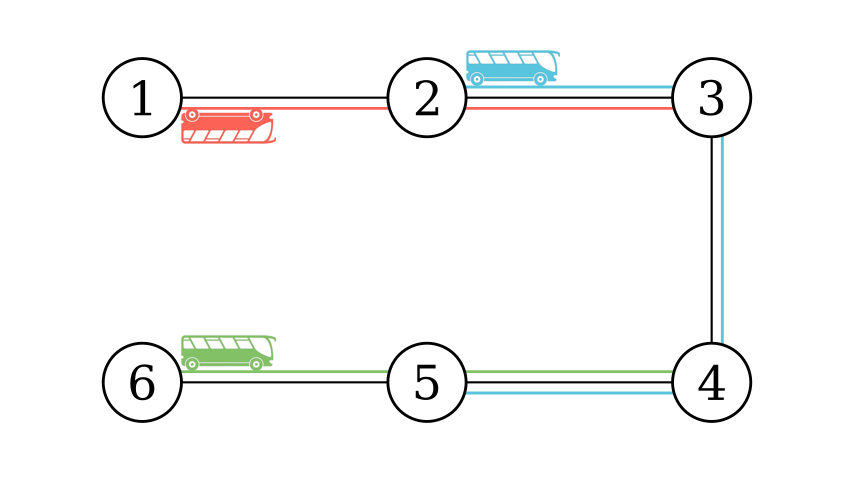

<h1 style='text-align: center;'> E. Bus Routes</h1>

<h5 style='text-align: center;'>time limit per test: 2.5 seconds</h5>
<h5 style='text-align: center;'>memory limit per test: 1024 megabytes</h5>

There is a country consisting of $n$ cities and $n - 1$ bidirectional roads connecting them such that we can travel between any two cities using these roads. In other words, these cities and roads form a tree.

There are $m$ bus routes connecting the cities together. A bus route between city $x$ and city $y$ allows you to travel between any two cities in the simple path between $x$ and $y$ with this route.

Determine if for every pair of cities $u$ and $v$, you can travel from $u$ to $v$ using at most two bus routes.

### Input

Each test contains multiple test cases. The first line contains the number of test cases $t$ ($1 \le t \le 10^4$). The description of the test cases follows.

The first line of each test case contains two integers $n$ and $m$ ($2 \le n \le 5 \cdot 10^5, 0 \le m \le 5 \cdot 10^5$) — the number of cities and the number of bus routes.

Then $n - 1$ lines follow. Each line contains two integers $u$ and $v$ denoting a road connecting city $u$ and city $v$ ($1 \le u, v \le n, u \neq v$). It is guaranteed that these cities and roads form a tree.

Then $m$ lines follow. Each line contains two integers $x$ and $y$ denoting a bus route between city $x$ and city $y$ ($1 \le x, y \le n$).

It is guaranteed that the sum of $n$ over all test cases does not exceed $5 \cdot 10^5$ and the sum of $m$ over all test cases does not exceed $5 \cdot 10^5$.

### Output

For each test case, output "YES" if you can travel between any pair of cities using at most two bus routes.

Otherwise, output "NO". In the next line, output two cities $x$ and $y$ ($1 \le x, y \le n$) such that it is impossible to reach city $y$ from city $x$ using at most two bus routes.

You can output the answer in any case (upper or lower). For example, the strings "yEs", "yes", "Yes", and "YES" will be recognized as positive responses.

## Example

### Input


```text
45 21 22 33 42 51 45 25 11 22 33 42 51 52 01 26 31 22 33 44 55 61 32 54 6
```
### Output

```text

YES
NO
1 3
NO
1 2
NO
1 6
```
## Note

Here are the graphs of test case $1$, $2$, and $4$:

  Sample 1   Sample 2   Sample 4 

#### Tags 

#3400 #NOT OK #binary_search #constructive_algorithms #dfs_and_similar #greedy #trees 

## Blogs
- [All Contest Problems](../Codeforces_Round_873_(Div._1).md)
- [Announcement (en)](../blogs/Announcement_(en).md)
- [Tutorial (en)](../blogs/Tutorial_(en).md)
