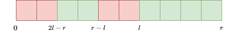
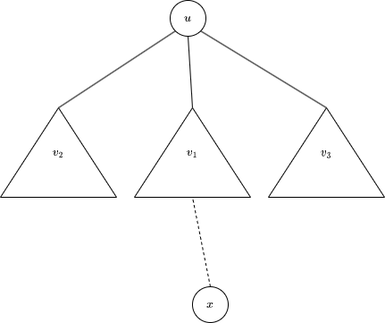
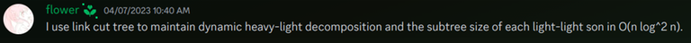
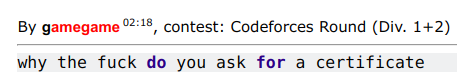

# Tutorial_(en)

[1828A - Divisible Array](../problems/A._Divisible_Array.md "Codeforces Round 873 (Div. 2)")
---------------------------------------------------------------------------------------------------------

Idea: [thenymphsofdelphi](https://codeforces.com/profile/thenymphsofdelphi "International Grandmaster thenymphsofdelphi")   
 Preparation: [Mike4235](https://codeforces.com/profile/Mike4235 "Master Mike4235")

 **Hint 1**Remember the sum of the first n positive integers?

 **Hint 2**Every positive integer is divisible by 1.

 **Solution**Consider the array a=[1,2,…,n] that satisfies the second condition. It has the sum of 1+2+⋯+n=n(n+1)2.

One solution is to notice that if we double every element (a=[2,4,6,…,2n]), the sum becomes n(n+1)2×2=n(n+1), which is divisible by n.

Another solution is to increase the value of a1 until the sum becomes divisible by n. This works because every integer is divisible by 1, and we only need to increase a1 by at most n.

Time complexity: O(n)

 **Implementation 1**
```cpp
#include <bits/stdc++.h>
 
using namespace std;
 
int main() {
    
    ios_base::sync_with_stdio(false); cin.tie(NULL); cout.tie(NULL);
 
    int t;
    cin >> t;
    while (t--) {
    	int n;
    	cin >> n;
    	for (int i = 1; i <= n; i++) cout << i * 2 << " ";
    	cout << "n";
    }
}
```
 **Implementation 2**
```cpp
#include<bits/stdc++.h>
using namespace std;
typedef long long ll;
#define fi first
#define se second
const int N=2e6+1;
const ll mod=998244353;
ll n,m;
ll a[N],b[N];
void solve(){
	cin >> n;
	ll s=0;
	for(int i=n; i>=2 ;i--){
		a[i]=i;
		s=(s+i)%n;
	}
	a[1]=n-s;
	for(int i=1; i<=n ;i++) cout << a[i] << ' ';
	cout << 'n';
}
int main(){
	ios::sync_with_stdio(false);cin.tie(0);
	int t;cin >> t;
	while(t--){
		solve();
	}
}
```
[1828B - Permutation Swap](../problems/B._Permutation_Swap.md "Codeforces Round 873 (Div. 2)")
----------------------------------------------------------------------------------------------------------

Idea: [thenymphsofdelphi](https://codeforces.com/profile/thenymphsofdelphi "International Grandmaster thenymphsofdelphi")   
 Preparation: [Mike4235](https://codeforces.com/profile/Mike4235 "Master Mike4235")

 **Hint 1**In order to move pi to its right position, what does the value of k have to satisfy?

 **Solution**In order to move pi to position i, it is easy to see that |pi−i| has to be divisible by k.

So, |p1−1|,|p2−2|,…,|pn−n| has to be all divisible by k. The largest possible value of k turns out to be the [greatest common divisor](https://codeforces.com/https://en.wikipedia.org/wiki/Greatest_common_divisor) of integers |p1−1|,|p2−2|,…,|pn−n|.

Time complexity: O(n+logn)

 **Implementation**
```cpp
#include <bits/stdc++.h>
 
using namespace std;
 
signed main() {
    
    ios_base::sync_with_stdio(false); cin.tie(NULL); cout.tie(NULL);
 
    int t;
    cin >> t;
    while (t--) {
    	int n, res = 0;
    	cin >> n;
    	for (int i = 1; i <= n; i++) {
    		int x; cin >> x;
    		res = __gcd(res, abs(x - i));
    	}
    	cout << res << "n";
    }
    
}
```
[1827A - Counting Orders](https://codeforces.com/contest/1827/problem/A "Codeforces Round 873 (Div. 1)")
---------------------------------------------------------------------------------------------------------

Idea: [Mike4235](https://codeforces.com/profile/Mike4235 "Master Mike4235")   
 Preparation: [thenymphsofdelphi](https://codeforces.com/profile/thenymphsofdelphi "International Grandmaster thenymphsofdelphi")

 **Hint 1**Sort the array b, and fix the values from an to a1.

 **Solution**First, we can sort the array b, as it does not change the answer.

Let's try to choose the values of a from an to a1. How many ways are there to choose the value of ai?

The new ai must satisfies ai>bi. But some of the candidates are already chosen as aj for some j>i. However, since aj>bj≥bi, we know that there are exactly (n−i) candidates already chosen previously by all values of j>i. So, there are (number of k such that ak>bi) −(n−i) ways to choose the value of ai.

We can use two pointers or binary search to efficiently find the (number of k such that ak>bi) for all i.

Time complexity: O(nlogn).

 **Implementation**
```cpp
#include <bits/stdc++.h>
using namespace std;
typedef long long ll;
const int MOD = 1e9 + 7;

struct testcase{
    testcase(){
        int n; cin >> n;
        vector<int> a(n);
        for (int i=0; i<n; i++) cin >> a[i];
        sort(a.begin(), a.end());
        vector<int> b(n);
        for (int i=0; i<n; i++) cin >> b[i];
        sort(b.begin(), b.end(), greater<>());
        ll result = 1;
        for (int i=0; i<n; i++){
            int geq_count = a.size() - (upper_bound(a.begin(), a.end(), b[i]) - a.begin());
            result = result * max(geq_count - i, 0) % MOD;
        }
        cout << result << "n";
    }
};

signed main(){
    cin.tie(0)->sync_with_stdio(0);
    int t; cin >> t;
    while (t--) testcase();
}
```
[1827B2 - Range Sorting (Hard Version)](https://codeforces.com/contest/1827/problem/B2 "Codeforces Round 873 (Div. 1)")
------------------------------------------------------------------------------------------------------------------------

Idea: [lanhf](https://codeforces.com/profile/lanhf "Master lanhf")   
 Preparation: [Mike4235](https://codeforces.com/profile/Mike4235 "Master Mike4235")

 **Hint 1**What is the minimum cost to sort just one subarray?

 **Hint 2**What happens when two operations intersect each other?

 **Hint 3**When can we sort two adjacency ranges independently?

 **Hint 4**Try to calculate the contribution of each position.

 **Solution**Let a[l..r] denotes the subarray al,al+1,…,ar.

**Observation 1**: In an optimal sequence of operations for one subarray, there will be no two operations that intersect each other. In other words, a subarray will be divided into non-overlapping subarrays, and we will apply a range-sort operation to each subarray.

*Proof*: Suppose there are two operations [l1,r1] and [l2,r2] that intersect each other, we can replace them with one operation [min(l1,l2),max(r1,r2)] which does not increase the cost.

**Observation 2**: Consider k positions l≤i1<i2<…<ik<r, then we can sort subarrays a[l..i1], a[i1+1..i2], …, a[ik+1..r] independently iff max(a[l..ix])<min(a[ix+1..r]) for all 1≤x≤k.

*Proof*: The obvious necessary and sufficient condition required to sort subarrays a[l..i1], a[i1+1..i2], …, a[ik+1..r] independently is max(a[ix−1+1..ix])<min(a[ix+1..ix+1]) for all 1≤x≤k, here we denote x0=l−1 and xk+1=r. It is not hard to prove that this condition is equal to the one stated above.

With these observations, we can conclude that the answer for a subarray a[l..r] equals the r−l minus the number of positions k such that l≤k<r and max(a[l..k])<min(a[k+1..r]) (∗). Let us analyze how to calculate the sum of this value over all possible l and r.

Consider a position i (1≤i≤n), let's count how many triplets (l,k,r) satisfy (∗) and min(a[k+1..r])=ai. It means that k must be the closest position to the left of i satisfying ak<ai. Denotes x as the closest position to the left of k such that ax>ai, and y as the closest position to the right of i such that ay<ai. 

We can see that a triplet (l,k,r) with x<l≤k and i≤r<y will match our condition. In other words, we will add to the answer (k−x)⋅(y−i).

In the easy version, we can find such values of x,k,y for each i in O(n) and end up with a total complexity of O(n2). We can further optimize the algorithm by using sparse table and binary lifting and achieve a time complexity of O(nlogn), which is enough to solve the hard version.

There is an O(n) solution described [here](Tutorial_(en).md?#comment-1029986).

 **Implementation 1**
```cpp
#include <bits/stdc++.h>

using namespace std;

const int N = 500005;
const int LOG = 19;

int a[N], r[N], rmq[LOG][N];

void solve() {
  int n; cin >> n;
  long long res = 0;
  vector<int> s;
  a[0] = a[n + 1] = 0;
  for (int i = 1; i <= n; i++) {
    cin >> a[i];
    rmq[0][i] = a[i];
    res += 1ll * i * (i - 1) / 2;
  }
  s.push_back(n + 1);
  for (int i = n; i > 0; i--) {
    while (a[s.back()] > a[i])
      s.pop_back();
    r[i] = s.back();
    s.push_back(i);
  }
  for (int k = 1; k < LOG; k++)
    for (int i = (1 << k); i <= n; i++)
      rmq[k][i] = max(rmq[k - 1][i], rmq[k - 1][i - (1 << (k - 1))]);
  s.clear();
  s.push_back(0);
  for (int i = 1; i <= n; i++) {
    while (a[s.back()] > a[i])
      s.pop_back();
    int j = s.back();
    for (int k = LOG - 1; k >= 0; k--)
      if (j >= (1 << k) && rmq[k][j] < a[i])
        j -= 1 << k;
    res -= 1ll * (r[i] - i) * (s.back() - j);
    s.push_back(i);
  }
  cout << res << 'n';
}

int main() {
  cin.tie(0)->sync_with_stdio(0);
  int t; cin >> t;
  while (t--) solve();
}
```
 **Implementation 2**
```cpp
#include <bits/stdc++.h>
using namespace std;

const int N = 3e5 + 5;

int n;
int a[N];

pair <int, int> b[N];

signed main(){
    ios_base::sync_with_stdio(0);
    cin.tie(0); cout.tie(0);
int tests; cin >> tests; while (tests--){
    cin >> n;
    for (int i = 1; i <= n; i++){
        cin >> a[i];
    }

    for (int i = 1; i <= n; i++){
        b[i] = make_pair(a[i], i);
    }
    sort(b + 1, b + n + 1);

    set <int> sttlo = {0, n + 1}, stthi = {0, n + 1};
    for (int i = 1; i <= n; i++){
        stthi.emplace(i);
    }
    long long ans = 0;
    for (int len = 1; len <= n; len++){
        ans += (long long)(len - 1) * (n - len + 1);
    }
    for (int i = 1; i <= n; i++){
        int idx = b[i].se;
        stthi.erase(idx); sttlo.emplace(idx);
 
        int x2 = *stthi.lower_bound(idx);
        int x1 = *prev(stthi.lower_bound(idx));
        if (x2 == n + 1){
            continue;
        }
        int x3 = *sttlo.lower_bound(x2);
        ans -= (long long)(idx - x1) * (x3 - x2);
    }
    cout << ans << endl;
}
}

```
 **Bonus**Solve the problem when the beauty of an array is (minimum time needed to sort)2.

[1827C - Palindrome Partition](https://codeforces.com/contest/1827/problem/C "Codeforces Round 873 (Div. 1)")
--------------------------------------------------------------------------------------------------------------

Idea: [lanhf](https://codeforces.com/profile/lanhf "Master lanhf")   
 Preparation: [lanhf](https://codeforces.com/profile/lanhf "Master lanhf")

 **Hint1**Try to construct beautiful string greedily.

 **Hint2**What happens when we have two even palindromes share one of their endpoints?

 **Solution**For the simplicity of the solution, we will abbreviate even palindrome as evp.

**Lemma**: Consider a beautiful string t, we can find the **unique maximal** partition for it by greedily choosing the smallest possible evp in each step from the left. Here maximal means maximum number of parts.

*Proof*: Suppose t[0..l) is smallest prefix which is an evp and t[0..r) is the first part in the partition of t, here t[l..r) mean substring tltl+1…tr−1. We consider two cases:

 * 2l≤r: In this case, it is clear that t[0..l), t[l..r−l) and t[r−l..r) are evps, so we can replace t[0..r) with them.


 * 2l>r: In this case, due to the fact that t[r−l..l) and t[0..l) are evps, t[0..2l−r) is also an evp, which contradicts to above assumption that t[0..l) is the smallest.



We can use dynamic programming to solve this problem. Let dpi be the number of beautiful substrings starting at i. For all i from n−1 to 0, if there are such nexti satisfying s[i..nexti) is the smallest evp beginning at i, then dpi=dpnexti+1, otherwise dpi=0. The answer will be the sum of dpi from 0 to n−1.

To calculate the next array, first, we use Manacher algorithm or hashing to find the maximum pali satisfying s[i−pali..i+pali) is an evp for each i. Then for all 0≤i<n, nexti=2j−i where j is smallest position such that i<j and j−palj≤i. The time complexity is O(nlogn).

 **Implementation**
```cpp
#include <bits/stdc++.h>
 
using namespace std;
 
const int N = 500005;
const int LOG = 19;
 
int n, pal[N], rmq[LOG][N], cnt[N];
string s;
 
int main() {
  cin.tie(0)->sync_with_stdio(0);
  int t; cin >> t;
  while (t--) {
    cin >> n >> s;
    for (int i = 0, l = 0, r = 0; i < n; i++) {
      pal[i] = i >= r ? 0 : min(pal[l + r - i], r - i);
      while (i + pal[i] < n && i - pal[i] - 1 >= 0
      && s[i + pal[i]] == s[i - pal[i] - 1]) pal[i]++;
      if (i + pal[i] > r) {
        l = i - pal[i]; r = i + pal[i];
      }
    }
    for (int i = 0; i < n; i++)
      rmq[0][i] = i - pal[i];
    for (int k = 1; k < LOG; k++)
      for (int i = 0; i + (1 << k) <= n; i++)
        rmq[k][i] = min(rmq[k - 1][i],
        rmq[k - 1][i + (1 << (k - 1))]);
    for (int i = 1; i <= n; i++)
      cnt[i] = 0;
    for (int i = 0; i < n; i++) {
      int j = i + 1;
      for (int k = LOG - 1; k >= 0; k--)
        if (j + (1 << k) <= n && rmq[k][j] > i)
          j += 1 << k;
      if (2 * j - i <= n)
        cnt[2 * j - i] += cnt[i] + 1;
      
    }
    long long res = 0;
    for (int i = 1; i <= n; i++)
      res += cnt[i];
    cout << res << 'n';
  }
}
```
 **Bonus**Solve the problem in O(n).

[1827D - Two Centroids](https://codeforces.com/contest/1827/problem/D "Codeforces Round 873 (Div. 1)")
-------------------------------------------------------------------------------------------------------

Idea: [Mike4235](https://codeforces.com/profile/Mike4235 "Master Mike4235")   
 Preparation: [lanhf](https://codeforces.com/profile/lanhf "Master lanhf")

 **Hint1**Is the answer related to the centroid of the current tree?

 **Hint2**How much the centroid will move after one query?

 **Solution****Observation**: The answer for the tree with n vertices equals n−2⋅mx where mx is the largest subtree among the centroid's children.

**Lemma**: After one query, the centroid will move at most one edge, and when the centroid move, the tree before the query already has two centroids.

*Proof*:



Suppose the tree before the query has n vertices and the current centroid is u. Let v1,v2,…,vk are the children of u and the next query vertex x is in subtree v1. Clearly, the centroid is either u or in the subtree v1. Consider the latter case, because the size of subtree v1 does not greater than ⌊n2⌋, the size of newly formed subtree including u is greater or equal to ⌈n2⌉. Moving one or more edges away from v1 will increase the size of this new subtree by one or more, and the vertex can not become centroid because ⌈n2⌉+1>⌊n+12⌋.

The second part is easy to deduce from the above proof.

We will solve this problem offline. First, we compute the Euler tour of the final tree and use "range add query" data structures like Binary indexed tree (BIT) or Segment tree to maintain each subtree's size. We will maintain the size of the largest subtree among the centroid's children mx. In the case where the centroid does not move, we just update mx with the size of the subtree including the newly added vertex, otherwise, we set mx to ⌊n2⌋ due to the lemma. The time complexity is O(nlogn).

 **Implementation**
```cpp
#include <bits/stdc++.h>

using namespace std;

const int N = 500005;
const int LOG = 19;

vector<int> adj[N];
int tin[N], tout[N], timer;
int par[LOG][N], bit[N], dep[N];

void dfs(int u) {
  tin[u] = ++timer;
  dep[u] = dep[par[0][u]] + 1;
  for (int k = 1; k < LOG; k++)
    par[k][u] = par[k - 1][par[k - 1][u]];
  for (int v : adj[u]) dfs(v);
  tout[u] = timer;  
}

void add(int u) {
  for (int i = tin[u]; i < N; i += i & -i)
    bit[i]++;
}

int get(int u) {
  int res = 0;
  for (int i = tout[u]; i > 0; i -= i & -i)
    res += bit[i];
  for (int i = tin[u] - 1; i > 0; i -= i & -i)
    res -= bit[i];
  return res;
}

int jump(int u, int d) {
  for (int k = 0; k < LOG; k++)
    if (d >> k & 1) u = par[k][u];
  return u;
}

bool cover(int u, int v) {
  return tin[u] <= tin[v] && tin[v] <= tout[u];
}

void solve() {
  int n; cin >> n;
  
  /// reset
  timer = 0;
  for (int i = 1; i <= n; i++) {
    bit[i] = 0; adj[i].clear();
  }
  
  for (int i = 2; i <= n; i++) {
    cin >> par[0][i];
    adj[par[0][i]].push_back(i);
  }
  dfs(1); add(1);
  int cen = 1, max_siz = 0;
  for (int u = 2; u <= n; u++) {
    add(u);
    if (cover(cen, u)) {
      int v = jump(u, dep[u] - dep[cen] - 1);
      int siz = get(v);
      if (siz >= (u + 1) / 2) {
        cen = v; max_siz = u / 2;
      } else max_siz = max(max_siz, siz);
    } else {
      int siz = get(cen);
      if (siz < (u + 1) / 2) {
        cen = par[0][cen]; max_siz = u / 2;
      } else max_siz = max(max_siz, u - siz);
    }
    cout << u - 2 * max_siz << " n"[u == n];
  }
}

int main() {
  cin.tie(0)->sync_with_stdio(0);
  int t; cin >> t;
  while (t--) solve();
}
```
 **flowerletter :pensive:**

[1827E - Bus Routes](https://codeforces.com/contest/1827/problem/E "Codeforces Round 873 (Div. 1)")
----------------------------------------------------------------------------------------------------

Idea: [Mike4235](https://codeforces.com/profile/Mike4235 "Master Mike4235")   
 Preparation: [thenymphsofdelphi](https://codeforces.com/profile/thenymphsofdelphi "International Grandmaster thenymphsofdelphi")

 **Hint 1**You do not need to consider all pairs of nodes, only some of them will do.

 **Hint 2**Find an equivalent condition of the statement.

 **Hint 2.1**Let S(u) be the set of all nodes reachable by u using at most one route. Consider all S(l) where l is a leaf in the tree.

 **Solution**First, notice that for a pair of nodes (u,v) such that u is not a leaf, we can find a leaf l such that path (l,v) fully covers path (u,v). Therefore, we only need to care about whether all pairs of leaves can reach each other using at most 2 routes.

**Lemma**

The condition above is equivalent to: There exists a node c such that c can reach all leaves by using at most one route.

*Proof*

The necessity part is trivial, so let's prove the sufficiency part.

Let the leaves of the tree be l1,l2,…,lm. 

Let S(u) be the induced subgraph of all nodes reachable by u using at most one route. If u and v is reachable within two routes, then the intersection of S(v) and S(u) is non-empty. We need to prove that the intersection of all S(li) is non-empty.

If li, lj, and lk are pairwise reachable within two paths, then the intersection of S(li), S(lj), and S(lk) must be pairwise non-empty. Since the graph is a tree, it follows trivially that intersection of S(li), S(lj), and S(lk) must be non-empty. We can generalize this to all leaves, thus proving the sufficiency part. 

To check if an answer exists or not, we can use this [trick from ko_osaga](https://codeforces.com/blog/entry/51740?#comment-356857) to find how many S(li) covers each node in O(n). The answer is YES when there is a node c that is covered by all S(li).

To find the two candidates when the answer is NO, notice that one of them is the first leaf lx such that there is no node c that is covered by S(l1),…,S(lx). We can find lx with binary search. To find the other one, root the tree at lx and define liftu as the lowest node reachable by u using at most one route. The other candidate is a node ly such that liftly is not in S(lx).

Time complexity: O(nlogn).

Tester's solution: Root the tree at some non-leaf vertex. Define liftu as the lowest node (minimum depth) reachable by u using at most one route. Take the node v with the deepest (maximum depth) liftv. Then the answer for this problem is YES iff for every leaf l, either l lie in liftv 's subtree or l has a path to liftv.

 **Implementation 1**
```cpp
#include <bits/stdc++.h>

using namespace std;

const int N = 5e5 + 5;
const int LOG = 19;

/// lca stuff
int tin[N], timer = 0;
vector<int> path, rmq[LOG];

/// some tree stuff
vector<int> adj[N], leaf, topo;
int n, m, par[N], val[N];

/// trips
vector<int> trip[N];

void dfs_pre(int u) {
  topo.push_back(u);
  tin[u] = timer++;
  for (int v : adj[u])
     if (v != par[u]) {
      path.push_back(u);
      rmq[0].push_back(tin[u]);
      par[v] = u; dfs_pre(v);
     }
}

int get_min(int l, int r) {
  int k = 31 - __builtin_clz(r - l);
  return min(rmq[k][l], rmq[k][r - (1 << k)]);
}

int lca(int u, int v) {
  if (u == v) return u;
  tie(u, v) = minmax(tin[u], tin[v]);
  return path[get_min(u, v)];
}

int lca_reroot(int r, int u, int v) {
  return lca(r, u) ^ lca(r, v) ^ lca(u, v);
}

void calc_val() {
  for (int u : topo)
    for (int v : adj[u])
      if (v != par[u]) val[u] += val[v];
}

void add(int u) {
  for (int v : trip[u])
    if (v < 0) val[-v]--;
    else val[v]++;
}

bool check(int l) {
  for (int u = 1; u <= n; u++) val[u] = 0;
  for (int i = 0; i < l; i++) add(leaf[i]);
  calc_val();
  for (int u = 1; u <= n; u++)
    if (val[u] == l) return true;
  return false;
}

void solve() {
  cin >> n >> m;
    
  /// reset 
  for (int i = 1; i <= n; i++) {
    adj[i].clear(); trip[i].clear();
  }
  timer = 0; leaf.clear(); topo.clear();
  path.clear(); rmq[0].clear();

  for (int i = 1; i < n; i++) {
    int u, v; cin >> u >> v;
    adj[u].push_back(v);
    adj[v].push_back(u);
  }
  /// leaves only
  for (int i = 1; i <= m; i++) {
    int u, v; cin >> u >> v;
    if (adj[u].size() == 1)
      trip[u].push_back(v);
    if (adj[v].size() == 1)
      trip[v].push_back(u);
  }
  
  if (n == 1) {
    cout << "YESn"; return;
  }
  
  /// prepare
  dfs_pre(1);
  reverse(topo.begin(), topo.end());
  for (int k = 1; (1 << k) <= n; k++) {
    rmq[k].resize(n - (1 << k) + 1);
    for (int i = 0; i + (1 << k) <= n; i++)
      rmq[k][i] = min(rmq[k - 1][i],
      rmq[k - 1][i + (1 << (k - 1))]);
  }
  
  for (int u = 1; u <= n; u++)
    if (adj[u].size() == 1) {
      leaf.push_back(u);
      trip[u].push_back(u);
      sort(trip[u].begin(), trip[u].end(),
      [&](int x, int y) {
        return tin[x] < tin[y];});
      int l = trip[u].size();
      for (int i = 0; i + 1 < l; i++)
        trip[u].push_back(-lca
        (trip[u][i], trip[u][i + 1]));
      trip[u].push_back(-par[lca
      (trip[u][0], trip[u][l - 1])]);
    }
  
  /// find longest prefix of leaves 
  int l = 0;
  for (int k = LOG - 1; k >= 0; k--)
    if (l + (1 << k) <= leaf.size()
    && check(l + (1 << k))) l += 1 << k;

  if (l == leaf.size()) {
    cout << "YESn"; return;
  }
  
  cout << "NOn";

  for (int u = 1; u <= n; u++) val[u] = 0;
  add(leaf[l]); calc_val();
  
  for (int u : leaf) {
    bool good = false;
    for (int v : trip[u]) {
      if (v <= 0) break;
      if (val[lca_reroot(leaf[l], u, v)]) {
        good = true; break;
      }
    }
    if (!good) {
      cout << leaf[l] << ' ' << u << 'n';
      return;
    }
  }
}

int main() {
  cin.tie(0)->sync_with_stdio(0);
  
  int t; cin >> t;
  
  while (t--) solve();
}
```
 **Implementation 2**
```cpp
#include<bits/stdc++.h>

using namespace std;

typedef long long ll;
const ll INF = 1e18;
const int maxn = 2e6 + 10;
const int mod = 1e9 + 7;
const int mo = 998244353;
using pi = pair < ll, ll > ;
using vi = vector < ll > ;
using pii = pair < pair < ll, ll > , ll > ;
mt19937 rng(chrono::steady_clock::now().time_since_epoch().count());
vector < int > G[maxn];
int n, m;
int h[maxn];
int eu[maxn];
pair < int, int > rmq[maxn][21];
int l = 0;
int st[maxn];
int out[maxn];
int low[maxn];
pair < int, int > ed[maxn];
int par[maxn];
int ok[maxn];
int d[maxn];
void dfs(int u, int pa) {
  eu[++l] = u;
  st[u] = l;
  for (auto v: G[u]) {
    if (v == pa) continue;
    par[v] = u;
    h[v] = h[u] + 1;
    dfs(v, u);
    eu[++l] = u;
  }
  out[u] = l;
}
void init() {
  for (int j = 1; (1 << j) <= l; j++) {
    for (int i = 1; i <= l; i++) {
      rmq[i][j] = min(rmq[i][j - 1], rmq[i + (1 << (j - 1))][j - 1]);
    }
  }
}
int LCA(int u, int v) {
  if (st[u] > st[v]) {
    swap(u, v);
  }
  int k = log2(st[v] - st[u] + 1);
  return min(rmq[st[u]][k], rmq[st[v] - (1 << k) + 1][k]).second;
}
bool check(int u, int pa, int c) {
  if (st[pa] <= st[c] && st[c] <= out[pa]) {
    if (st[c] <= st[u] && st[u] <= out[c]) {
      return true;
    }
    return false;
  }
  return false;
}
void solve() {
  cin >> n >> m;
  l = 0;
  for (int i = 1; i <= n; i++) {
    G[i].clear();
  }
  for (int i = 1; i < n; i++) {
    int x, y;
    cin >> x >> y;
    G[x].push_back(y);
    G[y].push_back(x);
  }
  dfs(1, -1);
  for (int i = 1; i <= l; i++) {
    rmq[i][0] = {st[eu[i]], eu[i]};
  }
  init();
  for (int i = 1; i <= n; i++) {
    low[i] = i;
    ok[i] = 0;
  }
  for (int i = 1; i <= m; i++) {
    int x, y;
    cin >> x >> y;
    ed[i] = {x, y};
    int u = LCA(x, y);
    if (h[low[x]] > h[u]) {
      low[x] = u;
    }
    if (h[low[y]] > h[u]) {
      low[y] = u;
    }
  }
  int need = 0;
  for (int i = 2; i <= n; i++) {
    if (low[i] != 1 && G[i].size() == 1) {
      if (need == 0 || h[low[need]] < h[low[i]]) {
        need = i;
      }
    }
  }
  if (need == 0) {
    cout << "YESn";
    return;
  }
  for (int i = 1; i <= m; i++) {
    int u = LCA(ed[i].first, ed[i].second);
    if (G[ed[i].first].size() == 1 && check(ed[i].second, u, low[need])) {
      ok[ed[i].first] = 1;
    }
    if (G[ed[i].second].size() == 1 && check(ed[i].first, u, low[need])) {
      ok[ed[i].second] = 1;
    }
  }
  for (int i = 1; i <= n; i++) {
    if (G[i].size() == 1) {
      if (st[low[need]] <= st[i] && st[i] <= out[low[need]]) {
        continue;
      }
      if (ok[i] == 0) {
        cout << "NOn";
        cout << need << " " << i << "n";
        return;
      }
    }
  }
  cout << "YESn";
  return;
}
signed main() {
  cin.tie(0), cout.tie(0) -> sync_with_stdio(0);
  int t;
  cin >> t;
  while (t--) solve();
  return 0;
}
```
 **sorry gamegame**

[1827F - Copium Permutation](https://codeforces.com/contest/1827/problem/F "Codeforces Round 873 (Div. 1)")
------------------------------------------------------------------------------------------------------------

Idea: [lanhf](https://codeforces.com/profile/lanhf "Master lanhf")   
 Preparation: [lanhf](https://codeforces.com/profile/lanhf "Master lanhf")

 **Solution**
### Solve the problem for fixed k

Call the last n−k elements as special numbers.

**Observation**: In optimal rearrangement, every maximal segment of special numbers will be placed on consecutive positions in either ascending order or descending order. For simplicity, from now on we will call maximal segment of special number as maximal segment.

For example, take a permutation p=[7,5,8,1,4,2,6,3] and k=2, the maximal segments are [1,4], [6,6] and [8,8].

We divide the set of copium subarrays into three parts, one for those lie entirely on prefix p[1..k], one for those lie entirely on suffix p[k+1..n], and one for the rest. The number of subarrays in the first part can be calculated with the algorithm used in [526F - Pudding Monsters](https://codeforces.com/contest/526/problem/F "ZeptoLab Code Rush 2015"). The number of subarrays in the second part can be easily deduced from above observation.

Define an array good=[good1,good2,…,goodm] such that for each i: goodi<goodi+1 and subarray p[goodi..k] contains consecutive nonspecial numbers.

For example, take a permutation p=[1,5,4,3,7,8,9,2,10,6] and k=5, then good=[1,4,5].

We will process good array from right to left while adding special numbers from left to right. Let us consider goodi, first add all special numbers which are missing from subarray [goodi,k] at the end of current permutation. If [goodi,k] is not already copium, we increase our answer by one. Denote mni and mxi as the minimum and maximum number in subarray [goodi,k]. Loot at two maximal segments, one contains mni−1 and one contains mxi+1. We can place them here to increase the answer.

For example, let n=10, k=5, goodi=3 and the current permutation p=[1,10,4,5,7,6]. The two maximal segments are [2,3] and [8,9]. We can place them like [1,10,4,5,7,6,8,9,3,2] to increase the answer by 4. Furthermore, we can see that three good positions 3, 4 and 5 benefit from maximal segment [8,9]. In general, consider consecutive good positions goodi,goodi+1,…,goodj satisfying mxi=mxi+1=…=mxj, all of them can benefit from the same maximal segment if for all i≤x<j, subarray [goodx..goodx+1−1] is copium (∗).

There is a similar condition when we consider consecutive good positions having the same mn. So the algorithm goes like this: For each value of mn and mx, find the longest segment of good positions satisfying condition (∗), then multiply with the length of corresponding maximal segment and add to the answer.

### Solve for each k

We will calculate the answer for each k from 0 to n in this order. We will store the longest segment for each prefix of mn-equivalent and mx-equivalent positions. Note that when going from k−1 to k, only a suffix of good will no longer be good, so we can manually delete them one by one from right to left, then add k. There will be at most 2 good positions we need to consider. The first one, of course, is k. If pk−1<pk or pk−1>pk, let j be the last position satisfying pj>pk or pj<pk, the second one is the first good position after j and it satisfies a property: It must be the last position in the mn-equivalent or mx-equivalent positions. The proof is left as an exercise. Therefore, updating this position will not affect the positions behind it. The overall complexity is O(nlogn).

 **Implementation**
```cpp
#include <bits/stdc++.h>

using namespace std;

using ll = long long;

const int N = 200005;
const int LOG = 18;

int n, a[N], pos[N];
int lef[N], rig[N];

vector<int> st_max, st_min;

void connect(int x, int y) {
  rig[x] = y; lef[y] = x;
}

struct range_min {
  vector<int> spt[LOG];
  
  void build() {
    for (int k = 0; k < LOG; k++)
      spt[k].resize(n + 1);
    for (int i = 1; i <= n; i++)
      spt[0][i] = pos[i];
    for (int k = 1; k < LOG; k++)
      for (int i = 1; i + (1 << k) <= n + 1; i++) {
        spt[k][i] = min(spt[k - 1][i],
        spt[k - 1][i + (1 << (k - 1))]);
      }
  }
  
  int get_min_pos(int l, int r) {
    int k = __lg(r - l + 1);
    return min(spt[k][l], spt[k][r - (1 << k) + 1]);
  }
} rmq;

int get_min(int i) {
  return a[*lower_bound(st_min.begin(), st_min.end(), i)];
}

int get_max(int i) {
  return a[*lower_bound(st_max.begin(), st_max.end(), i)];
}

struct segtree1 {
#define il i * 2
#define ir i * 2 + 1
  struct node {
    int val, cnt, tag;
  };
  
  node tree[N * 4];
  
  void build(int i, int l, int r) {
    tree[i] = {l, 1, 0};
    if (l < r) {
      int m = (l + r) / 2;
      build(il, l, m);
      build(ir, m + 1, r);
    }
  }
  
  void add(int i, int l, int r, int x, int y, int v) {  
    if (l >= x && r <= y) {
      tree[i].val += v; tree[i].tag += v; return;
    }

    int m = (l + r) / 2;
    if (m >= x) add(il, l, m, x, y, v);
    if (m < y) add(ir, m + 1, r, x, y, v);
  
    tree[i].val = tree[il].val;
    tree[i].cnt = tree[il].cnt;

    if (tree[i].val > tree[ir].val) {
      tree[i].val = tree[ir].val;
      tree[i].cnt = tree[ir].cnt;
    } else if (tree[i].val == tree[ir].val)
      tree[i].cnt += tree[ir].cnt;

    tree[i].val += tree[i].tag;
  }
#undef il
#undef ir
} seg1;

struct copium {
  int curr, maxx, type;
  
  copium() {}
  
  copium(int curr, int maxx, int type):
  curr(curr), maxx(max(maxx, curr)), type(type) {}
};

copium lmin[N], lmax[N];
ll prefix, middle, suffix;

/// cancer
void calc(int i, int j, bool recalc) {
  int imin = get_min(i), imax = get_max(i);
  int jmin = get_min(j), jmax = get_max(j);
  int type;
  if (recalc) {
    middle -= 1ll * lmax[j].maxx * (rig[jmax] - jmax - 1);
    middle -= 1ll * lmin[j].maxx * (jmin - lef[jmin] - 1);
  }
  
  if (imax == jmax) {
    if (!recalc)
      middle -= 1ll * lmax[i].maxx * (rig[imax] - imax - 1);
      
    if (jmin - imin == j - i) type = 0;
    else if (imin + j - i == lef[jmin] + 1) type = 1;
    else type = 2;
    
    if (type == 2) lmax[j] = copium(1, lmax[i].maxx, type);
    else if (lmax[i].type == 0)
      lmax[j] = copium(lmax[i].curr + 1, lmax[i].maxx, type);
    else lmax[j] = copium(2, lmax[i].maxx, type);
    
  } else lmax[j] = {1, 1, 3};
  if (imin == jmin) {
    if (!recalc)
      middle -= 1ll * lmin[i].maxx * (imin - lef[imin] - 1);
      
    if (imax - jmax == j - i) type = 0;
    else if (imax + i - j == rig[jmax] - 1) type = 1;
    else type = 2;
    
    if (type == 2) lmin[j] = copium(1, lmin[i].maxx, type);
    else if (lmin[i].type == 0)
      lmin[j] = copium(lmin[i].curr + 1, lmin[i].maxx, type);
    else lmin[j] = copium(2, lmin[i].maxx, type);
    
  } else lmin[j] = {1, 1, 3};
  
  middle += 1ll * lmax[j].maxx * (rig[jmax] - jmax - 1);
  middle += 1ll * lmin[j].maxx * (jmin - lef[jmin] - 1);
}

int main() {
  cin.tie(0)->sync_with_stdio(0);
  int t; cin >> t;
  while (t--) {
    cin >> n;
    for (int i = 1; i <= n; i++) {
      cin >> a[i]; pos[a[i]] = i;
      lef[i] = rig[i] = 0;
    }
    
    st_min.assign(1, 0);
    st_max.assign(1, 0);
    
    set<int> sorted;
    sorted.insert(0);
    sorted.insert(n + 1);
    
    prefix = 0;
    suffix = 1ll * n * (n + 1) / 2;
    middle = 0;
    
    // k = 0
    cout << suffix << ' ';
    
    lef[n] = 0; rig[0] = n;
    
    seg1.build(1, 1, n); rmq.build();
    
    vector<int> good;
    
    for (int i = 1; i <= n; i++) {
      
      while (good.size()) { 
        int j = good.back();
        int jmin = get_min(j), jmax = get_max(j);
        
        if (rmq.get_min_pos(min(jmin, a[i]), max(jmax, a[i])) < j) {
          middle -= 1ll * lmax[j].maxx * (rig[jmax] - jmax - 1);
          middle -= 1ll * lmin[j].maxx * (jmin - lef[jmin] - 1);
          good.pop_back();
          if (good.size()) {
            if (lmax[j].type < 3)
              middle += 1ll * lmax[good.back()].maxx * (rig[jmax] - jmax - 1);
            if (lmin[j].type < 3)
              middle += 1ll * lmin[good.back()].maxx * (jmin - lef[jmin] - 1);
          }
        } else break;
      }
      
      if (good.size()) {
        int j = good.back();
        int jmin = get_min(j), jmax = get_max(j);
        middle -= 1ll * lmax[j].maxx * (rig[jmax] - jmax - 1);
        middle -= 1ll * lmin[j].maxx * (jmin - lef[jmin] - 1); 
      }
      
      auto it = sorted.upper_bound(a[i]);
      suffix -= 1ll * (*it - a[i]) * (a[i] - *prev(it));
      connect(*prev(it), a[i]); connect(a[i], *it);
      sorted.insert(a[i]);
      
      while (st_max.size() > 1 && a[st_max.back()] < a[i]) {
        seg1.add(1, 1, n, st_max[st_max.size() - 2] + 1,
        st_max.back(), a[i] - a[st_max.back()]);
        st_max.pop_back();
      }
      
      while (st_min.size() > 1 && a[st_min.back()] > a[i]) {
        seg1.add(1, 1, n, st_min[st_min.size() - 2] + 1,
        st_min.back(), a[st_min.back()] - a[i]);
        st_min.pop_back(); 
      }
      
      st_max.push_back(i); st_min.push_back(i);
      
      if (good.size()) {
        int j = good.back();
        int jmin = get_min(j), jmax = get_max(j);
        middle += 1ll * lmax[j].maxx * (rig[jmax] - jmax - 1);
        middle += 1ll * lmin[j].maxx * (jmin - lef[jmin] - 1); 
        calc(j, i, 0);
      } else {
        lmax[i] = lmin[i] = {1, 1, 3};
        middle += rig[a[i]] - lef[a[i]] - 2;
      }

      good.push_back(i);
      if (st_min.size() >= 2) {
        int k = upper_bound(good.begin(), good.end(),
        st_min[st_min.size() - 2]) - good.begin();
        if (k > 0 && k < good.size())
          calc(good[k - 1], good[k], 1);
      }
      if (st_max.size() >= 2) {
        int k = upper_bound(good.begin(), good.end(),
        st_max[st_max.size() - 2]) - good.begin();
        if (k > 0 && k < good.size())
          calc(good[k - 1], good[k], 1);
      }
      
      cout << prefix + good.size() + middle + suffix << ' ';
      
      prefix += seg1.tree[1].cnt; 
    }
    cout << 'n';
  }
}
```
