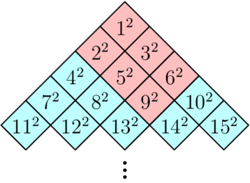
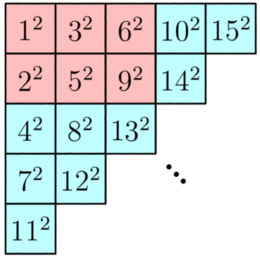

# Tutorial_(en)

We hope you enjoyed the contest!

[1829A - Love Story](../problems/A._Love_Story.md "Codeforces Round 871 (Div. 4)")

Idea: [SlavicG](https://codeforces.com/profile/SlavicG "Candidate Master SlavicG")

 **Tutorial**
### [1829A - Love Story](../problems/A._Love_Story.md "Codeforces Round 871 (Div. 4)")

You need to implement what is written in the statement. You need to compare the given string s with the string "codeforces" character by character, counting the number of differences. We know that the length of s is 10, so we can simply iterate through both strings and compare each character at the same index.

If the characters are the same, we move on to the next index. If they are different, we count it as a difference and move on to the next index. Once we have compared all 10 characters, we output the number of differences.

 **Solution**
```cpp
#include <bits/stdc++.h>

using namespace std;

void solve()
{
    string s, c = "codeforces";
    cin >> s;
    int ans = 0;
    for(int i = 0; i < 10; i++)
    {
        if(s[i] != c[i])
        {
            ans++;
        }
    }
    cout << ans << endl;
}

int32_t main(){
    int t = 1;
    cin >> t;
    while (t--) {
        solve();
    }
}
```
[1829B - Blank Space](../problems/B._Blank_Space.md "Codeforces Round 871 (Div. 4)")

Idea: [mesanu](https://codeforces.com/profile/mesanu "Expert mesanu")

 **Tutorial**
### [1829B - Blank Space](../problems/B._Blank_Space.md "Codeforces Round 871 (Div. 4)")

We can iterate through the array a and keep track of the length of the current blank space. Whenever we encounter a 0, we increase the length of the current blank space, and whenever we encounter a 1, we check if the current blank space is longer than the previous longest blank space. If it is, we update the length of the longest blank space. Finally, we return the length of the longest blank space.

The time complexity of this algorithm is O(n).

 **Solution**
```cpp
#include <bits/stdc++.h>
using namespace std;

void solve()
{
    int n;
    cin >> n;
    int a[n];
    int cnt = 0, ans = 0;
    for(int i = 0; i < n; i++)
    {
        cin >> a[i];
        if(a[i] == 0)
        {
            cnt++;
        }
        else
        {
            ans = max(ans, cnt);
            cnt = 0;
        }
    }
    cout << max(ans, cnt) << endl;
}

int32_t main(){
    int t = 1;
    cin >> t;
    while (t--) {
        solve();
    }
}
```
[1829C - Mr. Perfectly Fine](../problems/C._Mr._Perfectly_Fine.md "Codeforces Round 871 (Div. 4)")

Idea: [SlavicG](https://codeforces.com/profile/SlavicG "Candidate Master SlavicG")

 **Tutorial**
### [1829C - Mr. Perfectly Fine](../problems/C._Mr._Perfectly_Fine.md "Codeforces Round 871 (Div. 4)")

You can classify the books into four types "00", "01", "10", "11". We will take a book of any type at most once and wont take a book that learns a single skill if that skill is already learned, so there are only two cases to look at

* We take the shortest "01" and the the shortest "10".
* We take the shortest "11".

Out of these options, output the shortest one.

 **Solution**
```cpp
#include "bits/stdc++.h"
using namespace std;

#define ll long long

#define          all(v)              v.begin(), v.end()
#define         rall(v)              v.rbegin(),v.rend()

#define            pb                push_back
#define          sz(a)               (int)a.size()

void solve() {
    int n; cin >> n;
    map<string, int> mp;
    mp["00"] = mp["01"] = mp["10"] = mp["11"] = 1e9;
    int ans = 1e9;
    for(int i = 0; i < n; ++i) {
        int x; cin >> x; string s; cin >> s;
        mp[s] = min(mp[s], x);
    }
    if(min(mp["11"], mp["10"] + mp["01"]) > (int)1e6) {
        cout << "-1n";
    } else {
        cout << min(mp["11"], mp["10"] + mp["01"]) << "n";
    }
}

int32_t main() {
    ios_base::sync_with_stdio(0);cin.tie(0);cout.tie(0);
    int t = 1;
    cin >> t;
    while(t--) {
        solve();
    }
}
```
[1829D - Gold Rush](../problems/D._Gold_Rush.md "Codeforces Round 871 (Div. 4)")

Idea: [flamestorm](https://codeforces.com/profile/flamestorm "Candidate Master flamestorm")

 **Tutorial**
### [1829D - Gold Rush](../problems/D._Gold_Rush.md "Codeforces Round 871 (Div. 4)")

We can solve this problem recursively. Let the current pile have n gold nuggets. 

* If n=m, then we can make a pile with exactly m gold nuggets by not doing any operations.
* If n is not a multiple of 3, then it is not possible to make a move, because after a move we split n into x and 2x, so n=x+2x=3x for some integer x, meaning n has to be a multiple of 3.
* Finally, if n is a multiple of 3, then we can split the pile into two piles with n3 and 2n3 gold nuggets, and we can recursively check if we can make a pile with exactly m gold nuggets.

 See the implementation for more details.By the Master Theorem, the time complexity is O(nlog32)≈O(n0.631). Most compilers and languages optimize the recursion enough for this to pass comfortably. (The model solution in C++ runs in 15 milliseconds.)

 **Solution**
```cpp
#include <bits/stdc++.h>

using namespace std;

bool ok(int n, int m) {
	if (n == m) {return true;}
	else if (n % 3 != 0) {return false;}
	else {return (ok(n / 3, m) || ok(2 * n / 3, m));}
}

void solve() {
	int n, m;
	cin >> n >> m;
	cout << (ok(n, m) ? "YES" : "NO") << 'n';
}

int main() {
	ios::sync_with_stdio(false);
	cin.tie(nullptr);
	int tt; cin >> tt; for (int i = 1; i <= tt; i++) {solve();}
	// solve();
}
```
[1829E - The Lakes](../problems/E._The_Lakes.md "Codeforces Round 871 (Div. 4)")

Idea: [mesanu](https://codeforces.com/profile/mesanu "Expert mesanu")

 **Tutorial**
### [1829E - The Lakes](../problems/E._The_Lakes.md "Codeforces Round 871 (Div. 4)")

We can approach this problem using Depth First Search (DFS) or Breadth First Search (BFS) on the given grid.

The idea is to consider each cell of the grid as a potential starting point for a lake, and explore all the cells reachable from it by only moving up, down, left or right, without stepping on any cell with depth 0. If we reach a dead end, or a cell with depth 0, we backtrack and try another direction.

During this exploration, we keep track of the sum of depths of all the cells that we have visited. This sum gives us the volume of the current lake. When we have explored all the reachable cells from a starting point, we compare the volume of this lake with the maximum volume found so far, and update the maximum if necessary.

To implement this approach, we can use a nested loop to iterate through all the cells of the grid. For each cell, we check if its depth is greater than 0, and if it has not already been visited in a previous lake. If these conditions are satisfied, we start a DFS/BFS from this cell, and update the maximum volume found so far. See the implementation for more details.

The time complexity is O(mn).

 **Solution**
```cpp
#include <bits/stdc++.h>
#define startt ios_base::sync_with_stdio(false);cin.tie(0);
typedef long long  ll;
using namespace std;
#define vint vector<int>
#define all(v) v.begin(), v.end()
#define MOD 1000000007
#define MOD2 998244353
#define MX 1000000000
#define MXL 1000000000000000000
#define PI (ld)2*acos(0.0)
#define pb push_back
#define sc second
#define fr first
#define endl 'n'
#define ld long double
#define NO cout << "NO" << endl
#define YES cout << "YES" << endl

int n, m;
bool vis[1005][1005];
int a[1005][1005];

int dfs(int i, int j)
{
    vis[i][j] = true;
    int ans = a[i][j];
    if(i != 0 && a[i-1][j] != 0 && !vis[i-1][j])
    {
        ans+=dfs(i-1, j);
    }
    if(i != n-1 && a[i+1][j] != 0 && !vis[i+1][j])
    {
        ans+=dfs(i+1, j);
    }
    if(j != 0 && a[i][j-1] != 0 && !vis[i][j-1])
    {
        ans+=dfs(i, j-1);
    }
    if(j != m-1 && a[i][j+1] != 0 && !vis[i][j+1])
    {
        ans+=dfs(i, j+1);
    }
    return ans;
}

void solve()
{
    cin >> n >> m;
    for(int i = 0; i < n; i++)
    {
        for(int j = 0; j < m; j++)
        {
            vis[i][j] = false;
            cin >> a[i][j];
        }
    }
    int ans = 0;
    for(int i = 0; i < n; i++)
    {
        for(int j = 0; j < m; j++)
        {
            if(!vis[i][j] && a[i][j] != 0)
            {
                ans = max(ans, dfs(i, j));
            }
        }
    }
    cout << ans << endl;
}

int32_t main(){
    startt
    int t = 1;
    cin >> t;
    while (t--) {
        solve();
    }
}
```
[1829F - Forever Winter](../problems/F._Forever_Winter.md "Codeforces Round 871 (Div. 4)")

Idea: [flamestorm](https://codeforces.com/profile/flamestorm "Candidate Master flamestorm")

 **Tutorial**
### [1829F - Forever Winter](../problems/F._Forever_Winter.md "Codeforces Round 871 (Div. 4)")

The degree of a vertex is the number of vertices connected to it. We can count the degree of a vertex by seeing how many times it appears in the input.

Let's count the degrees of the vertices in a snowflake graph. 

* The starting vertex has degree x.
* Each of the x newly-generated vertices has degree y+1 (they have y new neighbors, along with the starting vertex).
* Each of the x×y newly-generated vertices has degree 1 (they are only connected to the previous vertex).

 Thus, we can make this table:  

| Count | Degree |
| --- | --- |
| 1 | x |
| x | y+1 |
| xy | 1 |

  So we can simply count the degrees, see which degree appears only once (it is x) and see the number of vertices with degree 1 (it is xy), and from here we can compute x and y.However, there is an edge case. If x=y+1, then the first two rows combine: 

 

| Count | Degree |
| --- | --- |
| x+1 | x=y+1 |
| xy | 1 |

  We can still compute xy by counting the number of vertices with degree 1, and from here we can see that the other degree has x+1 vertices of that type, so we can subtract one to extract x and from there, extract y.The time complexity is O(n+m) per test case.

 **Solution**
```cpp
#include <bits/stdc++.h>

using namespace std;

const int MAX = 200007;
const int MOD = 1000000007;

void solve() {
	int n, m;
	cin >> n >> m;
	int cnt[n + 1];
	for (int i = 1; i <= n; i++) {
		cnt[i] = 0;
	}
	for (int i = 0; i < m; i++) {
		int u, v;
		cin >> u >> v;
		cnt[u]++;
		cnt[v]++;
	}
	map<int, int> cnts;
	for (int i = 1; i <= n; i++) {
		cnts[cnt[i]]++;
	}
	vector<int> v;
	for (auto p : cnts) {
		v.push_back(p.second);
	}
	sort(v.begin(), v.end());
	if (v.size() == 3) {
		cout << v[1] << ' ' << v[2] / v[1] << 'n';
	}
	else {
		cout << v[0] - 1 << ' ' << v[1] / (v[0] - 1) << 'n';
	}
}

int main() {
	ios::sync_with_stdio(false);
	cin.tie(nullptr);
	int tt; cin >> tt; for (int i = 1; i <= tt; i++) {solve();}
	// solve();
}
```
[1829G - Hits Different](../problems/G._Hits_Different.md "Codeforces Round 871 (Div. 4)")

Idea: [flamestorm](https://codeforces.com/profile/flamestorm "Candidate Master flamestorm")

 **Tutorial**
### [1829G - Hits Different](../problems/G._Hits_Different.md "Codeforces Round 871 (Div. 4)")

There are many solutions which involve going row by row and using some complicated math formulas, but here is a solution that requires no formulas and is much quicker to code.

The cans are hard to deal with, but if we replace them with a different shape, a diamond, we get the following: 

   Now the cans that fall just form a rectangle. In fact, let's rotate the picture:    What we can see is that each query is just a [2D prefix sum](https://codeforces.com/https://usaco.guide/silver/more-prefix-sums?lang=cpp#2d-prefix-sums)! So we can precompute all prefix sums in the grid in O(M) time, where M=106 is the maximum value of the input, and answer each sum in O(1) time.To avoid finding the row and column, we can instead iterate through the cells in order 1,2,3,…, that is, we go diagonal-by-diagonal in the grid above. Now, make a separate array ans, and keep track of the answer for each cell from 1 to 106 as we find its prefix sum. This avoids having to do any complicated math or binary search to find the row and column for the prefix sum. See the implementation for more details.

The time complexity is O(n) precomputation with O(1) per test case.

 **Solution**
```cpp
  
#include <bits/stdc++.h>

using namespace std;

long long ans[2000007];
long long a[1500][1500] = {}, curr = 1;

void solve() {
	int n;
	cin >> n;
	cout << ans[n] << 'n';
}

int main() {
	ios::sync_with_stdio(false);
	cin.tie(nullptr);

	for (int i = 1; i < 1500; i++) {
		for (int j = i - 1; j >= 1; j--) {
			a[j][i - j] = a[j - 1][i - j] + a[j][i - j - 1] - a[j - 1][i - j - 1] + curr * curr;
			ans[curr] = a[j][i - j];
			curr++;
		}
	}
	
	int tt; cin >> tt; for (int i = 1; i <= tt; i++) {solve();}
	// solve();
}
```
[1829H - Don't Blame Me](../problems/H._Don't_Blame_Me.md "Codeforces Round 871 (Div. 4)")

Idea: [SlavicG](https://codeforces.com/profile/SlavicG "Candidate Master SlavicG")

 **Tutorial**
### [1829H - Don't Blame Me](../problems/H._Don't_Blame_Me.md "Codeforces Round 871 (Div. 4)")

We can notice that the numbers are pretty small (up to 63) and the AND values will be up to 63 as well. Thus, we can count the number of subsequences that have AND value equal to x for all x from 0 to 63.

We can do this using dynamic programming. Let's denote dpij as the number of subsequences using the first i elements that have a total AND value of j. The transitions are quite simple. We can iterate over all j values obtained previously and update the values respectively:

We have three cases:

The first case is when we don't use the i-th value. Here we just update the dpij in the following way: dp[i][j]=dp[i][j]+dp[i−1][j].

The second case is when we use the i-th value. Here we update the dp[i][a[i]&j] in the following way: dp[i][a[i]&j]=dp[i][a[i]&j]+dp[i−1][j]. 

The third case is starting a new subsequence with just the i-th element. Thus, we update dp[i][a[i]]=dp[i][a[i]]+1.

 **Solution**
```cpp
#include "bits/stdc++.h"
using namespace std;

#define ll long long
 
#define          all(v)              v.begin(), v.end()
#define         rall(v)              v.rbegin(),v.rend()
 
#define            pb                push_back
#define          sz(a)               (int)a.size()

const int mod = 1e9 + 7;
void solve() {
    int n, x; cin >> n >> x;
    vector<int> a(n + 1);
    vector<vector<int>> dp(n + 1, vector<int>(1 << 6, 0));
    for(int i = 1; i <= n; ++i) {
        cin >> a[i];
        for(int mask = 0; mask < (1 << 6); ++mask) {
            dp[i][mask] += dp[i - 1][mask];
            if(dp[i][mask] >= mod) dp[i][mask] -= mod;
            dp[i][mask & a[i]] += dp[i - 1][mask];
            if(dp[i][mask & a[i]] >= mod) dp[i][mask & a[i]] -= mod;
        }
        dp[i][a[i]] = (dp[i][a[i]] + 1) % mod;
    }
    int ans = 0;
    for(int mask = 0; mask < (1 << 6); ++mask) {
        if(__builtin_popcount(mask) == x) {
            ans = (ans + dp[n][mask]) % mod;
        }
    }
    cout << ans << "n";
}   
 
int32_t main() {
    ios_base::sync_with_stdio(0);cin.tie(0);cout.tie(0);
    int t = 1;
    cin >> t;
    while(t--) {
        solve();
    }
}
```
