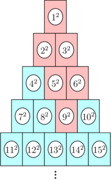

<h1 style='text-align: center;'> G. Hits Different</h1>

<h5 style='text-align: center;'>time limit per test: 2.5 seconds</h5>
<h5 style='text-align: center;'>memory limit per test: 256 megabytes</h5>

In a carnival game, there is a huge pyramid of cans with $2023$ rows, numbered in a regular pattern as shown.

 If can $9^2$ is hit initially, then all cans colored red in the picture above would fall. 

You throw a ball at the pyramid, and it hits a single can with number $n^2$. This causes all cans that are stacked on top of this can to fall (that is, can $n^2$ falls, then the cans directly above $n^2$ fall, then the cans directly above those cans, and so on). For example, the picture above shows the cans that would fall if can $9^2$ is hit.

What is the sum of the numbers on all cans that fall? Recall that $n^2 = n \times n$.

### Input

The first line contains an integer $t$ ($1 \leq t \leq 1000$) — the number of test cases.

The only line of each test case contains a single integer $n$ ($1 \leq n \leq 10^6$) — it means that the can you hit has label $n^2$.

### Output

For each test case, output a single integer — the sum of the numbers on all cans that fall.

Please note, that the answer for some test cases won't fit into 32-bit integer type, so you should use at least 64-bit integer type in your programming language (like long long for C++). For all valid inputs, the answer will always fit into 64-bit integer type.

## Example

### Input


```text
1091234561014341000000
```
### Output

```text

156
1
5
10
21
39
46
146
63145186
58116199242129511

```
## Note

The first test case is pictured in the statement. The sum of the numbers that fall is $$1^2 + 2^2 + 3^2 + 5^2 + 6^2 + 9^2 = 1 + 4 + 9 + 25 + 36 + 81 = 156.$$

In the second test case, only the can labeled $1^2$ falls, so the answer is $1^2=1$.

In the third test case, the cans labeled $1^2$ and $2^2$ fall, so the answer is $1^2+2^2=1+4=5$.

In the fourth test case, the cans labeled $1^2$ and $3^2$ fall, so the answer is $1^2+3^2=1+9=10$.

In the fifth test case, the cans labeled $1^2$, $2^2$, and $4^2$ fall, so the answer is $1^2+2^2+4^2=1+4+16=21$.


#### Tags 

#1600 #NOT OK #data_structures #dp #implementation #math 

## Blogs
- [All Contest Problems](../Codeforces_Round_871_(Div._4).md)
- [Announcement (en)](../blogs/Announcement_(en).md)
- [Tutorial (en)](../blogs/Tutorial_(en).md)
