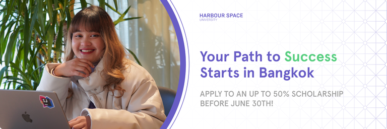

# Announcement

Hello Codeforces!

On [Friday, May 12, 2023 at 20:35UTC+6](https://codeforces.com/https://www.timeanddate.com/worldclock/fixedtime.html?day=12&month=5&year=2023&hour=17&min=35&sec=0&p1=166) [Educational Codeforces Round 148 (Rated for Div. 2)](https://codeforces.com/contest/1832 "Educational Codeforces Round 148 (Rated for Div. 2)") will start.

Series of Educational Rounds continue being held as [Harbour.Space University](https://codeforces.com/https://harbour.space/) initiative! You can read the details about the cooperation between [Harbour.Space University](https://codeforces.com/https://harbour.space/) and Codeforces in the [blog post](//mirror.codeforces.com/blog/entry/51208).

This round will be **rated for the participants with rating lower than 2100**. It will be held on extended ICPC rules. The penalty for each incorrect submission until the submission with a full solution is 10 minutes. After the end of the contest, you will have 12 hours to hack any solution you want. You will have access to copy any solution and test it locally.

You will be given **6 or 7 problems** and **2 hours** to solve them.

The problems were invented and prepared by Adilbek [adedalic](https://codeforces.com/profile/adedalic "International Master adedalic") Dalabaev, Ivan [BledDest](https://codeforces.com/profile/BledDest "International Grandmaster BledDest") Androsov, Maksim [Neon](https://codeforces.com/profile/Neon "Candidate Master Neon") Mescheryakov and me. Also, huge thanks to Mike [MikeMirzayanov](https://codeforces.com/profile/MikeMirzayanov "Headquarters, MikeMirzayanov") Mirzayanov for great systems Polygon and Codeforces.

Good luck to all the participants!

Our friends at Harbour.Space also have a message for you:

***Your Path to Success Starts at Harbour.Space Bangkok***

*Hello Codeforces!*

*We are excited to announce that we are offering 10 full scholarships to study Computer Science or Data Science at Harbour.Space, Bangkok Campus!*

*We invite you to apply to our university in Bangkok, Thailand, where we offer a full scholarship for qualified participants.* 

*Our university has a vibrant and inclusive community, where you'll have the opportunity to learn from and collaborate with some of the brightest minds in your field, such as the one and only Mike [MikeMirzayanov](https://codeforces.com/profile/MikeMirzayanov "Headquarters, MikeMirzayanov") Mirzayanov. Additionally, our state-of-the-art University is designed to support your academic success and personal growth.*

*If you want to pursue higher education, get accreditation and expand your horizons, we encourage you to apply! As members of the Codeforces community, we recognise your talent and dedication to problem-solving, and you would make an excellent candidate for our programme.*

**Requirements:**

***Study Commitment:** 3 hours/day. You will complete 15 modules (each three weeks long) in one year. The daily class workload is 3 hours, plus homework to complete in your own time.*

***University requirements***

 * *CV*
* *High School/Bachelor's Degree*
* *English proficiency*
* *Medalist in any Programming competition is a plus!*

*Make sure to apply before **June the 30th, 2023**, to be eligible for the scholarship and reduced application fee!*

  [Apply here →](https://scholarship.harbour.space/bangkok?utm_source=codeforces&utm_medium=partner&utm_campaign=bkk_b2c_bangkok_2023) *We look forward to hearing from you and welcoming you to our community.*

*All the best,* *The Harbour.Space Team*

**UPD:** [Editorial is out](Tutorial.md)

