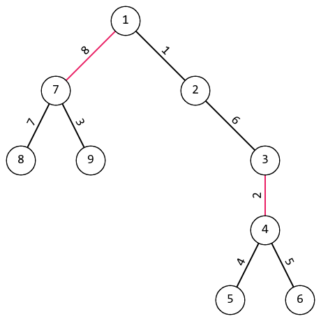

<h1 style='text-align: center;'> G. Ksyusha and Chinchilla</h1>

<h5 style='text-align: center;'>time limit per test: 3 seconds</h5>
<h5 style='text-align: center;'>memory limit per test: 256 megabytes</h5>

Ksyusha has a pet chinchilla, a tree on $n$ vertices and huge scissors. A tree is a connected graph without cycles. During a boring physics lesson Ksyusha thought about how to entertain her pet.

Chinchillas like to play with branches. A branch is a tree of $3$ vertices.

  The branch looks like this. A cut is the removal of some (not yet cut) edge in the tree. Ksyusha has plenty of free time, so she can afford to make enough cuts so that the tree splits into branches. In other words, after several (possibly zero) cuts, each vertex must belong to exactly one branch.

Help Ksyusha choose the edges to be cut or tell that it is impossible.

#### Input

The first line contains a single integer $t$ ($1 \le t \le 10^4$) — number of testcases.

The first line of each testcase contains a single integer $n$ ($2 \le n \le 2 \cdot 10^5$) — the number of vertices in the tree.

The next $n - 1$ rows of each testcase contain integers $v_i$ and $u_i$ ($1 \le v_i, u_i \le n$) — the numbers of vertices that the $i$-th edge connects.

It is guaranteed that this set of edges forms a tree. It is also guaranteed that the sum of $n$ over all testcases does not exceed $2 \cdot 10^5$.

#### Output

Print the answer for each testcase.

If the desired way to cut the tree does not exist, print $-1$.

Otherwise, print an integer $k$ — the number of edges to be cut. In the next line, print $k$ different integers $e_i$ ($1 \le e_i < n$) — numbers of the edges to be cut. If $k = 0$, print an empty string instead.

If there are several solutions, you can print any.

## Examples

#### Input


```text
491 24 37 95 44 63 28 71 761 21 34 31 56 161 23 23 44 56 551 35 35 23 4
```
#### Output

```text

2
2 8 
-1
1
3 
-1

```
#### Input


```text
421 231 23 161 23 13 43 56 192 66 99 19 71 87 38 54 7
```
#### Output

```text

-1
0

1
2 
2
4 3 

```
## Note

  The first testcase in first test. 

#### Tags 

#1800 #NOT OK #constructive_algorithms #dfs_and_similar #dp #dsu #greedy #implementation #trees 

## Blogs
- [All Contest Problems](../Codeforces_Round_874_(Div._3).md)
- [Announcement](../blogs/Announcement.md)
- [Tutorial](../blogs/Tutorial.md)
