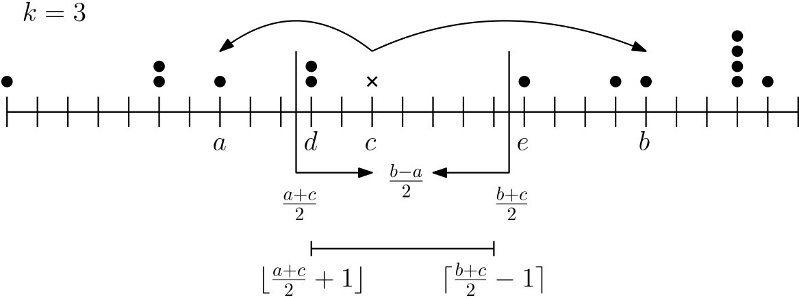

# Tutorial_(en)

[1836A - Destroyer](https://codeforces.com/contest/1836/problem/A "Codeforces Round 880 (Div. 2)")

 * Author: [kempusss](https://codeforces.com/profile/kempusss "Master kempusss")
* Developer: [kempusss](https://codeforces.com/profile/kempusss "Master kempusss")
* First solve: [Tima9](https://codeforces.com/profile/Tima9 "Specialist Tima9")

 **Tutorial**
### [1836A - Destroyer](https://codeforces.com/contest/1836/problem/A "Codeforces Round 880 (Div. 2)")

We can simplify the statement to the following — can we divide the input sequence into multiple arithmetic sequences starting with 0 and a common difference equal to 1?

Note that for each such arithmetic sequence, if a number x>0 belongs to it, then x−1 must also be included in it. Thus, if we denote cntx as the number of occurrences of x in the input, we must have cntx≥cntx+1 for each x≥0. We can note that if such a condition is fulfilled, we can always divide the input into described arithmetic sequences.

We can implement it straightforwardly in O(N+L), where L is the maximum value in the input.

 **Solution**
```cpp
#include <bits/stdc++.h>
using namespace std;
 
const int N = 1e6;
 
int main()
{
    int cases;
    scanf("%d", &cases);
    
    while (cases--) {
    	int n;
    	scanf ("%d", &n);
    	
    	vector <int> cnt(n + 1);
    	for (int i = 0; i < n; i++) {
    		int d;
    		scanf("%d", &d);
    		if (d < n) {
        		cnt[d]++;
    		} else {
    		    cnt[n] = N;
    		}
    	}
    	
    	bool good = true;
    	for (int i = 1; i <= n; i++) if (cnt[i] > cnt[i-1]) {
    	    good = false;
    	    break;
    	}
    	
    	puts(good ? "YES" : "NO");
    }
}
```
[1836B - Astrophysicists](https://codeforces.com/contest/1836/problem/B "Codeforces Round 880 (Div. 2)")

 * Author: [Fly_37](https://codeforces.com/profile/Fly_37 "Master Fly_37")
* Developer: [Okrut](https://codeforces.com/profile/Okrut "Grandmaster Okrut")
* First solve: [NTR_Lover](https://codeforces.com/profile/NTR_Lover "Specialist NTR_Lover")

 **Tutorial**
### [1836B - Astrophysicists](https://codeforces.com/contest/1836/problem/B "Codeforces Round 880 (Div. 2)")

Note that in the perfect world, we'd give each astrophysicist precisely ⌊G−12⌋, and we'd spare N⋅⌊G−12⌋ silver coins. Unfortunately, two things may happen: 

* First, we may run out of money. This is an easy case; it is enough to output K⋅G if it is less than ⌊G−12⌋.
* Second, we may have some money left. It turns out that an acceptable solution is to give everything to one astrophysicist. The intuition behind it is simple — we are only interested in bonus sizes modulo G, and by decreasing the bonus of one astrophysicist, we can get at most 1 from another one, and by increasing it, we lose ⌊G−12⌋. In both cases, it is not worth changing the value.Thus, we got a formula to calculate in O(1).
 **Solution**
```cpp
#include "bits/stdc++.h"
using namespace std;
 
int main()
{
	int t;
	scanf ("%d", &t);
	while (t--) {
		long long n, k, g;
		scanf ("%lld %lld %lld", &n, &k, &g);
 
		long long stolen = min((g - 1) / 2 * n, k * g);
		long long rest = (k * g - stolen) % g;
 
		if (rest > 0) {
		    stolen -= (g - 1) / 2;
		    long long last = ((g - 1) / 2 + rest) % g;
 
		    if (last * 2 < g) {
		        stolen += last;
		    } else {
		        stolen -= g - last;
		    }
		}
 
		printf ("%lldn", stolen);
	}
}
```
[1836C - k-th equality](https://codeforces.com/contest/1836/problem/C "Codeforces Round 880 (Div. 2)") / [1835A - k-th equality](../problems/A._k-th_equality.md "Codeforces Round 880 (Div. 1)")

 * Author: [Okrut](https://codeforces.com/profile/Okrut "Grandmaster Okrut")
* Developer: [w0nsh](https://codeforces.com/profile/w0nsh "Grandmaster w0nsh")
* First solve: [NTR_Lover](https://codeforces.com/profile/NTR_Lover "Specialist NTR_Lover") / [ksun48](https://codeforces.com/profile/ksun48 "Legendary Grandmaster ksun48")

 **Tutorial**
### [1836C - k-th equality](https://codeforces.com/contest/1836/problem/C "Codeforces Round 880 (Div. 2)")

The largest possible value for a is 106−1, so we can iterate over each possibility. When we fix a, we can find the range of values for b such that 10C−1≤a+b<10C, and 10B−1≤b<10B. For each such value, we have a correct equality.

We can easily find this range. We get that max{10C−1−a,10B−1}≤b<min{10C−a,10B} and from this inequality, we know how many equations for the given a we have. As we start by minimizing a, we can find its value for the k-th equation if we iterate from the smallest possible values of a.

When we have fixed a (or find out that there is no such equation), we iterate over all possible values of b and check if the resulting c has C digits. The complexity is O(10A+10B).

 **Solution**
```cpp
#include <bits/stdc++.h>

int power(int a, int e) {
    if (e == 0) return 1;
    return e == 1 ? a : a * power(a, e-1);
}

void answer(int a, int b) {
    std::cout << a << " + " << b << " = " << a+b << std::endl;
}

int main() {
    using ll = long long;
    
    int t;
    std::cin >> t;
    while (t--) {

        int a, b, c;
        ll k;
        std::cin >> a >> b >> c >> k;
        
        bool good = false;
    
        for (int i = power(10, a-1); i < power(10, a); ++i) {
            int left = std::max(power(10, b-1), power(10, c-1) - i);
            int right = std::min(power(10, b)-1, power(10, c) - 1 - i);
            if (left > right) continue;
    
            int have = right - left + 1;
            if (k <= have) {
                answer(i, left + k - 1);
                good = true;
                break;
            }
    
            k -= have;
        }
    
        if (!good) std::cout << "-1" << std::endl;
    }

    return 0;
}
```
[1836D - Lottery](https://codeforces.com/contest/1836/problem/D "Codeforces Round 880 (Div. 2)") / [1835B - Lottery](../problems/B._Lottery.md "Codeforces Round 880 (Div. 1)")

 * Author: [Arti1990](https://codeforces.com/profile/Arti1990 "Candidate Master Arti1990")
* Developer: [Arti1990](https://codeforces.com/profile/Arti1990 "Candidate Master Arti1990")
* First solve: [Nobody.Emissary](https://codeforces.com/profile/Nobody.Emissary "Newbie Nobody.Emissary") / [ecnerwala](https://codeforces.com/profile/ecnerwala "Legendary Grandmaster ecnerwala")

 **Tutorial**
### [1836D - Lottery](https://codeforces.com/contest/1836/problem/D "Codeforces Round 880 (Div. 2)")

Let's assume that Bytek has selected a certain position c. Let the closest occupied position to the left be d, and the closest occupied position to the right be e. Let's denote the position of the k-th person to the left as a and the k-th person to the right as b (on the picture k=3). 

  Note that for Bytek to win, the target position should be closer to him than a and closer to him than b. So his winning range is in the interval (a+c2,b+c2). It will either have a length of ⌊b−a2−1⌋ or ⌊b−a2−2⌋, which depends only on whether he chooses an even or odd position relative to the people on positions a and b.

So the solution to the task was to consider each pair of people standing next to each other and see what happens if Bytek stands between them. To do this, we find the person k positions to the left and k positions to the right for Bytek and then check what the result will be if Bytek stands on the leftmost position inside this interval and what if Bytek stands on the second position from the left inside this interval. The other positions in this interval would give Bytek the same results but wouldn't be the leftmost.

In addition, we should look at what would happen if Bytek stood in a position where someone is already standing (this may help if there is not enough space between consecutive people). There are also two more edge cases – from the left and the right. One of these cases is to look at what would happen if Bytek stands one or two positions in front of the k-th person from the left. This position would give Bytek the biggest winning range containing 0. The other case is analogous from the right.

The final complexity is O(n) or O(nlogn) based on implementation.

 **Solution**
```cpp
#include <bits/stdc++.h>
 
#define forr(i, n) for (int i = 0; i < n; i++)
#define FOREACH(iter, coll) for (auto iter = coll.begin(); iter != coll.end(); ++iter)
#define FOREACHR(iter, coll) for (auto iter = coll.rbegin(); iter != coll.rend(); ++iter)
#define lbound(P, K, FUN) ({auto SSS=P, PPP = P-1, KKK=(K)+1; while(PPP+1!=KKK) {SSS = (PPP+(KKK-PPP)/2); if(FUN(SSS)) KKK = SSS; else PPP = SSS;} PPP; })
#define testy()    
    int _tests;    
    cin >> _tests; 
    FOR(_test, 1, _tests)
#define CLEAR(tab) memset(tab, 0, sizeof(tab))
#define CONTAIN(el, coll) (coll.find(el) != coll.end())
#define FOR(i, a, b) for (int i = a; i <= b; i++)
#define FORD(i, a, b) for (int i = a; i >= b; i--)
#define MP make_pair
#define PB push_back
#define ff first
#define ss second
#define deb(X) X;
#define SIZE(coll) ((int)coll.size())
 
#define M 1000000007
#define INF 1000000007LL
 
using namespace std;
 
long long n, m, k;
long long poz_l, poz_p;
vector<long long> v;
 
long long policz_ile(long long strzal)
{
    while (poz_l < n && v[poz_l] < strzal)
        poz_l++;
    while (poz_p < n && v[poz_p] <= strzal)
        poz_p++;
 
    long long pocz = poz_p < k ? 0 : (strzal + v[poz_p - k]) / 2 + 1;
    long long kon = poz_l + k - 1 >= n ? m : (v[poz_l + k - 1] + strzal - 1) / 2;
 
    return max(0ll, kon - pocz + 1);
}
 
int solve()
{
    cin >> n >> m >> k;
    long long a;
    forr(i, n)
    {
        cin >> a;
        v.PB(a);
    }
    sort(v.begin(), v.end());
    v.PB(m + 1);
    long long res = policz_ile(0), best = 0;
    forr(i, n)
    {
        long long pocz = i == 0 ? max(0ll, v[i] - 2) : max(v[i] - 2, v[i - 1] + 3);
        long long kon = min(m, v[i] + 2);
        for (long long s = pocz; s <= kon; s++)
        {
            long long ile = policz_ile(s);
 
            if (ile > res)
            {
                res = ile;
                best = s;
            }
        }
    }
    cout << res << " " << best << 'n';
 
    return 0;
}
 
int main()
{
    std::ios_base::sync_with_stdio(0);
    cin.tie(0);
    cout.tie(0);
 
    solve();
 
    return 0;
}
```
[1836E - Twin Clusters](https://codeforces.com/contest/1836/problem/E "Codeforces Round 880 (Div. 2)") / [1835C - Twin Clusters](../problems/C._Twin_Clusters.md "Codeforces Round 880 (Div. 1)")

 * Author: [Anadi](https://codeforces.com/profile/Anadi "International Grandmaster Anadi"), [w0nsh](https://codeforces.com/profile/w0nsh "Grandmaster w0nsh")
* Developer: [Fly_37](https://codeforces.com/profile/Fly_37 "Master Fly_37")
* First solve: [GULAL_S_ZHENOY_UMNIKA](https://codeforces.com/profile/GULAL_S_ZHENOY_UMNIKA "Specialist GULAL_S_ZHENOY_UMNIKA") / [Um_nik](https://codeforces.com/profile/Um_nik "Legendary Grandmaster Um_nik")

 **Tutorial**
### [1836E - Twin Clusters](https://codeforces.com/contest/1836/problem/E "Codeforces Round 880 (Div. 2)")

Deterministic solution:

Let us first look for segments that zeros first k (out of 2k) bits. Since we have n=2k+1, then we have n+1 prefix xors of the array (along with en empty prefix). Let us look at the xor prefix modulo 2k. Each time we have a prefix xor that has already occurred before let us match it with this previous occurrence. We will find at least 2k+1 such segments. Note that segments have pairwise different ends and pairwise different beginnings.

Each of those segments generates some kind of xor value on the other k bits. Since there is only 2k different possible values, due to pigeon principle there will be two segments that generate same xor. We select those two intervals. If they are disjoint then we already found the answer. Otherwise the final answer will be the xor of those two segments (values that are covered only by one of them). It can be showed that we will obtain two disjoint, non-empty segments.

Nondeterministic solution:

If there are any duplicates in the array, then we can take two one-element arrays and obtain answer. From now on we will assume that no duplicates occur in the array.

Let us observe that number of valid segments is equal to (n2)+n≥22k+1 which is over twice larger than all possible xor values for a segment which is 22k. This suggest, that chances of collision of two random segments is quite high. For simplicity let us assume there is exactly 22k+1 segments. Let us look at the final distribution over the xors used by segments. It can be showed by exchange argument, that the the distribution that needs the most random tosses to obtain collision is the one in which every xor value is used by exactly two segments. Since we choose segments randomly, by birthday paradox the expected time of obtaining a collision is around 2^k. Now there is a chance, that we will toss the same segment twice, but if we multiply the number of tossing by log(n) then chance that we find two different segments is very high (in reality even less random choices are necessary).

There is another issue, even if we find two different segments with the same xor values. They can use common elements. But then we can simply take only the elements that belong to the exactly one of them.

Still if the segments had common end one of the obtained segments would be empty. To omit this issue let us see that the second obtained segment would have xor equal to 0. So now we can take any prefix and corresponding suffix as an answer. Unfortunately this segment can have length 1. But in this case the only element in the segment has to be equal to 0.

There must be at most one number 0 in the array, so we can simply get rid of it (shorten the array by one). The analysis still holds (with some slight modifications). 

 **Solution**
```cpp
#include <bits/stdc++.h>

using namespace std;

void solve()
{
    int k, n;
    scanf("%d", &k);

    n = 2 << k;

    vector <long long> input(n + 1);
    vector <int> memHighBits(1 << k, -1);
    vector <pair <int, int> > memLowBits(1 << k, {-1, -1});
    
    auto addInterval = [&memLowBits, &input](int s, int e) {
        const int remXor = input[e] ^ input[s - 1];
        auto &[os, oe] = memLowBits[remXor];

        if (os == -1) {
            os = s, oe = e;
            return false;
        }

        if (oe < s) {
            printf("%d %d %d %dn", os, oe, s, e);
        } else {
            printf("%d %d %d %dn", min(s, os), max(s, os) - 1, oe + 1, e);
        }

        return true;
    };

    memHighBits[0] = 0;
    for (int i = 1; i <= n; ++i) {
        scanf("%lld", &input[i]);
        input[i] ^= input[i - 1];
    }

    for (int i = 1; i <= n; ++i) {
        if (memHighBits[input[i] >> k] != -1) {
            if (addInterval(memHighBits[input[i] >> k] + 1, i)) {
                break;
            }
        }

        memHighBits[input[i] >> k] = i;
    }
}

int main()
{
    int cases;
    scanf("%d", &cases);

    while (cases--) {
        solve();
    }

    return 0;
}
```
[1836F - Doctor's Brown Hypothesis](https://codeforces.com/contest/1836/problem/F "Codeforces Round 880 (Div. 2)") / [1835D - Doctor's Brown Hypothesis](../problems/D._Doctor's_Brown_Hypothesis.md "Codeforces Round 880 (Div. 1)")

 * Author: [Okrut](https://codeforces.com/profile/Okrut "Grandmaster Okrut")
* Developer: [Okrut](https://codeforces.com/profile/Okrut "Grandmaster Okrut")
* First solve: None / [ksun48](https://codeforces.com/profile/ksun48 "Legendary Grandmaster ksun48")

 **Tutorial**
### [1836F - Doctor's Brown Hypothesis](https://codeforces.com/contest/1836/problem/F "Codeforces Round 880 (Div. 2)")

As both vertices must visit each other, they must be in the same strongly connected component. We can compute all SCC and solve for them independently. Further, we will assume that we are solving for a fixed SCC.

The critical observation is that n3 is enormous, and we can visit an entire graph. This gives us hope that if we fix a vertex v, we can represent all vertices that are reachable from it. 

If we compute the greatest common divisor of all cycles in our graph g, then all paths from a fixed vertex s to a vertex t have the same remainder modulo g. Moreover, we can always find such if we are looking for a long enough path and the correct remainder. It turns out that n3 is a large enough bound for such paths.

Now we have to find the greatest common divisor of all cycles in the graph. There are many ways (including linear), but we are going to present O(nlogn) here. First, find any cycle in the graph. As g has to divide it, we just have to consider its divisors. 

We'll develop a quick way to find if a divisor d divides g. To do this, we check if there is a colouring with colours from 0 to d−1, such that for every edge ⟨u,v⟩, colour(v)=(colour(u)+1)modd. We can check for such colouring with a simple DFS in a linear time.

To obtain the right complexity, we'll only check prime divisors (and their powers, and take the least common multiple of the ones which divide g.

Now we have to find all pairs ⟨s,t⟩ such that there are paths from s to t and from t to s of length k. We have two cases. Either g|k and colour(s)=colour(t) or 2|g and k=g/2modg and colour(s)=(colour(t)+g/2)modg. After preprocessing, we can check both cases in O(g) time.

The final complexity is O(nlogn) or O(n) depending on the implementation.

 **Solution**
```cpp
#include<bits/stdc++.h>
using namespace std;
 
#define sz(s) (int)s.size()
#define all(s) s.begin(), s.end()
#define pb push_back
#define FOR(i, n) for(int i = 0; i < n; i++)
 
using vi = vector<int>;
using vvi = vector<vi>;
 
struct SCC {
    int cnt = 0;
    vi vis, scc_nr;
    vvi scc_list, DAG;
 
    SCC(){}
 
    SCC(vvi & G){
        // G is 0 indexed!
        int n = sz(G);
        vvi G_rev(n);
        vis = scc_nr = vi(n);
 
        vi postorder;
        for(int i = 0; i < n; i++)
            if(!vis[i])
                dfs_post(i, G, G_rev, postorder);
        
        vis = vi(n);
        while(sz(postorder)){
            auto akt = postorder.back();
            postorder.pop_back();
            if(!vis[akt]){
                DAG.emplace_back();
                scc_list.emplace_back();
                dfs_rev(akt, G_rev);
                cnt++;
            }
        }
 
        // optional
        for(int i = 0; i < sz(DAG); i++){
            sort(all(DAG[i]));
            DAG[i].resize(unique(all(DAG[i])) - DAG[i].begin());
        }
    }
 
    void dfs_post(int start, vvi & G, vvi & G_rev, vi & postorder){
        vis[start] = 1;
        for(auto & u : G[start]){
            G_rev[u].pb(start);
            if(!vis[u])
                dfs_post(u, G, G_rev, postorder);
        }
        
        postorder.pb(start);
    }
 
    void dfs_rev(int start, vvi & G_rev){
        vis[start] = true;
        scc_list.back().pb(start);
        scc_nr[start] = cnt;
 
        for(auto & u : G_rev[start])
            if(!vis[u])
                dfs_rev(u, G_rev);
            else if(scc_nr[u] != cnt)
                DAG[scc_nr[u]].pb(cnt);
    }
};
 
int main()
{
    ios::sync_with_stdio(0);
    cin.tie(0);
 
    long long n, m, k;
    cin >> n >> m >> k;
 
    vvi G(n);
 
    set<pair<int, int>> edges;
    for (int i = 0; i < m; i++)
    {
        int a, b;
        cin >> a >> b;
        a--, b--;
        G[a].pb(b);
        edges.insert({a, b});
    }
 
    SCC scc(G);
    vi coloring(n, -1);
 
    auto try_coloring = [&](int num_col, const vi& group)
    {
        vi visited;
        function<bool(int)> dfs = [&](int start){
            visited.pb(start);
            
            bool good_coloring = true;
            for (auto & u : G[start])
            {
                if (scc.scc_nr[u] != scc.scc_nr[start])
                {
                    continue;
                }
                if (coloring[u] == -1)
                {
                    coloring[u] = (coloring[start] + 1) % num_col;
                    good_coloring &= dfs(u);
                }
                else
                {
                    good_coloring &= coloring[u] == (coloring[start] + 1) % num_col;
                }
 
                if (not good_coloring)
                {
                    break;    
                }
            }
 
            return good_coloring;
        };
 
        coloring[group[0]] = 0;
        if (not dfs(group[0]))
        {
            for (auto & u : visited)
            {
                coloring[u] = -1;
            }
            return vvi();
        }
        else
        {
            vvi ret(num_col);
            for (auto & u : visited)
            {
                ret[coloring[u]].push_back(u);
            }
            return ret;
        }
    };
 
    long long ans = 0;
    vi depths(n, -1);
 
    for (vi& group : scc.scc_list)
    {
        n = sz(group);
 
        if (n == 1 and edges.count({group[0], group[0]}) == 0)
        {
            continue;
        }
        int gcd = -1;
        function<void(int)> dfs_depths = [&](int start)
        {
            for (auto & u : G[start])
            {
                if (scc.scc_nr[u] != scc.scc_nr[start])
                {
                    continue;
                }
 
                if (depths[u] == -1)
                {
                    depths[u] = depths[start] + 1;
                    dfs_depths(u);
                }
                else {
                    int diff = abs(depths[u] - (depths[start] + 1));
                    if (diff)
                    {
                        if (gcd == -1)
                        {
                            gcd = diff;
                        }
                        else
                        {
                            gcd = __gcd(gcd, diff);
                        }
                    }
                }
            }
        };
 
        depths[group[0]] = 0;
        dfs_depths(group[0]);
        assert(gcd != -1);
 
        vvi by_color = try_coloring(gcd, group);
 
        assert(sz(by_color) != 0);
        if (k % gcd == 0)
        {
            FOR (i, gcd)
            {
                ans += sz(by_color[i]) + 1ll * sz(by_color[i]) * (sz(by_color[i]) - 1) / 2;
            }
        }
        else if (k % gcd * 2 == gcd)
        {
            FOR (i, gcd / 2)
            {
                ans += 1ll * sz(by_color[i]) * sz(by_color[i + gcd / 2]);
            }
        }
    }
    cout << ans << 'n';
}
```
[1835E - Old Mobile](../problems/E._Old_Mobile.md "Codeforces Round 880 (Div. 1)")

 * Author: [Fly_37](https://codeforces.com/profile/Fly_37 "Master Fly_37")
* Developer: [maras](https://codeforces.com/profile/maras "Master maras")
* First solve: [tourist](https://codeforces.com/profile/tourist "Legendary Grandmaster tourist")

 **Tutorial**
### [1835E - Old Mobile](../problems/E._Old_Mobile.md "Codeforces Round 880 (Div. 1)")

Let us make some observations. First of them is that if a phone number consists of two or more digits of the same kind then we will always pay exactly 1 click for each but the first occurrence of it (it follows from the fact, that we have to already the key responsible for this digit). This is why we can reduce the problem to finding a solution for a phone number with unique digits.

Secondly, since all the buttons are indistinguishable at the beginning then the order of digits in the input does not matter. 

This leads to the conclusion that what we want to compute is some kind of dp[i][j], which stands for expected time of completing number if i buttons that we have to eventually click are not yet discovered (good buttons), and j buttons that we don't need are also not yet discovered (bad buttons). Unfortunately the BackSpace key and necessity of clearing incorrect prefix of the phone number complicates things significantly.

We will create additional dimension of the dp responsible for the state of the prefix and the information about if we have already clicked backspace. Those four states will be:

* EMPTY – empty prefix of digits on the screen
* GOOD – non empty, correct prefix of digits on the screen
* BAD – non empty prefix that is not prefix of the phone number
* BACKSPACE – when we have already found a backspace (we assume prefix is correct, or in other words paid in advance)

Let us first compute dp[i][j][BACKSPACE]. If i=0 then dp[0][j][BACKSPACE]=0. Else we try to click new buttons. If we guess correctly exactly the next button then we get dp[i][j][BACKSPACE]=1+dp[i−1][j][BACKSPACE]. Otherwise we could guess one of the remaining good buttons (with probability i−1i+j. Since we already know backspace location, we can remove it and in future we will pay only 1 for this digit. We hence get 3+dp[i−1][j][BACKSPACE] operations. Similarly if we guess bad button we get dp[i][j][BACKSPACE]=2+dp[i][j−1][BACKSPACE].

Rest of the states can be computed using similar approach: dp[i][j][GOOD]={0,if i=01+dp[i−1][j][GOOD],when tossing exactly correct digit3+dp[i−1][j][BAD],for one of the remaining good digits(in future we will have to remove it and use in correct place)2+dp[i][j−1][BAD],for guessing bad digit2+dp[i][j][BACKSPACE],when clicking backspace button(removing good digit from the prefix which we need to fix)

dp[i][j][BAD]={3+dp[i−1][j][BAD],when guessing any good digit2+dp[i][j−1][BAD],for bad digitdp[i][j][BACKSPACE],when clicking backspace(this click was paid in advance)

dp[i][j][EMPTY]={1+dp[i−1][j][GOOD],when tossing correct digit3+dp[i−1][j][BAD],when guessing other good digit2+dp[i][j−1][BAD],for bad digit1+dp[i][j][BACKSPACE],when clicking backspace

Even though transitions may look scary, they are similar for different dimensions and common implementation can be used.

 **Solution**
```cpp
#include <bits/stdc++.h>
 
using namespace std;
 
constexpr int MAX_M = 1000 + 7;
constexpr int PRECISION = 9;
constexpr long long MOD = 1e9 + 7;
 
long long mod_inv[MAX_M];
long long DP[MAX_M][MAX_M][2][2];
long long DPprob[MAX_M][MAX_M][2][2];
bool updated[MAX_M][MAX_M][2][2];
// DP[correct][incorrect][backspace][bad suffix]
 
long long calc_mod_inv(long long n)
{
    long long res = 1;
    long long exp = MOD - 2;
 
    while (exp)
    {
        if (exp & 1)
        {
            res = (res * n) % MOD;
        }
 
        exp >>= 1;
        n = (n * n) % MOD;
    }
 
    return res;
}
 
void calc_DP(int digits, int needed)
{
    DP[0][0][0][0] = 0;
    DPprob[0][0][0][0] = 1;
 
    struct ID
    {
        int x, y, z, s;
    };
 
    queue <ID> dp_queue;
    dp_queue.push({0, 0, 0, 0});
 
    while(!dp_queue.empty())
    {
        auto [x, y, z, s] = dp_queue.front();
        dp_queue.pop();
 
        if (updated[x][y][z][s])
        {
            continue;
        }
 
        updated[x][y][z][s] = true;
 
        long long left = digits + 1 - x - y - z;
        long long corr = needed - x;
        long long incorr = digits - needed - y;
        long long prob = DPprob[x][y][z][s];
 
        if (corr == 0 and s == 0)
        {
            // done
            continue;
        }
 
        // correct suffix
        if (s == 0)
        {
            if (corr > 0)
            {
                // found the one correct digit (no need to delete)
                long long opt_prob = (prob * mod_inv[left]) % MOD;
                DPprob[x + 1][y][z][0] = (DPprob[x + 1][y][z][0] + opt_prob) % MOD;
                DP[x + 1][y][z][0] = (DP[x + 1][y][z][0] + DP[x][y][z][0] * mod_inv[left]) % MOD;
 
                // found a needed but currently wrong digit (needs to be deleted)
                if (corr > 1)
                {
                    if (z == 0) // if backspace is not known, the suffix is bad
                    {
                        long long opt_prob = ((prob * (corr - 1) % MOD) * mod_inv[left]) % MOD;
                        DPprob[x + 1][y][z][1] = (DPprob[x + 1][y][z][1] + opt_prob) % MOD;
 
                        DP[x + 1][y][z][1] = (DP[x + 1][y][z][1] + ((corr - 1) * mod_inv[left] % MOD) * DP[x][y][z][0] + 2 * opt_prob) % MOD;
                        dp_queue.push({x + 1, y, z, 1});
                    }
                    else // if backspace is known, the suffix can be instantly repaired
                    {
                        long long opt_prob = ((prob * (corr - 1) % MOD) * mod_inv[left]) % MOD;
                        DPprob[x + 1][y][z][0] = (DPprob[x + 1][y][z][0] + opt_prob) % MOD;
                        DP[x + 1][y][z][0] = (DP[x + 1][y][z][0] + ((corr - 1) * mod_inv[left] % MOD) * DP[x][y][z][0] + 2 * opt_prob) % MOD;
                    }
                }
 
                dp_queue.push({x + 1, y, z, 0});
            }
 
            if (incorr > 0)
            {
                // found an incorrect digit
                if (z == 0)
                {
                    long long opt_prob = (prob * incorr % MOD) * mod_inv[left] % MOD;
                    DPprob[x][y + 1][z][1] = (DPprob[x][y + 1][z][1] + opt_prob) % MOD;
                    DP[x][y + 1][z][1] = (DP[x][y + 1][z][1] + (incorr * mod_inv[left] % MOD) * DP[x][y][z][0] + 2 * opt_prob) % MOD;
                    dp_queue.push({x, y + 1, z, 1});
                }
                else // suffix can be repaired
                {
                    long long opt_prob = ((prob * incorr % MOD) * mod_inv[left]) % MOD;
                    DPprob[x][y + 1][z][0] = (DPprob[x][y + 1][z][0] + opt_prob) % MOD;
                    DP[x][y + 1][z][0] = (DP[x][y + 1][z][0] + (incorr * mod_inv[left] % MOD) * DP[x][y][z][0] + 2 * opt_prob) % MOD;
                    dp_queue.push({x, y + 1, z, 0});
                }
            }
 
            if (z == 0)
            {
                if (x > 0) // deleted correct digit
                {
                    long long opt_prob = prob * mod_inv[left] % MOD;
                    DPprob[x][y][1][0] = (DPprob[x][y][1][0] + opt_prob) % MOD;
                    DP[x][y][1][0] = (DP[x][y][1][0] + mod_inv[left] * DP[x][y][0][0] + 2 * opt_prob) % MOD;
                }
                else // deleted nothing
                {
                    long long opt_prob = prob * mod_inv[left] % MOD;
                    DPprob[x][y][1][0] = (DPprob[x][y][1][0] + opt_prob) % MOD;
                    DP[x][y][1][0] = (DP[x][y][1][0] + mod_inv[left] * DP[x][y][0][0] + opt_prob) % MOD;
                }
 
                dp_queue.push({x, y, 1, 0});
            }
        }
 
        if (s == 1)
        {
            if (corr > 0)
            {
                // found a needed but currently wrong digit (needs to be deleted)
                long long opt_prob = (prob * corr % MOD) * mod_inv[left] % MOD;
                DPprob[x + 1][y][z][1] = (DPprob[x + 1][y][z][1] + opt_prob) % MOD;
                DP[x + 1][y][z][1] = (DP[x + 1][y][z][1] + (corr * mod_inv[left] % MOD) * DP[x][y][z][1] + 2 * opt_prob) % MOD;
                dp_queue.push({x + 1, y, z, 1});
            }
 
            if (incorr > 0)
            {
                // found an incorrect digit
                long long opt_prob = (prob * incorr % MOD) * mod_inv[left] % MOD;
                DPprob[x][y + 1][z][1] = (DPprob[x][y + 1][z][1] + opt_prob) % MOD;
                DP[x][y + 1][z][1] = (DP[x][y + 1][z][1] + (incorr * mod_inv[left] % MOD) * DP[x][y][z][1] + 2 * opt_prob) % MOD;
                dp_queue.push({x, y + 1, z, 1});
            }
 
            if (z == 0)
            {
                // deleted bad suffix
                long long opt_prob = prob * mod_inv[left] % MOD;
                DPprob[x][y][1][0] = (DPprob[x][y][1][0] + opt_prob) % MOD;
                DP[x][y][1][0] = (DP[x][y][1][0] + mod_inv[left] * DP[x][y][0][1]) % MOD;
                dp_queue.push({x, y, 1, 0});
            }
        }
    }
}
 
int main()
{
    ios::sync_with_stdio(0);
    cin.tie(0);
    cout.tie(0);
 
    mod_inv[0] = 1;
    for (int i = 1; i < MAX_M; ++i) {
        mod_inv[i] = calc_mod_inv(i);
        assert (mod_inv[i] * i % MOD == 1);
    }
 
    int n, m;
    cin >> n >> m;
 
    set <int> different_digits;
 
    for (int i = 0; i < n; ++i)
    {
        int p;
        cin >> p;
 
        different_digits.insert(p);
    }
 
    int needed = different_digits.size();
 
    calc_DP(m, needed);
 
    long long result = 0;
 
    for (int i = 0; i <= MAX_M; ++i)
    {
        result = (result + DP[needed][i][0][0]) % MOD;
        result = (result + DP[needed][i][1][0]) % MOD;
    }
 
    cout << (result + n) % MOD << "n";
 
    return 0;
}
```
[1835F - Good Graph](../problems/F._Good_Graph.md "Codeforces Round 880 (Div. 1)")

 * Author: [Anadi](https://codeforces.com/profile/Anadi "International Grandmaster Anadi")
* Developer: [Arti1990](https://codeforces.com/profile/Arti1990 "Candidate Master Arti1990")
* First solve: [rainboy](https://codeforces.com/profile/rainboy "Candidate Master rainboy")

 **Tutorial**
### [1835F - Good Graph](../problems/F._Good_Graph.md "Codeforces Round 880 (Div. 1)")

According to Hall's theorem, a graph is good if and only if a perfect matching exists. We run any reasonable algorithm to find a perfect matching (e.g. the Hopcroft-Karp's algorithm). We call the found matching M (any perfect matching is fine).

We look for a counterexample if we do not find a perfect matching. One way to find it is to run s similar DFS as in the Hopcroft-Karp algorithm from any unmatched vertex on the left side. As a reminder, we visit all neighbours of vertices on the left side and only the vertex with which we are matched for vertices on the right side. As we won't see any unmatched vertex on the right side (otherwise, we'd found an augmenting path), the set of visited vertices on the left side has fewer neighbours than its size — we found our counterexample.

As our graph is good, we should examine the construction of tight sets.

Lemma 1

Function N(S) is submodular.

Proof

Consider two sets A⊆B and a vertex v∉B. For each vertex u∈N(B+v)∖N(B), we know that u∈N(A+v) and u∉N(A), thus, u∈N(A+v)∖N(A). We conclude that |N(B+v)∖N(B)|≤|N(A+v)∖N(A)|; thus, the function is submodular.

Lemma 2

Tight sets are closed under intersection and sum.

Proof

Consider two tight sets, A and B. From Lemma 1, we get that |A|+|B|=|N(A)|+|N(B)|≥|N(A∪B)|+|N(A∩B)|≥|A∪B|+|A∩B|=|A|+|B|, where the last inequality results from the graph being good. As we get the same value on both sides, all inequalities become equalities. In particular, with the graph being good, we get that |N(A∪B)|=|A∪B| and |N(A∩B)|=|A∩B|. That proves that sets A∪B, and A∩B are tight.

We define T(v) as the minimal tight set containing vertex v. We know such a set exists as tight sets are closed under the intersection. From that, we can conclude that any tight set can be represented as a sum of minimal tight sets. Thus, we are only interested in keeping the same minimal tight sets. We can find the minimal tight sets using the same DFS algorithm as for finding a counterexample. As the graph is large, use bitsets to optimise it.

To find the smallest graph, we analyse these sets in order of nondecreasing sizes. For simplicity, we erase duplicates. When we analyse the set, we distinguish the new vertices (the ones that haven't been touched yet). There is always a new vertex, as this is the minimal tight set for at least one vertex (and we removed duplicates). If there is only one new vertex v, we can add an edge from v to M(v). Otherwise, we have to connect these vertices v1,v2,…,vk into a cycle — we create edges ⟨v1,M(v1)⟩,⟨M(v1),v2,⟩…,⟨vk,M(vk)⟩,⟨M(vk),v1⟩. If we have less than 2⋅k edges, then there exists a vertex vi with a degree equal to 1 — we could pick this vertex, and it'd create a minimal tight set.

We still have to handle other vertices in this (i.e. the ones which are not new). We pick a representative v for our cycle, which will become a representative for this set. Similarly, we have a representative for other sets. We find a partition of these vertices into a minimal number of tight sets. We add an edge between these representatives and our vertex v. We use a similar argument as before — if we didn't add this edge, we would find different minimal tight sets. To handle representatives, we use a disjoint set union structure. 

The final complexity of this algorithm is O(N3/64).

 **Solution**
```cpp
#include <bits/stdc++.h>

#define forr(i, n) for (int i = 0; i < n; i++)
#define FOREACH(iter, coll) for (auto iter = coll.begin(); iter != coll.end(); ++iter)
#define FOREACHR(iter, coll) for (auto iter = coll.rbegin(); iter != coll.rend(); ++iter)
#define lbound(P, K, FUN) ({auto SSS=P, PPP = P-1, KKK=(K)+1; while(PPP+1!=KKK) {SSS = (PPP+(KKK-PPP)/2); if(FUN(SSS)) KKK = SSS; else PPP = SSS;} PPP; })
#define testy()    
    int _tests;    
    cin >> _tests; 
    FOR(_test, 1, _tests)
#define CLEAR(tab) memset(tab, 0, sizeof(tab))
#define CONTAIN(el, coll) (coll.find(el) != coll.end())
#define FOR(i, a, b) for (int i = a; i <= b; i++)
#define FORD(i, a, b) for (int i = a; i >= b; i--)
#define MP make_pair
#define PB push_back
#define ff first
#define ss second
#define deb(X) X;
#define SIZE(coll) ((int)coll.size())

using namespace std;

const int MXN = 1007;
int n, m;
vector<int> G[MXN];
bitset<MXN> bs[MXN], edge[MXN];

// MATCHING

const int MXM = 1007 * 2;
int skojX[MXM], skojY[MXM];
bool vis[MXM];

bool dfs_m(int x)
{
    vis[x] = 1;
    FOREACH(it, G[x])
    if (!skojY[*it] || (!vis[skojY[*it]] && dfs_m(skojY[*it])))
    {
        skojX[x] = *it;
        skojY[*it] = x;
        return 1;
    }
    return 0;
}

bool skoj()
{
    int czy = 1;
    int res = 0;
    while (czy)
    {
        czy = 0;
        CLEAR(vis);
        FOR(i, 1, n)
        if (!vis[i] && !skojX[i] && dfs_m(i))
        {
            czy = 1;
            res++;
        }
    }
    return res == n;
}

// END OF MATCHING

void dfs(int nr, bitset<MXN> &visited, bitset<MXN> &to_visit)
{
    visited[nr] = 1;
    to_visit[nr] = 0;
    to_visit = to_visit | (edge[nr] & (~visited));
    for (int i = to_visit._Find_first(); i < SIZE(to_visit); i = to_visit._Find_next(i))
        dfs(i, visited, to_visit);
}

int solve()
{
    cin >> n >> m;
    forr(i, m)
    {
        int a, b;
        cin >> a >> b;
        G[a].PB(b);
    }

    int rres = skoj();
    if (rres)
    {
        FOR(i, 1, n)
        {
            for (auto j : G[i])
            {
                edge[i][skojY[j]] = 1;
            }
        }
        unordered_map<bitset<MXN>, vector<int>> mapa;
        vector<pair<int, int>> vec, res;
        FOR(i, 1, n)
        {
            bitset<MXN> to_visit;
            dfs(i, bs[i], to_visit);
            mapa[bs[i]].PB(i);
        }

        for (auto p : mapa)
        {
            vector<int> l = p.ss;
            vec.PB({bs[l[0]].count(), l[0]});
            if (l.size() == 1)
            {
                res.PB({l[0], l[0]});
                continue;
            }
            for (int i = 0; i < SIZE(l); i++)
            {
                res.PB({l[i], l[i]});
                res.PB({l[i], l[(i + 1) % SIZE(l)]});
            }
        }
        sort(vec.begin(), vec.end());
        forr(i, SIZE(vec))
        {
            int nr = vec[i].ss;
            bitset<MXN> b;
            for (int j = i - 1; j >= 0; j--)
                if (vec[j].ff < vec[i].ff)
                {
                    int nr2 = vec[j].ss;
                    if (bs[nr][nr2] && !b[nr2])
                    {
                        b |= bs[nr2];
                        res.PB({nr, nr2});
                    }
                }
        }

        cout << "YES" << 'n';
        cout << res.size() << 'n';
        for (auto p : res)
            cout << p.ff << " " << p.ss + n << 'n';
    }
    else
    {
        CLEAR(vis);
        FOR(i, 1, n)
        {
            if (skojX[i] == 0)
            {
                dfs_m(i);
                break;
            }
        }
        vector<int> v;
        FOR(i, 1, n)
        {
            if (vis[i])
                v.PB(i);
        }
        cout << "NO" << 'n';
        cout << v.size() << 'n';
        for (auto el : v)
            cout << el << " ";
        cout << 'n';
    }

    return 0;
}

int main()
{
    std::ios_base::sync_with_stdio(0);
    cin.tie(0);
    cout.tie(0);

    solve();

    return 0;
}
```
