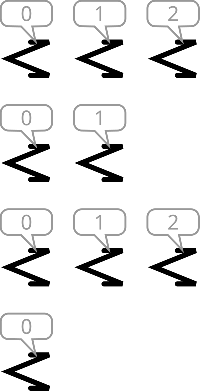
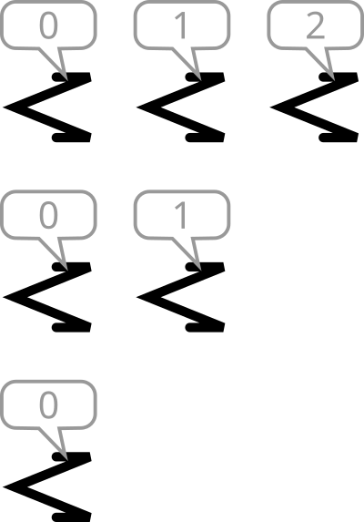

<h1 style='text-align: center;'> A. Destroyer</h1>

<h5 style='text-align: center;'>time limit per test: 1 second</h5>
<h5 style='text-align: center;'>memory limit per test: 256 megabytes</h5>

John is a lead programmer on a destroyer belonging to the space navy of the Confederacy of Independent Operating Systems. One of his tasks is checking if the electronic brains of robots were damaged during battles.

A standard test is to order the robots to form one or several lines, in each line the robots should stand one after another. After that, each robot reports the number of robots standing in front of it in its line.

  An example of robots' arrangement (the front of the lines is on the left). The robots report the numbers above. The $i$-th robot reported number $l_i$. Unfortunately, John does not know which line each robot stands in, and can't check the reported numbers. Please determine if it is possible to form the lines in such a way that all reported numbers are correct, or not.

### Input

The first line contains a single integer $t$ ($1 \leq t \leq 100$), denoting the number of test cases.

The first line in each test case contains a single integer $n$ ($1 \le n \le 100$) — the number of robots.

The second line in each test case contains $n$ integers $l_1, l_2, \ldots, l_n$ ($0 \leq l_i < 100$), $l_i$ is equal to the number of robots in front of the $i$-th robot in its line.

The sum of $n$ over all test cases won't exceed $200$.

### Output

For each test case, output "YES", if there exists a robot arrangement consistent with robots' reports. Otherwise, output "NO".

You can output the answer in any case (upper or lower). For example, the strings "yEs", "yes", "Yes", and "YES" will be recognized as positive responses.

## Example

### Input


```text
560 1 2 0 1 090 0 0 0 1 1 1 2 230 0 219950 1 2 3 4
```
### Output

```text

YES
YES
NO
NO
YES

```
## Note

## Example

 arrangement consistent with robot statements from the first example test case: 

  
## Example

 arrangement consistent with robot statements from the second example is shown in the statement.

In the third test case, the third robot claims that there are two machines in front of it. In such a case, the robot directly in front of it would have one machine in front. No robot claims that, so there is no valid arrangement.


#### Tags 

#800 #NOT OK #implementation #sortings 

## Blogs
- [All Contest Problems](../Codeforces_Round_880_(Div._2).md)
- [Announcement (en)](../blogs/Announcement_(en).md)
- [Tutorial (en)](../blogs/Tutorial_(en).md)
