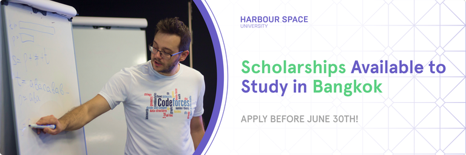

# Announcement

Hello Codeforces!

On [Thursday, May 25, 2023 at 20:35UTC+6](https://codeforces.com/https://www.timeanddate.com/worldclock/fixedtime.html?day=25&month=5&year=2023&hour=17&min=35&sec=0&p1=166) [Educational Codeforces Round 149 (Rated for Div. 2)](https://codeforces.com/contest/1837 "Educational Codeforces Round 149 (Rated for Div. 2)") will start.

Series of Educational Rounds continue being held as [Harbour.Space University](https://codeforces.com/https://harbour.space/) initiative! You can read the details about the cooperation between [Harbour.Space University](https://codeforces.com/https://harbour.space/) and Codeforces in the [blog post](//mirror.codeforces.com/blog/entry/51208).

This round will be **rated for the participants with rating lower than 2100**. It will be held on extended ICPC rules. The penalty for each incorrect submission until the submission with a full solution is 10 minutes. After the end of the contest, you will have 12 hours to hack any solution you want. You will have access to copy any solution and test it locally.

You will be given **6 or 7 problems** and **2 hours** to solve them.

The problems were invented and prepared by Adilbek [adedalic](https://codeforces.com/profile/adedalic "International Master adedalic") Dalabaev, Ivan [BledDest](https://codeforces.com/profile/BledDest "International Grandmaster BledDest") Androsov, Maksim [Neon](https://codeforces.com/profile/Neon "Candidate Master Neon") Mescheryakov and me. Also, huge thanks to Mike [MikeMirzayanov](https://codeforces.com/profile/MikeMirzayanov "Headquarters, MikeMirzayanov") Mirzayanov for great systems Polygon and Codeforces.

Good luck to all the participants!

Our friends at Harbour.Space also have a message for you:

**Seize the Opportunity: Full Scholarships Available at Harbour.Space Bangkok**

*Exciting news Codeforces! Harbour.Space Bangkok Campus is offering 10 full scholarships to study Computer Science or Data Science!*

*Join us at Harbour.Space in the heart of Bangkok, Thailand, and unlock a world of opportunities. We're proud to share that we recently emerged victorious at SWERC, one of the most prestigious programming competitions.* 

*At Harbour.Space, you'll have the privilege of learning from renowned experts like Mike [MikeMirzayanov](https://codeforces.com/profile/MikeMirzayanov "Headquarters, MikeMirzayanov") Mirzayanov and Kamil [Errichto](https://codeforces.com/profile/Errichto "International Grandmaster Errichto") Debowski. These exceptional individuals bring their wealth of knowledge and industry insights to create a dynamic learning experience.*

*By becoming a part of our vibrant and inclusive community, you'll collaborate with brilliant minds, fostering a culture of growth and innovation. Our students, who are qualified and talented, have the opportunity to compete in ICPC, showcasing their skills on a global stage.*

*Join our alumni who have gone on to work at leading companies such as IBM, Google, Deloitte, Amazon and more, paving their way to success.*

**Requirements:**

***Study Commitment:** 3 hours/day. You will complete 15 modules (each three weeks long) in one year. The daily class workload is 3 hours, plus homework to complete in your own time.*

***University requirements***

 * *CV*
* *High School/Bachelor's Degree*
* *English proficiency*
* *Medalist in any Programming competition is a plus!*

*Make sure to apply before **June the 30th, 2023**, to be eligible for the scholarship and reduced application fee!*

*Ready to embark on your path to success? Apply now [here](https://scholarship.harbour.space/bangkok?utm_source=codeforces&utm_medium=partner&utm_campaign=bkk_b2c_bangkok_2023).*

*We can't wait to welcome you to our amazing community.*

*All the best,* *The Harbour.Space Team*

**UPD:** [Editorial is out](Tutorial.md)

