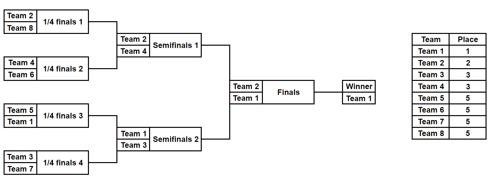

<h1 style='text-align: center;'> E. Playoff Fixing</h1>

<h5 style='text-align: center;'>time limit per test: 2 seconds</h5>
<h5 style='text-align: center;'>memory limit per test: 256 megabytes</h5>

$2^k$ teams participate in a playoff tournament. The teams are numbered from $1$ to $2^k$, in order of decreasing strength. So, team $1$ is the strongest one, team $2^k$ is the weakest one. A team with a smaller number always defeats a team with a larger number.

First of all, the teams are arranged in some order during a procedure called seeding. Each team is assigned another unique value from $1$ to $2^k$, called a seed, that represents its starting position in the playoff.

The tournament consists of $2^k - 1$ games. They are held as follows: the teams are split into pairs: team with seed $1$ plays against team with seed $2$, team with seed $3$ plays against team with seed $4$ (exactly in this order), and so on (so, $2^{k-1}$ games are played in that phase). When a team loses a game, it is eliminated.

After that, only $2^{k-1}$ teams remain. If only one team remains, it is declared the champion; otherwise, $2^{k-2}$ games are played: in the first one of them, the winner of the game "seed $1$ vs seed $2$" plays against the winner of the game "seed $3$ vs seed $4$", then the winner of the game "seed $5$ vs seed $6$" plays against the winner of the game "seed $7$ vs seed $8$", and so on. This process repeats until only one team remains.

After the tournament ends, the teams are assigned places according to the tournament phase when they were eliminated. In particular:

* the winner of the tournament gets place $1$;
* the team eliminated in the finals gets place $2$;
* both teams eliminated in the semifinals get place $3$;
* all teams eliminated in the quarterfinals get place $5$;
* all teams eliminated in the 1/8 finals get place $9$, and so on.

Now that we established the rules, we do a little rigging. In particular, we want: 

* team $1$ (not team with seed $1$) to take place $1$;
* team $2$ to take place $2$;
* teams $3$ and $4$ to take place $3$;
* teams from $5$ to $8$ to take place $5$, and so on.

For example, this picture describes one of the possible ways the tournament can go with $k = 3$, and the resulting places of the teams:

  Some seeds are already reserved for some teams (we are not the only ones rigging the tournament, apparently). We have to fill the rest of the seeds with the remaining teams to achieve the desired placements. How many ways are there to do that? Since that value might be large, print it modulo $998\,244\,353$.

######## Input

The first line contains a single integer $k$ ($0 \le k \le 19$) — there are $2^k$ teams.

The second line contains $2^k$ integers $a_1, a_2, \dots, a_{2^k}$ ($a_i = -1$ or $1 \le a_i \le 2^k$). If $a_i \ne -1$, then team $a_i$ has seed $i$. Otherwise, the seed $i$ is not reserved for any team.

All values, that are not $-1$, are distinct.

######## Output

Print a single integer — the number of ways to fill the non-reserved seeds so that the tournament goes as planned, modulo $998\,244\,353$.

## Examples

######## Input


```text
2
1 2 3 4
```
######## Output


```text
0
```
######## Input


```text
2
1 3 4 2
```
######## Output


```text
1
```
######## Input


```text
1
-1 -1
```
######## Output


```text
2
```
######## Input


```text
2
-1 -1 -1 -1
```
######## Output


```text
16
```
######## Input


```text
3
-1 -1 -1 -1 2 -1 -1 -1
```
######## Output


```text
768
```
######## Input


```text
0
1
```
######## Output


```text
1
```


#### Tags 

#2200 #NOT OK #combinatorics #trees 

## Blogs
- [All Contest Problems](../Educational_Codeforces_Round_149_(Rated_for_Div._2).md)
- [Announcement](../blogs/Announcement.md)
- [Tutorial](../blogs/Tutorial.md)
