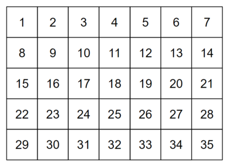
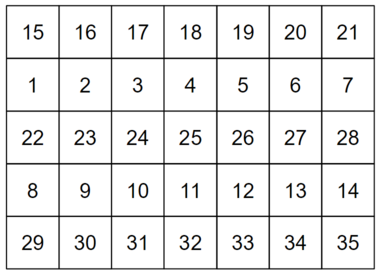
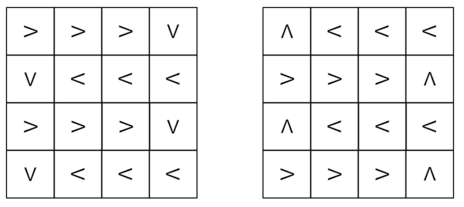
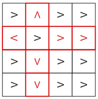

# Tutorial_(en)

[1838A - Blackboard List](../problems/A._Blackboard_List.md "Codeforces Round 877 (Div. 2)")

 **Solution**
### [1838A - Blackboard List](../problems/A._Blackboard_List.md "Codeforces Round 877 (Div. 2)")

Note that any negative integers on the board must have been one of the original two numbers, because the absolute difference between any two numbers is nonnegative. 

So, if there are any negative numbers, print one of those.

If there are only nonnegative integers, note that the maximum number remains the same after performing an operation, because for nonnegative integers $a$, $b$, where $a \le b$, we have $$|a-b| = b - a \le b$$ Therefore, in this case, the maximum number in the list must be one of the original numbers.

Complexity: $O(n)$

 **Code**
```cpp
#include <bits/stdc++.h>
using namespace std;

int main() {

    int t; cin >> t;
    for(int tc = 1; tc <= t; ++tc) {

        int n; cin >> n;
        int mn = INT_MAX, mx = INT_MIN;

        for(int i = 0; i < n; ++i) {
            int x; cin >> x;
            mn = min(mn, x);
            mx = max(mx, x);
        }

        if(mn < 0) cout << mn << 'n';
        else cout << mx << 'n';
    }
}
```
[1838B - Minimize Permutation Subarrays](../problems/B._Minimize_Permutation_Subarrays.md "Codeforces Round 877 (Div. 2)")

 **Solution**
### [1838B - Minimize Permutation Subarrays](../problems/B._Minimize_Permutation_Subarrays.md "Codeforces Round 877 (Div. 2)")

Let $\mathrm{idx}_x$ be the position of the element $x$ in $p$, and consider what happens if $\mathrm{idx}_n$ is in between $\mathrm{idx}_1$ and $\mathrm{idx}_2$. Notice that any subarray of size greater than $1$ that is a permutation must contain $\mathrm{idx}_1$ and $\mathrm{idx}_2$. So it must also contain every index in between, including $\mathrm{idx}_n$. Therefore, $n$ is an element of the permutation subarray, so it must be of size at least $n$, and therefore must be the whole array. 

Therefore, if $\mathrm{idx}_n$ is in between $\mathrm{idx}_1$ and $\mathrm{idx}_2$, the only subarrays that are permutations are $[\mathrm{idx}_1, \mathrm{idx}_1]$ and $[1, n]$. These two subarrays will always be permutations, so this is minimal.

To achieve this, we have 3 cases:

* If $\mathrm{idx}_n$ lies in between $\mathrm{idx}_1$ and $\mathrm{idx}_2$, swap $\mathrm{idx}_1$ and $\mathrm{idx}_2$.
* If $\mathrm{idx}_n < \mathrm{idx}_1, \mathrm{idx}_2$, swap $\mathrm{idx}_n$ with the smaller of $\mathrm{idx}_1$, $\mathrm{idx}_2$.
* If $\mathrm{idx}_n > \mathrm{idx}_1, \mathrm{idx}_2$, swap $\mathrm{idx}_n$ with the larger of $\mathrm{idx}_1$, $\mathrm{idx}_2$.

In all three of these cases, after the swap, $\mathrm{idx}_n$ will lie in between $\mathrm{idx}_1$ and $\mathrm{idx}_2$, minimizing the number of permutation subarrays.

Complexity: $O(n)$

 **Code**
```cpp
#include <bits/stdc++.h>
using namespace std;
#define N 200010

int idx[N];

int main() {

    int t; cin >> t;
    for(int tc = 1; tc <= t; ++tc) {

        int n; cin >> n;

        for(int i = 1; i <= n; ++i) {
            int x; cin >> x;
            idx[x] = i;
        }

        if(idx[n] < min(idx[1], idx[2])) {
            cout << idx[n] << ' ' << min(idx[1], idx[2]) << 'n';
        } else if(idx[n] > max(idx[1], idx[2])) {
            cout << idx[n] << ' ' << max(idx[1], idx[2]) << 'n';
        } else {
            cout << idx[1] << ' ' << idx[2] << 'n';
        }
    }
}
```
[1838C - No Prime Differences](../problems/C._No_Prime_Differences.md "Codeforces Round 877 (Div. 2)")

 **Solution**
### [1838C - No Prime Differences](../problems/C._No_Prime_Differences.md "Codeforces Round 877 (Div. 2)")

Note that if we fill in the numbers in order from the top left to the bottom right, for example, for $n=5$, $m=7$,

  the only adjacent differences are $1$ and $m$. So if $m$ is not prime, this solves the problem. We'll now rearrange the rows so that it works regardless of whether $m$ is prime. Put the first $\lfloor\frac{n}{2}\rfloor$ rows in rows $2$, $4$, $6$, ... and the last $\lceil\frac{n}{2}\rceil$ rows in rows $1$, $3$, $5$, .... In the example above, this would give

  Note that because we are just rearranging the rows from the above solution, all of the horizontal differences are $1$, and the vertical differences are multiples of $m\ge 4$. Therefore, as long as none of the vertical differences equal $m$ itself, they must be composite.

Because $n\ge 4$, no row is next to either of its original neighbors in this ordering, and therefore all vertical differences are greater than $m$, and thus composite.

So we can use this final grid regardless of whether $m$ is prime. 

Complexity: $O(nm)$

 **Code**
```cpp
#include <bits/stdc++.h>
using namespace std;

int main() {

    int t; cin >> t;
    for(int tc = 1; tc <= t; ++tc) {

        int n, m; cin >> n >> m;

        for(int i = 0; i < n; ++i) {
            for(int j = 0; j < m; ++j) {
                if(i % 2 == 0) cout << (n / 2 + i / 2) * m + j + 1 << ' ';
                else cout << (i / 2) * m + j + 1 << ' ';
            }
            cout << 'n';
        }
    }
}
```
[1838D - Bracket Walk](../problems/D._Bracket_Walk.md "Codeforces Round 877 (Div. 2)")

 **Solution**
### [1838D - Bracket Walk](../problems/D._Bracket_Walk.md "Codeforces Round 877 (Div. 2)")

For a string to be walkable, we need $n$ to be even, because the parity of the balance factor changes on each move, and it has to be zero at the end of the process. So if $n$ is odd, the string is never walkable.

Now, consider the set $A$ that contains all indices $i$ ($1$-indexed) satisfying one of the below conditions:

* $i$ is even and $s_i = $ '('
* $i$ is odd and $s_i = $ ')'

Now, consider a few cases:

If $A$ is empty, then $s$ is of the form ()()()(), and is therefore trivially walkable by just moving to the right.

If $\min(A)$ is odd, then $s$ is of the form ()()()).... We can show that it is never walkable, because for every ')' in the first section ()()(), when we land on this ')' (before leaving this section of the string for the first time), the balance factor must be $0$. Therefore, when we try to move across the "))", the balance factor will go to $-1$, and the walk will no longer be valid.

If $\max(A)$ is even, then $s$ is of the form ....(()()(), and we can show that it is never walkable using a somewhat symmetric argument to the previous case, but considering the ending of the walk instead of the beginning.

Otherwise, $\min(A)$ is even and $\max(A)$ is odd. We will prove that it is walkable. In this case, s is of the form ()()()((....))()(). To form a valid walk, keep moving to the right until you hit the "((", then alternate back and forth on the "((" $10^{18}$ times. After this, move to the right until you hit the "))". Note that during this process, the balance factor can never go negative, because it will always be at least $10^{18}-n$. Once you reach the "))", alternate back and forth on it until the balance factor hits $0$. Because n is even, this will happen on the rightmost character of the "))". At this point, just walk to the right until you hit the end, at which point the balance factor will once again be $0$.

So we just need to maintain the set $A$ across all of the queries, and do these simple checks after each query to see if $s$ is walkable.

Complexity: $O((n + q) log n)$

 **Code**
```cpp
#include <bits/stdc++.h>
using namespace std;

int main() {

    int n, q; string s;
    cin >> n >> q >> s;

    set<int> a;

    for(int i = 1; i <= n; ++i)
        if((i % 2) != (s[i - 1] == '('))
            a.insert(i);

    while(q--) {
        int i; cin >> i;

        if(a.count(i)) a.erase(i);
        else a.insert(i);

        if(n % 2) cout << "NOn";
        else if(a.size() && (*a.begin() % 2 || !(*a.rbegin() % 2))) cout << "NOn";
        else cout << "YESn";
    }
}
```
[1838E - Count Supersequences](../problems/E._Count_Supersequences.md "Codeforces Round 877 (Div. 2)")

 **Solution**
### [1838E - Count Supersequences](../problems/E._Count_Supersequences.md "Codeforces Round 877 (Div. 2)")

Let's first consider a DP solution. Let $dp_{i,j}$ be the number of arrays of length $i$, such that the longest prefix of $a$ that appears as a subsequence of the array is of length $j$.

To compute this DP, consider some cases. Let $b'$ be the subarray of the first $i$ elements of $b$, and $a'$ be the subarray of the first $j$ elements of $a$.

1. Every subsequence of $b'$ that equals $a'$ includes position $i$ of $b'$: In this case, position $i$ must be part of the subsequence. This gives us $dp_{i-1, j-1}$ solutions.
2. At least one subsequence of $b'$ that equals $a'$ doesn't include position $i$, and $j < n$: In this case, the value in position $i$ can be anything except for $a_{j+1}$, because that would create a subsequence of length $j+1$. So this gives us $(k-1)dp_{i-1, j}$ solutions.
3. At least one subsequence of $b'$ that equals $a'$ doesn't include position $i$, and $j = n$: This is the same as the previous case, except we don't have a "next" element to worry about, so anything can go in position $i$, and there are $k\cdot dp_{i-1, j}$ solutions.

So the final equation for the DP comes out to

$$dp_{i,j} = \begin{cases} dp_{i-1, j-1} + (k-1)dp_{i-1, j} & j < n \\\ dp_{i-1, j-1} + k\cdot dp_{i-1, j} & j = n \end{cases}$$

This would be $O(nm)$ to compute, so it will TLE. However, we can notice that the DP does not depend on $a$! This means we can change the $a_i$ values to anything we want, and it won't change the answer. To simplify the problem, let all $a_i = 1$. Now, the problem becomes, how many arrays of size $m$, consisting of the values $[1, k]$, contain at least $n$ ones?

To compute this, let's find the number of arrays of size $m$ that contain less than $n$ ones, and subtract it from $k^m$, the total number of arrays. There are $\binom{m}{i}(k-1)^{m-i}$ arrays that contain exactly $i$ ones, so the answer is

$$k^m - \sum_{i=0}^{n-1} \binom{m}{i}(k-1)^{m-i}$$

We use fast exponentiation to compute the powers of $k-1$, and to compute the $\binom{m}{i}$ values, we use the fact that $\binom{m}{0} = 1$ and for $i \ge 1$,

$$\binom{m}{i} = \frac{m(m-1)\ldots(m-i+1)}{i(i-1)\ldots 1} = \frac{m - i + 1}{i}\binom{m}{i - 1}$$

So we can compute the first $n$ $\binom{m}{i}$ values within the time limit.

Complexity: $O(n \log M)$ where $M = 10^9 + 7$.

 **Code**
```cpp
#include <bits/stdc++.h>
using namespace std;

typedef long long int ll;

ll M = 1000000007;

ll pw(ll a, ll p) { return p ? pw(a * a % M, p / 2) * (p & 1 ? a : 1) % M : 1; }

ll inv(ll a) { return pw(a, M - 2); }

int main() {

    ll t; cin >> t;
    for(ll tc = 1; tc <= t; ++tc) {

        ll n, m, k, ai;
        cin >> n >> m >> k;
        for(ll i = 0; i < n; ++i) cin >> ai;

        ll ans = pw(k, m), mCi = 1;

        for(ll i = 0; i < n; ++i) {
            ans = (ans + M - mCi * pw(k - 1, m - i) % M) % M;
            mCi = mCi * (m - i) % M * inv(i + 1) % M;
        }

        cout << ans << 'n';
    }
}
```
[1838F - Stuck Conveyor](../problems/F._Stuck_Conveyor.md "Codeforces Round 877 (Div. 2)")

 **Solution**
### [1838F - Stuck Conveyor](../problems/F._Stuck_Conveyor.md "Codeforces Round 877 (Div. 2)")

The key to our solution will be these two "snake" configurations:

We will initially query the first snake with the box on the top left, and the second snake with the box on the bottom left (or bottom right, depending on parity of $n$).

Note that these two snakes, with the box on the given starting positions, each form a single path such that the box visits all squares, and the second snake visits squares in the reverse order of the first.

Now, consider some cases.

If the stuck conveyor belt directs items to an empty square, then for both of the above configurations, the box will end up in that empty square. This cannot be the "intended" behavior for both of them, because the intended behavior for both of them is different. So in one snake, we will know that this is unintended behavior. Because each possible empty square is only adjacent to one belt, we know exactly which belt must have sent it there, and therefore which one is broken.

If the stuck conveyor belt directs items to another belt, number the conveyor belts from $1$ to $n^2$ in the order they are visited by the first snake, and consider two subcases:

1. If the other belt has a lower number than the stuck belt, then the box will enter an infinite loop for the first snake query, and will terminate for the second snake query. Since the opposite will happen in the other case, this allows us to distinguish these two subcases.Consider what happens if we ask the first snake query again, but place the box on belt $i$ instead of belt $1$. Assume the stuck belt is belt $j$. Because the stuck belt directs items to a belt with smaller number, if $i \le j$, the box will hit the stuck belt, and enter an infinite loop. If $i > j$, the box will never encounter the stuck belt, so it will eventually reach the end of the snake and stop moving.

So with one query, by checking whether the box enters an infinite loop, we can determine whether $i \le j$ or $i > j$. This allows us to binary search for $j$ in $\log (n^2)$ queries.
2. The case where the other belt has a higher number than the stuck belt is analogous, using the second snake query rather than the first.

So now, in all cases, we know which of the $n^2$ belts is stuck. In order to determine the direction in which it is stuck, we use one more query. Place the box on the stuck conveyor, and direct all belts in the same row or column as the stuck belt away from it (all other belts can be directed arbitrarily). Here is one example for $n=4$ where the stuck belt is $(2, 2)$:

So we will get a different final position for the box for each of the four directions in which it could be stuck, and can recover the direction.

The total number of queries for these steps is bounded by $2 + log(n^2) + 1$. Since $n \le 100$, this is at most $17$.

Complexity: $O(n^2 \log (n^2))$

 **Code**
```cpp
#include <bits/stdc++.h>
using namespace std;

char grid[110][110];
int n;
vector<pair<int, int>> snake;
map<pair<int, int>, char> getChar = {
    {{1, 0}, 'v'},
    {{-1, 0}, '^'},
    {{0, 1}, '>'},
    {{0, -1}, '<'}
};

pair<pair<int, int>, char> getBeltAndDir(pair<int, int> p) {
    if(p.first == -1) return {p, 'X'};
    pair<int, int> q = p;

    if(p.first == 0) q.first++;
    if(p.second == 0) q.second++;
    if(p.first > n) q.first--;
    if(p.second > n) q.second--;

    return {q, getChar[{p.first - q.first, p.second - q.second}]};
}

pair<pair<int, int>, char> query(int idx) {

    cout << "? " << snake[idx].first << ' ' << snake[idx].second << endl;

    for(int i = 1; i <= n; ++i) {
        for(int j = 1; j <= n; ++j)
            cout << grid[i][j];
        cout << endl;
    }

    int i, j; cin >> i >> j;

    return getBeltAndDir({i, j});
}

void fillGrid() {
    for(int i = 0; i < n * n; ++i) {
        int dx = snake[i + 1].first - snake[i].first;
        int dy = snake[i + 1].second - snake[i].second;

        grid[snake[i].first][snake[i].second] = getChar[{dx, dy}];
    }
}

int main() {
    cin >> n;

    for(int i = 1; i <= n; ++i)
        if(i % 2 == 0)
            for(int j = n; j >= 1; --j)
                snake.emplace_back(i, j);
        else
            for(int j = 1; j <= n; ++j)
                snake.emplace_back(i, j);

    snake.emplace_back(n + 1, (n % 2 ? n : 1));
    fillGrid();

    auto ans = query(0);

    if(ans.second != 'X') {

        snake.pop_back();
        reverse(snake.begin(), snake.end());
        snake.emplace_back(0, 1);
        fillGrid();

        ans = query(0);
    }

    if(ans.second == 'X') {

        int id = 0;
        for(int j = 13; j >= 0; --j)
            if(id + (1 << j) < n * n && query(id + (1 << j)).second == 'X')
                id += (1 << j);

        ans.first = snake[id];

        for(int i = 1; i <= n; ++i)
            for(int j = 1; j <= n; ++j)
                if(i < ans.first.first) grid[i][j] = '^';
                else if(i > ans.first.first) grid[i][j] = 'v';
                else grid[i][j] = j < ans.first.second ? '<' : '>';
            
        ans.second = query(id).second;
    }

    cout << "! " << ans.first.first << ' ' << ans.first.second << ' ' << ans.second << endl;
}
```
