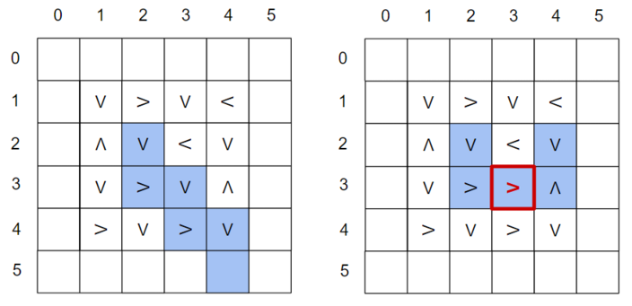

<h1 style='text-align: center;'> F. Stuck Conveyor</h1>

<h5 style='text-align: center;'>time limit per test: 2 seconds</h5>
<h5 style='text-align: center;'>memory limit per test: 256 megabytes</h5>

This is an interactive problem.

There is an $n$ by $n$ grid of conveyor belts, in positions $(1, 1)$ through $(n, n)$ of a coordinate plane. Every other square in the plane is empty. Each conveyor belt can be configured to move boxes up ('^'), down ('v'), left ('<'), or right ('>'). If a box moves onto an empty square, it stops moving.

However, one of the $n^2$ belts is stuck, and will always move boxes in the same direction, no matter how it is configured. Your goal is to perform a series of tests to determine which conveyor belt is stuck, and the direction in which it sends items.

To achieve this, you can perform up to $25$ tests. In each test, you assign a direction to all $n^2$ belts, place a box on top of one of them, and then turn all of the conveyors on. 

One possible result of a query with $n=4$. In this case, the box starts at $(2, 2)$. If there were no stuck conveyor, it would end up at $(5, 4)$, but because of the stuck '>' conveyor at $(3, 3)$, it enters an infinite loop.The conveyors move the box around too quickly for you to see, so the only information you receive from a test is whether the box eventually stopped moving, and if so, the coordinates of its final position.

## Interaction

You begin the interaction by reading a single integer $n$ ($2 \le n\le 100$) — the number of rows and columns in the grid.

Then, you can make at most $25$ queries.

Each query should begin with a line of the form ? r c, where r and c are the initial row and column of the box, respectively.

The next $n$ lines of the query should contain $n$ characters each. The $j$th character of the $i$th row should be one of '^', 'v', '<', or '>', indicating the direction of conveyor $(i, j)$ for this query.

After each query, you will receive two integers $x$ and $y$. If $x = y = -1$, then the box entered an infinite loop. Otherwise, its final position was $(x, y)$.

If you make too many queries or make an invalid query, you will receive the Wrong Answer verdict.

After you have found the stuck conveyor and its direction, print a single line ! r c dir, where r and c are the row and column of the stuck conveyor, respectively, and dir is one of '^', 'v', '<', or '>', indicating the direction of the stuck conveyor. 
## Note

 that printing this answer does not count towards your total of $25$ queries. After printing this line, your program should terminate.

The interactor is non-adaptive. This means that the location and direction of the stuck belt is fixed at the start of the interaction, and does not change after the queries.

After printing a query do not forget to output the end of line and flush the output. Otherwise, you will get Idleness limit exceeded. To do this, use:

* fflush(stdout) or cout.flush() in C++;
* System.out.flush() in Java;
* flush(output) in Pascal;
* stdout.flush() in Python;
* see the documentation for other languages.

Hacks

To make a hack, use the following format.

The first line should contain a single integer $n$ ($1 \le n \le 100$) — the number of rows and columns in the grid.

The next line should contain two integers $r$ and $c$ ($1 \le r, c \le n$), as well as a character $\mathrm{dir}$ ($\mathrm{dir}$ is one of '^', 'v', '<', '>') — the position of the stuck conveyor and its fixed direction. These values should be separated by spaces.

## Examples

##Input
```text

3


-1 -1


0 2
```
##Output
```text


? 2 2
>><
>>v
^<<

? 1 1
>><
>>v
^<<

! 1 2 ^
```
##Input
```text

4


-1 -1
```
##Output
```text


? 2 2
v>v<
^v<v
v>v^
>v>v

! 3 3 >
```
## Note

For the first query of the first sample input, the box starts on $(2, 2)$ and enters an infinite loop containing rows $2$ and $3$. Because the stuck conveyor is in row $1$, it does not affect the outcome of the query.

For the second query of the first sample input, the conveyors are configured in the same way, but the box starts on $(1, 1)$. If there were no stuck conveyor, it would enter an infinite loop between $(1, 2)$ and $(1, 3)$. However, the stuck conveyor redirects it to $(0, 2)$.

After these two queries, the program is able to determine that the stuck conveyor is at $(1, 2)$ and directs items upward.

The query for the second sample input corresponds to the picture above. After asking the query, there are many possibilities for the stuck conveyor, but the program correctly guesses that it is at $(3, 3)$ and directs items to the right.


#### Tags 

#3000 #NOT OK #binary_search #constructive_algorithms #interactive 

## Blogs
- [All Contest Problems](../Codeforces_Round_877_(Div._2).md)
- [Announcement (en)](../blogs/Announcement_(en).md)
- [Tutorial (en)](../blogs/Tutorial_(en).md)
