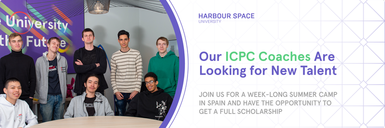

# Announcement

Hello Codeforces!

On [Monday, June 12, 2023 at 20:35UTC+6](https://codeforces.com/https://www.timeanddate.com/worldclock/fixedtime.html?day=12&month=6&year=2023&hour=17&min=35&sec=0&p1=166) [Educational Codeforces Round 150 (Rated for Div. 2)](https://codeforces.com/contest/1841 "Educational Codeforces Round 150 (Rated for Div. 2)") will start.

Series of Educational Rounds continue being held as [Harbour.Space University](https://codeforces.com/https://harbour.space/) initiative! You can read the details about the cooperation between [Harbour.Space University](https://codeforces.com/https://harbour.space/) and Codeforces in the [blog post](//mirror.codeforces.com/blog/entry/51208).

This round will be **rated for the participants with rating lower than 2100**. It will be held on extended ICPC rules. The penalty for each incorrect submission until the submission with a full solution is 10 minutes. After the end of the contest, you will have 12 hours to hack any solution you want. You will have access to copy any solution and test it locally.

You will be given **6 or 7 problems** and **2 hours** to solve them.

The problems were invented and prepared by Adilbek [adedalic](https://codeforces.com/profile/adedalic "International Master adedalic") Dalabaev, Ivan [BledDest](https://codeforces.com/profile/BledDest "International Grandmaster BledDest") Androsov, Maksim [Neon](https://codeforces.com/profile/Neon "Candidate Master Neon") Mescheryakov, Dmitry [TheWayISteppedOutTheCar](https://codeforces.com/profile/TheWayISteppedOutTheCar "Grandmaster TheWayISteppedOutTheCar") Piskalov and me. Also, huge thanks to Mike [MikeMirzayanov](https://codeforces.com/profile/MikeMirzayanov "Headquarters, MikeMirzayanov") Mirzayanov for great systems Polygon and Codeforces.

Additionally, big thanks to the testers [ashmelev](https://codeforces.com/profile/ashmelev "Grandmaster ashmelev"), [shnirelman](https://codeforces.com/profile/shnirelman "International Grandmaster shnirelman") and [Fanarill](https://codeforces.com/profile/Fanarill "Specialist Fanarill") for their valuable advice and suggestions!

Good luck to all the participants!

Our friends at Harbour.Space also have a message for you:

*Hello Codeforces,*

*Thinking about what to do with your one wild life? You are amazing in every way imaginable! You are young and immensely talented, so why not setting yourself up for a lifetime adventure — studying abroad with Harbour.Space University. **Our experienced ICPC coaches are looking for new talent to join the Harbour.Space teams in SWERC and Asia Pacific regions.***

*Every year and all around the year, Harbour.Space University is offering full and partial Bachelor and Master scholarships to study in Barcelona and Bangkok for the academic year 2023/24 for all aspiring and eligible ICPC candidates. We qualified 2 times for the ICPC world finals and it is only the beginning of skills deployment for Spacers.*

*Sign up using [this form](https://codeforces.com/https://harbour-space.typeform.com/to/dJqi3Fo5) to be invited to join our week-long summer camp in Spain, to get to know each other and meet the HS faculty and staff.* 

*Our upcoming Welcome Camp will take place in August 1-7, nearby Barcelona.*

*After we spend a week together, you can be offered a place to study at our university. You don’t even have to leave Spain after the camp, if you secure an offer.* 

*This is your real chance to experience two amazing cities with people from all over the world and get a diploma and accreditation too. Study, compete, work, travel, teach, enjoy the sun, sea, mountains, and all these while networking with the legends of competitive programming, future high-tech entrepreneurs and famous startup investors.*

*We are a no nonsense university that will immerse you into the international culture and spirit of adventure, improve your English and help you build unprecedented confidence and technical expertise to ace the ICPC. With us, you can do what you love everyday, as we never force you to take courses that you do not find interesting! When we say full academic freedom, we mean it. Your personal growth and everyday development are our utmost priority. We recognise your special abilities and therefore needs, everyone at Harbour.Space is unique and here for a reason.* 

*Our caring admission officers are always there for you to answer any questions you might have about studying and working in Barcelona or Bangkok campuses.* 

*Come and help us build the university of the future. Join the Stars.*

*Lana Velikanova,* *The Founder and CEO*

*(Please feel free to add me to your [LinkedIn network](https://codeforces.com/https://www.linkedin.com/in/svetlana-velikanova-871a1057/))*

**UPD:** [Editorial is out](Tutorial.md)

