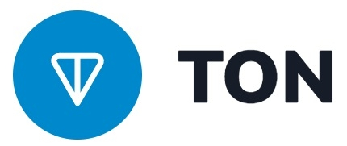

# Announcement_(en)

**Note the unusual start time of the round.** 

Hello, Codeforces!

Now that Gaokao is over, we are very glad to invite you to participate in [CodeTON Round 5 (Div. 1 + Div. 2, Rated, Prizes!)](https://codeforces.com/contest/1842), which will start at [Saturday, June 24, 2023 at 20:05UTC+6](https://codeforces.com/https://www.timeanddate.com/worldclock/fixedtime.html?day=24&month=6&year=2023&hour=17&min=5&sec=0&p1=166). You will be given **9 problems** and **3 hours** to solve them. The round will be rated for everyone.

All problems are written and prepared by [Gary2005](https://codeforces.com/profile/Gary2005 "International Grandmaster Gary2005"), [Asuka](https://codeforces.com/profile/Asuka "International Grandmaster Asuka"), [Crying](https://codeforces.com/profile/Crying "International Grandmaster Crying"), [sjcsjcsjc](https://codeforces.com/profile/sjcsjcsjc "International Grandmaster sjcsjcsjc"), [MonkeyKing](https://codeforces.com/profile/MonkeyKing "Grandmaster MonkeyKing"), [DerekFeng](https://codeforces.com/profile/DerekFeng "International Grandmaster DerekFeng"), [KbltQaQ](https://codeforces.com/profile/KbltQaQ "Master KbltQaQ"), [ShmilyTY](https://codeforces.com/profile/ShmilyTY "Master ShmilyTY") and me.

Statements and editorials will be available in Chinese (Simplified) after the contest.

We would like to give our sincere thanks to:

 * [errorgorn](https://codeforces.com/profile/errorgorn "International Grandmaster errorgorn") for his wonderful coordination!
* [Alexdat2000](https://codeforces.com/profile/Alexdat2000 "Master Alexdat2000") for translating problem statements.
* [gyh20](https://codeforces.com/profile/gyh20 "Legendary Grandmaster gyh20"), [wangziji](https://codeforces.com/profile/wangziji "Legendary Grandmaster wangziji"), [MagicalFlower](https://codeforces.com/profile/MagicalFlower "Legendary Grandmaster MagicalFlower"), [themoon](https://codeforces.com/profile/themoon "Grandmaster themoon"), [qiuzx](https://codeforces.com/profile/qiuzx "International Grandmaster qiuzx"), [Atomic-Jellyfish](https://codeforces.com/profile/Atomic-Jellyfish "International Master Atomic-Jellyfish"), [valeriu](https://codeforces.com/profile/valeriu "Master valeriu"), [nvmdava](https://codeforces.com/profile/nvmdava "Grandmaster nvmdava"), [mtw](https://codeforces.com/profile/mtw "Master mtw"), [AlperenT](https://codeforces.com/profile/AlperenT "Master AlperenT"), [ffao](https://codeforces.com/profile/ffao "International Grandmaster ffao"), [AquaMoon](https://codeforces.com/profile/AquaMoon "International Master AquaMoon"), [Umi](https://codeforces.com/profile/Umi "Grandmaster Umi"), [zengminghao](https://codeforces.com/profile/zengminghao "Master zengminghao"), [blobugh](https://codeforces.com/profile/blobugh "Master blobugh"), [Arraiter](https://codeforces.com/profile/Arraiter "International Grandmaster Arraiter"), [FengzhuJian](https://codeforces.com/profile/FengzhuJian "Master FengzhuJian"), [He_Ren](https://codeforces.com/profile/He_Ren "International Grandmaster He_Ren"), [LZDQ](https://codeforces.com/profile/LZDQ "Grandmaster LZDQ"), [CrTsIr](https://codeforces.com/profile/CrTsIr "Grandmaster CrTsIr"), [Pineapplello](https://codeforces.com/profile/Pineapplello "Master Pineapplello"), [feecle6418](https://codeforces.com/profile/feecle6418 "International Grandmaster feecle6418"), [1.618](https://codeforces.com/profile/1.618 "International Master 1.618"), [Alexdat2000](https://codeforces.com/profile/Alexdat2000 "Master Alexdat2000"), [tzc_wk](https://codeforces.com/profile/tzc_wk "International Grandmaster tzc_wk"), [WAtoAC2001](https://codeforces.com/profile/WAtoAC2001 "Candidate Master WAtoAC2001") and [tibinyte](https://codeforces.com/profile/tibinyte "Newbie tibinyte") for testing this round and providing valuable feedbacks.
* [MikeMirzayanov](https://codeforces.com/profile/MikeMirzayanov "Headquarters, MikeMirzayanov") for the great codeforces and polygon platform.
* Lastly, we would like to express our gratitude to **you** for participating in the round.

The main character of the problems will be Tenzing Tsondu.

We hope that everyone can enjoy the round! As this round is sponsored, everyone will have an opportunity to win some prizes!

Good luck!

**UPD1: Here is the score distribution:**

**250 — 500 — 1000 — 1500 — 2000 — 2500 — 3000 — 3750 — 5000**

**UPD2: [Tutorial](Tutorial_2_(en).md) is available.**

**UPD3: Congratulations to the winners.**

 1. [tourist](https://codeforces.com/profile/tourist "Legendary Grandmaster tourist")
2. [maroonrk](https://codeforces.com/profile/maroonrk "Legendary Grandmaster maroonrk")
3. [hos.lyric](https://codeforces.com/profile/hos.lyric "Legendary Grandmaster hos.lyric")
4. [cnnfls_csy](https://codeforces.com/profile/cnnfls_csy "Legendary Grandmaster cnnfls_csy")
5. [Um_nik](https://codeforces.com/profile/Um_nik "Legendary Grandmaster Um_nik")
6. [DearMargaret](https://codeforces.com/profile/DearMargaret "Legendary Grandmaster DearMargaret")
7. [jiangly](https://codeforces.com/profile/jiangly "Legendary Grandmaster jiangly")
8. [potato167](https://codeforces.com/profile/potato167 "Legendary Grandmaster potato167")
9. [kotatsugame](https://codeforces.com/profile/kotatsugame "Legendary Grandmaster kotatsugame")
10. [noimi](https://codeforces.com/profile/noimi "Legendary Grandmaster noimi")

**UPD4: Congratulations to the first solver of each problem.**

A: [alexwice](https://codeforces.com/profile/alexwice "Candidate Master alexwice")  
B: [ksun48](https://codeforces.com/profile/ksun48 "Legendary Grandmaster ksun48")  
C: [PinkieRabbit](https://codeforces.com/profile/PinkieRabbit "International Grandmaster PinkieRabbit")  
D: [Um_nik](https://codeforces.com/profile/Um_nik "Legendary Grandmaster Um_nik")  
E: [Qingyu](https://codeforces.com/profile/Qingyu "International Grandmaster Qingyu")  
F: [amenotiomoi](https://codeforces.com/profile/amenotiomoi "International Grandmaster amenotiomoi")  
G: [tourist](https://codeforces.com/profile/tourist "Legendary Grandmaster tourist")  
H: [rain_boy](https://codeforces.com/profile/rain_boy "Candidate Master rain_boy")  
I: [maroonrk](https://codeforces.com/profile/maroonrk "Legendary Grandmaster maroonrk") (after contest)

**UPD5: [Chinese statements](https://codeforces.com/https://github.com/platelett/CodeTON-Round-5-Chineses/blob/main/CodeTON%20Round%205%20%E4%B8%AD%E6%96%87%E9%A2%98%E9%9D%A2.pdf)**

**UPD6: [Chinese editorials](https://codeforces.com/https://github.com/platelett/CodeTON-Round-5-Chineses/blob/main/CodeTon%20Round%205%20%E4%B8%AD%E6%96%87%E9%A2%98%E8%A7%A3.pdf)**

Some information from our title sponsor:

*Hello, Codeforces!*

*We, the [Ton Foundation](https://codeforces.com/https://ton.org/) team, are pleased to support CodeTON Round 5.*

*The Open Network (TON) is a fully decentralized layer-1 blockchain designed to onboard billions of users to Web3.*

*Since July 2022, [we have been supporting](https://codeforces.com/blog/entry/104544) Codeforces as a title sponsor. This round is another way for us to contribute to the development of the community.*

*The winners of CodeTON Round 5 will receive valuable prizes.*

*The first 1,023 participants will receive prizes in TON cryptocurrency:*

 * *1st place: 1,024 TON*
* *2–3 places: 512 TON each*
* *4–7 places: 256 TON each*
* *8–15 places: 128 TON each*
* …
* *512–1,023 places: 2 TON each*

*We wish you good luck at CodeTON Round 5 and hope you enjoy the contest!*

