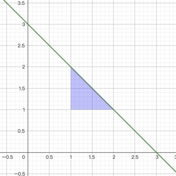
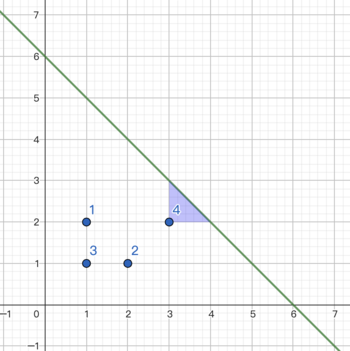
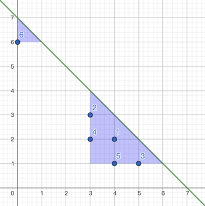

<h1 style='text-align: center;'> E. Tenzing and Triangle</h1>

<h5 style='text-align: center;'>time limit per test: 2 seconds</h5>
<h5 style='text-align: center;'>memory limit per test: 256 megabytes</h5>

There are $n$ pairwise-distinct points and a line $x+y=k$ on a two-dimensional plane. The $i$-th point is at $(x_i,y_i)$. All points have non-negative coordinates and are strictly below the line. Alternatively, $0 \leq x_i,y_i, x_i+y_i < k$.

Tenzing wants to erase all the points. He can perform the following two operations:

1. Draw triangle: Tenzing will choose two non-negative integers $a$, $b$ that satisfy $a+b<k$, then all points inside the triangle formed by lines $x=a$, $y=b$ and $x+y=k$ will be erased. It can be shown that this triangle is an isosceles right triangle. Let the side lengths of the triangle be $l$, $l$ and $\sqrt 2 l$ respectively. Then, the cost of this operation is $l \cdot A$.The blue area of the following picture describes the triangle with $a=1,b=1$ with cost $=1\cdot A$.

 
2. Erase a specific point: Tenzing will choose an integer $i$ that satisfies $1 \leq i \leq n$ and erase the point $i$. The cost of this operation is $c_i$.

Help Tenzing find the minimum cost to erase all of the points.

##### Input

The first line of the input contains three integers $n$, $k$ and $A$ ($1\leq n,k\leq 2\cdot 10^5$, $1\leq A\leq 10^4$) — the number of points, the coefficient describing the hypotenuse of the triangle and the coefficient describing the cost of drawing a triangle.

The following $n$ lines of the input the $i$-th line contains three integers $x_i,y_i,c_i$ ($0\leq x_i,y_i,x_i+y_i< k$, $1\leq c_i\leq 10^4$) — the coordinate of the $i$-th points and the cost of erasing it using the second operation. It is guaranteed that the coordinates are pairwise distinct.

##### Output

##### Output

 a single integer —the minimum cost needed to erase all of the points.

## Examples

##### Input


```text
4 6 1
1 2 1
2 1 1
1 1 1
3 2 6
```
##### Output


```text
4
```
##### Input


```text
6 7 1
4 2 1
3 3 1
5 1 4
3 2 5
4 1 1
0 6 4
```
##### Output


```text
4
```
##### Input


```text
10 4 100
0 0 1
0 1 1
0 2 50
0 3 200
1 0 1
1 1 1
1 2 1
2 0 200
2 1 200
3 0 200
```
##### Output


```text
355
```
## Note

The picture of the first example:

Tenzing do the following operations:

1. draw a triangle with $a=3,b=2$, the cost $=1\cdot A=1$.
2. erase the first point, the cost $=1$.
3. erase the second point, the cost $=1$.
4. erase the third point, the cost $=1$.

  The picture of the second example: 

  

#### Tags 

#2300 #NOT OK #data_structures #dp #geometry #greedy #math 

## Blogs
- [All Contest Problems](../CodeTON_Round_5_(Div._1_+_Div._2,_Rated,_Prizes!).md)
- [Announcement (en)](../blogs/Announcement_(en).md)
- [Tutorial #2 (en)](../blogs/Tutorial_2_(en).md)
