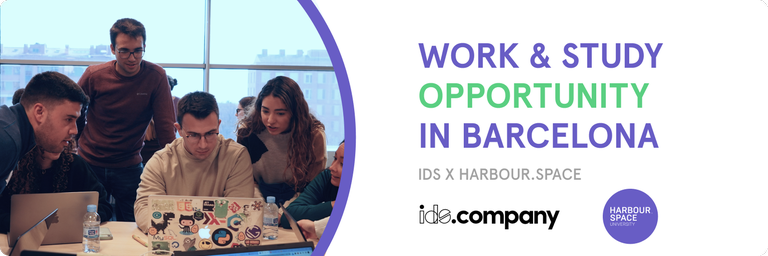

# Announcement

Hello Codeforces!

On [Thursday, June 29, 2023 at 20:35UTC+6](https://codeforces.com/https://www.timeanddate.com/worldclock/fixedtime.html?day=29&month=6&year=2023&hour=17&min=35&sec=0&p1=166) [Educational Codeforces Round 151 (Rated for Div. 2)](https://codeforces.com/contest/1845 "Educational Codeforces Round 151 (Rated for Div. 2)") will start.

Series of Educational Rounds continue being held as [Harbour.Space University](https://codeforces.com/https://harbour.space/) initiative! You can read the details about the cooperation between [Harbour.Space University](https://codeforces.com/https://harbour.space/) and Codeforces in the [blog post](https://mirror.codeforces.com/blog/entry/51208).

This round will be **rated for the participants with rating lower than 2100**. It will be held on extended ICPC rules. The penalty for each incorrect submission until the submission with a full solution is 10 minutes. After the end of the contest, you will have 12 hours to hack any solution you want. You will have access to copy any solution and test it locally.

You will be given **6 or 7 problems** and **2 hours** to solve them.

The problems were invented and prepared by Adilbek [adedalic](https://codeforces.com/profile/adedalic "International Master adedalic") Dalabaev, Ivan [BledDest](https://codeforces.com/profile/BledDest "International Grandmaster BledDest") Androsov, Maksim [Neon](https://codeforces.com/profile/Neon "Candidate Master Neon") Mescheryakov and me. Also, huge thanks to Mike [MikeMirzayanov](https://codeforces.com/profile/MikeMirzayanov "Headquarters, MikeMirzayanov") Mirzayanov for great systems Polygon and Codeforces.

Good luck to all the participants!

Our friends at Harbour.Space also have a message for you:

  **WORK & STUDY OPPORTUNITY IN BARCELONA — IDS x HARBOUR.SPACE UNIVERSITY***Intentionally Designed Solutions (IDS) has partnered with **Harbour.Space University** to offer **Master’s degree scholarships** to study **Front-end Development**, as well as **work experience as a Front-end Engineer** in a leading product development studio specializing in web-based solutions, including websites and web applications.*

*All successful applicants will be eligible for a 100% Tuition Fee Scholarship (29.900 €/year) provided by the Intentionally Designed Solutions (IDS).*

**CANDIDATE’S COMMITMENT**

***Study Commitment:** 3 hours/day*

*You will complete 15 modules (each three weeks long) in one year. The daily class workload is 3 hours, plus homework to complete in your own time.*

***Work Commitment:** 4+ hours/day* 

*Immerse yourself in the professional world during your apprenticeship. You’ll learn from the best and get to apply your newly acquired knowledge in the field from day one.*

**RESPONSIBILITIES** 

 * *Collaborate with cross-functional teams to develop and implement innovative front-end solutions that align with project requirements and design specifications.*
* *Write clean, efficient, and maintainable code using modern front-end technologies, including Typescript and Svelte.*
* *Ensure seamless integration of front-end components with back-end systems, leveraging technologies such as MongoDB and Firebase.*
* *Demonstrate a basic understanding of smart contract technology, enabling the integration of wallets and blockchain functionality into web-based products.*
* *Lead and mentor junior developers, conducting code reviews and providing guidance to improve code quality and development practices.*
* *Drive the development arm of IDS's business by identifying opportunities to optimize processes, enhance efficiency, and improve overall team productivity.*

**REQUIREMENTS:** 

 * *Minimum of 2 years of professional experience in front-end development, with a focus on web-based products.*
* *Strong proficiency in Typescript and Svelte, with a solid understanding of front-end frameworks and libraries.*
* *Experience with back-end integration, particularly with MongoDB and Firebase.*
* *Basic understanding of smart contract technology and its application in web development.*
* *Previous experience managing and mentoring developers, conducting code reviews, and improving development processes.*
* *Excellent problem-solving, communication, and collaboration skills.*
* *Bachelor’s degree or equivalent experience.*
* *Advanced English level.*

  [Apply Now →](https://codeforces.com/https://harbour-space.typeform.com/ids-hsu) **UPD:** [Editorial is out](Tutorial.md)

