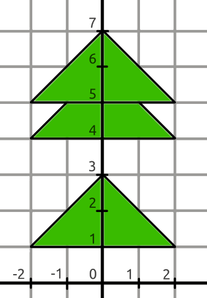

<h1 style='text-align: center;'> D. Rudolph and Christmas Tree</h1>

<h5 style='text-align: center;'>time limit per test: 2 seconds</h5>
<h5 style='text-align: center;'>memory limit per test: 256 megabytes</h5>

Rudolph drew a beautiful Christmas tree and decided to print the picture. However, the ink in the cartridge often runs out at the most inconvenient moment. Therefore, Rudolph wants to calculate in advance how much green ink he will need.

The tree is a vertical trunk with identical triangular branches at different heights. The thickness of the trunk is negligible.

Each branch is an isosceles triangle with base $d$ and height $h$, whose base is perpendicular to the trunk. The triangles are arranged upward at an angle, and the trunk passes exactly in the middle. The base of the $i$-th triangle is located at a height of $y_i$.

The figure below shows an example of a tree with $d = 4, h = 2$ and three branches with bases at heights $[1, 4, 5]$.

  Help Rudolph calculate the total area of the tree branches.

### Input

The first line contains a single integer $t$ ($1 \le t \le 10^4$) — the number of test cases.

Then follow the descriptions of the test cases.

The first line of each test case contains three integers $n, d, h$ ($1 \le n, d, h \le 2 \cdot 10^5$) — the number of branches, the length of the base, and the height of the branches, respectively.

The second line of each test case contains $n$ integers $y_i$ $(1 \le y_i \le 10^9, y_1 < y_2 < ... < y_n)$ — the heights of the bases of the branches.

The sum of $n$ over all test cases does not exceed $2 \cdot 10^5$.

### Output

For each test case, output a single real number on a separate line — the total area of the tree branches. The answer will be considered correct if its absolute or relative error does not exceed $10^{-6}$.

## Example

### Input


```text
53 4 21 4 51 5 134 6 61 2 3 42 1 2000001 2000002 4 39 11
```
### Output

```text

11
2.5
34.5
199999.9999975
11.333333
```


#### Tags 

#1200 #OK #constructive_algorithms #geometry #math 

## Blogs
- [All Contest Problems](../Codeforces_Round_883_(Div._3).md)
- [Announcement](../blogs/Announcement.md)
- [Editorial (en)](../blogs/Editorial_(en).md)
