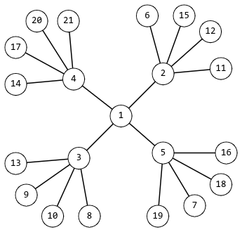

<h1 style='text-align: center;'> E1. Rudolf and Snowflakes (simple version)</h1>

<h5 style='text-align: center;'>time limit per test: 2 seconds</h5>
<h5 style='text-align: center;'>memory limit per test: 256 megabytes</h5>

This is a simple version of the problem. The only difference is that in this version $n \le 10^6$.

One winter morning, Rudolf was looking thoughtfully out the window, watching the falling snowflakes. He quickly noticed a certain symmetry in the configuration of the snowflakes. And like a true mathematician, Rudolf came up with a mathematical model of a snowflake.

He defined a snowflake as an undirected graph constructed according to the following rules: 

* Initially, the graph has only one vertex.
* Then, more vertices are added to the graph. The initial vertex is connected by edges to $k$ new vertices ($k > 1$).
* Each vertex that is connected to only one other vertex is connected by edges to $k$ more new vertices. This step should be done at least once.

The smallest possible snowflake for $k = 4$ is shown in the figure.

  After some mathematical research, Rudolf realized that such snowflakes may not have any number of vertices. Help Rudolf check if a snowflake with $n$ vertices can exist.

### Input

The first line of the input contains an integer $t$ ($1 \le t \le 10^4$) — the number of test cases.

Then follow the descriptions of the test cases.

The first line of each test case contains an integer $n$ ($1 \le n \le 10^6$) — the number of vertices for which it is necessary to check the existence of a snowflake.

### Output

### Output

 $t$ lines, each of which is the answer to the corresponding test case — "YES" if there exists such $k > 1$ for which a snowflake with the given number of vertices can be constructed; "NO" otherwise.

## Example

### Input


```text
912361315255101011000000
```
### Output

```text

NO
NO
NO
NO
YES
YES
YES
YES
NO

```


#### Tags 

#1300 #OK #brute_force #implementation #math 

## Blogs
- [All Contest Problems](../Codeforces_Round_883_(Div._3).md)
- [Announcement](../blogs/Announcement.md)
- [Editorial (en)](../blogs/Editorial_(en).md)
