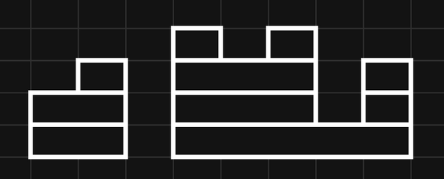

# Tutorial_(en)

We hope you enjoyed these problems :) This contest has been in the works for almost a year.

 **About the Authors**This round was mostly made possible by problemsetters from the [CerealCodes](https://codeforces.com/https://www.cerealcodes.org/) initiative!

CerealCodes is an organization based in the United States dedicated to running high quality competitive programming contests. You can check out our previous contest [here](https://codeforces.com/gym/103886).

**UPD: D1D Editorial have been updated**

**UPD 2: D1D Editorial now has images by [EmeraldBlock](https://codeforces.com/profile/EmeraldBlock "Master EmeraldBlock"). As an apology gift for being so slow, the image generator is programmatic and available [here](https://artofproblemsolving.com/texer/codeforces).**

#### [1853A - Desorting](https://codeforces.com/contest/1853/problem/A "Codeforces Round 887 (Div. 2)")

Problem Credits: [buffering](https://codeforces.com/profile/buffering "Expert buffering")

Analysis: [buffering](https://codeforces.com/profile/buffering "Expert buffering")

 **Hint 1**To make aa not sorted, we just need to pick one index ii so ai>ai+1ai>ai+1. How do we do this?

 **Solution**To make aa not sorted, we just have to make ai>ai+1ai>ai+1 for one ii. 

In one operation, we can reduce the gap between two adjacent elements i,i+1i,i+1 by 22 by adding 11 to 1…i1…i and subtracting 11 from i+1…ni+1…n.

It is clearly optimal to pick the smallest gap between a pair of adjacent elements to minimize the number of operations we have to do. If we have ai=x,ai+1=yai=x,ai+1=y, we can make x>yx>y within ⌊(y−x)2⌋+1⌊(y−x)2⌋+1 operations.

Thus, we can just go through aa, find the minimum difference gap, and calculate the minimum operations using the above formula. Note that if aa is not sorted, we can just output 00.

The time complexity is O(n)O(n).

 **Code (C++)**
```cpp
#include <bits/stdc++.h>
#include <numeric>
using namespace std;
 
int main(){
 
    ios::sync_with_stdio(false);
    cin.tie(0);
 
    int T; cin >> T;
 
    while (T--) {
 
        int n; cin >> n;
        vector<int> nums(n);
        int diff = 1e9;
        bool sorted = true;
        for (int i = 0; i < n; i++) {
            cin >> nums[i];
            if (i > 0) {
                diff = min(nums[i] - nums[i - 1], diff);
                sorted &= nums[i] >= nums[i - 1];
            }
        }
        
        if (!sorted) {
            cout << 0 << endl;
            continue;
        }
    
        cout << diff/2 + 1 << endl;
    }
}
```
#### [1853B - Fibonaccharsis](https://codeforces.com/contest/1853/problem/B "Codeforces Round 887 (Div. 2)")

Problem Credits: [ntarsis30](https://codeforces.com/profile/ntarsis30 "Specialist ntarsis30"), [cry](https://codeforces.com/profile/cry "Candidate Master cry")

Analysis: [cry](https://codeforces.com/profile/cry "Candidate Master cry")

 **Hint 1**Can a sequence involving nn, which is up to 105105, really have up to 109109 terms? 

 **Solution**The terms of the fibonacci sequence will increase exponentially. This is quite intuitive, but mathematically, fibonnaci-like sequences will increase at a rate of phi to the power of nn, where phi (the golden ratio) is about 1.6181.618. Thus, the maximum number of terms a sequence can have before it reaches 109109, or the maximum value of nn, is pretty small (around lognlog⁡n). 

Instead of trying to fix the first two elements of the sequence and counting how many sequences ss will have sk=nsk=n, note that we already have nn fixed. If we loop over the k−1k−1th element of the sequence, the sequence is still fixed. If we know the xxth element and x−1x−1th element of ss, we can find that sx−2=sx−sx−1sx−2=sx−sx−1. 

Thus, we can just go backwards and simulate for kk iterations in O(logn)O(log⁡n) since kk is small, breaking at any point if the current sequence is not fibonnaci-like (there are negative elements or it is not strictly increasing). Otherwise, we add 11 to our answer. 

The time complexity is O(n⋅logn)O(n⋅log⁡n).

 **Code (C++)**
```cpp
#include <bits/stdc++.h>
using namespace std;
 
int main()
{
    ios::sync_with_stdio(false);
    cin.tie(0);
    
    int T; cin >> T;
    
    while (T--) {
 
        int n; int k;
        cin >> n >> k;
     
        int ans = 0;
     
        for (int i = 1; i <= n; i++) {
            int second = n; //xth element where x is k
            int first = i; //fixing x-1th element where x is k-1
            bool valid_seq = true;
            for (int j = 0; j < k - 2; j++) {
                //for s_x and s_x-1, s_x-2 = s_x - s_x-1
                int fx = first;
                first = second - fx;
                second = fx;
                valid_seq &= first <= second;
                valid_seq &= min(first, second) >= 0;
                if (!valid_seq) break; //break if the sequence is not fibonacci-like
            }
            if (valid_seq) ans++;
        }
 
        cout << ans << endl;
    }
 
}
```
Bonus: Solve for n,k≤109n,k≤109

 **Bonus Solution**Analysis by [awesomeguy856](https://codeforces.com/profile/awesomeguy856 "Candidate Master awesomeguy856")

f[k]=Fk−2f[0]+Fk−1f[1]f[k]=Fk−2f[0]+Fk−1f[1]

By the Extended Euclidean Algorithm, we can find one integral solution for this equation, since gcd(Fk−2,Fk−1)=1|f[k].gcd(Fk−2,Fk−1)=1|f[k]. Let this solution be (f[0],f[1])=(x,y).(f[0],f[1])=(x,y). Then all other integral solutions are in the form (x+cFk−1,y−cFk−2),(x+cFk−1,y−cFk−2), for c∈Zc∈Z so we can find all valid solutions by binary search on f[1],f[0]≥0f[1],f[0]≥0 and f[1]>f[0]f[1]>f[0], or just by some calculations. 

#### [1852A - Ntarsis' Set](../problems/A._Ntarsis'_Set.md "Codeforces Round 887 (Div. 1)")

Problem Credits: [nsqrtlog](https://codeforces.com/profile/nsqrtlog "Expert nsqrtlog")

Analysis: [nsqrtlog](https://codeforces.com/profile/nsqrtlog "Expert nsqrtlog"), [buffering](https://codeforces.com/profile/buffering "Expert buffering")

 **Hint 1**Suppose that the numbers are arranged in a line in increasing order. Take a look at each number xx before some day. If it isn't deleted on that day, what new position does it occupy, and how is that impacted by its previous position?

 **Answer**If xx is between aiai and ai+1ai+1, it will move to a new position of x−ix−i, since ii positions before it are deleted.

 **Hint 2**Take this observation, and apply it to simulate the process backwards.

 **Solution**Suppose the numbers are arranged in a line in increasing order. Consider simulating backwards; instead of deleting the numbers at positions a1,a2,…,ana1,a2,…,an in each operation, then checking the first number after kk operations, we start with the number 11 at the front, try to insert zeroes right after positions a1−1,a2−2,…,an−na1−1,a2−2,…,an−n in each operation so that the zeroes will occupy positions a1,a2,…,ana1,a2,…,an after the insertion, and after kk insertions, we will check the position that 11 will end up at.

If a1a1 is not equal to 11, the answer is 11. Otherwise, each insertion can be processed in O(1)O(1) if we keep track of how many of a1−1,a2−2,…,an−na1−1,a2−2,…,an−n are before the current position xx of 11; if a1−1a1−1 through ai−iai−i are before xx, then we will insert ii zeroes before xx. 

The time complexity is O(n+k)O(n+k) per test case. The editorial code additionally processes every insertion with the same ii value in O(1)O(1), for O(n)O(n) overall complexity. 

There are alternative solutions using binary search with complexity O(klognk)O(klog⁡nk) or O(klognlognk)O(klog⁡nlog⁡nk), and we allowed them to pass. In fact, this problem was originally proposed with k≤109k≤109 but we lowered the constraints.

 **Code (C++) -- Model Solution**
```cpp
#include <bits/stdc++.h>
using namespace std;

int n, k, a[200010];

void solve() {
    cin >> n >> k;
    for (int i = 0; i < n; i++) {
        cin >> a[i];
        a[i] -= i;
    }
    if (a[0] != 1) {
        cout << 1 << "n";
        return;
    }
    a[n] = 2e9;
    //start at position 1, and find what number moves to its position
    long long ans = 1;
    int inc = 1; //how many zeroes to insert
    while (inc < n) {
        int days = (a[inc] - ans + inc - 1) / inc;
        if (days >= k){
            ans += k * inc;
            k = 0;
            break;
        }
        ans += days * inc;
        k -= days;
        while (a[inc] <= ans) inc++;
    }
    ans += 1ll * k * n;
    cout << ans << "n";
}

int main() {
    ios::sync_with_stdio(0);
    cin.tie(nullptr);
    
    int t; cin >> t;
    while (t--) solve();
}
```
 **Code (C++) -- Simulation (more readable)**
```cpp
#include <bits/stdc++.h>
using namespace std;

using ll = long long;
const int inf = 1e9+10;
const ll inf_ll = 1e18+10;
#define all(x) (x).begin(), (x).end()
#define pb push_back
#define cmax(x, y) (x = max(x, y))
#define cmin(x, y) (x = min(x, y))

#ifndef LOCAL
#define debug(...) 0
#else
#include "../../debug.cpp"
#endif

int main() {
    ios_base::sync_with_stdio(0); cin.tie(0);
    int t; cin >> t;
    while (t--) {
        ll n, k; cin >> n >> k;
        vector<ll> a(n);
        for (int i = 0; i < n; i++)
            cin >> a[i];

        ll j = 0, x = 1;
        while (k--) {
            while (j < n && a[j] <= x+j)
                j++;
            x += j;
        }

        cout << x << "n";
    }
}
```
#### [1852B - Imbalanced Arrays](../problems/B._Imbalanced_Arrays.md "Codeforces Round 887 (Div. 1)")

Problem Credits: [nsqrtlog](https://codeforces.com/profile/nsqrtlog "Expert nsqrtlog")

Analysis: [buffering](https://codeforces.com/profile/buffering "Expert buffering"), [nsqrtlog](https://codeforces.com/profile/nsqrtlog "Expert nsqrtlog")

 **Hint 1**You can solve the problem by picking one number from each pair (n,−n)(n,−n), (n−1,−n+1)…(n−1,−n+1)…, (1,−1)(1,−1).

 **Hint 2**bi>bjbi>bj implies ai>ajai>aj.

 **Hint 3**First, try to determine **one** index in O(n)O(n), or determine if that's impossible.

 **Hint 4**Sort the array aa to optimize the O(n2)O(n2) solution.

 **Solution**At the start, let xx be an index such that bxbx has the greatest absolute value. If bxbx is negative, we have ax=0ax=0, and else ax=nax=n. Moreover, we can't have ay=0,az=nay=0,az=n for any indices yy and zz, because that implies by+bzby+bz is both positive and negative, contradiction. Hence, the necessary and sufficient condition to check if we can determine an element in array bb with maximum absolute value is (there exists an element of array aa equal to 00) xor (there exists an element of array aa equal to nn). Then, we can remove that element and re-calculate the aa array, leading to an O(n2)O(n2) solution. If the check fails at any moment, there is no valid solution.

To optimize it further, note that we can sort array aa at the start and keep track of them in a deque-like structure. We only need to check the front and end of the deque to see if our key condition holds. Finally, we can use a variable to record the number of positive elements deleted so far and subtract it from the front and end of the deque when checking our condition, so that each check is O(1)O(1). The overall complexity becomes O(nlogn)O(nlog⁡n) due to sorting.

 **Code (C++)**
```cpp
#include <bits/stdc++.h>
using namespace std;

int n, ans[100010];
vector<pair<int,int>> arr;

void solve() {
    cin >> n;
    arr.resize(n);
    for (int i = 0; i < n; i++) {
        cin >> arr[i].first;
        arr[i].second = i;
    }
    sort(arr.begin(), arr.end());
    int l = 0, r = n - 1, sz = n;
    while (l <= r) {
        if ((arr[r].first == n - l) ^ (arr[l].first == n - 1 - r)) {
            if (arr[r].first == n - l) {
                ans[arr[r--].second] = sz--;
            }
            else {
                ans[arr[l++].second] = -(sz--);
            }
        }
        else {
            cout << "NO" << "n";
            return;
        }
    }
    cout << "YES" << "n";
    for (int i = 0; i < n; i++) cout << ans[i] << " ";
    cout << "n";
}

int main() {
    ios::sync_with_stdio(0);
    cin.tie(nullptr);

    int t; cin >> t;
    while(t--) solve();
}
```
#### [1852C - Ina of the Mountain](../problems/C._Ina_of_the_Mountain.md "Codeforces Round 887 (Div. 1)")

Problem Credits: [Ina](https://codeforces.com/profile/Ina "Candidate Master Ina")

Analysis: [Ina](https://codeforces.com/profile/Ina "Candidate Master Ina"), [EmeraldBlock](https://codeforces.com/profile/EmeraldBlock "International Master EmeraldBlock"), [GusterGoose27](https://codeforces.com/profile/GusterGoose27 "Master GusterGoose27")

 **Hint One**Suppose you knew in advance how many times each octopus will regenerate. Could you solve the problem then?

 **Solution**To make things easier, replace health values of kk with health values of 00, so the goal is to reach 00 health. Regeneration is now from 00, which was formerly kk, to k−1k−1, instead of 11 to kk, which is now 11 to 00. For clarity, create a new array bb such that b[i]=a[i]%kb[i]=a[i]%k.

Now, instead of letting health values wrap around, we can just initially give each octopus a multiple of kk more health. For example, if k=3k=3 and an octopus with initially 22 health regenerates twice, we can pretend it initially had 2+2⋅3=82+2⋅3=8 health.

Create a new array cc storing these new healths. Since all healths will reach 00, it also represents the number of boulders that will hit each octopus.

To find the minimum number of boulder throws, represent the health values with a histogram, where the heights of blocks are equal to the values of cc:


Then, erase all vertical borders between blocks. The resulting segments each represent a boulder throw:



Intuitively, this should minimize the number of boulders, since any sequence of boulder throws should be rearrangeable into horizontal segments covering this histogram.

We can easily calculate the number of boulders as the sum of all **positive** adjacent differences, treating the far left and far right as having health 00.


Formally, pad cc with an extra 00 to the left and right (i.e. c[0]=c[n+1]=0c[0]=c[n+1]=0) and let the adjacent differences be d[i]=c[i+1]−c[i]d[i]=c[i+1]−c[i]. We claim the minimum number of boulder throws is throws=∑ni=0max{d[i],0}throws=∑i=0nmax{d[i],0}.

 * This many is necessary, since if d[i]d[i] is positive, octopus i+1i+1 gets crushed d[i]d[i] more times than octopus ii, so at least d[i]d[i] boulders' ranges have left endpoint l=i+1l=i+1.
* This many is achievable, as depicted above. Crush all octopuses with the highest health exactly once (crushing consecutive octopuses with the same boulder), then all octopuses with the new highest health, and so on. Each boulder's range's left endpoint corresponds with part of a positive adjacent difference.
 **Hint 2**Can you figure out an O(n2)O(n2) solution? And can you improve on it?

 **Hint 3**Suppose you already had the optimal solution for the subarray a[1…i]a[1…i]. How could you extend it to a[1…i+1]a[1…i+1]?

 **Tutorial**Read the solution in Hint One before continuing with this tutorial; it provides important definitions.

To reduce the number of possibilities for each c[i]c[i], we prove the following lemma: There exists an optimal choice of cc (minimizing throwsthrows) where all differences between adjacent c[i]c[i] have absolute value less than kk.

Intuitively, this is because we can decrease a c[i]c[i] by kk. Formally:

 **Proof of Lemma**We can prove this using a monovariant on the sum of all values in cc.

Start with an optimal choice of cc. If there does not exist an ii with |d[i]|≥k|d[i]|≥k, we are done.

Otherwise, choose one such ii. Without loss of generality, we can assume d[i]d[i] is positive, as the problem is symmetrical when flipped horizontally.

Now, decrease c[i+1]c[i+1] by kk. This decreases d[i]d[i] by kk to a still-positive value, which decreases throwsthrows by kk. This also increases d[i+1]d[i+1] by kk, which increases throwsthrows by **at most** kk. Thus, throwsthrows does not increase, so the new cc is still optimal.

We can apply this operation repeatedly on any optimal solution until we do not have any more differences with absolute value ≥k≥k. Since each operation decreases the sum of values in cc by kk, this algorithm terminates since the sum of values in cc is finite.

By the previous lemma, if we have determined c[i]c[i], there are at most 22 choices for c[i+1]c[i+1]. (There is 11 choice when b[i]=b[i+1]b[i]=b[i+1], resulting in d[i]=0d[i]=0, c[i]=c[i+1]c[i]=c[i+1], effectively merging the two octopuses.)

We can visualize this as a DAG in the 2D plane over all points (i,c[i])(i,c[i]) (over all possible choices of c[i]c[i]). Each point points to the points in the next column that are the closest above and below (if it exists), forming a grid-like shape. Our goal is to find a path of minimum cost from (0,0)(0,0) to (n+1,0)(n+1,0).

This is the DAG for the second testcase in samples: 

Call each time we choose a c[i+1]>c[i]c[i+1]>c[i] (i.e. positive d[i]d[i]) an *ascent*. Note that the number of ascents is fixed because each nonzero d[i]d[i] is either xx or x+kx+k for some fixed negative xx, and there must be a fixed number of +k+k's to make the total change from c[0]c[0] to c[n+1]c[n+1] zero.

Each ascent brings the path up to the next "row" of descents. Since these rows slope downwards, the jjth ascent must take place at or before some index ijij, because otherwise c[ij+1]c[ij+1] would be negative.

We can use the following strategy to find a path which we claim is optimal:

If we can descend, then we descend. Otherwise, either we ascend, or alternatively, we change a previous descent into an ascent so we can descend here. (This can be further simplified by having a hypothetical "descent" here, so you do not need to compare two possibilities in the implementation.) Now, the best such location for an ascent is the one with **minimum cost.**

 **Proof**We show how to improve (or preserve the optimality of) any other path into the one chosen by this strategy. Index the ascents by the order they are chosen by the strategy, not in left-to-right order.

Let jj be the index of first ascent this strategy chooses that is not in the compared path. Besides the j−1j−1 matching ascents, the compared path must contain at least 11 more ascent at or before ijij, and because of how the strategy chooses ascents, said ascent(s) must have cost no less than the strategy’s jjth ascent. Any can be changed to match the strategy, since the matching ascents already guarantee that each of the first j−1j−1 ascents in left-to-right order happens early enough.

Repeating the above operation will obtain the strategy’s path.

We can implement the above strategy with a priority queue, where for each descent we push on the cost of the corresponding ascent, and when an ascent is required, we then pop off the minimum element. In particular, if b[i]<b[i+1]b[i]<b[i+1], then the corresponding ascent has cost b[i+1]−b[i]b[i+1]−b[i], while if b[i]>b[i+1]b[i]>b[i+1], it has cost b[i+1]−b[i]+kb[i+1]−b[i]+k. Also, since the bottom of the DAG corresponds to c[i]=b[i]c[i]=b[i], an ascent is required exactly when b[i]<b[i+1]b[i]<b[i+1].

 **Code (C++)**
```cpp
#include <bits/stdc++.h>
using namespace std;
typedef long long ll;

void solve() {
	int n, k;
	cin >> n >> k;
	priority_queue<int, vector<int>, greater<int>> differences;
	int previous = 0;
	ll ans = 0;
	for (int i = 0; i < n; i++) {
		int x;
		cin >> x;
		x %= k;
		if (x > previous) {
			differences.push(x - previous);
			ans += differences.top();
  			differences.pop();
		} else {
  			differences.push(k + x - previous);
		}
		previous = x;
  	}
  	cout << ans << "n";
}

int main() {
	int t;
	cin >> t;
	while (t--)
		solve();
}
```
#### [1852D - Miriany and Matchstick](../problems/D._Miriany_and_Matchstick.md "Codeforces Round 887 (Div. 1)")

Problem Credits: [ArielShehter](https://codeforces.com/profile/ArielShehter "Newbie ArielShehter")

Analysis: [EmeraldBlock](https://codeforces.com/profile/EmeraldBlock "International Master EmeraldBlock"), [emorgan](https://codeforces.com/profile/emorgan "International Grandmaster emorgan")

 **Hint 1**Solve the samples for all values of kk.

 **Hint 2**What does constructing a second row from left to right look like?

 **Hint 3**How does knowing the possible kk for any first row help you construct a second row?

 **Hint 4**Apply dynamic programming to calculate the possible kk, and use the information in the DP to construct a solution.

 **Solution**Call the number of adjacent pairs of cells with different characters the *cost*.

If we construct the second row from left to right, the amount each character adds to the cost only depends on the previous character. Thus, we can represent the problem with a DAG whose vertices represent choices for each character and whose edges represent the cost of choosing two adjacent characters. Our goal is to find a path starting from the far left and ending at the far right of cost kk. For example, below is the DAG for the third testcase in the sample. (For convenience, we include the cost of cells in the top row with the corresponding cells in the bottom row.)


A general way to find such a path is as follows: For each vertex, store all possible costs of a path starting from the far left and ending at that vertex, which can be calculated with dynamic programming. Then we construct our path backwards from the right. For each candidate previous vertex, we check that the constructed path's cost plus the cost of the edge from this vertex plus some stored cost in this vertex equals kk, in which case we know that some completion of the path from the far left to this vertex exists and we can choose this vertex.

Naively calculating this DP would require O(n)O(n) time per operation. However, intuitively, each set of possible costs should contain almost all values between its minimum and maximum, and experiments suggest it always consists of at most two intervals. We will first formalize the DP and then prove this observation.

Let dpA[i]dpA[i] store the set of possible values of kk when the grid is truncated to the first ii columns and the last character in the second row is AA. Define dpB[i]dpB[i] similarly.

Using the notation [true]=1[true]=1, [false]=0[false]=0, S+x={s+x∣s∈S}S+x={s+x∣s∈S}, we have the recurrences  
   


 dpA[i]dpB[i]=dpA[i−1]∪(dpB[i−1]+1)+[si≠A]+[si≠si−1]=dpB[i−1]∪(dpA[i−1]+1)+[si≠B]+[si≠si−1]dpA[i]=dpA[i−1]∪(dpB[i−1]+1)+[si≠A]+[si≠si−1]dpB[i]=dpB[i−1]∪(dpA[i−1]+1)+[si≠B]+[si≠si−1]with initial values dpA[1]=[s1≠A]dpA[1]=[s1≠A] and dpB[1]=[s1≠B]dpB[1]=[s1≠B].

Now either we hope that each set consists of O(1)O(1) intervals, or we have to prove that each set indeed consists of at most two intervals:

 **Proof**We will use induction to prove that the following stronger property holds for all i≥2i≥2: dpA[i]dpA[i] and dpB[i]dpB[i] are overlapping intervals, except that possibly one (non-endpoint) value vv is missing from one interval, but in that case either v−1v−1 or v+1v+1 is present in the other interval. (i=1i=1 must be treated separately, but it can easily be checked.)

**Base case.** To prove this holds for i=2i=2, WLOG let s1=As1=A so dpA[1]={0}dpA[1]={0} and dpB[1]={1}dpB[1]={1}. If s2=As2=A, then  
   


 dpA[2]dpB[2]={0}∪({1}+1)+0+0={0,2}={1}∪({0}+1)+1+0={2}dpA[2]={0}∪({1}+1)+0+0={0,2}dpB[2]={1}∪({0}+1)+1+0={2}which satisfies the property with v=1v=1. If s2=Bs2=B, then  
   


 dpA[2]dpB[2]={0}∪({1}+1)+1+1={2,4}={1}∪({0}+1)+0+1={2}dpA[2]={0}∪({1}+1)+1+1={2,4}dpB[2]={1}∪({0}+1)+0+1={2}which satisfies the property with v=3v=3.

**Induction step.** Suppose the property holds for i−1i−1.

Since the conditions of the property only depend on relative positions, for convenience we shift the sets dpA[i]dpA[i] and dpB[i]dpB[i] left by h=[si≠A]+[si≠si−1]h=[si≠A]+[si≠si−1] to get  
   


 dp′A[i]dp′B[i]=dpA[i]−h=dpA[i−1]∪(dpB[i−1]+1)=dpB[i]−h=dpB[i−1]∪(dpA[i−1]+1)+(si=A ? 1:−1).dpA′[i]=dpA[i]−h=dpA[i−1]∪(dpB[i−1]+1)dpB′[i]=dpB[i]−h=dpB[i−1]∪(dpA[i−1]+1)+(si=A ? 1:−1).If the property holds for dp′dp′, then it holds for dpdp.

First, we show that a missing value in dp′A[i]dpA′[i] or dp′B[i]dpB′[i] can only come directly from a missing value in dpA[i−1]dpA[i−1] or dpB[i−1]dpB[i−1] and not from the union operation merging two non-adjacent intervals. This is true because dpA[i−1]dpA[i−1] and dpB[i−1]dpB[i−1] overlap, so even after 11 is added to either, they are still at least adjacent.

If a value vv is missing, WLOG let it be missing from dpA[i−1]dpA[i−1].

 * If v+1∈dpB[i−1]v+1∈dpB[i−1], then dp′A[i]dpA′[i] may be missing vv while dp′B[i]dpB′[i] does not miss any value. Also, since v−1v−1 is adjacent to the missing value (which isn't an endpoint), it is in dpA[i−1]dpA[i−1], so either v+1v+1 or v−1v−1 is in dp′B[i]dpB′[i]. This also guarantees the intervals overlap, satisfying the property for ii.
* The case for v−1∈dpB[i−1]v−1∈dpB[i−1] is very similar. dp′B[i]dpB′[i] may be missing either vv or v+2v+2, and since v+1∈dpA[i−1]v+1∈dpA[i−1], v+1v+1 is in dp′A[i]dpA′[i].

If no value is missing, let xx be a common value in both dpA[i−1]dpA[i−1] and dpB[i−1]dpB[i−1]. Then, dp′A[i]⊇{x,x+1}dpA′[i]⊇{x,x+1} and dp′B[i]dpB′[i] is a superset of either {x−1,x}{x−1,x} or {x+1,x+2}{x+1,x+2}, so the intervals overlap.

To find the union of two sets of intervals, sort them by left endpoint and merge adjacent overlapping intervals. After computing the DP, apply the aforementioned backwards construction to obtain a valid second row.

Below is a visualization of solving the third testcase in the sample. Generate your own [here](https://artofproblemsolving.com/texer/codeforces)!


 **Code (C++)**
```cpp
#include <bits/stdc++.h>
using namespace std;

#define all(x) (x).begin(), (x).end()

struct state {

    // represents a set of integers compressed as a vector
    // of non-overlapping intervals [l, r]

    basic_string<array<int, 2>> a;

    // add d to everything in the set
    friend state add(state x, int d) {
        for (auto& [l, r] : x.a)
            l += d, r += d;
        return x;
    }

    // union of two sets of integers
    friend state unite(state x, state y) {
        state z;
        merge(all(x.a), all(y.a), back_inserter(z.a));
        int j = 0;
        for (int i = 1; i < z.a.size(); i++) {
            if (z.a[i][0] <= z.a[j][1]+1)
                z.a[j][1] = max(z.a[j][1], z.a[i][1]);
            else
                z.a[++j] = z.a[i];
        }
        z.a.erase(z.a.begin() + j + 1, z.a.end());
        return z;
    }

    // whether integer k is in the set
    friend bool contains(state x, int k) {
        for (auto& [l, r] : x.a)
            if (k >= l && k <= r)
                return true;
        return false;
    }
};

// set containing only one integer d
state from_constant(int d) {
    return state({{{d, d}}});
}

int main() {
    ios_base::sync_with_stdio(0); cin.tie(0);
    int t; cin >> t;
    while (t--) {
        int n, k; cin >> n >> k;
        string s; cin >> s;

        vector<array<state, 2>> dp(n);

        dp[0][0] = from_constant(s[0] != 'A');
        dp[0][1] = from_constant(s[0] != 'B');

        for (int i = 1; i < n; i++) {
            dp[i][0] = add(unite(dp[i-1][0], add(dp[i-1][1], 1)), (s[i] != 'A') + (s[i] != s[i-1]));
            dp[i][1] = add(unite(dp[i-1][1], add(dp[i-1][0], 1)), (s[i] != 'B') + (s[i] != s[i-1]));
        }

        if (!(contains(dp[n-1][0], k) || contains(dp[n-1][1], k))) {
            cout << "NOn";
            continue;
        }

        string ans;

        for (int i = n-1; i >= 0; i--) {
            char c = contains(dp[i][0], k - (i == n-1 ? 0 : (ans.back() != 'A'))) ? 'A' : 'B';
            k -= (c != s[i]);
            if (i > 0)
                k -= (s[i] != s[i-1]);
            if (i < n-1)
                k -= (c != ans.back());
            ans += c;
        }

        reverse(all(ans));
        cout << "YESn" << ans << "n";
    }
}
```
#### [1852E - Rivalries](../problems/E._Rivalries.md "Codeforces Round 887 (Div. 1)")

Problem Credits: [buffering](https://codeforces.com/profile/buffering "Expert buffering"), [ArielShehter](https://codeforces.com/profile/ArielShehter "Newbie ArielShehter"), [Ina](https://codeforces.com/profile/Ina "Candidate Master Ina")

Analysis: [oursaco](https://codeforces.com/profile/oursaco "Master oursaco")

 **Hint 1**For each distinct value, only the leftmost and rightmost positions actually have an effect on the power.

 **Hint 2**Think of each distinct value as an interval corresponding to its leftmost and rightmost positions, and let that distinct value be the value of its interval. If interval xx strictly contains an interval yy with greater value, then xx will not have an effect on the power and it can be discarded.

 **Hint 3**In order to not change the power, we can only add intervals that strictly contain an interval with greater value. Afterwards, if ii is not the endpoint of an interval, bibi equals the largest value of an interval containing ii. 

 **Hint 4**There will only be at most one interval that we have to add. Assume that there are multiple intervals that we can add without changing the answer. In this case it is easy to see that its more optimal to combine the interval with smaller value into the interval with larger value. Thus, it is never optimal to add multiple intervals.

 **Solution**Read the hints.

We can remove all intervals that will not affect the power by iterating over them in decreasing order of value and maintain a segment tree that stores for each left endpoint of any processed intervals, the right endpoint that corresponds to it. Checking if an interval is strictly contained then becomes a range minimum query.

Assume that we know the value xx of the interval that we want to add. We can immediately fill the value for the interior of all intervals that correspond to a value greater than xx. However, we also have to guarantee that xx is strictly contained by an interval with greater value, so we can try each interval to contain xx. If are no unfilled indices the left or right side of the interval, then we want to replace the smallest filled on either side value with xx. Otherwise, we can just fill in all the unfilled indices with xx. Note that it is also possible for xx to not be able to be contained by any interval. 

Thus, we can just try every possible xx in decreasing order and maintain the filled indices as we iterate. There are only at most nn values of xx to check, which is just the set of ai−1ai−1 that does not appear in aa.

 **Code (C++)**
```cpp
#include <bits/stdc++.h>
using namespace std;

#define pb push_back
#define ff first
#define ss second

typedef long long ll;
typedef pair<int, int> pii;
typedef pair<ll, ll> pll;

const int INF = 1e9 + 1;

void setIO() {
    ios_base::sync_with_stdio(0); cin.tie(0);
}

pii seg[400005];
int n;

void build(int l = 0, int r = n - 1, int cur = 0){
    seg[cur] = {INF, INF};
    if(l == r) return;
    int mid = (l + r)/2;
    build(l, mid, cur*2 + 1);
    build(mid + 1, r, cur*2 + 2);
}

void update(int x, int v, int l = 0, int r = n - 1, int cur = 0){
    if(l == r){
        seg[cur] = {v, l};
        return;
    }
    int mid = (l + r)/2;
    if(x <= mid) update(x, v, l, mid, cur*2 + 1);
    else update(x, v, mid + 1, r, cur*2 + 2);
    seg[cur] = min(seg[cur*2 + 1], seg[cur*2 + 2]);
}

pii query(int l, int r, int ul = 0, int ur = n - 1, int cur = 0){
    if(l <= ul && ur <= r) return seg[cur];
    if(l > r || ur < l || ul > r) return {INF, INF};
    int mid = (ul + ur)/2;
    return min(query(l, r, ul, mid, cur*2 + 1), query(l, r, mid + 1, ur, cur*2 + 2));
}

int main(){
    setIO();
    int t;
    cin >> t;
    for(int tt = 1; tt <= t; tt++){
        cin >> n;
        map<int, vector<int>> m;
        int arr[n];
        for(int i = 0; i < n; i++){
            cin >> arr[i];
            m[arr[i]].pb(i);
        }
        vector<int> rel; //relevant numbers
        for(auto &i : m){
            rel.pb(i.ff);
            for(int j = 1; j < i.ss.size() - 1; j++){
                arr[i.ss[j]] = 0;
            }
        }
        reverse(rel.begin(), rel.end());
        vector<int> nw;
        build();
        for(int i : rel){
            int l = m[i].front(), r = m[i].back();
            if(query(l, r).ff <= r){
                arr[l] = arr[r] = 0;
            } else {
                update(l, r);
                nw.pb(i);
            }
        }
        swap(rel, nw);
        set<int> s;
        for(int i = 0; i < n; i++) if(!arr[i]) s.insert(i);
        vector<int> vals; //possible target values
        for(int i = rel.size() - 1; i >= 0; i--){
            if(i == rel.size() - 1 || rel[i] - 1 != rel[i + 1]){
                vals.pb(rel[i] - 1);
            }
        }
        ll sum = 0, mx = 0, mxval = 0;
        int lex = -1, rex = -1;
        build();
        for(int i = 0; i < n; i++) if(!arr[i]) update(i, -1);
        reverse(vals.begin(), vals.end());
        queue<pii> upd;
        int ind = 0;
        //try to add an interval with value i
        for(int i : vals){
            vector<int> nxt;
            //try filling in all intervals > i
            while(ind < rel.size() && rel[ind] > i){
                int l = m[rel[ind]].front(), r = m[rel[ind]].back();
                set<int>::iterator it = s.lower_bound(l);
                while(it != s.end() && *it < r){
                    sum += rel[ind];
                    update(*it, rel[ind]);
                    upd.push({*it, rel[ind]});
                    it = s.erase(it);
                }
                nxt.pb(rel[ind++]);
            }
            //try each necessary interval to be strictly contained by i
            for(int j : nxt){
                int l = m[j].front(), r = m[j].back();
                if(s.size() && 0 < l && r < n - 1){
                    //find which indeces on each side to replace with i
                    pii rnw = query(r + 1, n);
                    pii lnw = query(0, l - 1);
                    if(rnw.ff == INF || lnw.ff == INF) continue;
                    ll add = (ll)i*s.size() + (rnw.ff == -1 ? 0 : i - rnw.ff) + (lnw.ff == -1 ? 0 : i - lnw.ff);
                    if(i && sum + add > mx){
                        mx = sum + add;
                        mxval = i;
                        lex = (lnw.ff == -1 ? -1 : lnw.ss);
                        rex = (rnw.ff == -1 ? -1 : rnw.ss);
                        //it is optimal to fill in all intervals > i
                        while(!upd.empty()){
                            arr[upd.front().ff] = upd.front().ss;
                            upd.pop();
                        }
                    }
                }
            }
        }
        //don't want to add any intervals
        if(s.size() == 0 && sum > mx){
            mx = sum;
            lex = rex = -1;
            //it is optimal to fill in all remaining intervals
            while(!upd.empty()){
                arr[upd.front().ff] = upd.front().ss;
                upd.pop();
            }
        }
        if(lex != -1) arr[lex] = 0;
        if(rex != -1) arr[rex] = 0;
        for(int i = 0; i < n; i++) cout << (arr[i] ? arr[i] : mxval) << " ";
        cout << endl;
    }
}
```
#### [1852F - Panda Meetups](../problems/F._Panda_Meetups.md "Codeforces Round 887 (Div. 1)")

Problem Credits: [Benq](https://codeforces.com/profile/Benq "Legendary Grandmaster Benq")

Analysis: [Benq](https://codeforces.com/profile/Benq "Legendary Grandmaster Benq"), [oursaco](https://codeforces.com/profile/oursaco "Master oursaco")

 **Hint 1**If we want to answer one of the questions (say, the question involving all the events) in polynomial time, how do we do it?

 **Hint 2**Construct a network with edges from the source to each of the red panda events with capacities equal to the number of red pandas, edges from red panda events to blue panda events with innite capacities if the red pandas can catch the corresponding blue pandas, and edges from each of the blue panda events to the sink with capacities equal to the number of blue pandas.

 **Hint 3**The next step is to use the max-flow min-cut theorem: the maximum flow is equal to the minimum number of red pandas plus blue pandas we need to remove from the graph such that no remaining red panda can reach any remaining blue panda.

How do we go from here?

 **Hint 4**For any cut, consider the region of the xx-tt plane reachable by the remaining red pandas. No remaining blue pandas can lie in this region, and its border is a polyline that intersects each vertical line in the xx-tt plane exactly once. Furthermore, the slope of every segment in this polyline has slope plus or minus 11. Conversely, we can associate every polyline satisfying this condition with a cut; we just need to remove every red panda lying below the polyline and every blue panda lying on or above the polyline.

Now, figure out how to answer the queries online.

 **Solution**Read the hints to understand the solution better.

We can answer the queries online. For each xx-coordinate xx, maintain a treap that stores for every xx-coordinate, the minimum cut dp[x][t]dp[x][t] associated with a polyline satisfying the condition above that starts at x=−∞x=−∞ and ends at (x,t)(x,t) when only considering events with xx-coordinate at most xx. When transitioning from to xx to x+1x+1, we need to set for every dp[x+1][t]=min(dp[x][t−1],dp[x][t],dp[x][t+1])dp[x+1][t]=min(dp[x][t−1],dp[x][t],dp[x][t+1]) for every tt. To do this quickly, we maintain the values of tt where dp[x][t+1]−dp[x][t]≠0dp[x][t+1]−dp[x][t]≠0 in increasing order, of which there are at most nn. When xx increases by one, each value of increases or decreases by one, depending on the sign of dp[x][t+1]−dp[x][t]dp[x][t+1]−dp[x][t], and some of the values of tt merge, decreasing the size of our treap. As long as we can process each merge in lognlog⁡n time, our solution will run in O(nlogn)O(nlog⁡n) total time. When processing an event, we need to increase all dpdp values in a suffix for red panda events, and all dpdp values in a prefix for blue panda events. To answer a query, we just need to return the minimum prefix sum in our treap.

 **Code (C++)**
```cpp
#include <bits/stdc++.h>
using namespace std;

#define pb push_back
#define ff first
#define ss second

typedef long long ll;
typedef pair<int, int> pii;
typedef pair<ll, ll> pll;

const int INF = 1e9 + 1;

void setIO() {
    ios_base::sync_with_stdio(0); cin.tie(0);
}

struct node {
    //mnpos - leftmost negative 
    //mxpos - rightmost positive
    int pos, tag, mnpos, mxpos;
    //minimum distance
    pair<int, pii> mndif;
    ll sum, pre, val;
    int weight;

    node(){}

    node(int pos_, ll val_){
        pos = pos_;
        val = val_;
        sum = val;
        pre = min((ll)0, val);
        mxpos = -INF;
        mnpos = INF;
        mndif = {INF, {INF, INF}};
        if(val > 0) mxpos = pos;
        if(val < 0) mnpos = pos;
        tag = 0;
        weight = rand();
    }
};

int sz = 1;
node treap[1000005];
int left0[1000005];
int right0[1000005];

int newnode(int pos, ll val){
    treap[sz] = node(pos, val);
    return sz++;
}

pair<int, pii> comb(int a, int b){
    if(a == -INF || b == INF) return {INF, {INF, INF}};
    return {b - a, {a, b}};
}

void pull(int x){
    treap[x].sum = treap[x].val;
    treap[x].pre = min((ll)0, treap[x].val);
    treap[x].mxpos = -INF;
    treap[x].mnpos = INF;
    treap[x].mndif = {INF, {INF, INF}};
    if(treap[x].val > 0) treap[x].mxpos = treap[x].pos;
    if(treap[x].val < 0) treap[x].mnpos = treap[x].pos;
    if(left0[x]){
        treap[x].mndif = min(treap[x].mndif, treap[left0[x]].mndif);
        treap[x].mndif = min(treap[x].mndif, comb(treap[left0[x]].mxpos, treap[x].mnpos));
        treap[x].mnpos = min(treap[x].mnpos, treap[left0[x]].mnpos);
        treap[x].mxpos = max(treap[x].mxpos, treap[left0[x]].mxpos);
        treap[x].pre = min(treap[left0[x]].pre, treap[left0[x]].sum + treap[x].pre);
        treap[x].sum += treap[left0[x]].sum; 
    }
    if(right0[x]){
        treap[x].mndif = min(treap[x].mndif, treap[right0[x]].mndif);
        treap[x].mndif = min(treap[x].mndif, comb(treap[x].mxpos, treap[right0[x]].mnpos));
        treap[x].mnpos = min(treap[x].mnpos, treap[right0[x]].mnpos);
        treap[x].mxpos = max(treap[x].mxpos, treap[right0[x]].mxpos);
        treap[x].pre = min(treap[x].pre, treap[x].sum + treap[right0[x]].pre);
        treap[x].sum += treap[right0[x]].sum;
    }
}

int move(node& x, int shift){
    int ret = x.pos;
    if(x.val < 0) ret -= shift;
    if(x.val > 0) ret += shift;
    return ret;
}

void apply(int x, int tag){
    treap[x].pos = move(treap[x], tag);
    treap[x].tag += tag;
    if(treap[x].mnpos != INF) treap[x].mnpos -= tag;
    if(treap[x].mxpos != -INF) treap[x].mxpos += tag;
    if(treap[x].mndif.ff != INF){
        treap[x].mndif.ff -= 2*tag;
        treap[x].mndif.ss.ff += tag;
        treap[x].mndif.ss.ss -= tag;
    }
}

void push(int x){
    if(!treap[x].tag) return;
    if(left0[x]) apply(left0[x], treap[x].tag);
    if(right0[x]) apply(right0[x], treap[x].tag);
    treap[x].tag = 0;
}

int merge(int a, int b){
    if(!a) return b;
    if(!b) return a;
    if(treap[a].weight < treap[b].weight){ 
        push(a);
        right0[a] = merge(right0[a], b);
        pull(a);
        return a;
    } else {
        push(b);
        left0[b] = merge(a, left0[b]);
        pull(b);
        return b;
    }
}

//splits rt's tree into [0, k) [k, INF)
pair<int, int> split(int x, int k){
    if(!x) return pair<int, int>{0, 0};
    push(x);
    pair<int, int> ret;
    if(treap[x].pos < k){
        ret = split(right0[x], k);
        right0[x] = ret.first;
        ret.first = x;
    } else {
        ret = split(left0[x], k);
        left0[x] = ret.second;
        ret.second = x;
    }
    pull(x);
    return ret;
}

int rt = 0;

void erase(int x){
    pair<int, int> a = split(rt, x);
    pair<int, int> b = split(a.second, x + 1);
    rt = merge(a.first, b.second);
}

//position, value
void insert(int a, ll b){
    if(!rt){
        rt = newnode(a, b);
        return;
    }
    pair<int, int> nw = split(rt, a);
    rt = merge(nw.first, merge(newnode(a, b), nw.second));
}

//value
ll query(int x){
    pair<int, int> a = split(rt, x);
    pair<int, int> b = split(a.second, x + 1); 
    ll ret = (b.first ? treap[b.first].val : 0);
    rt = merge(a.first, merge(b.first, b.second));
    return ret;
}

int main(){
    setIO();
    int n;
    cin >> n;
    int prv = 0;
    ll st = 0;
    for(int i = 1; i <= n; i++){
        int x, t, c;
        cin >> x >> t >> c;
        int dif = x - prv;
        //remove overlap
        while(rt && treap[rt].mndif.ff <= 2*dif){
            pair<int, pii> x = treap[rt].mndif;
            ll a = query(x.ss.ff), b = query(x.ss.ss);
            ll sub = min(a, -b);
            erase(x.ss.ff);
            erase(x.ss.ss);
            a -= sub, b += sub;
            if(a != 0) insert(x.ss.ff, a);
            if(b != 0) insert(x.ss.ss, b);
        }
        //shift everything
        if(rt){
            treap[rt].pos = move(treap[rt], dif);
            treap[rt].tag += dif;
            if(treap[rt].mnpos != INF) treap[rt].mnpos -= dif;
            if(treap[rt].mxpos != -INF) treap[rt].mxpos += dif;
            if(treap[rt].mndif.ff != INF){
                treap[rt].mndif.ff -= 2*dif;
                treap[rt].mndif.ss.ff += dif;
                treap[rt].mndif.ss.ss -= dif;
            }
        }
        ll cur = query(t + 1);
        if(cur != 0) erase(t + 1);
        if(cur - c != 0) insert(t + 1, cur - c);
        if(c > 0) st += c;
        cout << st + (!rt ? 0 : treap[rt].pre) << endl;
        prv = x;
    }
}
```
