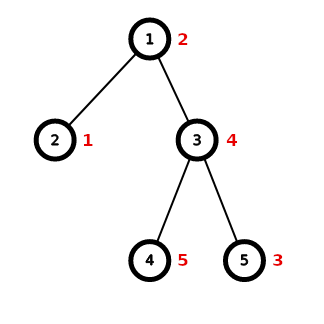
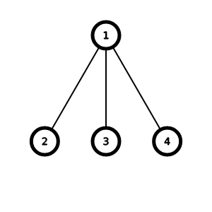

<h1 style='text-align: center;'> E1. PermuTree (easy version)</h1>

<h5 style='text-align: center;'>time limit per test: 2 seconds</h5>
<h5 style='text-align: center;'>memory limit per test: 512 megabytes</h5>

This is the easy version of the problem. The differences between the two versions are the constraint on $n$ and the time limit. You can make hacks only if both versions of the problem are solved.

You are given a tree with $n$ vertices rooted at vertex $1$.

For some permutation$^\dagger$ $a$ of length $n$, let $f(a)$ be the number of pairs of vertices $(u, v)$ such that $a_u < a_{\operatorname{lca}(u, v)} < a_v$. Here, $\operatorname{lca}(u,v)$ denotes the [lowest common ancestor](https://en.wikipedia.org/wiki/Lowest_common_ancestor) of vertices $u$ and $v$.

Find the maximum possible value of $f(a)$ over all permutations $a$ of length $n$.

$^\dagger$ A permutation of length $n$ is an array consisting of $n$ distinct integers from $1$ to $n$ in arbitrary order. For example, $[2,3,1,5,4]$ is a permutation, but $[1,2,2]$ is not a permutation ($2$ appears twice in the array), and $[1,3,4]$ is also not a permutation ($n=3$ but there is $4$ in the array).

###### Input

The first line contains a single integer $n$ ($2 \le n \le 5000$).

The second line contains $n - 1$ integers $p_2,p_3,\ldots,p_n$ ($1 \le p_i < i$) indicating that there is an edge between vertices $i$ and $p_i$.

###### Output

###### Output

 the maximum value of $f(a)$.

## Examples

###### Input


```text
5
1 1 3 3
```
###### Output


```text
4
```
###### Input


```text
2
1
```
###### Output


```text
0
```
###### Input


```text
6
1 2 2 1 5
```
###### Output


```text
7
```
###### Input


```text
4
1 1 1
```
###### Output


```text
2
```
## Note

The tree in the first test: 

  One possible optimal permutation $a$ is $[2, 1, 4, 5, 3]$ with $4$ suitable pairs of vertices: 

* $(2, 3)$, since $\operatorname{lca}(2, 3) = 1$ and $1 < 2 < 4$,
* $(2, 4)$, since $\operatorname{lca}(2, 4) = 1$ and $1 < 2 < 5$,
* $(2, 5)$, since $\operatorname{lca}(2, 5) = 1$ and $1 < 2 < 3$,
* $(5, 4)$, since $\operatorname{lca}(5, 4) = 3$ and $3 < 4 < 5$.

The tree in the third test: 

  The tree in the fourth test: 

  

#### Tags 

#1800 #NOT OK #dfs_and_similar #dp #trees 

## Blogs
- [All Contest Problems](../Codeforces_Round_890_(Div._2)_supported_by_Constructor_Institute.md)
- [Announcement (en)](../blogs/Announcement_(en).md)
- [Tutorial (en)](../blogs/Tutorial_(en).md)
