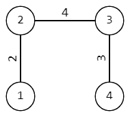
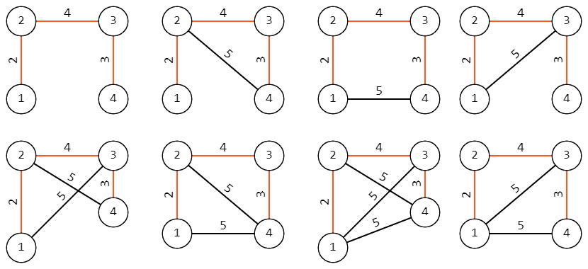

<h1 style='text-align: center;'> G. Counting Graphs</h1>

<h5 style='text-align: center;'>time limit per test: 2 seconds</h5>
<h5 style='text-align: center;'>memory limit per test: 256 megabytes</h5>

Given a tree consisting of $n$ vertices. A tree is a connected undirected graph without cycles. Each edge of the tree has its weight, $w_i$.

Your task is to count the number of different graphs that satisfy all four conditions:

1. The graph does not have self-loops and multiple edges.
2. The weights on the edges of the graph are integers and do not exceed $S$.
3. The graph has exactly one [minimum spanning tree](http://tiny.cc/30g9vz).
4. The minimum spanning tree of the graph is the given tree.

Two graphs are considered different if their sets of edges are different, taking into account the weights of the edges.

The answer can be large, output it modulo $998244353$.

### Input

The first line contains an integer $t$ ($1\le t\le 10^4$) — the number of test cases.

The first line of each test case contains two integers $n$ and $S$ ($2 \le n \le 2 \cdot 10^5, 1\le S\le 10^9$) — the number of vertices and the upper bound of the weights.

Then follow $n-1$ lines describing the tree, the $i$-th line contains three integers $u_i$, $v_i$, and $w_i$ ($1\le u_i,v_i\le n, u_i \ne v_i, 1\le w_i\le S$) — an edge in the tree with weight $w_i$.

It is guaranteed that the sum of $n$ for all tests does not exceed $2\cdot 10^5$.

### Output

For each test, output the number of different graphs that satisfy the conditions, modulo $998244353$.

## Example

### Input


```text
42 51 2 44 51 2 22 3 43 4 35 61 2 31 3 23 4 63 5 110 2001 2 32 3 333 4 2001 5 1325 6 15 7 297 8 1877 9 207 10 4
```
### Output

```text

1
8
80
650867886

```
## Note

In the first sample, there is only one graph, which is the given tree.

In the second samle, the given tree looks like this: 

   All possible graphs for the second sample are shown below, the minimum spanning tree is highlighted in red:  

#### Tags 

#2000 #NOT OK #combinatorics #divide_and_conquer #dsu #graphs #greedy #sortings #trees 

## Blogs
- [All Contest Problems](../Codeforces_Round_891_(Div._3).md)
- [Announcement (en)](../blogs/Announcement_(en).md)
- [Tutorial (en)](../blogs/Tutorial_(en).md)
