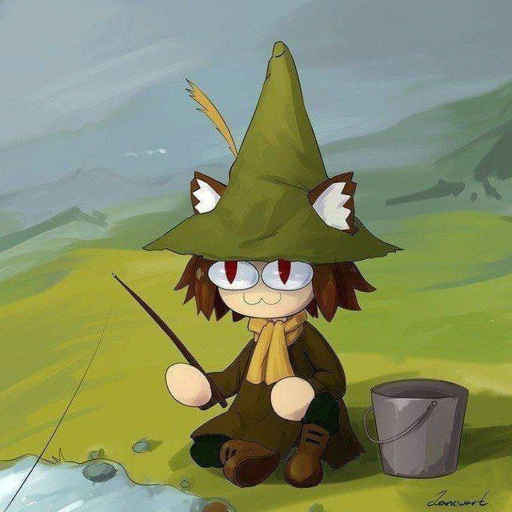

# Announcement_(en)

#### **Hello, Codeforces.**

We are happy to invite you to [Codeforces Round 892 (Div. 2)](https://codeforces.com/contest/1859 "Codeforces Round 892 (Div. 2)"), which will take place on [Saturday, August 12, 2023 at 20:35UTC+6](https://codeforces.com/https://www.timeanddate.com/worldclock/fixedtime.html?day=12&month=8&year=2023&hour=17&min=35&sec=0&p1=166). All of the problems are original and were prepared by a collective of authors, consisting of [kristevalex](https://codeforces.com/profile/kristevalex "Grandmaster kristevalex"), [i_love_penguins](https://codeforces.com/profile/i_love_penguins "Specialist i_love_penguins"), [efimovpaul](https://codeforces.com/profile/efimovpaul "Candidate Master efimovpaul") and me, [induk_v_tsiane](https://codeforces.com/profile/induk_v_tsiane "Master induk_v_tsiane").  **This round will be rated for participants with a rating lower than 2100.**

We would like to thank:

 * [Artyom123](https://codeforces.com/profile/Artyom123 "Grandmaster Artyom123") for coordinating the round.
* [maomao90](https://codeforces.com/profile/maomao90 "Grandmaster maomao90"), [Umi](https://codeforces.com/profile/Umi "Grandmaster Umi"), [Qwerty1232](https://codeforces.com/profile/Qwerty1232 "Grandmaster Qwerty1232") and [Mangooste](https://codeforces.com/profile/Mangooste "International Grandmaster Mangooste") for GM testing.
* [maks_matiupatenko](https://codeforces.com/profile/maks_matiupatenko "International Master maks_matiupatenko"), [tiom4eg](https://codeforces.com/profile/tiom4eg "Master tiom4eg"), [ilyakrasnovv](https://codeforces.com/profile/ilyakrasnovv "Master ilyakrasnovv"), [sergeev.PRO](https://codeforces.com/profile/sergeev.PRO "Master sergeev.PRO"), [EJIC_B_KEDAX](https://codeforces.com/profile/EJIC_B_KEDAX "Master EJIC_B_KEDAX"), [Kihihihi](https://codeforces.com/profile/Kihihihi "Master Kihihihi"), [gmusya](https://codeforces.com/profile/gmusya "Master gmusya"), [zwezdinv](https://codeforces.com/profile/zwezdinv "Master zwezdinv"), [74TrAkToR](https://codeforces.com/profile/74TrAkToR "International Master 74TrAkToR"), [Dominater069](https://codeforces.com/profile/Dominater069 "International Master Dominater069"), [TeaTime](https://codeforces.com/profile/TeaTime "Master TeaTime"), [antonis.white](https://codeforces.com/profile/antonis.white "International Master antonis.white"), [nikuradze](https://codeforces.com/profile/nikuradze "Master nikuradze"), [satyam343](https://codeforces.com/profile/satyam343 "Master satyam343"), [Noobish_Monk](https://codeforces.com/profile/Noobish_Monk "Master Noobish_Monk"), [AquaMoon](https://codeforces.com/profile/AquaMoon "International Master AquaMoon"), [fishy15](https://codeforces.com/profile/fishy15 "Master fishy15"), [meowcneil](https://codeforces.com/profile/meowcneil "Master meowcneil") and [green_gold_dog](https://codeforces.com/profile/green_gold_dog "Master green_gold_dog") for Master and International Master testing.
* [diskoteka](https://codeforces.com/profile/diskoteka "Candidate Master diskoteka"), [ArtAlex](https://codeforces.com/profile/ArtAlex "Candidate Master ArtAlex"), [MrEssiorx](https://codeforces.com/profile/MrEssiorx "Candidate Master MrEssiorx") and [makrav](https://codeforces.com/profile/makrav "Candidate Master makrav") for CM testing.
* [playerr17](https://codeforces.com/profile/playerr17 "Expert playerr17"), [dmikhalin](https://codeforces.com/profile/dmikhalin "Expert dmikhalin"), [FelixDzerzhinsky](https://codeforces.com/profile/FelixDzerzhinsky "Expert FelixDzerzhinsky"), [KiruxaLight](https://codeforces.com/profile/KiruxaLight "Expert KiruxaLight"), [VolkovMA](https://codeforces.com/profile/VolkovMA "Expert VolkovMA"), [Gornak40](https://codeforces.com/profile/Gornak40 "Expert Gornak40"), [Splatjov](https://codeforces.com/profile/Splatjov "Expert Splatjov"), [v0s7er](https://codeforces.com/profile/v0s7er "Expert v0s7er"), [arseny2606](https://codeforces.com/profile/arseny2606 "Expert arseny2606"), [Mr_Ell](https://codeforces.com/profile/Mr_Ell "Expert Mr_Ell"), [qwexd](https://codeforces.com/profile/qwexd "Expert qwexd") and [olyazyryanova](https://codeforces.com/profile/olyazyryanova "Expert olyazyryanova") for Expert testing.
* [YakovLya](https://codeforces.com/profile/YakovLya "Specialist YakovLya") and [LinkCatList](https://codeforces.com/profile/LinkCatList "Specialist LinkCatList") for Specialist testing.
* [pazal](https://codeforces.com/profile/pazal "Newbie pazal") for Newbie testing.
* And last but not least, [MikeMirzayanov](https://codeforces.com/profile/MikeMirzayanov "Headquarters, MikeMirzayanov") for the Codeforces platform and Polygon systems.

You will be given **6 problems** and **2 hours** to solve them. The score distribution is **500 — 1000 — 1250 — 1750 — 2250 — 3000**.

I would like to also congratulate my cousin Max, who is turning 30 the day of the round. If you wish, you can write birthday wishes for him and I will pass them on.

**UPD**: [Editorial](Tutorial_1_(en).md)

**UPD 2**: Congratulations to the winners!

**Div. 2:**

 1. [modulo998244353](https://codeforces.com/profile/modulo998244353 "Newbie modulo998244353")
2. [botjiaxun](https://codeforces.com/profile/botjiaxun "Unrated, botjiaxun")
3. [Tmath_OneLove](https://codeforces.com/profile/Tmath_OneLove "Expert Tmath_OneLove")
4. [FengjianZhu](https://codeforces.com/profile/FengjianZhu "Specialist FengjianZhu")
5. [Alihan_8](https://codeforces.com/profile/Alihan_8 "Expert Alihan_8")

**Div. 1:**

 1. [Geothermal](https://codeforces.com/profile/Geothermal "Legendary Grandmaster Geothermal")
2. [heno239](https://codeforces.com/profile/heno239 "Legendary Grandmaster heno239")
3. [maspy](https://codeforces.com/profile/maspy "Legendary Grandmaster maspy")
4. [jiangly](https://codeforces.com/profile/jiangly "Legendary Grandmaster jiangly")
5. [Ormlis](https://codeforces.com/profile/Ormlis "Legendary Grandmaster Ormlis")
