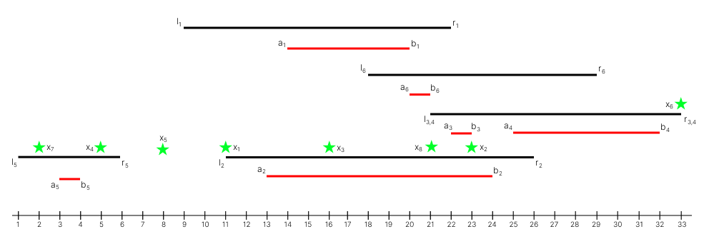

<h1 style='text-align: center;'> D. Andrey and Escape from Capygrad</h1>

<h5 style='text-align: center;'>time limit per test: 2 seconds</h5>
<h5 style='text-align: center;'>memory limit per test: 256 megabytes</h5>

An incident occurred in Capygrad, the capital of Tyagoland, where all the capybaras in the city went crazy and started throwing mandarins. Andrey was forced to escape from the city as far as possible, using portals.

Tyagoland is represented by a number line, and the city of Capygrad is located at point $0$. There are $n$ portals all over Tyagoland, each of which is characterised by four integers $l_i$, $r_i$, $a_i$ and $b_i$ ($1 \le l_i \le a_i \le b_i \le r_i \le 10^9$). 
## Note

 that the segment $[a_i, b_i]$ is contained in the segment $[l_i, r_i]$.

If Andrey is on the segment $[l_i, r_i]$, then the portal can teleport him to any point on the segment $[a_i, b_i]$. Andrey has a pass that allows him to use the portals an unlimited number of times.

Andrey thinks that the point $x$ is on the segment $[l, r]$ if the inequality $l \le x \le r$ is satisfied.

Andrey has $q$ options for where to start his escape, each option is characterized by a single integer $x_i$ — the starting position of the escape. He wants to escape from Capygrad as far as possible (to the point with the maximum possible coordinate). Help Andrey determine how far he could escape from Capygrad, starting at each of the $q$ positions.

### Input

Each test consists of multiple test cases. The first line contains a single integer $t$ ($1 \le t \le 10^4$) — the number of sets of test cases. The description of test cases follows.

The first line of each test case contains a single integer $n$ ($1 \le n \le 2 \cdot 10^5$) — the number of portals.

Each of the next $n$ lines contains four integers $l_i$, $r_i$, $a_i$, and $b_i$ $(1 \le l_i \le a_i \le b_i \le r_i \le 10^9)$ — the characteristics of the portals.

The next line contains a single integer $q$ ($1 \le q \le 2 \cdot 10^5$) — the number of positions.

The following line contains $q$ integers $x_1, x_2, \ldots, x_q$ ($1 \le x_i \le 10^9$) — the position from which Andrey will start his escape in the $i$-th options.

It is guaranteed that the sum of $n$ and the sum of $q$ over all test cases does not exceed $2 \cdot 10^5$.

### Output

For each test case, output a single line of $q$ integers, containing the answers to Andrey's questions.

## Example

### Input


```text
536 17 7 141 12 3 816 24 20 22610 2 23 15 28 1833 14 7 1016 24 20 221 16 3 1492 4 6 8 18 23 11 13 1521 4 2 33 9 6 734 8 1518 24 18 241 8 2 411 16 14 1426 32 28 305 10 6 8915 14 13 27 22 17 31 1 769 22 14 2011 26 13 2421 33 22 2321 33 25 321 6 3 418 29 20 21811 23 16 5 8 33 2 21
```
### Output

```text

14 14 23 15 28 22 
14 14 14 14 22 23 14 14 15 
7 8 7 
15 14 14 30 24 17 31 4 8 
32 32 32 5 8 33 4 32 

```
## Note

In the first test case:

  Optimal actions when starting from each position: 

1. Use portal $1$ and teleport to point $b_1 = 14$.
2. Use portal $2$ first and teleport to point $6$, which is on the segment $[l_1, r_1] = [6, 17]$, then use portal $1$ and teleport to point $b_1 = 14$.
3. Stay at point $x_3=23$ without using any portals.
4. Stay at point $x_4=15$ without using any portals.
5. Point $x_5=28$ is not on any segment, so Andrey won't be able to teleport anywhere.
6. Point $x_6=18$ is only on the segment $[l_3, r_3] = [16, 24]$, use portal $3$ and teleport to point $b_3 = 22$.

In the fifth test case:

  Optimal actions when starting from each position: 

1. Use portal $1$ first and teleport to point $15$ on the segment $[a_1, b_1] = [14, 20]$, then use portal $2$ and teleport to point $21$, which is on the segment $[l_4, r_4] = [21, 33]$ and on the segment $[a_2, b_2] = [13, 24]$, then teleport to point $b_4 = 32$.
2. Use portal $6$ first and teleport to point $20$ on the segment $[a_6, b_6] = [20, 21]$, then use portal $2$ and teleport to point $22$, which is simultaneously on the segment $[l_4, r_4] = [21, 33]$ and on the segment $[a_2, b_2] = [13, 24]$, then teleport to point $b_4 = 32$.
3. Perform the same actions as from the first position.
4. Stay at point $x_4=5$ without using any portals.
5. Point $8$ is not on any segment, so Andrey won't be able to teleport anywhere.
6. Stay at point $x_6=33$ without using any portals.
7. Use portal $5$ and teleport to point $b_5 = 4$.
8. Perform the same actions as from the first position.


#### Tags 

#1800 #NOT OK #binary_search #data_structures #dp #dsu #greedy #sortings 

## Blogs
- [All Contest Problems](../Codeforces_Round_892_(Div._2).md)
- [Announcement (en)](../blogs/Announcement_(en).md)
- [Tutorial #1 (en)](../blogs/Tutorial_1_(en).md)
