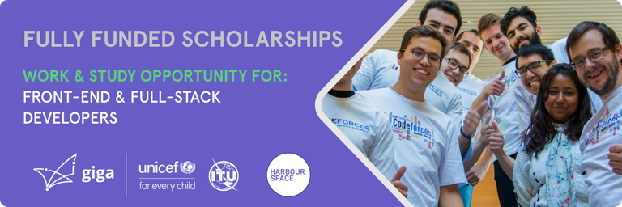

# Announcement

Hello Codeforces!

On [Thursday, August 17, 2023 at 20:35UTC+6](https://codeforces.com/https://www.timeanddate.com/worldclock/fixedtime.html?day=17&month=8&year=2023&hour=17&min=35&sec=0&p1=166) [Educational Codeforces Round 153 (Rated for Div. 2)](https://codeforces.com/contest/1860 "Educational Codeforces Round 153 (Rated for Div. 2)") will start.

Series of Educational Rounds continue being held as [Harbour.Space University](https://codeforces.com/https://harbour.space/) initiative! You can read the details about the cooperation between [Harbour.Space University](https://codeforces.com/https://harbour.space/) and Codeforces in the [blog post](https://mirror.codeforces.com/blog/entry/51208).

This round will be **rated for the participants with rating lower than 2100**. It will be held on extended ICPC rules. The penalty for each incorrect submission until the submission with a full solution is 10 minutes. After the end of the contest, you will have 12 hours to hack any solution you want. You will have access to copy any solution and test it locally.

You will be given **6 or 7 problems** and **2 hours** to solve them.

The problems were invented and prepared by Adilbek [adedalic](https://codeforces.com/profile/adedalic "International Master adedalic") Dalabaev, Ivan [BledDest](https://codeforces.com/profile/BledDest "International Grandmaster BledDest") Androsov, Maksim [Neon](https://codeforces.com/profile/Neon "Candidate Master Neon") Mescheryakov and me. Also, huge thanks to Mike [MikeMirzayanov](https://codeforces.com/profile/MikeMirzayanov "Headquarters, MikeMirzayanov") Mirzayanov for great systems Polygon and Codeforces.

Good luck to all the participants!

Our friends at Harbour.Space also have a message for you:

  **WORK & STUDY OPPORTUNITY IN BARCELONA @HARBOUR.SPACE UNIVERSITY***[Harbour.Space University](https://codeforces.com/https://harbour-space.typeform.com/giga-hsu) has partnered with Giga (Unicef) to offer **Master’s degree scholarships** in the field of **Computer Science and Front-end Development**, as well as **work experience**.* 

*We are looking for various **junior** to **mid** level candidates:* 

***Front-end Developer:***

*This student will work closely with the blockchain developer and product lead to contribute to the design and implementation of user interfaces for the company's blockchain-based prototypes. They will be responsible for translating UI/UX design wireframes into functional and visually appealing web applications, ensuring seamless user experiences. The student will collaborate with blockchain and backend developers and designers to integrate front-end components with server-side logic and optimize application performance. They will also be involved in testing, debugging, and maintaining the front-end codebase. The intern will have the opportunity to gain practical experience in front-end development within the context of blockchain technology and contribute to the Giga’s mission of connecting schools to the internet.*

 * *Solid understanding of HTML, CSS, and JavaScript*
* *Familiarity with front-end frameworks and tools such as React or Vue.js.*
* *Strong problem-solving skills, attention to detail, and a passion for creating intuitive user interfaces are essential*

***Full Stack Developer:***

 * *Interest and experience in web application development, data products and OpenAPIs*
* *Comfortable with on-cloud deployment services (preferably Azure), Git and CI/CD pipeline and deployment processes*
* *Experience with open-source projects is highly preferred*
* *Strong ML knowledge*
* *Experience with data visualization tools like matplotlib, ggplot, d3.js, Tableau that help to visually encode data*
* *Excellent communication skills, — it is incredibily important to describe findings to a technical and non-technical audience*
* *Strong software engineering background*
* *Hands-on experience with data science tools*
* *Problem-solving aptitutde*
* *Analytical mind and great business sense*
* *Degree in computer science, engineering or relevant field is preferred*

*All successful applicants will be eligible for a 100% tuition fee scholarship (29.900 €/year) provided by the partner company.*

***CANDIDATE’S COMMITMENT***

***Study Commitment:** 3 hours/day*

*You will complete 15 modules (each three weeks long) in one year. Daily class workload is 3 hours, plus homework to complete in your own time.*

***Work Commitment:** 4+ hours/day* 

*Immerse yourself in the professional world during your apprenticeship. You’ll learn from the best and get to apply your newly acquired knowledge in the field from day one.*

***REQUIREMENTS:*** 

 * *Industry experience*
* *International exposure*
* *Eager to learn*
* *Sustainability is a key topic for you*
* *You want to work for an NGO*

  [Apply here →](https://scholarship.harbour.space/partner/giga-by-unicef?utm_source=codeforces&utm_medium=partner&utm_campaign=bcn_b2b_giga) **UPD:** [Editorial is out](Tutorial.md)

