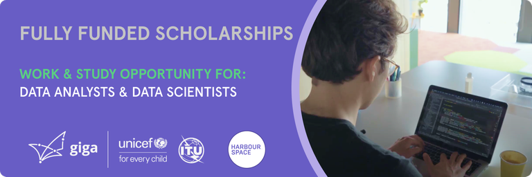

# Announcement

Hello Codeforces!

On [Thursday, August 31, 2023 at 20:35UTC+6](https://codeforces.com/https://www.timeanddate.com/worldclock/fixedtime.html?day=31&month=8&year=2023&hour=17&min=35&sec=0&p1=166) [Educational Codeforces Round 154 (Rated for Div. 2)](https://codeforces.com/contest/1861 "Educational Codeforces Round 154 (Rated for Div. 2)") will start.

Series of Educational Rounds continue being held as [Harbour.Space University](https://codeforces.com/https://harbour.space/) initiative! You can read the details about the cooperation between [Harbour.Space University](https://codeforces.com/https://harbour.space/) and Codeforces in the [blog post](https://mirror.codeforces.com/blog/entry/51208).

This round will be **rated for the participants with rating lower than 2100**. It will be held on extended ICPC rules. The penalty for each incorrect submission until the submission with a full solution is 10 minutes. After the end of the contest, you will have 12 hours to hack any solution you want. You will have access to copy any solution and test it locally.

You will be given **6 or 7 problems** and **2 hours** to solve them.

The problems were invented and prepared by Adilbek [adedalic](https://codeforces.com/profile/adedalic "International Master adedalic") Dalabaev, Ivan [BledDest](https://codeforces.com/profile/BledDest "International Grandmaster BledDest") Androsov, Maksim [Neon](https://codeforces.com/profile/Neon "Candidate Master Neon") Mescheryakov, Roman [Roms](https://codeforces.com/profile/Roms "Master Roms") Glazov and me. Also, huge thanks to Mike [MikeMirzayanov](https://codeforces.com/profile/MikeMirzayanov "Headquarters, MikeMirzayanov") Mirzayanov for great systems Polygon and Codeforces.

Additionally, big thanks to the tester [stAngel](https://codeforces.com/profile/stAngel "Pupil stAngel") for their valuable advice and suggestions!

Good luck to all the participants!

Our friends at Harbour.Space also have a message for you:

  **WORK & STUDY OPPORTUNITY IN BARCELONA @HARBOUR.SPACE UNIVERSITY***[Harbour.Space University](https://codeforces.com/https://harbour-space.typeform.com/giga-hsu) has partnered with Giga (UNICEF) to offer **Master’s degree scholarships** in the field of **Data Science**, as well as **work experience**.* 

*We are looking for various **junior** to **mid** level candidates:* 

**Data Scientist:**

 * *Strong ML knowledge*
* *Experience with Data Visualization Tools like matplotlib, ggplot, d3.js., Tableau that helps to visually encode data*
* *Excellent Communication Skills – it is incredibly important to describe findings to a technical and non-technical audience*
* *Strong Software Engineering Background*
* *Hands-on experience with data science tools*
* *Problem-solving aptitude*
* *Analytical mind and great business sense*
* *Degree in Computer Science, Engineering or relevant field is preferred*

**Data Analyst:**

 * *Cleansing and preparing data*
* *Analyzing and exploring data*
* *Expertise in statistics*
* *Analyzing and visualizing data*
* *Reports and dashboards*
* *Communication and writing*
* *Expertise in the domain*
* *Solution-oriented*

*All successful applicants will be eligible for a 100% tuition fee scholarship (29.900 €/year) provided by the partner company.*

***CANDIDATE’S COMMITMENT***

***Study Commitment:** 3 hours/day*

*You will complete 15 modules (each three weeks long) in one year. Daily class workload is 3 hours, plus homework to complete in your own time.*

***Work Commitment:** 4+ hours/day* 

*Immerse yourself in the professional world during your apprenticeship. You’ll learn from the best and get to apply your newly acquired knowledge in the field from day one.*

***REQUIREMENTS:*** 

 * *Industry experience*
* *International exposure*
* *Eager to learn*
* *Sustainability is a key topic for you*
* *You want to work for an NGO*

  [Apply here →](https://scholarship.harbour.space/partner/giga-by-unicef?utm_source=codeforces&utm_medium=partner&utm_campaign=bcn_b2b_giga) **UPD:** [Editorial is out](Tutorial_(en).md)

