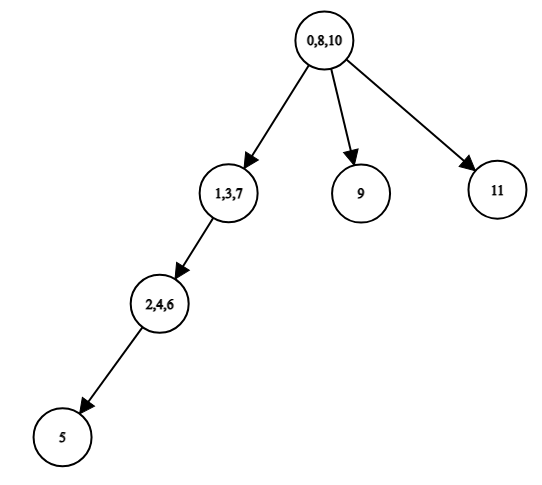

# Tutorial_(en)

[1861A - Prime Deletion](../problems/A._Prime_Deletion.md "Educational Codeforces Round 154 (Rated for Div. 2)")

Idea: [BledDest](https://codeforces.com/profile/BledDest "International Grandmaster BledDest")

 **Tutorial**Tutorial is loading... **Solution (BledDest)**
```cpp
#include<bits/stdc++.h>
 
using namespace std;
 
int main()
{
	int t;
	cin >> t;
	for(int i = 0; i < t; i++)
	{
		string s;
		cin >> s;
		if(s.find("1") < s.find("3"))
			cout << 13;
		else
			cout << 31;
		cout << endl;
	}
}
```
[1861B - Two Binary Strings](../problems/B._Two_Binary_Strings.md "Educational Codeforces Round 154 (Rated for Div. 2)")

Idea: [Roms](https://codeforces.com/profile/Roms "Master Roms")

 **Tutorial**
### [1861B - Two Binary Strings](../problems/B._Two_Binary_Strings.md "Educational Codeforces Round 154 (Rated for Div. 2)")

If the answer is YES, we can always bring both strings to the form 00…01…11 (some prefix consists of zeros, some suffix consists of ones, and all zeroes are before all ones). It's true because after we make both strings equal, we can apply another operation with l=i,r=|a|, where i is the minimum index where both strings have 1 after we made them equal. For example, in the first test case, the strings are equal to 01110001 after applying all operations considered in the statement. We can turn them into the string 01111111 by applying operation with l=2,r=8.

Okay, now let's try to find out when we can transform a string into the form 00…0011…11. We claim that it's possible to transform the string s into the form "i first elements are zeroes, all the remaining elements are ones" if and only if si=0 and si+1=1:

* if si=0 and si+1=1, we can apply two operations with l=1,r=i and l=i+1,r=|s|, and the string turns into the form "i first elements are zeroes, all the remaining elements are ones";
* however, if that's not the case, then either si=si+1, or si=1 and si+1=0. In the former case, we need to change one of these two elements; but since they are equal and adjacent, every operation on them will affect them both, so it's impossible to change only one of them. In the latter case, we need to set either si to 0 or si+1 to 1 first; and when we do it, the elements become equal, and every operation on them will affect them both. So, it's impossible to bring the string into the form "i first elements are zeroes, all the remaining elements are ones".

So, the answer is YES if there is an index i such that ai=bi=0 and ai+1=bi+1=1. Otherwise, the answer is NO.

 **Solution (Roms)**
```cpp
#include <bits/stdc++.h>
 
using namespace std;
 
int main() {
    int t;
    cin >> t;
    for (int tc = 0; tc < t; ++tc) {
        string a, b;
        cin >> a >> b;
        bool ok = false;
        for (int i = 0; i + 1 < a.size(); ++i) {
            if (a[i] == b[i] && a[i] == '0' && a[i + 1] == b[i + 1] && a[i + 1] == '1') {
                ok = true;
            }
        }
        
        if (ok) 
            puts("YES");
        else
            puts("NO");
    }
    return 0;
}
```
[1861C - Queries for the Array](../problems/C._Queries_for_the_Array.md "Educational Codeforces Round 154 (Rated for Div. 2)")

Idea: [BledDest](https://codeforces.com/profile/BledDest "International Grandmaster BledDest")

 **Tutorial**
### [1861C - Queries for the Array](../problems/C._Queries_for_the_Array.md "Educational Codeforces Round 154 (Rated for Div. 2)")

First of all, let's analyze which situations cause the answer to be NO. There are two types:

* if the number of elements in the array is currently less than 2, the array is definitely sorted. So, if we get a 0 and the number of elements is 0 or 1, the answer is NO;
* if the array is sorted, but some prefix of it (maybe coinciding with the whole array) is not sorted, this is also a NO.

These are the only two situations that cause a NO. We can prove that if none of this occurs, the answer is YES, using the following construction: every time there is a + query, we will add 1 to the array; every time there is a 0 query, and the current array is sorted, we will change the last element of the array to 0 (and assume we added 0 instead of 1 in the query it was added). That way, we can ensure that the array stays sorted as long as possible. The only cases when this construction doesn't work are:

* we try to change an element to 0, but there is no such element (the array is empty), or the array stays sorted after the change (we change the first element). This is exactly when a query 0 appears and the current number of elements is less than 2;
* we change an element to 0, and it makes the current array non-sorted, but it has to be sorted due to a query of type 1 affecting it. This is exactly when we have a sorted array with a non-sorted prefix.

Okay, now we have to check these two conditions somehow. The first one is quite easy: just keep track of the number of elements in the array; every time you process +, increase it; every time you process -, decrease it; every time you process 0, check the number of elements.

The second condition is tricky. There are many approaches on how to handle it; I will describe two of them.

Approach 1 (Roms)

We are interested in a situation when a sorted array has an unsorted prefix. Suppose there is a state of our array when this happens. In case when this array has multiple prefixes for which we know that they are sorted, which one should we choose? It should be the longest sorted prefix, because we want an unsorted prefix to be shorter (or have the same length). And among all non-sorted prefixes, we are interested in the shortest one, for the same reason.

So, let's go over the queries and keep track of the shortest non-sorted prefix and the longest sorted prefix of our array. Let's analyze how our queries affect these two values.

* when we append a new element (query of type +), we no longer know that the current array is sorted, but its longest sorted prefix stays the same, and its shortest non-sorted prefix also stays the same. So, we don't need to update these values;
* when we delete the last element (query of type -), the length of the sorted prefix might change. If it was equal to the number of elements before the query, it should decrease by 1, because the last element on that prefix was deleted, and the prefix no longer exists. As for the length of the shortest unsorted prefix, if it was equal to the number of elements in the array before the query, it should be set to 0 — because maybe the last element of the array made the array unsorted, and we don't know anything about the prefixes before it.
* when we process a query of type 0 or 1, we should update the shortest non-sorted prefix or the longest sorted prefix accordingly.

After each query, we can just check that the longest sorted prefix is shorter than the shortest non-sorted prefix (or one of them doesn't exist).

Approach 2 (BledDest)

BledDest is a graph theory lunatic, so naturally, he designed a graph-related solution to this problem.

Let's visualize all states of the array using a rooted tree. Every moment of time after a query corresponds to some vertex in this tree, and one vertex x is a parent of another vertex y if the array in the state represented by x is the same as the array represented by y, but without the last element. For example, if the string of queries is ++-++---+-+, the tree looks like this (the labels on the vertices correspond to the number of queries after which the array is in that state):

  This tree can be constructed from the query string as follows. Start with the root vertex, which represents the state when the array is empty. Every time you get a query +, you need to go down the tree. You create a new vertex to go into, because if you go down the tree to an existing vertex, it means that the states will coincide — and the arrays in these two states are not necessarily similar. If you get a query -, you go up the tree — so you either maintain the current path in the tree in a stack, or store a parent for each vertex, to know where to go when you go up.

Okay, now what about queries of type 0 and 1? Every time we process such a query, we mark the current vertex to remember that it has a 0 or a 1 in it. For example, you can store two boolean arrays that give you the information whether a vertex is marked with 0 and whether a vertex is marked with 1.

So, how does this tree help us in solving the problem? Recall what we're trying to check: we want to find out if a sorted array has a non-sorted prefix. In terms of our tree, it means that a vertex marked with 0 has an ancestor (possibly itself) marked with 1. To check that in O(n), you can, for example, run a series of DFS traversals from all vertices marked with 1 and make sure that you don't visit any vertices marked with 0. Or you could do it in a single DFS (as the model solution does) which, for each vertex in the tree, computes if it has a vertex marked with 0 in its subtree.

 **Solution 1 (Roms)**
```cpp
#include <bits/stdc++.h>
 
using namespace std;
 
const int N = 200000;
 
int main() {
    int t;
    cin >> t;
    for (int tc = 0; tc < t; ++tc) {
        string s;
        cin >> s;
        int maxSortedPref = 0;
        int minNotSortedPref = 0;
        int bal = 0;
        bool good = true;
        
        for (auto c : s) {
            if (c == '+') {
                ++bal;
            } else if (c == '-') {
                --bal;
                maxSortedPref = min(maxSortedPref, bal);
                if (bal < minNotSortedPref)
                    minNotSortedPref = 0;
            } else if (c == '1') {
                maxSortedPref = max(maxSortedPref, bal);
            } else {
                if (bal <= 1) {
                    good = false;
                    break;
                }
                if (minNotSortedPref == 0 || minNotSortedPref > bal)
                    minNotSortedPref = bal;
            }
            if(minNotSortedPref <= maxSortedPref && minNotSortedPref != 0) {
                good = false;
                break;
            }
        }
        
        if (good)
            puts("YES");
        else
            puts("NO");
    }
    return 0;
}
```
 **Solution 2 (BledDest)**
```cpp
#include<bits/stdc++.h>
 
using namespace std;
 
vector<int> has0, has1;
vector<vector<int>> g;
 
bool ans;
 
bool dfs(int x, int d)
{
	if(has0[x] && (has1[x] || d <= 1))
		ans = false;
	bool res = false;
	for(auto y : g[x])
		res |= dfs(y, d + 1);
	if(has0[x] && res)
		ans = false;
	return res || has1[x];
}
 
void solve()
{
	ans = true;
	has0.push_back(0);
	has1.push_back(0);
	g.push_back(vector<int>());
	int ts = 1;
	
	string s;
	cin >> s;
	vector<int> st = {0};
	for(auto x : s)
	{
		int cur = st.back();
		if(x == '0')
			has0[cur] = 1;
		if(x == '1')
			has1[cur] = 1;
		if(x == '+')
		{
			g[cur].push_back(ts);
			st.push_back(ts);
			ts++;
			has0.push_back(0);
			has1.push_back(0);
			g.push_back(vector<int>());
		}
		if(x == '-')
			st.pop_back();
	}
	
	dfs(0, 0);
	cout << (ans ? "YESn" : "NOn");
	
	has0.clear();
	has1.clear();
	g.clear();
}
 
int main()
{
	ios_base::sync_with_stdio(0);
	cin.tie(0);
	int t;
	cin >> t;
	for(int i = 0; i < t; i++)
		solve();
}
```
[1861D - Sorting By Multiplication](../problems/D._Sorting_By_Multiplication.md "Educational Codeforces Round 154 (Rated for Div. 2)")

Idea: [Roms](https://codeforces.com/profile/Roms "Master Roms")

 **Tutorial**
### [1861D - Sorting By Multiplication](../problems/D._Sorting_By_Multiplication.md "Educational Codeforces Round 154 (Rated for Div. 2)")

At first, let's figure out which multiplications by negative values we perform. After a few multiplications, some subarrays of the array a might become negative. If there is more than one such negative subarray (and there are non-negative elements between them), then the array cannot be sorted by multiplication by non-negative values. If there is one such subarray, then it must be a prefix of the array.

Let's try solving this problem in O(n2). Let's iterate over the length of the negative prefix and solve the problem for some fixed negative prefix. Make all the elements on this prefix negative (for example, by multiplying by −1), and then iterate over indices of the array in ascending order. If ai<ai+1 (where i is the current index), then we just go to the next index. Otherwise, we can always multiply the prefix (if ai<0) or the suffix (if ai>0) by some positive value so that the prefix a1,…,ai,ai+1 becomes sorted. Note that if we fixed the negative prefix, we cannot restore the condition ai<ai+1 on multiple indices i with just one operation. For example, if ai,ai+1,aj and aj+1 are all positive, ai≥ai+1 and aj≥aj+1, we need at least two operations to ensure that ai<ai+1 and aj<aj+1. In the first operation, we should choose l=i+1, and in the second operation, we should choose l=j+1, so that both ai+1 becomes greater than ai and aj+1 becomes greater than aj.

For example, if the array a is [−1,−2,−3,2,1,3] (after we fixed that the first 3 elements will be negative). we perform the following sequence of actions: 

1. i=1, a1≥a2 and a1<0, so we just multiply the prefix a1,…,a1 by some positive value (for example 4); after that the current array a=[−4,−2,−3,2,1,3];
2. i=2, a2≥a3 and a2<0, so we just multiply the prefix a1,…,a2 by some positive value (for example 2); after that the current array a=[−8,−4,−3,2,1,3];
3. i=3, a3<a4 so we just go to the next index;
4. i=4, a4≥a5 and a4>0, so we just multiply the suffix a5,…,a6 by some positive value (for example 10); after that, the current array a=[−8,−4,−3,2,10,30];
5. i=5, a5<a6 so we just go to the next index;
6. i=6, so the array is sorted.

To solve the problem in O(n), we need the following observation: if the negative prefix has length x, we perform the operations in two cases: 

* if ai≤ai+1 (in the original array) and i+1≤x;
* if ai≥ai+1 and i≥x.

So, we can iterate on the length of negative prefix x and maintain 

* the number of indices i such that ai−1≤ai and i<x;
* and the number of indices j such that aj≥aj+1 and j≥x.

Don't forget the case when x=0, then we don't need an extra operation to make the prefix negative. 

 **Solution (Roms)**
```cpp
#include <bits/stdc++.h>
 
using namespace std;
 
const int N = 200 * 1000 + 5;
 
int t;
int n;
int a[N];
 
int main() {
    cin >> t;
    for (int tc = 0; tc < t; ++tc){
    	cin >> n;
    	for (int i = 0; i < n; ++i)
    	    cin >> a[i];
    	
    	int cnt = 0;
    	for (int i = 1; i < n; ++i)
    	    cnt += (a[i - 1] >= a[i]);
    	    
    	int res = n, cnt2 = 0;
        for (int i = 0; i <= n; ++i) {
            bool isMultipliedByNegative = (i > 0);
            res = min(res, isMultipliedByNegative + cnt + cnt2);
            
            if (i + 1 < n)
                cnt -= (a[i] >= a[i + 1]);
            if (i > 0)
                cnt2 += (a[i - 1] <= a[i]);
        }
        
        cout << res << endl;
    }
}
```
[1861E - Non-Intersecting Subpermutations](../problems/E._Non-Intersecting_Subpermutations.md "Educational Codeforces Round 154 (Rated for Div. 2)")

Idea: [BledDest](https://codeforces.com/profile/BledDest "International Grandmaster BledDest")

 **Tutorial**
### [1861E - Non-Intersecting Subpermutations](../problems/E._Non-Intersecting_Subpermutations.md "Educational Codeforces Round 154 (Rated for Div. 2)")

Let's try to solve another problem first: we are given an array and a value of k, we need to compute its cost. How can we do it? We can solve it greedily: find the leftmost subarray of length k that contains all values from 1 to k and doesn't intersect with previously added subarrays, add it to the answer, rinse and repeat.

How do we search for the subarray with k distinct values? Let's go through the array from left to right and maintain the maximum number of last elements that are distinct, i. e. the longest suffix that consists of pairwise distinct elements. When this number of elements reaches k, we add 1 to the cost of the array, and drop the number of pairwise distinct elements on suffix to 0 (because we can't reuse them). When we meet an element that already belongs to the longest suffix we maintain, we need to shorten this suffix (it should start right after the last occurrence of that element).

Okay. Now back to the original problem. Let's try to design a dynamic programming solution that will use the number of last distinct elements we can use as one of the states. For example, it could be something like this:

* dpi,x,c — how many arrays of length i exist such that the number of elements on the suffix we can use is x, and the current cost of the array is c?;

The transitions can be done as follows. When we transition from dpi,x,c to dpi+1,x′,c′, we need to consider two cases:

* the new element does not appear among the last x elements. The number of ways to choose it is (k−x), and we transition either to dpi+1,x+1,c, or to dpi+1,0,c+1 (the latter transition is used when x=k−1, since we increase the cost by 1 and cannot reuse the elements);
* the new element appears among the last x elements. Let's iterate which of them is that element: let it be the j-th element from the back, then the current number of elements we can use becomes j, and we transition to dpi+1,j,c.

However, this is O(n2⋅k), since the number of states is O(n2) (the second state is up to k, the third state is up to nk). Let's optimize it to O(n2). The transitions that actually make our solution slow are the transitions of the second type. Let's look at them in detail.

From dpi,x,c, there are transitions of the second type to every state dpi+1,j,c such that j≤x, and in every such transition, the new element is chosen uniquely (so they have the same coefficient equal to 1). This means that we can compute all of those transitions efficiently using partial sums: the difference between the value of dpi+1,j,c and the value of dpi+1,j+1,c (if we don't consider the transitions of the first type) is just dpi,j,c. So, all transitions of the second type can be handled in O(n2), and there are only O(n2) transitions of the first type.

This is enough to solve the problem, but I want to add one final touch that allows to implement the solution much easier. We don't actually need the third state. We can use Contribution To The Sum technique: let's rewrite our dynamic programming without the third state, and every time we try to increase the second state to k, instead of increasing the third state, we calculate how many arrays have this subarray contributing to the cost. This is just the current value of dynamic programming, multiplied by the number of ways we can choose the remaining elements (which is kn−i−1). That way, the implementation becomes much simpler, and the complexity of the solution is now O(nk).

 **Solution (BledDest)**
```cpp
#include<bits/stdc++.h>
 
using namespace std;
 
const int MOD = 998244353;
 
int add(int x, int y)
{
	x += y;
	while(x >= MOD) x -= MOD;
	while(x < 0) x += MOD;
	return x;
}
 
int sub(int x, int y)
{
	return add(x, -y);
}
 
int mul(int x, int y)
{
	return (x * 1ll * y) % MOD;
}
 
int binpow(int x, int y)
{
	int z = 1;
	while(y > 0)
	{
		if(y & 1) z = mul(z, x);
		x = mul(x, x);
		y /= 2;
	}
	return z;
}
 
int main()
{
	int n, k;
	cin >> n >> k;
	int ans = 0;
	vector<vector<int>> dp(n + 1, vector<int>(k, 0));
	dp[0][0] = 1;
	for(int i = 0; i < n; i++)
	{
		int cur = 0;
		for(int j = k - 1; j >= 1; j--)
		{
			cur = add(cur, dp[i][j]);
			dp[i + 1][j] = cur;
		}
		for(int j = k - 1; j >= 0; j--)
		{
			int nxt = (j + 1) % k;
			dp[i + 1][nxt] = add(dp[i + 1][nxt], mul(dp[i][j], k - j));
		}
		ans = add(ans, mul(dp[i + 1][0], binpow(k, n - (i + 1))));
	}
	cout << ans << endl;
}
```
[1861F - Four Suits](../problems/F._Four_Suits.md "Educational Codeforces Round 154 (Rated for Div. 2)")

Idea: [BledDest](https://codeforces.com/profile/BledDest "International Grandmaster BledDest")

 **Tutorial**
### [1861F - Four Suits](../problems/F._Four_Suits.md "Educational Codeforces Round 154 (Rated for Div. 2)")

As far as I am concerned, fully greedy solutions don't work in this problem. However, we can try employing some greedy ideas.

First of all, let's calculate how many cards each player should receive. I will call it remaini for the i-th player.

Suppose we want to maximize the answer for the i-th player. Let's iterate on the suit j for which that player will have the maximum number of cards. We can assign as many cards of suit j as possible from the deck to the i-th player: suppose we have given a card of suit j to another player, and a card of another suit to the i-th player. If we exchange them, the answer won't become worse.

Okay, now we want to find the minimum possible maximum number of cards (after the players discard some of their cards) that the other players can have. Let's suppose it's x. There should be a way to assign the remaining cards from the deck so that every player k gets exactly remaink cards, and no player has more than x cards in any suit (except for the i-th player).

The good thing is that if it's possible to assign cards for some value of x, it's also possible for x+1. So, we can find this x with binary search.

Now we have to solve the following problem: check if there exists an assignment of cards from the deck for a particular x. We can model it using maximum flow:

* create a network with a source, sink, a vertex for every player except for i, and a vertex for every suit;
* for every suit, create a directed edge from the source to that suit with capacity equal to the number of cards of that suit left in the deck (don't forget that we greedily assigned some cards to the i-th player!);
* for every player k except i=k, create a directed edge from that player to the sink with capacity equal to remaink;
* for every suit and every player except i, create a directed edge from the suit to the player with capacity equal to the maximum number of cards of that suit the player can receive;
* check that the maximum flow in this network saturates all edges going into the sink (i. e. is equal to the sum of remaink for all players except the i-th one).

However, simply building this network is too slow, let alone finding the maximum flow in it. We need something faster.

If you're thinking about using Hall's theorem, then unfortunately, it doesn't work since it cannot handle the constraint on x. But you're thinking in the right direction.

Let's try to find the minimum cut in this network. To do this, iterate on the mask of the suits that will be in the set S in the minimum cut, add the capacities of other suits to the value of the cut, and for every player, determine if it's better to have them in the set S or in the set T of the cut. The key thing is that if we fix the mask of suits and the value of x, it is uniquely determined. Let the number of suits in the mask be suits, and the total number of cards the k-th player has from those suits be alreadyHasmask,k. The total capacity of all edges going into the k-th player that we need to cut is suits⋅x−alreadyHasmask,k, and the capacity of the outgoing edge is remaink. So, the value the k-th player adds to the cut is min(remaink,suits⋅x−alreadyHasmask,k), and we need to compute the sum of these values for all players (except for the player i) efficiently.

This is basically the outline of the solution. Now the implementation part follows. To be honest, I think that the model solution is a bit too complicated, some solutions I've seen during the contest are shorter and cleaner. But I will explain it nevertheless.

For every mask and every value of x, let's try to find the sum of min(suits⋅x−alreadyHasmask,k,remaink) over all players. To do this, for every player, find the maximum value of x such that suits⋅x−alreadyHasmask,k is less than remaink. For the value of x not greater than this value, the player adds suits⋅x−alreadyHasmask,k to the cut; for greater values, the player adds remaink. Both of those are linear functions, and for every x, we can compute the sum of those linear functions for all players using difference arrays. I calculate these sums of linear functions in all values of x up to 2⋅106, because there might be situations when a player has more than 106 cards of a particular suit.

That way, when we want to compute the minimum cut for the i-th player, chosen mask of suits and the value of x, we can use the already computed sum of those functions to find the total value all players add to the cut, and then subtract the value that the i-th player added (since we need to discard that player from the network).

The rest of the implementation is fairly straightforward, you can see the reference code for details (I hope I commented it well enough). One final note: when choosing the left border for binary search, I compute the maximum number of cards among all suits that the other players have, to make sure that I don't choose the value of x that leads to edges having negative capacity in the network. But I think it's not actually required, so you can try discarding it from the solution.

The model implementation works in something like O(2K⋅(n⋅K+A)) for precalculation of linear functions plus O(n⋅2K⋅K2⋅logA) for actually solving the problem, where A is the maximum number of cards of a particular suit a player can have (A≤2⋅106).

 **Solution (BledDest)**
```cpp
#include<bits/stdc++.h>
 
using namespace std;
 
const int K = 4;
const int N = 2 * int(1e6) + 43;
 
pair<long long, long long> operator+(const pair<long long, long long>& a, const pair<long long, long long>& b)
{
	return make_pair(a.first + b.first, a.second + b.second);
}
 
pair<long long, long long> operator-(const pair<long long, long long>& a, const pair<long long, long long>& b)
{
	return make_pair(a.first - b.first, a.second - b.second);
}
 
// prefix sums for an array of pairs
vector<pair<long long, long long>> pref_sums(const vector<pair<long long, long long>>& a)
{
	int n = a.size();
	vector<pair<long long, long long>> ans(n);
	ans[0] = a[0];
	for(int i = 1; i < n; i++)
		ans[i] = ans[i - 1] + a[i];
	return ans;
}
 
// for an array of pairs denoting linear functions, evaluate
// them in the corresponding points
vector<long long> eval(const vector<pair<long long, long long>>& a)
{
	int n = a.size();
	vector<long long> ans(n);
	for(int i = 0; i < n; i++)
		ans[i] = a[i].first * i + a[i].second;
	return ans;
}
 
void solve()
{
	int n;
	scanf("%d", &n);
	vector<vector<int>> a(n, vector<int>(K));
	for(int i = 0; i < n; i++)
		for(int j = 0; j < K; j++)
			scanf("%d", &a[i][j]);
	vector<int> b(K);
	for(int i = 0; i < K; i++)
		scanf("%d", &b[i]);
	
	int deck_size = 0;
	for(int i = 0; i < K; i++)
		deck_size += b[i];
	
	// calculate the remaining number of cards for each player
	long long full = deck_size;
	for(int i = 0; i < n; i++)
		for(int j = 0; j < K; j++)
			full += a[i][j];
	vector<int> remain(n, full / n);
	for(int i = 0; i < n; i++)
		for(int j = 0; j < K; j++)
			remain[i] -= a[i][j];
	
	// for every player, calculate the maximum number of cards
	// they already have among all suits
	// and store it in a multiset
	vector<int> min_val(n);
	for(int i = 0; i < n; i++)
		min_val[i] = *max_element(a[i].begin(), a[i].end());
	multiset<int> min_vals;
	for(int i = 0; i < n; i++)
		min_vals.insert(min_val[i]);
	
	// for every mask of suits and every player, calculate
	// the number of cards in those suits they already have
	vector<vector<int>> already_has(1 << K, vector<int>(n));
	for(int mask = 0; mask < (1 << K); mask++)
		for(int i = 0; i < n; i++)
			for(int j = 0; j < K; j++)
				if(mask & (1 << j))
					already_has[mask][i] += a[i][j];
	// for every mask of suits and every player, calculate the
	// maximum value of x such that if that player can receive 
	// no more than x cards in each suit, the vertex of that
	// player should belong to T in the cut
	vector<vector<int>> max_x(1 << K, vector<int>(n));
	for(int mask = 0; mask < (1 << K); mask++)
		for(int i = 0; i < n; i++)
		{
			int suits = __builtin_popcount(mask);
			if (suits == 0) max_x[mask][i] = N - 2;
			else
			{
				// incoming edges have capacity of
				// x - a[i][j]
				int incoming = -already_has[mask][i];
				// outgoing edge has capacity of remain[i]
				// find the maximum x such that
				// suits * x + incoming < remains[i]
				int x = (remain[i] - incoming) / suits;
				x = min(x, N - 2);
				max_x[mask][i] = x;
			}
		}
	
	// for every mask and for all players, calculate the sum of 
	// values they add to the cut if they can have no more than
	// x cards of each suit in the mask
	vector<vector<long long>> add_to_cut(1 << K, vector<long long>(N));
	for(int mask = 0; mask < (1 << K); mask++)
	{
		int suits = __builtin_popcount(mask);
		vector<pair<long long, long long>> aux(N);
		for(int i = 0; i < n; i++)
		{
			// for the i-th player, they add remains[i] to
			// the minimum cut if x > max_x[mask][i]
			// otherwise, they add
			// suits * x - already_has[mask][i]
			int incoming = -already_has[mask][i];
			// add [suits * x - incoming] on segment [0, max_x]
			int x = max_x[mask][i];
			pair<long long, long long> f1 = {suits, incoming};
			aux[0] = aux[0] + f1;
			aux[x + 1] = aux[x + 1] - f1;
			// add remain[i] on [max_x + 1, N)
			pair<long long, long long> f2 = {0, remain[i]};
			aux[x + 1] = aux[x + 1] + f2;
			aux[N - 1] = aux[N - 1] - f2;
		}
		// sum up those functions and evaluate them
		add_to_cut[mask] = eval(pref_sums(aux));
	}
	
	// now we're ready to solve the problem!
	vector<int> ans(n);
	// iterate on the player we want to maximize
	for(int i = 0; i < n; i++)
	{
		// iterate on the suits they will maximize
		for(int j = 0; j < K; j++)
		{
			int d = min(remain[i], b[j]);
			int max_cards = a[i][j] + d;
			b[j] -= d;
			// find the maximum current score over all others
			min_vals.erase(min_vals.find(min_val[i]));
			int max_rival = *min_vals.rbegin();
			min_vals.insert(min_val[i]);
			if(max_rival >= max_cards)
				ans[i] = max(ans[i], 0);
			else
			{
				// binary search on the maximum cards over all
				// opponents
				int L = max_rival - 1;
				int R = max_cards;
				while(R - L > 1)
				{
					int mid = (L + R) / 2;
					long long min_cut = 1e18;
					long long req_flow = deck_size - remain[i];
					// iterate on the mask of suit vertices
					// which belong to S
					for(int mask = 0; mask < (1 << K); mask++)
					{
						int suits = __builtin_popcount(mask);
						long long cur_cut = 0;
						for(int z = 0; z < K; z++)
							if(!(mask & (1 << z)))
								cur_cut += b[z];
						cur_cut += add_to_cut[mask][mid];
						// don't forget to discard our player
						// from the flow network!
						if(mid > max_x[mask][i])
							cur_cut -= remain[i];
						else
						{
							long long add = mid * suits - already_has[mask][i];
							cur_cut -= add;
						}
						min_cut = min(min_cut, cur_cut);
					}
					if(min_cut < req_flow)
						L = mid;
					else
						R = mid;
				}
				ans[i] = max(ans[i], max_cards - R);
			}
			b[j] += d;
		}
	}
	
	for(int i = 0; i < n; i++)
		printf("%d ", ans[i]);
	puts("");
}
 
int main()
{
	int t = 1;
	for(int i = 0; i < t; i++) solve();
}
```
