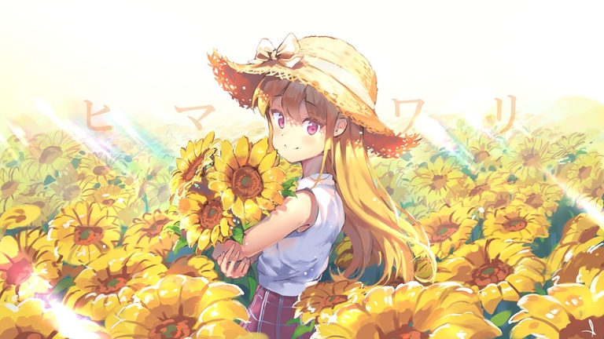

# Announcement

**☀ ☀ ☀ Hey Codeforces ☀ ☀ ☀**
------------------------------

Summer is ending, but my team and I are happy to invite you to participate in [Codeforces Round 894 (Div. 3)](https://codeforces.com/contest/1862 "Codeforces Round 894 (Div. 3)"). The round will take place on [Thursday, August 24, 2023 at 20:35UTC+6](https://codeforces.com/https://www.timeanddate.com/worldclock/fixedtime.html?day=24&month=8&year=2023&hour=17&min=35&sec=0&p1=166). You will be offered 7 problems with expected difficulties to compose an interesting competition for participants with ratings up to 1600. However, all of you who wish to take part and have a rating of 1600 or higher, can register for the round unofficially.

The round will be hosted by rules of educational rounds (extended ICPC). Thus, solutions will be judged on preliminary tests during the round, and after the round, it will be a 12-hour phase of **open hacks**.

You will be given **7 problems** and **2 hours and 15 minutes** to solve them.

Note that the **penalty** for the wrong submission in this round is **10 minutes**.

[Remember](https://codeforces.com/blog/entry/59228) that only the trusted participants of the third division will be included in the official standings table. As it is written by link, this is a compulsory measure for combating unsporting behavior. To qualify as a *trusted participant of the third division*, you must:

 * take part in at least five rated rounds (and solve at least one problem in each of them)
* do not have a point of 1900 or higher in the rating.

**Regardless of whether you are a trusted participant of the third division or not, if your rating is less than 1600, then the round will be rated for you.**

Problems have been created and written by: [diskoteka](https://codeforces.com/profile/diskoteka "Candidate Master diskoteka"), [pavlekn](https://codeforces.com/profile/pavlekn "Master pavlekn"), [playerr17](https://codeforces.com/profile/playerr17 "Expert playerr17"). [Ivang](https://codeforces.com/profile/Ivang "Master Ivang") helped us with the idea of one of the tasks.

We would like to thank:

 1. [Vladosiya](https://codeforces.com/profile/Vladosiya "Expert Vladosiya") for coordinating the round
2. [MikeMirzayanov](https://codeforces.com/profile/MikeMirzayanov "Headquarters, MikeMirzayanov") for great Polygon and Codeforces platforms
3. [feeder1](https://codeforces.com/profile/feeder1 "Grandmaster feeder1"), [Xellos](https://codeforces.com/profile/Xellos "International Grandmaster Xellos") for red testing
4. [michao](https://codeforces.com/profile/michao "Master michao"), [induk_v_tsiane](https://codeforces.com/profile/induk_v_tsiane "Master induk_v_tsiane"), [Phantom_Performer](https://codeforces.com/profile/Phantom_Performer "Master Phantom_Performer"), [vladmart](https://codeforces.com/profile/vladmart "Master vladmart"), [dmkz](https://codeforces.com/profile/dmkz "Master dmkz"), [LordVoIdebug](https://codeforces.com/profile/LordVoIdebug "Master LordVoIdebug"), [vrintle](https://codeforces.com/profile/vrintle "Master vrintle") for yellow testing
5. [kzyKT](https://codeforces.com/profile/kzyKT "Candidate Master kzyKT"), [celin](https://codeforces.com/profile/celin "Candidate Master celin") for purple testing
6. [segment_tea](https://codeforces.com/profile/segment_tea "Expert segment_tea"), [Egorsa](https://codeforces.com/profile/Egorsa "Expert Egorsa"), [MADE_IN_HEAVEN](https://codeforces.com/profile/MADE_IN_HEAVEN "Expert MADE_IN_HEAVEN"), [Thost](https://codeforces.com/profile/Thost "Expert Thost"), [BF_OF_Priety](https://codeforces.com/profile/BF_OF_Priety "Expert BF_OF_Priety"), [mewnya](https://codeforces.com/profile/mewnya "Expert mewnya"), [natalina](https://codeforces.com/profile/natalina "Expert natalina"), [Serik2003](https://codeforces.com/profile/Serik2003 "Expert Serik2003") for blue testing
7. [i_love_penguins](https://codeforces.com/profile/i_love_penguins "Expert i_love_penguins"), [tnaito](https://codeforces.com/profile/tnaito "Specialist tnaito"), [akwa_blue](https://codeforces.com/profile/akwa_blue "Specialist akwa_blue"), [Zeyad_Hekal](https://codeforces.com/profile/Zeyad_Hekal "Specialist Zeyad_Hekal"), [NgJaBach](https://codeforces.com/profile/NgJaBach "Specialist NgJaBach") for cyan testing
8. [mkshh](https://codeforces.com/profile/mkshh "Pupil mkshh"), [myav](https://codeforces.com/profile/myav "Pupil myav") for green testing

We wish you all good luck and a high rating!

**UPD: [Editorial](Tutorial_(en).md) published**

