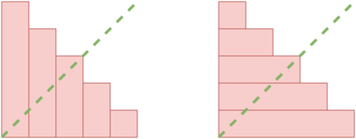
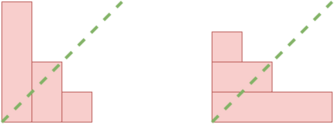

<h1 style='text-align: center;'> C. Flower City Fence</h1>

<h5 style='text-align: center;'>time limit per test: 2 seconds</h5>
<h5 style='text-align: center;'>memory limit per test: 256 megabytes</h5>

Anya lives in the Flower City. By order of the city mayor, she has to build a fence for herself.

The fence consists of $n$ planks, each with a height of $a_i$ meters. According to the order, the heights of the planks must not increase. In other words, it is true that $a_i \ge a_j$ for all $i < j$.

Anya became curious whether her fence is symmetrical with respect to the diagonal. In other words, will she get the same fence if she lays all the planks horizontally in the same order.

For example, for $n = 5$, $a = [5, 4, 3, 2, 1]$, the fence is symmetrical. Because if all the planks are laid horizontally, the fence will be $[5, 4, 3, 2, 1]$, as shown in the diagram.

  On the left is the fence $[5, 4, 3, 2, 1]$, on the right is the same fence laid horizontally 

But for $n = 3$, $a = [4, 2, 1]$, the fence is not symmetrical. Because if all the planks are laid horizontally, the fence will be $[3, 2, 1, 1]$, as shown in the diagram.

  On the left is the fence $[4, 2, 1]$, on the right is the same fence laid horizontally 

 Help Anya and determine whether her fence is symmetrical.

### Input

The first line of the input contains an integer $t$ ($1 \le t \le 10^4$) — the number of test cases. 

The description of the test cases follows.

The first line of a test case contains a single integer $n$ ($1 \le n \le 2 \cdot 10^5$) — the length of the fence.

The second line of a test case contains $n$ integers $a_1 \ge a_2 \ge a_3 \ge \dots \ge a_n$ ($1 \le a_i \le 10^9$) — the heights of the planks.

The sum of the values of $n$ for all test cases does not exceed $2 \cdot 10^5$.

### Output

For each test case, output "YES" if the fence is symmetrical, otherwise output "NO".

You can output each letter in any case (lowercase or uppercase). For example, the strings "yEs", "yes", "Yes" and "YES" will be accepted as a positive answer.

## Example

### Input


```text
755 4 3 2 133 1 134 2 11255 3 3 1 155 5 5 3 326 1
```
### Output

```text

YES
YES
NO
NO
YES
YES
NO

```
## Note

In the first and second test cases of the example, the fence is symmetrical.

In the third test case of the example, the fence is not symmetrical. If the planks are laid horizontally, the fence will be $[3, 2, 1, 1]$.

In the fourth test case of the example, the fence is not symmetrical. If the planks are laid horizontally, the fence will be $[1, 1]$.

In the fifth and sixth test cases of the example, the fence is symmetrical.

In the seventh test case of the example, the fence is not symmetrical. If the planks are laid horizontally, the fence will be $[2, 1, 1, 1, 1, 1]$.


#### Tags 

#1100 #OK #binary_search #data_structures #implementation #sortings 

## Blogs
- [All Contest Problems](../Codeforces_Round_894_(Div._3).md)
- [Announcement](../blogs/Announcement.md)
- [Tutorial (en)](../blogs/Tutorial_(en).md)
