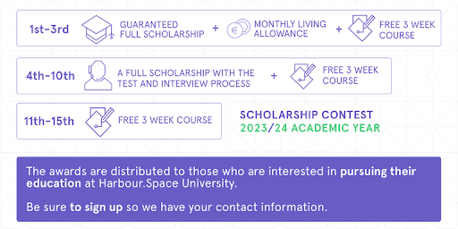

# Announcement_(en)

Salam, Codeforces!  «Be attentive about your thought that becomes your behavior» «Be attentive about your behavior that becomes your speech» «Be attentive about your speech because it becomes your habit»«Be attentive about your habit because it becomes your personality»«Be attentive about your personality because it becomes your destiny» Said by: Imam Ali

We're so excited to invite you to take part in our round [Harbour.Space Scholarship Contest 2023-2024 (Div. 1 + Div. 2)](https://codeforces.com/contest/1864) which will start on [Saturday, August 26, 2023 at 20:35UTC+6](https://codeforces.com/https://www.timeanddate.com/worldclock/fixedtime.html?day=26&month=8&year=2023&hour=17&min=35&sec=0&p1=166). The round will be **rated and open for everyone**.

The problems were prepared and authored by [amenotiomoi](https://codeforces.com/profile/amenotiomoi "International Grandmaster amenotiomoi"), Dhruvil [Psychotic_D](https://codeforces.com/profile/Psychotic_D "International Master Psychotic_D") Kakadiya, Han [wuhudsm](https://codeforces.com/profile/wuhudsm "Master wuhudsm") Jinlong, Amir Hossein [Amir_Parsa](https://codeforces.com/profile/Amir_Parsa "Master Amir_Parsa") Farhadi, Matthew [chromate00](https://codeforces.com/profile/chromate00 "Expert chromate00") Roh, [JohnVictor](https://codeforces.com/profile/JohnVictor "Master JohnVictor"), [ODT](https://codeforces.com/profile/ODT "Master ODT"), [ugly2333](https://codeforces.com/profile/ugly2333 "Legendary Grandmaster ugly2333"), [Lavine](https://codeforces.com/profile/Lavine "Master Lavine"), [RiverHamster](https://codeforces.com/profile/RiverHamster "Grandmaster RiverHamster"), [MagicalFlower](https://codeforces.com/profile/MagicalFlower "Legendary Grandmaster MagicalFlower") and [AquaMoon](https://codeforces.com/profile/AquaMoon "International Master AquaMoon").

We would like to thank :

 * [irkstepanov](https://codeforces.com/profile/irkstepanov "International Master irkstepanov") for coordinating the round;
* [aaaaawa](https://codeforces.com/profile/aaaaawa "Legendary Grandmaster aaaaawa"), [BurnedChicken](https://codeforces.com/profile/BurnedChicken "Legendary Grandmaster BurnedChicken"), [p_b_p_b](https://codeforces.com/profile/p_b_p_b "Legendary Grandmaster p_b_p_b") and [Sugar_fan](https://codeforces.com/profile/Sugar_fan "Legendary Grandmaster Sugar_fan") for LGM testing;
* [hibye1217](https://codeforces.com/profile/hibye1217 "Grandmaster hibye1217"), [alireza_kaviani](https://codeforces.com/profile/alireza_kaviani "International Grandmaster alireza_kaviani"), [errorgorn](https://codeforces.com/profile/errorgorn "International Grandmaster errorgorn"), [JianfengZhu](https://codeforces.com/profile/JianfengZhu "Grandmaster JianfengZhu"), [AmShZ](https://codeforces.com/profile/AmShZ "Grandmaster AmShZ"), [Crying](https://codeforces.com/profile/Crying "International Grandmaster Crying"), [Huah](https://codeforces.com/profile/Huah "Grandmaster Huah"), [bthero](https://codeforces.com/profile/bthero "Grandmaster bthero"), [fengzhengwei](https://codeforces.com/profile/fengzhengwei "International Grandmaster fengzhengwei") and [Ecrade_](https://codeforces.com/profile/Ecrade_ "Grandmaster Ecrade_") for GM and IGM testing;
* [Kieray](https://codeforces.com/profile/Kieray "Master Kieray"), [k1r1t0](https://codeforces.com/profile/k1r1t0 "Master k1r1t0"), [Arpa](https://codeforces.com/profile/Arpa "International Master Arpa"), [triple__a](https://codeforces.com/profile/triple__a "Master triple__a"), [blxst](https://codeforces.com/profile/blxst "Master blxst"), [leukocyte](https://codeforces.com/profile/leukocyte "International Master leukocyte"), [ITO](https://codeforces.com/profile/ITO "International Master ITO") and [NemanjaSo2005](https://codeforces.com/profile/NemanjaSo2005 "Master NemanjaSo2005") for M and IM testing;
* [iiand](https://codeforces.com/profile/iiand "Candidate Master iiand"), [TAIYANGFENG](https://codeforces.com/profile/TAIYANGFENG "Candidate Master TAIYANGFENG"), [callmepandey](https://codeforces.com/profile/callmepandey "Candidate Master callmepandey"), [Mkswll](https://codeforces.com/profile/Mkswll "Candidate Master Mkswll") and [uuku](https://codeforces.com/profile/uuku "Candidate Master uuku") for CM testing;
* [adventofcode](https://codeforces.com/profile/adventofcode "Expert adventofcode"), [KitasCraft](https://codeforces.com/profile/KitasCraft "Expert KitasCraft"), [aayushdhankecha](https://codeforces.com/profile/aayushdhankecha "Expert aayushdhankecha"), [Qualified](https://codeforces.com/profile/Qualified "Expert Qualified"), [Nanani](https://codeforces.com/profile/Nanani "Expert Nanani"), [USACOW](https://codeforces.com/profile/USACOW "Expert USACOW") and [tllwtg](https://codeforces.com/profile/tllwtg "Expert tllwtg") for Expert testing;
* [Hex-willappear](https://codeforces.com/profile/Hex-willappear "Specialist Hex-willappear"), [Savani004](https://codeforces.com/profile/Savani004 "Specialist Savani004"), [AkibAzmain](https://codeforces.com/profile/AkibAzmain "Specialist AkibAzmain"), [Visrut_](https://codeforces.com/profile/Visrut_ "Specialist Visrut_"), [Banis](https://codeforces.com/profile/Banis "Specialist Banis") and [Harshil4442](https://codeforces.com/profile/Harshil4442 "Specialist Harshil4442") for Specialist testing;
* [strange-creator](https://codeforces.com/profile/strange-creator "Pupil strange-creator") for the only Pupil testing;
* [Valenz](https://codeforces.com/profile/Valenz "Newbie Valenz") for the only Newbie testing;
* [MikeMirzayanov](https://codeforces.com/profile/MikeMirzayanov "Headquarters, MikeMirzayanov") for the great Codeforces and Polygon platforms;
* And **at last but not least**, [You](https://codeforces.com/profile/) for participaing in the round!

You will be given 9 **problems and 3 hours** to solve! 

Score Distribution:

500−1000−1250−1500−2000−2500−3000−3500−4250 

**UPD1** : [Editorial is out.](Tutorial_(en).md)

**UPD2** : 

**First Solve** 

| Problem | Name |
| --- | --- |
| A | [qiuzx](https://codeforces.com/profile/qiuzx "International Grandmaster qiuzx") |
| B | [noimi](https://codeforces.com/profile/noimi "Legendary Grandmaster noimi") |
| C | [SSRS_](https://codeforces.com/profile/SSRS_ "International Grandmaster SSRS_") |
| D | [Um_nik](https://codeforces.com/profile/Um_nik "Legendary Grandmaster Um_nik") |
| E | [Geothermal](https://codeforces.com/profile/Geothermal "Legendary Grandmaster Geothermal") |
| F | [MysticPanda](https://codeforces.com/profile/MysticPanda "Master MysticPanda") |
| G | [Radewoosh](https://codeforces.com/profile/Radewoosh "Legendary Grandmaster Radewoosh") |
| H | [maroonrk](https://codeforces.com/profile/maroonrk "Legendary Grandmaster maroonrk") |
| I | [Radewoosh](https://codeforces.com/profile/Radewoosh "Legendary Grandmaster Radewoosh"), One and only Orz |

**Top Performers** 

| Rank | Name |
| --- | --- |
| 1 | [Radewoosh](https://codeforces.com/profile/Radewoosh "Legendary Grandmaster Radewoosh") |
| 2 | [maroonrk](https://codeforces.com/profile/maroonrk "Legendary Grandmaster maroonrk") |
| 3 | [jqdai0815](https://codeforces.com/profile/jqdai0815 "Legendary Grandmaster jqdai0815") |
| 4 | [Benq](https://codeforces.com/profile/Benq "Legendary Grandmaster Benq") |
| 5 | [Um_nik](https://codeforces.com/profile/Um_nik "Legendary Grandmaster Um_nik") |
| 6 | [jiangly](https://codeforces.com/profile/jiangly "Legendary Grandmaster jiangly") |
| 7 | [SSRS_](https://codeforces.com/profile/SSRS_ "International Grandmaster SSRS_") |
| 8 | [noimi](https://codeforces.com/profile/noimi "Legendary Grandmaster noimi") |
| 9 | [hos.lyric](https://codeforces.com/profile/hos.lyric "Legendary Grandmaster hos.lyric") |
| 10 | [Brewess](https://codeforces.com/profile/Brewess "Grandmaster Brewess") |

### GL & HF ;)

  [Sign up for the contest →](https://codeforces.com/contests/1864) This round wouldn't have been possible without Harbour.Space University's support.

This contest is **for all interested eligible programmers** who want to start their bachelor and master studies in Barcelona, Spain or Bangkok, Thailand, and join ICPC team.

For the next academic year (2023/24), Harbour.Space University is recruiting a fascinating community of competitive programmers from the top prize-winners of international Olympiads to [join one of several competitive programming teams at the university](https://codeforces.com/https://harbour.space/news/articles/habour-space-great-performance-at-swerc-next-stop-icpc-world-finals).

In the next few years, their goal is to continue winning SWERC and competing at a high level in the ICPC globally. Therefore they want to invest a serious amount of energy, resources, and talent into these activities.

That’s why you are invited on an exciting journey in the company of like-minded people, outstanding coaches, and ongoing partnership Harbour.Space University with Codeforces.

Over 100 educational rounds were already organized, so the time has come to test our joint efforts and reward the most diligent.

**Here’s what you win if you place in the contest:**

The monthly living allowance throughout the entire duration of studies may vary depending on the overall performance of the students as measured by their GPA, professional achievements and official ICPC competition results. As a guideline, it is in the range of 700-1500 EUR (it might be applied to the contestants who win 4th-10th places).

**No application fee is required for any of the awards listed above**.

Good luck, and may the code be with you!

