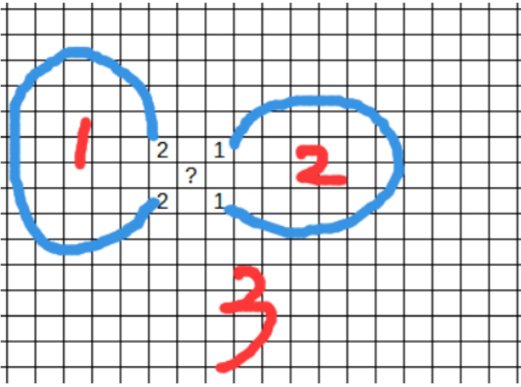

# Tutorial_(en)

Thank you for participation and we hope you enjoy this round ヽ(^ o ^)/.

During the contest, there was a small issue in problem D. For those affected, we have skipped your duplicate submissions (if your duplicate submissions were not skipped, please let us know). We apologize again for any inconvenience caused.

In addition, we are honored to invite you to our unofficial round tomorrow (*╹▽╹*) [Invitation to TheForces Round #22 (Interesting-Forces)](https://mirror.codeforces.com/blog/entry/119771)

### [1864A-Increasing and Decreasing](../problems/A._Increasing_and_Decreasing.md)

Idea : [wuhudsm](https://codeforces.com/profile/wuhudsm "Master wuhudsm")

 **Tutorial**We use the following greedy construction:

For all i (1<i<n), set ai=ai+1−(n−i). If a2−a1≥n−1, we've found a solution, otherwise there is no solution.

Proof. Assume there's a solution which includes an index i (1<i<n) such that ai+1−ai>n−i. We can make aj:=aj+Δ for all j (2≤j≤i), where Δ=ai+1−ai−(n−i). After several processes like this, we get a solution the same as greedy construction gives. This leads to a contradiction.

 **solution**
```cpp
#include <bits/stdc++.h>

#define all(a) (a).begin(), (a).end()
#define sz(a) (int)(a).size()
#define pb push_back
#define mp make_pair

using namespace std;

typedef long long ll;
typedef long double ld;
typedef pair<int, int> pii;

int main() {

    ios_base::sync_with_stdio(false);
    cin.tie(0);
    cout.tie(0);
    
    int tt;
    cin >> tt;
    while (tt--) {
        int x, y, n;
        cin >> x >> y >> n;
        vector<int> a(n);
        a[0] = x, a[n - 1] = y;
        int d = 1;
        for (int i = n - 2; i >= 1; --i) {
            a[i] = a[i + 1] - d;
            ++d;
        }
        bool ok = true;
        for (int i = 0; i + 1 < n; ++i) {
            if (a[i + 1] <= a[i]) {
                ok = false;
            }
        }
        for (int i = 0; i + 2 < n; ++i) {
            int p = a[i + 1] - a[i];
            int q = a[i + 2] - a[i + 1];
            if (p <= q) {
                ok = false;
            }
        }
        if (!ok) {
            cout << "-1n";
            continue;
        }
        for (int i = 0; i < n; ++i) {
            cout << a[i] << " ";
        }
        cout << "n";
    }

}
```
### [1864B-Swap and Reverse](../problems/B._Swap_and_Reverse.md)

Idea : [Amir_Parsa](https://codeforces.com/profile/Amir_Parsa "Master Amir_Parsa"), [chromate00](https://codeforces.com/profile/chromate00 "Expert chromate00")

 **Tutorial**By the first kind of operation, we already know that every odd index (same for the even ones) can be swapped with each other freely. Therefore, let us write down the values of the indices modulo 2. For example, if n is 10, the indices modulo 2 are [1,0,1,0,1,0,1,0,1,0]. Now, we consider the two cases.

 * When k is odd.

We can find out that after reversing any subarray of length k, the indices modulo 2 do not change. So in this case, any series of the second operation is identical to some series of the first operation. Therefore, you should sort the odd indices and the even indices separately, and output the result of merging them into one string.

 * When k is even.

Let us observe how we can swap two adjacent indices in this case. First, reverse [i,i+k−1], and then reverse [i+1,i+k]. If we do this on [1,0,1,0,1,0,1,0,1,0], assuming i=1 and k=6, the indices modulo 2 turn into [0,1,0,1,0,1,1,0,1,0], and then [0,1,1,0,1,0,1,0,1,0]. Using these two steps and some series of the first operation, we can see that we can swap any two adjacent indices as a result. And such a series of operation is always possible, as k<n. Therefore, we can sort the entire string, and output the result.

 **solution**
```cpp
  
#include <bits/stdc++.h>

#define all(a) (a).begin(), (a).end()
#define sz(a) (int)(a).size()
#define pb push_back
#define mp make_pair

using namespace std;

typedef long long ll;
typedef long double ld;
typedef pair<int, int> pii;

int main() {

    ios_base::sync_with_stdio(false);
    cin.tie(0);
    cout.tie(0);
    
    int tt;
    cin >> tt;
    while (tt--) {
        int n, k;
        cin >> n >> k;
        string s;
        cin >> s;
        vector<char> odd, even;
        for (int i = 0; i < n; ++i) {
            if (i % 2 == 0) {
                even.pb(s[i]);
            } else {
                odd.pb(s[i]);
            }
        }
        sort(all(even));
        sort(all(odd));
        string ans1 = "";
        for (int i = 0, j = 0; i < sz(even) || j < sz(odd); ++i, ++j) {
            if (i < sz(even)) {
                ans1 += even[i];
            }
            if (j < sz(odd)) {
                ans1 += odd[i];
            }
        }
        if (k % 2 == 0) {
            sort(all(s));
            cout << s << "n";
            continue;
        }
        cout << ans1 << "n";
    }

}


```
 **bonus**Try to solve the problem if n=k was allowed.

### [1864C-Divisor Chain](../problems/C._Divisor_Chain.md)

Idea : [wuhudsm](https://codeforces.com/profile/wuhudsm "Master wuhudsm")

 **Tutorial**Let us divide the task into two steps, on each step we will use each divisor at most once. For convenience, let us denote L as the largest value, such that 2L≤x holds. The two steps are as follows.

 * Reduce x to 2L.

Given any integer x, we can see that its lowest significant bit is a divisor of x. If x has more than one bit, we can repeatedly subtract the value corresponding to the lowest significant bit of x. When x finally has only one bit, finish the first step. In this step, we have only used each significant bit of x at most once.

 * Reduce 2L to 1.

We can find a way to reduce 2L to 1 by using each bit exactly once. Formally, if k≥0, then 2k+1−2k=2k, and 2k is a divisor of 2k+1. Thus, by subtracting 2L−1,2L−2,…,1 in order, we reach 1 from 2L by using each bit from the 0-th bit to the (L−1)-st bit exactly once.

As a result, we can reduce x to 1 by using each power of 2 at most twice (once from the first step, once from the second step). Since we used each bit at most twice, the time complexity for solving one test case is O(logx).

Due to the lenient constraints, some solutions with O(√x) time complexity should pass as well (as long as they fit into the 1000 operations limit).

 **solution**
```cpp
  
#include <bits/stdc++.h>

#define all(a) (a).begin(), (a).end()
#define sz(a) (int)(a).size()
#define pb push_back
#define mp make_pair

using namespace std;

typedef long long ll;
typedef long double ld;
typedef pair<int, int> pii;

bool bit(int mask, int pos) {
    return (mask >> pos) & 1;
}

int main() {

    ios_base::sync_with_stdio(false);
    cin.tie(0);
    cout.tie(0);
    
    int tt;
    cin >> tt;
    while (tt--) {
        int x;
        cin >> x;
        int p;
        vector<int> ans;
        ans.pb(x);
        for (int i = 0; ; ++i) {
            if (bit(x, i)) {
                if (x == (1 << i)) {
                    p = i;
                    break;
                }
                x -= (1 << i);
                ans.pb(x);
            }
        }
        while (p > 0) {
            x -= (1 << (p - 1));
            ans.pb(x);
            --p;
        }
        cout << sz(ans) << "n";
        for (int y : ans) {
            cout << y << " ";
        }
        cout << "n";
    }

}

```
### [1864D-Matrix Cascade](../problems/D._Matrix_Cascade.md)

Idea : [AquaMoon](https://codeforces.com/profile/AquaMoon "International Master AquaMoon")

 **Tutorial**Firstly, the first row has some elements that are 1 s and some elements that are 0 s. The elements that are 1 can only be turned into 0 by operating on the corresponding cell an odd number of times, and the elements that are 0 can only be turned into 0 by operating on the corresponding cell an even number of times. Two operations on the same cell are equivalent to no operation, so only one operation is performed on the corresponding cell of the element that is 1 in the first row. Thus, the operation on the first row is deterministic. Subsequent rows are affected by the operations in the first row, so it is sufficient to proceed to consider rows 2 to n in the same way.

Now consider how to quickly deal with the effect of the preceding rows on the following rows. An operation on position (x,y) will simultaneously invert all the elements from column y−1 to column y+1 in row x+1, and from column y−2 to column y+2 in row x+2, and son on. Thus, the elements being inverted are exactly the portion of the matrix sandwiched between lines passing through (x,y) with slopes 1 and −1. Let b denote the effect of the line with slope 1 from all predecing rows, and let c denote the effect of the line with slope −1 from all preceding rows. % To optimize complexity, b, c are both obtained using difference arrays to the current line using prefix sums to obtain the b,c values at that time.

After an operation on (i,j), b[i+1][j−1] is marked, and c[i+1][j+2] is marked. Next, b[i][j] inherits b[i−1][j+1], and c[i][j] inherits c[i−1][j−1]. For the current row, the effect of the previous rows is obtained by maintaining the prefix sums on b and c. The total complexity is O(n2).

 **solution**
```cpp
  
#include <bits/stdc++.h>

#define all(a) (a).begin(), (a).end()
#define sz(a) (int)(a).size()
#define pb push_back
#define mp make_pair

using namespace std;

typedef long long ll;
typedef long double ld;
typedef pair<int, int> pii;

int main() {

    ios_base::sync_with_stdio(false);
    cin.tie(0);
    cout.tie(0);
    
    int tt;
    cin >> tt;
    
    while (tt--) {
        int n;
        cin >> n;
        vector<string> a(n);
        for (int i = 0; i < n; ++i) {
            cin >> a[i];
        }
        int ans = 0;
        vector<vector<int> > val(n, vector<int>(n, 0));
        vector<vector<int> > sum(n, vector<int>(n, 0));
        for (int i = 0; i < n; ++i) {
            for (int j = 0; j < n; ++j) {
                if (i == 0) {
    
                } else if (i == 1) {
                    for (int k = max(0, j - 1); k <= min(j + 1, n - 1); ++k) {
                        sum[i][j] ^= sum[i - 1][k];
                    }
                } else {
                    if (j == 0) {
                        sum[i][j] ^= sum[i - 2][j];
                    } else {
                        sum[i][j] ^= sum[i - 1][j - 1];
                    }
                    if (j == n - 1) {
                        sum[i][j] ^= sum[i - 2][j];
                    } else {
                        sum[i][j] ^= sum[i - 1][j + 1];
                    }
                    sum[i][j] ^= sum[i - 2][j];
                    sum[i][j] ^= val[i - 1][j];
                }
                if (sum[i][j] ^ (a[i][j] - '0')) {
                    ++ans;
                    sum[i][j] ^= 1;
                    val[i][j] = 1;
                }
            }
        }
        cout << ans << "n";
    }

}

```
### [1864E-Guess Game](../problems/E._Guess_Game.md)

Idea : [wuhudsm](https://codeforces.com/profile/wuhudsm "Master wuhudsm")

 **Tutorial**First, let's analize a single game for fixed a, b, and how many turns it takes.

Consider the binary representation of a∣b. We consider bits from highest to lowest. For bits with a value of 0, we can ignore it because it firmly tells us that both bits of a and b are 0. For convenience, we assume that all bits of a∣b are 1. 

In the first round, if the highest bit of a is 0, then Alice can immediately say that a<b. Otherwise, in the second round of the game, Bob knows that the highest bit of a is not 0. If the highest or the second highest bit of b is 0, then Bob can immediately say that a>b. Otherwise, in the third round of the game, Alice knows that the highest and the second highest bits of b are not 0, and so on.

Consider only set bits in a∣b. Let's enumerate these bits from highest to lowest. After some observation, we can conclude that:

 * If a<b and the i-th bit in a is zero, then the answer is i+1−(i%2==1);
* If a=b, then the answer is k+1, where k is the number of set bits in a∣b;
* If a>b and the i-th bit in b is zero, then the answer is i+(i%2==1).

Now that we have a brute force algorithm for O(n2logA), how can we optimize it? 

We can build a bit trie and traverse all nodes. We can easily calculate the number of 1s that pass from a node to the root node, as well as the number of numbers prefixed with it and followed by 0 (or 1). Use this information to calculate the answer.

 **solution**
```cpp
#include <bits/stdc++.h>

#define all(a) (a).begin(), (a).end()
#define sz(a) (int)(a).size()
#define pb push_back
#define mp make_pair

using namespace std;

typedef long long ll;
typedef long double ld;
typedef pair<int, int> pii;

struct node {
    int to[2];
    int cnt;
    node() {
        to[0] = to[1] = -1;
        cnt = 0;
    }
};

bool bit(int mask, int pos) {
    return (mask >> pos) & 1;
}

vector<node> t;

void add(int x) {
    int v = 0;
    for (int i = 29; i >= 0; --i) {
        int b = bit(x, i);
        if (t[v].to[b] == -1) {
            t[v].to[b] = sz(t);
            t.pb(node());
        }
        ++t[v].cnt;
        v = t[v].to[b];
    }
    ++t[v].cnt;
}

const int mod = 998244353;

void mul(int& a, int b) {
    ll c = ll(a) * b;
    if (c >= mod) {
        c %= mod;
    }
    a = c;
}

int binpow(int a, int n) {
    int ans = 1;
    while (n) {
        if (n & 1) {
            mul(ans, a);
        }
        mul(a, a);
        n >>= 1;
    }
    return ans;
}

void solve(int v, int k, ll& ans) {
    if (t[v].to[0] != -1 && t[v].to[1] != -1) {
        ll i = k + 1;
        ans += (2 * (i / 2) + 1) * t[t[v].to[0]].cnt * t[t[v].to[1]].cnt;
        ans += 2 * ((i + 1) / 2) * t[t[v].to[0]].cnt * t[t[v].to[1]].cnt;
    }
    if (t[v].to[0] == -1 && t[v].to[1] == -1) {
        ll i = k + 1;
        ans += i * t[v].cnt * t[v].cnt;
    }
    if (t[v].to[0] != -1) {
        solve(t[v].to[0], k, ans);
    }
    if (t[v].to[1] != -1) {
        solve(t[v].to[1], k + 1, ans);
    }
}

int main() {

    ios_base::sync_with_stdio(false);
    cin.tie(0);
    cout.tie(0);
    
    int tt;
    cin >> tt;
    while (tt--) {
        t.clear();
        t.pb(node());
        int n;
        cin >> n;
        for (int i = 0; i < n; ++i) {
            int a;
            cin >> a;
            add(a);
        }
        ll x = 0;
        solve(0, 0, x);
        int ans = x % mod;
        mul(ans, binpow(n, mod - 2));
        mul(ans, binpow(n, mod - 2));
        cout << ans << "n";
    }

}

```
### [1864F-Exotic Queries](../problems/F._Exotic_Queries.md)

Idea : [ODT](https://codeforces.com/profile/ODT "Master ODT"), [AquaMoon](https://codeforces.com/profile/AquaMoon "International Master AquaMoon")

 **Hint**The final solution is irrelevant to Cartesian trees.

 **Tutorial**First, we consider only the sequence of elements to be manipulated. We claim that it is optimal to operate on the whole sequence so that the minimum elements are all decreased to 0, and then solve the problem on the segments separated by the $0$s recursively.

A straightforward corollary of the claim is that two equal elements between which there are no smaller elements are handled in a single operation, so the final answer is ℓ (the number of elements to be manipulated) minus the number of such adjacent pairs.

Proof: Define S(l,r) to be the answer for the segment [l,r]. Do induction on the length of the segment. If the first operation does not manipulate the whole segment, the segment will be separated into several independent parts by the first operation, for the non-inclusive operations cannot intersect, and the final answer, which is the sum of S of the parts, will not be less than the initial answer according to the corollary, for some of the equal pairs are separated.

Now the original problem is converted into a data structure task. Consider all adjacent equal pairs (l,r), and m is the maximum element between (l,r), $m < a_l$. (l,r) decrease the answer if and only if m<L≤al=ar≤R, which can be easily calculated with a segment tree and sweeping lines.

 **solution**
```cpp
  
#include <bits/stdc++.h>

#define all(a) (a).begin(), (a).end()
#define sz(a) (int)(a).size()
#define pb push_back
#define mp make_pair

using namespace std;

typedef long long ll;
typedef long double ld;
typedef pair<int, int> pii;

vector<int> sum;
int N;

void updSumTree(int pos) {
    for (pos += N; pos; pos >>= 1) {
        ++sum[pos];
    }
}

int getSumTree(int l, int r) {
    int ans = 0;
    for (l += N, r += N; l <= r; l = (l + 1) >> 1, r = (r &mdash; 1) >> 1) {
        if (l & 1) {
            ans += sum[l];
        }
        if (!(r & 1)) {
            ans += sum[r];
        }
    }
    return ans;
}

vector<int> t;
int n;

void updTree(int pos, int val) {
    for (pos += n; pos; pos >>= 1) {
        t[pos] = max(t[pos], val);
    }
}

int getTree(int l, int r) {
    int ans = 0;
    for (l += n, r += n; l <= r; l = (l + 1) >> 1, r = (r &mdash; 1) >> 1) {
        if (l & 1) {
            ans = max(ans, t[l]);
        }
        if (!(r & 1)) {
            ans = max(ans, t[r]);
        }
    }
    return ans;
}

const int nmax = 1e6 + 100;

vector<int> pos[nmax];
int cnt[nmax];
int distinct[nmax];

struct query {
    int l, r, id;
    bool operator<(const query& other) const {
        return l < other.l;
    }
};

int main() {

    ios_base::sync_with_stdio(false);
    cin.tie(0);
    cout.tie(0);
    
    int q;
    cin >> n >> q;
    vector<int> a(n);
    for (int i = 0; i < n; ++i) {
        cin >> a[i];
    }
    
    t.assign(4 * n, 0);
    
    for (int i = 0; i < n; ++i) {
        pos[a[i]].pb(i);
    }
    
    vector<pii> pts;
    for (int x = 1; x <= n; ++x) {
        for (int i = 0; i + 1 < sz(pos[x]); ++i) {
            int lf = pos[x][i], rg = pos[x][i + 1];
            ++lf, --rg;
            if (lf > rg) {
                continue;
            }
            int y = getTree(lf, rg);
            //cout << x << " " << y << endl;
            if (y == 0) {
                continue;
            }
            pts.pb({n - y, x});
        }
        for (int p : pos[x]) {
            updTree(p, x);
        }
    }
    
    cnt[0] = 0;
    distinct[0] = 0;
    for (int x = 1; x <= n; ++x) {
        cnt[x] = cnt[x - 1] + sz(pos[x]);
        distinct[x] = distinct[x - 1] + (!pos[x].empty());
    }
    
    sort(all(pts));
    int ptr = 0;
    
    vector<query> queries(q);
    vector<int> ans(q);
    for (int i = 0; i < q; ++i) {
        int l, r;
        cin >> l >> r;
        queries[i] = {n - l, r, i};
        ans[i] = distinct[r] - distinct[l - 1];
    }
    
    sort(all(queries));
    
    N = n + 1;
    sum.assign(2 * N, 0);


    for (int i = 0; i < q; ++i) {
        while (ptr < sz(pts) && pts[ptr].first <= queries[i].l) {
            updSumTree(pts[ptr].second);
            ++ptr;
        }
        ans[queries[i].id] += getSumTree(0, queries[i].r);
    }
    
    for (int i = 0; i < q; ++i) {
        cout << ans[i] << "n";
    }

}

```
### [1864G-Magic Square](../problems/G._Magic_Square.md)

Idea : [AquaMoon](https://codeforces.com/profile/AquaMoon "International Master AquaMoon")

 **Hint1**Theorem 1: After a row shift, all numbers moved are in the correct column.

Proof 1: Suppose a number moved after a row shift is not in the correct column, if it is not in the correct row, it needs at least two more moves to its target position, otherwise it needs at least three more moves because the row cannot be shifted again.

Also, after a column shift, all numbers moved are in the correct row.

 **Hint2**Theorem 2: If both row shift and column shift are performed, two rows cannot have equal shift distance.

Proof 2: If row i is shifted by x and column j is shifted by y, regardless of their order, then there is a number with offset (y,x). If row i1 and row i2 are shifted by x and column j is shifted by y, regardless of their order, then there are two numbers with the same offset (y,x) (if two number coincide, it was moved at least three times).

In the same way, if both row shift and column shift are performed, two columns cannot have equal shift distance.

If after a row shift, all numbers moved are in the correct column, we call such rows available. Similarly, if after a column shift, all numbers moved are in the correct row, we call such columns available.

 **Hint3**Theorem 3: If there is an available row and an available column at the same time, then there is no solution. 

Proof 3: If row i can be shifted by x and column j can be shifted by y, the number in (i,j) has offset (y,x). Assume that the number in (i,j) is moved to (i+y,j) and then to (i+y,j+x). Row i+y is shifted by x, no other row can be shifted by x. Consider the number in (i,j+1), it needs to be shifted by x in some row, so it must be moved to row i+y before row i+y shifts. Then the numbers in (i,j) and (i+1,j) have the same offset (y,x). Similarly, if the number in (i,j) is moved to (i,j+x) and then to (i+y,j+x), there is no solution.

 **Tutorial**We can use the following method to solve this problem:

For each row and each column, check if it is available.

If there are both available rows and available columns, there is no solution.

If no rows or columns are available, the matrix is already equal to the target one, or there is no solution.

If there are only available rows or available columns, their order doesn't matter, so if there s choices, the answer should be multiplied by s!. Apply all available operations and check again.

Total complexity: O(n3) or O(n2) if maintaining row/column offsets in each row/column.

 **solution**
```cpp
#include <bits/stdc++.h>

#define all(a) (a).begin(), (a).end()
#define sz(a) (int)(a).size()
#define pb push_back
#define mp make_pair

using namespace std;

typedef long long ll;
typedef long double ld;
typedef pair<int, int> pii;

const int mod = 998244353;
const int nmax = 600;

int fact[nmax];

int main() {

    ios_base::sync_with_stdio(false);
    cin.tie(0);
    cout.tie(0);
    
    fact[0] = 1;
    for (int i = 1; i < nmax; ++i) {
        fact[i] = ll(fact[i - 1]) * i % mod;
    }
    
    int tt;
    cin >> tt;
    
    while (tt--) {
        int n;
        cin >> n;
        vector<vector<int> > a(n, vector<int>(n));
        set<int> seta;
        for (int i = 0; i < n; ++i) {
            for (int j = 0; j < n; ++j) {
                cin >> a[i][j];
                seta.insert(a[i][j]);
            }
        }
        assert(sz(seta) == n * n);
    
        vector<vector<int> > b(n, vector<int>(n));
        set<int> setb;
        for (int i = 0; i < n; ++i) {
            for (int j = 0; j < n; ++j) {
                cin >> b[i][j];
                setb.insert(b[i][j]);
            }
        }
        assert(sz(setb) == n * n);
        assert(seta == setb);
        vector<int> vct;
        for (int x : seta) {
            vct.pb(x);
        }
    
        for (int i = 0; i < n; ++i) {
            for (int j = 0; j < n; ++j) {
                a[i][j] = lower_bound(all(vct), a[i][j]) - vct.begin();
                b[i][j] = lower_bound(all(vct), b[i][j]) - vct.begin();
            }
        }
    
        vector<pii> posa(n * n);
        vector<pii> posb(n * n);
    
        set<pii> off;
    
        for (int i = 0; i < n; ++i) {
            for (int j = 0; j < n; ++j) {
                posa[a[i][j]] = {i, j};
                posb[b[i][j]] = {i, j};
            }
        }
        bool valid = true;
        for (int x = 0; x < n * n; ++x) {
            pii p = posa[x], q = posb[x];
            if (p.first != q.first && p.second != q.second) {
                pii s = {(q.first - p.first + n) % n, (q.second - p.second + n) % n};
                if (off.count(s)) {
                    valid = false;
                } else {
                    off.insert(s);
                }
            }
        }
        if (!valid) {
            cout << "0n";
            continue;
        }
    
        int cnt = 0;
        ll ans = 1;
    
        while (a != b) {
            vector<pii> rows;
            for (int i = 0; i < n; ++i) {
                int shift = posb[a[i][0]].second;
                bool ok = true;
                for (int j = 0; j < n; ++j) {
                    int x = a[i][j];
                    if (posb[x].second != (j + shift) % n) {
                        ok = false;
                        break;
                    }
                }
                if (ok && shift) {
                    rows.pb({i, shift});
                }
            }
            vector<pii> cols;
            for (int j = 0; j < n; ++j) {
                int shift = posb[a[0][j]].first;
                bool ok = true;
                for (int i = 0; i < n; ++i) {
                    int x = a[i][j];
                    if (posb[x].first != (i + shift) % n) {
                        ok = false;
                        break;
                    }
                }
                if (ok && shift) {
                    cols.pb({j, shift});
                }
            }
            if (cols.empty() && rows.empty()) {
                valid = false;
                break;
            }
            if (!(cols.empty() ^ rows.empty())) {
                valid = false;
                break;
            }
            if (!rows.empty()) {
                cnt += sz(rows);
                ans *= fact[sz(rows)];
                ans %= mod;
                for (pii p : rows) {
                    int i = p.first;
                    int shift = p.second;
                    vector<int> v = a[i];
                    for (int j = 0; j < n; ++j) {
                        int x = v[j];
                        a[i][(j + shift) % n] = x;
                        posa[x] = {i, (j + shift) % n};
                    }
                }
            } else {
                cnt += sz(cols);
                ans *= fact[sz(cols)];
                ans %= mod;
                for (pii p : cols) {
                    int j = p.first;
                    int shift = p.second;
                    vector<int> v;
                    for (int i = 0; i < n; ++i) {
                        v.pb(a[i][j]);
                    }
                    for (int i = 0; i < n; ++i) {
                        int x = v[i];
                        a[(i + shift) % n][j] = x;
                        posa[x] = {(i + shift) % n, j};
                    }
                }
            }
        }
        if (!valid) {
            cout << "0n";
            continue;
        }
        cout << ans << 'n';
        // cout << cnt << " " << ans << "n";
    }

}

```
### [1864H-Asterism Stream](../problems/H._Asterism_Stream.md)

Idea : [adventofcode](https://codeforces.com/profile/adventofcode "Expert adventofcode") Solution: [Psychotic_D](https://codeforces.com/profile/Psychotic_D "International Master Psychotic_D"), [amenotiomoi](https://codeforces.com/profile/amenotiomoi "International Grandmaster amenotiomoi")

 **Tutorial**Here is a basic Θ(n) dp solution.

Before that let k=12. At the same time, because a special geometric sequence f(x)=akbx will be frequently used next, it is defined as {a,b}.

Let f(x) be the expected number of moves needed if we start with x. Obviously, there is the following formula:

 f(x)={0n⩽xk(f(x+1)+f(2x))+1x<nIt's easy to see that for the interval [n,2n] value of f(x) is 0.

If for an interval [2l,2r], it can already be represented by the sum of several a,b, then it can be represented by a small number of new {a,b} for all f(x), where x∈[l,r]

First there is f(r)=kf(r+1)+kf(2r)+1. So, r−1 can be represented as f(r−1)=k2f(r+1)+kf(2r−2)+k2f(2r)+k+1.

By analogy, one can get

 f(r−x)=kx+1f(r+1)+x∑i=0ki+1f(2r−2x+2i)+x∑i=0kiby substitution, it can be shown as

 f(x)=kr−x+1f(r+1)+r−x∑i=0ki+1f(2x+2i)+r−x∑i=0kiBecause {a,b} of the interval where f(r+1) is already known, the value of f(r+1) can be calculated quickly. So, the first term of f(x) can be represented as below:

 kr−x+1f(r+1)=kr+1f(r+1)·k−x={kr+1f(r+1),−1}Then the last term of f(x), r−x∑i=0ki is sum of an ordinary geometric sequence. So, after applying the formula it can represented as {2,0}+{−kr,−1}.

For the second term r−x∑i=0ki+1f(2x+2i), it has been assumed that f(2x+2i) is ∑{a,b}, so split it into the following form (the derivation process depends on k2b+1≠1):

 r−x∑i=0ki+1f(2x+2i)=r−x∑i=0ki+1∑f{a,b}=r−x∑i=0ki+1∑fakb(2x+2i)=∑fr−x∑i=0ki+1akb(2x+2i)=∑fr−x∑i=0ak2bx+1·ki+2bi=∑fak2bx+1r−x∑i=0(k2b+1)i=∑fak2bx+1⋅k(2b+1)(r−x+1)−1k2b+1−1=∑fak(2b+1)(n+1)+1k2b+1−1⋅k−x+−akk2b+1−1⋅k2bx=∑f{ak(2b+1)(n+1)+1k2b+1−1,−1}+{−akk2b+1−1,2b}Because of the obvious combination law {a,b}+{c,b}={a+c,b}, the number of its geometric series is linear with the number of recursions.

For x∈[n,2n],f(x)=0, which can be represented as f(x)={0,0}, so this recursive rule can always be used, Until the x∈[1,1] is obtained, to get the result.

The complexity varies depending on the implementation Θ(Tlog3n) or Θ(Tlog2n).

 **solution**
```cpp
#include <bits/stdc++.h>
using namespace std;
#pragma GCC optimize("Ofast", "inline", "-ffast-math")
#pragma GCC target("avx,sse2,sse3,sse4,mmx")
#define int long long
const int MOD = 998244353;
int n, k;
long long power(int x, int p)
{
    if (p < 0)
        return power(power(x, MOD - 2), -p);
    int answer = 1;
    x %= MOD;
    while (p)
    {
        if (p & 1)
            answer = answer * x % MOD;
        x = x * x % MOD;
        p >>= 1;
    }
    return answer;
}
void Delta()
{
    cin >> n;
    k = power(2, MOD - 2);
    int l = n, r = max(1ll, (n - 1) * 2), n0 = 0, s;
    vector<int> Q;
    while (l > 1)
    {
        vector<int> P;
        l = (l + 1) / 2;
        r /= 2;
        s = n0;
        for (int i = 0, t = k - 1; i < (int)Q.size(); ++i)
        {
            s = (s + Q[i] * power(power(k, -(1ll << i)), r + 1)) % MOD;
            t = t * t % MOD;
        }
        P.push_back(((power(k, r + 1) * s - power(k, r)) % MOD + MOD) % MOD);
        for (int i = 0; i < (int)Q.size(); ++i)
        {
            P[0] += power(power(k, 1 - (1ll << (i + 1))) - 1, MOD - 2) * Q[i] % MOD * power(power(k, 1 - (1ll << (i + 1))), r + 1) % MOD * k % MOD;
            P.push_back(((MOD - Q[i] * k % MOD * power(power(k, 1 - (1ll << (i + 1))) - 1, MOD - 2) % MOD) % MOD + MOD) % MOD);
        }
        P[0] += (MOD - n0) * power(k, r + 1) % MOD;
        for (int &i : P)
            i %= MOD;
        Q = P;
        n0 += 2;
    }
    s = n0;
    for (int i = 0, t = k - 1; i < (int)Q.size(); ++i)
    {
        s = (s + Q[i] * power(power(k, -(1ll << i)), 1)) % MOD;
        t = t * t % MOD;
    }
    cout << s << endl;
}
signed main()
{
    ios_base::sync_with_stdio(0);
    cin.tie(0);
    cout.tie(0);
    int T;
    cin >> T;
    while (T--)
        Delta();
}


```
### [1864I-Future Dominators](../problems/I._Future_Dominators.md)

Idea : [Psychotic_D](https://codeforces.com/profile/Psychotic_D "International Master Psychotic_D"), [amenotiomoi](https://codeforces.com/profile/amenotiomoi "International Grandmaster amenotiomoi")

 **Tutorial**This problem is based on a method of online edge deletion and querying connectivity of a planar graph.

Firstly, if this vertex is not an articulation point, it will not cause any change in connectivity. Therefore, the algorithm needs to determine whether a certain vertex is an articulation point.

Thinking about using a data structure called union-find to keep track of the deleted points, we can identify a clear condition: if a vertex has two neighbors with the same union-find value among its 8-connected neighbors, then it becomes an articulation point. This is easy to understand:



When the values in the union-find are the same, it means there's a loop forming, and this messes up how things are connected inside and outside the loop. But if all the values in the union-find are different, no loops will form, and we can find a way to connect these points to each other.

For points which are not articulation points, the greedy way to do it is to put the biggest number in the component of points that are already connected. This helps keep things organized and efficient.

Now, let's think about the case of articulation points. If we've already decided to put a 1 in the connected group before the articulation point, it's pretty clear that, in order to get the largest overall value, we should put the 1 in the smallest connected component. And the remaining connected components will then share the largest value. In other words, when we pick the largest number for one component, the largest numbers for the other components will decrease at the same time.

If we're sure that a particular component won't have the number 1 placed in it, then the point we're looking at can only hold the value which is one more than the maximum value in the connected component formed by removing this point. It might sound a bit complicated, but I'll show you a picture to make it clearer.


In simpler words, the value we put in that point is fixed. It's just the right amount to make sure it matches the sum of all the values in the connected group above it, instead of picking the smallest group. To make this work, we have to keep track of where the smallest value is located inside that connected component.

The method we discussed is quite slow, around O(n3). Now, let's talk about how to make it much faster, around O(n2logn).

Firstly, for every cell, we keep a pointer that points to the information about its connected component. So, whenever we update any cell, the entire connected component gets updated automatically.

When dealing with articulation points, it's important to quickly update the pointer information. One effective way is to use a clever merging technique. This involves simultaneously performing a breadth-first search on multiple connected components. If only one connected component remains incomplete in the search, we immediately stop all calculations.

One of the things we need to do is to launch the BFS from the new connected components which arise after fixing a certain cell. In particular, we don't want to launch two parallel BFS which start in different cells but sooner or later are merged into one component. So among the 4 side-neighbors of the cell being fixed, we need to segregate them based on the remaining connectivity, considering the removal of the current cell. To facilitate this segregation, we examine the 8 corner- or side-neighbors and analyze their DSU values. For instance, if all these DSU values are distinct from each other, it implies that the empty neighboring cells belong to a unified component. 


Conversely, if certain DSU values occur multiple times, it signifies the existence of a planar cycle that becomes linked through the cell being fixed. Consequently, cells within and outside this cycle must be assigned to separate connected components. To manage this, we iterate through pairs of $8-$neighbors sharing the same DSU value and classify the $4-$neighbors into those situated within the cycle and those outside it.

During the pointer update process, we handle smaller connected components by updating their pointers in a straightforward manner. For larger connected components, we retain their original pointers and make necessary adjustments. It's easy to show that this approach updates pointers efficiently (each time a connected group is encountered in the search, its size at least doubles). This helps us achieve a time complexity of O(n2logn).

Next, we also need to determine whether two cells are part of the same connected component. This is necessary for calculating the situation represented in the previous image. This step is quite simple because we ensured earlier that pointers of different connected components are always different. So, all we need to do is compare the pointer values to check if two cells belong to the same connected component.

For the connected components that share the largest value, there are several ways to handle them. One approach is to use the `*int` data type for the maximum value, so changing one value directly changes the shared value. Another method is to use a `vector` to store the pointers that share the value, and when updating, you iterate through this vector to update them.

It's easy to prove that the maximum shared values can only exist in a maximum of O(1) components simultaneously. This is because they only arise when cutting an articulation point in a connected component where the value is not 1, and these components cannot merge together.

So, the total time complexity will be O(n2logn).

 **solution**
```cpp
#include<bits/stdc++.h>
using namespace std;
#pragma GCC optimize("Ofast","inline","-ffast-math")
#pragma GCC target("avx,sse2,sse3,sse4,mmx")
struct node {
   int mx,sz;bool bg;
   pair<int,int> mn;
   vector<node*> cp;
   void cln(){for(node* i:cp)i->cp.erase(find(i->cp.begin(),i->cp.end(),this));cp.clear();}
   void fresh() {
      if(!bg) return;
      bg=false;int sum=0;node* lt=nullptr;
      for(node* i:cp)if(i->bg){lt=i;sum++;}
      if(sum==1){lt->mx=lt->sz;lt->bg=false;lt->cln();}
   }
   ~node(){cln();}
};
int prevAns;
pair<int,int> fa[1002][1002];
pair<int,int> getfa(pair<int,int> x) {
   if(fa[x.first][x.second]==x) return x;
   return fa[x.first][x.second]=getfa(fa[x.first][x.second]);
}
void merge(pair<int,int> x,pair<int,int> y) {
   pair<int,int> t=getfa(x);
   fa[t.first][t.second]=getfa(y);
}

int n,q;
node* bk[1002][1002];
bool vis[1002][1002];
vector<pair<int,int>> dxy={{-1,-1},{-1,0},{-1,1},{0,1},{1,1},{1,0},{1,-1},{0,-1}},xy={{-1,0},{0,1},{1,0},{0,-1}};
void Delta() {
   cin >> n >> q;
   bk[1][1]=new node{n*n,n*n,false,{0,0},{}};
   for(int i=0;i<=n+1;++i)
      for(int j=0;j<=n+1;++j) {
         fa[i][j]={i,j};
         if(i==0||j==0||i==n+1||j==n+1) {
            fa[i][j]={0,0};
            vis[i][j]=true;
            bk[i][j]=nullptr;
         } else {
            bk[i][j]=bk[1][1];
            vis[i][j]=false;
         }
      }
   prevAns=0;
   while(q--) {
      int x,y,cnt=1;cin >> x >> y;
      x^=prevAns;
      y^=prevAns;
      pair<int,int> Q[8];
      int P[4]={0,0,0,0};
      for(int i=0;i<8;++i)
         Q[i]=getfa({x+dxy[i].first,y+dxy[i].second});
      for(int i=0;i<8;++i)
         for(int j=1;j<8;++j)
            if(Q[i]==Q[(i+j)%8]) {
               cnt++;
               for(int k=(i+1)%8;k!=(i+j)%8;k=(k+1)%8)
                  if(k%2==1)
                     P[k/2]+=1ll<<cnt;
               break;
            }
      vis[x][y]=true;
      for(pair<int,int> i:dxy)
         if(vis[x+i.first][y+i.second])
            merge({x,y},{x+i.first,y+i.second});
      bk[x][y]->fresh();
      if((P[0]&P[1]&P[2]&P[3])==max({P[0],P[1],P[2],P[3]})) {
         prevAns=bk[x][y]->mx;
         cout << prevAns << ' ';
         bk[x][y]->mx--;bk[x][y]->sz--;
         for(node* i:bk[x][y]->cp) i->mx--;
         if(bk[x][y]->sz==0) delete bk[x][y];
      } else {
         vector<pair<int,int>> s[4];
         queue<pair<int,int>> q[4];
         pair<int,int> id[4];
         int cnt,dc=0;
         {
            vector<int> R;
            for(int i=0;i<4;++i) R.push_back(P[i]);
            sort(R.begin(),R.end());
            R.resize(unique(R.begin(),R.end())-R.begin());
            cnt=R.size();
            for(int i=0;i<4;++i)
               P[i]=lower_bound(R.begin(),R.end(),P[i])-R.begin();
         }
         for(int i=0;i<cnt;++i) {
            for(int j=0;j<4;++j)
               if(P[j]==i&&!vis[x+xy[j].first][y+xy[j].second]) {
                  id[i]={x+xy[j].first,y+xy[j].second};
                  if(!vis[id[i].first][id[i].second]) {
                     q[i].push(id[i]);
                     s[i].push_back(id[i]);
                     vis[id[i].first][id[i].second]=true;
                     dc++;
                  }
                  break;
               }
         }
         while(dc>1)
            for(int i=0;i<4;++i)
               if(q[i].size()!=0) {
                  pair<int,int> t=q[i].front();q[i].pop();
                  for(int j=0;j<4;++j) {
                     pair<int,int> p={t.first+xy[j].first,t.second+xy[j].second};
                     if(!vis[p.first][p.second]) {
                        q[i].push(p);s[i].push_back(p);
                        vis[p.first][p.second]=true;
                     }
                  }
                  if(q[i].empty()) --dc;
               }
         vector<int> sm,bg;node* tp[4];
         if(bk[x][y]->mx==bk[x][y]->sz) {
            if(dc==1) {
               for(int i=0;i<4;++i)
                  if(!q[i].empty()) bg.push_back(i);
                  else if(!s[i].empty()) sm.push_back(i);
               for(int i:sm) {
                  tp[i]=new node{bk[x][y]->mx,(int)s[i].size(),false,{x,y},{}};
                  for(pair<int,int> j:s[i])
                     bk[j.first][j.second]=tp[i];
               }
               for(int i:sm) {
                  for(int j:sm)
                     if(i!=j) tp[i]->cp.push_back(tp[j]);
                  bk[x][y]->sz-=s[i].size();
               }
               prevAns=bk[x][y]->sz;
               cout<< prevAns << ' ';
               bk[x][y]->sz--;bk[x][y]->mx=bk[x][y]->sz;
            } else {
               int mxz=0;
               for(int i=0;i<4;++i)
                  if(!s[i].empty()) {
                     sm.push_back(i);
                     mxz=max(mxz,(int)s[i].size());
                  }
               prevAns=mxz+1;
               cout << prevAns << ' ';
               for(int i:sm) {
                  tp[i]=new node{bk[x][y]->mx,(int)s[i].size(),(int)s[i].size()==mxz,{x,y},{}};
                  for(pair<int,int> j:s[i])
                     bk[j.first][j.second]=tp[i];
               }
               for(int i:sm)
                  for(int j:sm)
                     if(i!=j) tp[i]->cp.push_back(tp[j]);
               delete bk[x][y];
            }
         } else {
            vector<node*> ar;vector<int> lt,ult;
            if(dc==1) {
               int sult=1,ty=bk[x][y]->mx;
               pair<int,int> pmn=bk[x][y]->mn;
               bk[x][y]->mn={x,y};bk[x][y]->sz--;
               for(int i=0;i<4;++i)
                  if(!s[i].empty()) {
                     if(!q[i].empty()) {
                        bg.push_back(i);
                        tp[i]=bk[x][y];
                     }
                     else {
                        tp[i]=new node{bk[x][y]->mx,(int)s[i].size(),false,{x,y},{}};
                        sm.push_back(i);
                        bk[x][y]->sz-=(int)s[i].size();
                        for(pair<int,int> j:s[i])
                           bk[j.first][j.second]=tp[i];
                     }
                  }
               pair<int,int> tmp=pmn;
               for(pair<int,int> i:xy) {
                  node* t=bk[i.first+tmp.first][i.second+tmp.second];
                  if(t!=nullptr&&pair<int,int>{i.first+tmp.first,i.second+tmp.second}!=pair<int,int>{x,y}) {
                     ar.push_back(t);
                  }
               }
               vector<node*> cp=bk[x][y]->cp;
               for(node* i:cp) i->cp.erase(find(i->cp.begin(),i->cp.end(),bk[x][y]));
               bk[x][y]->cp.clear();
               for(int i=0;i<4;++i) {
                  if(!s[i].empty()) {
                     if(id[i]==tmp||find(ar.begin(),ar.end(),bk[id[i].first][id[i].second])!=ar.end()) {
                        tp[i]->mn=pmn;
                        lt.push_back(i);
                     } else {
                        ult.push_back(i);
                        sult+=tp[i]->sz;
                     }
                  }
               }
               for(int i:ult)
                  for(int j:ult)
                     if(i!=j) tp[i]->cp.push_back(tp[j]);
               for(node* i:cp) {
                  for(int j:lt) {
                     i->cp.push_back(tp[j]);
                     tp[j]->cp.push_back(i);
                  }
                  i->mx-=sult;
               }
               prevAns=ty-sult+1;
               cout << prevAns << ' ';
               for(int i:lt) {
                  for(int j:lt)
                     if(i!=j) tp[i]->cp.push_back(tp[j]);
                  tp[i]->mx-=sult;
               }
            } else {
               pair<int,int> pmn=bk[x][y]->mn;
               int sult=1;
               for(int i=0;i<4;++i)
                  if(!s[i].empty()) {
                     tp[i]=new node{bk[x][y]->mx,(int)s[i].size(),false,{x,y},{}};
                     for(pair<int,int> j:s[i])
                        bk[j.first][j.second]=tp[i];
                  }
               pair<int,int> tmp=bk[x][y]->mn;
               for(pair<int,int> i:xy) {
                  node* t=bk[i.first+tmp.first][i.second+tmp.second];
                  if(t!=nullptr&&pair<int,int>{i.first+tmp.first,i.second+tmp.second}!=pair<int,int>{x,y})
                     ar.push_back(t);
               }
               for(int i=0;i<4;++i)
                  if(!s[i].empty()) {
                     if(id[i]==tmp||find(ar.begin(),ar.end(),bk[id[i].first][id[i].second])!=ar.end()) {
                        tp[i]->mn=pmn;
                        lt.push_back(i);
                     } else {
                        ult.push_back(i);
                        sult+=(int)s[i].size();
                     }
                  }
               for(int i:ult)
                  for(int j:ult)
                     if(i!=j) tp[i]->cp.push_back(tp[j]);
               for(node* i:bk[x][y]->cp) {
                  for(int j:lt) {
                     i->cp.push_back(tp[j]);
                     tp[j]->cp.push_back(i);
                  }
                  i->mx-=sult;
               }
               for(int i:lt) {
                  for(int j:lt)
                     if(i!=j) tp[i]->cp.push_back(tp[j]);
                  tp[i]->mx-=sult;
               }
               prevAns=bk[x][y]->mx-sult+1;
               cout << prevAns << ' ';
               delete bk[x][y];
            }
         }
         for(int i=0;i<4;++i)
            for(pair<int,int> j:s[i])
               vis[j.first][j.second]=false;
      }
      bk[x][y]=nullptr;
   }
   set<node*> _;
   for(int i=1;i<=n;++i)
      for(int j=1;j<=n;++j)
         _.insert(bk[i][j]);
   for(node* i:_)
      if(i!=nullptr) delete i;
   cout << endl;
}
signed main() {
   ios_base::sync_with_stdio(0);
   cin.tie(0);cout.tie(0);
   int T;cin >> T;
   while(T--) Delta();
}

```
Feel free to ask if you have any questions! (*╹▽╹*)

