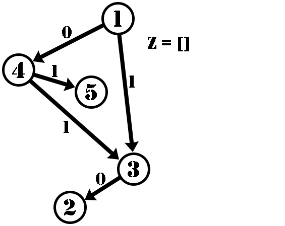

<h1 style='text-align: center;'> C. Completely Searching for Inversions</h1>

<h5 style='text-align: center;'>time limit per test: 2 seconds</h5>
<h5 style='text-align: center;'>memory limit per test: 512 megabytes</h5>

Pak Chanek has a directed acyclic graph (a directed graph that does not have any cycles) containing $N$ vertices. Vertex $i$ has $S_i$ edges directed away from that vertex. The $j$-th edge of vertex $i$ that is directed away from it, is directed towards vertex $L_{i,j}$ and has an integer $W_{i,j}$ ($0\leq W_{i,j}\leq1$). Another information about the graph is that the graph is shaped in such a way such that each vertex can be reached from vertex $1$ via zero or more directed edges.

Pak Chanek has an array $Z$ that is initially empty.

Pak Chanek defines the function dfs as follows:


```text
// dfs from vertex i  
void dfs(int i) {  
    // iterate each edge of vertex i that is directed away from it  
    for(int j = 1; j <= S[i]; j++) {  
        Z.push_back(W[i][j]); // add the integer in the edge to the end of Z  
        dfs(L[i][j]); // recurse to the next vertex  
    }  
}  

```
## Note

 that the function does not keep track of which vertices have been visited, so each vertex can be processed more than once.

Let's say Pak Chanek does dfs(1) once. After that, Pak Chanek will get an array $Z$ containing some elements $0$ or $1$. Define an inversion in array $Z$ as a pair of indices $(x, y)$ ($x < y$) such that $Z_x > Z_y$. How many different inversions in $Z$ are there if Pak Chanek does dfs(1) once? Since the answer can be very big, output the answer modulo $998\,244\,353$.

### Input

The first line contains a single integer $N$ ($2 \leq N \leq 10^5$) — the number of vertices in the graph. The following lines contain the description of each vertex from vertex $1$ to vertex $N$.

The first line of each vertex $i$ contains a single integer $S_i$ ($0 \leq S_i \leq N-1$) — the number of edges directed away from vertex $i$.

The $j$-th of the next $S_i$ lines of each vertex $i$ contains two integers $L_{i,j}$ and $W_{i,j}$ ($1 \leq L_{i,j} \leq N$; $0 \leq W_{i,j} \leq 1$) — an edge directed away from vertex $i$ that is directed towards vertex $L_{i,j}$ and has an integer $W_{i,j}$. For each $i$, the values of $L_{i,1}$, $L_{i,2}$, ..., $L_{i,S_i}$ are pairwise distinct. 

It is guaranteed that the sum of $S_i$ over all vertices does not exceed $2 \cdot 10^5$. There are no cycles in the graph. Each vertex can be reached from vertex $1$ via zero or more directed edges.

### Output

An integer representing the number of inversions in $Z$ if Pak Chanek does dfs(1) once. Since the answer can be very big, output the answer modulo $998\,244\,353$.

## Example

### Input


```text
5
2
4 0
3 1
0
1
2 0
2
3 1
5 1
0
```
### Output


```text
4
```
## Note

The following is the dfs(1) process on the graph.

 

In the end, $Z=[0,1,0,1,1,0]$. All of its inversions are $(2,3)$, $(2,6)$, $(4,6)$, and $(5,6)$.


#### Tags 

#1900 #NOT OK #dfs_and_similar #dp #graphs 

## Blogs
- [All Contest Problems](../COMPFEST_15_-_Preliminary_Online_Mirror_(Unrated,_ICPC_Rules,_Teams_Preferred).md)
- [Announcement (en)](../blogs/Announcement_(en).md)
- [Tutorial (en)](../blogs/Tutorial_(en).md)
