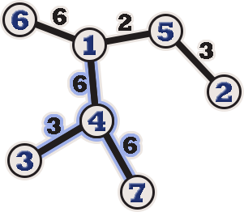
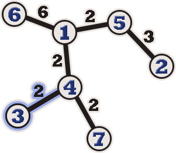

<h1 style='text-align: center;'> K. Keen Tree Calculation</h1>

<h5 style='text-align: center;'>time limit per test: 2 seconds</h5>
<h5 style='text-align: center;'>memory limit per test: 512 megabytes</h5>

There is a tree of $N$ vertices and $N-1$ edges. The $i$-th edge connects vertices $U_i$ and $V_i$ and has a length of $W_i$.

Chaneka, the owner of the tree, asks you $Q$ times. For the $j$-th question, the following is the question format: 

* $X_j$ $K_j$ – If each edge that contains vertex $X_j$ has its length multiplied by $K_j$, what is the diameter of the tree?

## Note

s: 

* Each of Chaneka's question is independent, which means the changes in edge length do not influence the next questions.
* The diameter of a tree is the maximum possible distance between two different vertices in the tree.
#### Input

The first line contains a single integer $N$ ($2\leq N\leq10^5$) — the number of vertices in the tree.

The $i$-th of the next $N-1$ lines contains three integers $U_i$, $V_i$, and $W_i$ ($1 \leq U_i,V_i \leq N$; $1\leq W_i\leq10^9$) — an edge that connects vertices $U_i$ and $V_i$ with a length of $W_i$. The edges form a tree.

The $(N+1)$-th line contains a single integer $Q$ ($1\leq Q\leq10^5$) — the number of questions.

The $j$-th of the next $Q$ lines contains two integers $X_j$ and $K_j$ as described ($1 \leq X_j \leq N$; $1 \leq K_j \leq 10^9$).

#### Output

#### Output

 $Q$ lines with an integer in each line. The integer in the $j$-th line represents the diameter of the tree on the $j$-th question.

## Examples

#### Input


```text
7
5 1 2
1 4 2
3 4 1
2 5 3
6 1 6
4 7 2
2
4 3
3 2
```
#### Output


```text
18
11
```
#### Input


```text
3
1 2 1000000000
2 3 1000000000
1
2 1000000000
```
#### Output


```text
2000000000000000000
```
## Note

In the first example, the following is the tree without any changes.


The following is the tree on the $1$-st question.



The maximum distance is between vertices $6$ and $7$, which is $6+6+6=18$, so the diameter is $18$.

The following is the tree on the $2$-nd question.



The maximum distance is between vertices $2$ and $6$, which is $3+2+6=11$, so the diameter is $11$.


#### Tags 

#2500 #NOT OK #binary_search #data_structures #dp #geometry #graphs #implementation #trees 

## Blogs
- [All Contest Problems](../COMPFEST_15_-_Preliminary_Online_Mirror_(Unrated,_ICPC_Rules,_Teams_Preferred).md)
- [Announcement (en)](../blogs/Announcement_(en).md)
- [Tutorial (en)](../blogs/Tutorial_(en).md)
