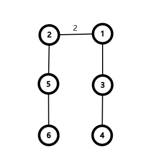
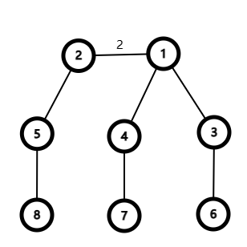
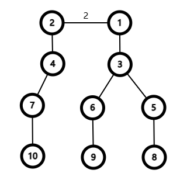

# Tutorial_(en)

[1869A - Make It Zero](https://codeforces.com/contest/1869/problem/A "Codeforces Round 896 (Div. 2)")

Author: [Error_Yuan](https://codeforces.com/profile/Error_Yuan "Candidate Master Error_Yuan")

 **Hint 1**Indeed at most 4 operations will be used.

 **Hint 2**If r−l+1 is even, and you do the operation on [l,r] twice, then the subarray a[l;r] will all become 0.

 **Solution**
### [1869A - Make It Zero](https://codeforces.com/contest/1869/problem/A "Codeforces Round 896 (Div. 2)")

Note that

$$\underbrace{x\oplus x\oplus \cdots\oplus x}_{\text{even times}}=0,$$

So if $r-l+1$ is even, after performing the operation on $[l,r]$ twice, the subarray $a[l;r]$ will all become $0$.

When $n$ is even, we can perform the operation on $[1,n]$ twice.

When $n$ is odd, we can perform the operation on $[1,n-1]$ twice. After that the array becomes $[0,0,\ldots,0,a_n]$. Then perform the operation on $[n-1,n]$ twice.

Time Complexity: $\mathcal{O}(n)$ per test case.

 **Implementation**
```cpp
#include <bits/stdc++.h>
#define all(s) s.begin(), s.end()
using namespace std;
using ll = long long;
using ull = unsigned long long;

const int _N = 1e5 + 5;

int T;

void solve() {
	int n; cin >> n;
	vector<int> a(n);
	for (int i = 0; i < n; i++) cin >> a[i];
	if (n & 1) {
		cout << "4" << 'n';
		cout << "1 " << n - 1 << 'n';
		cout << "1 " << n - 1 << 'n';
		cout << n - 1 << ' ' << n << 'n';
		cout << n - 1 << ' ' << n << 'n';
	} else {
		cout << "2" << 'n';
		cout << "1 " << n << 'n';
		cout << "1 " << n << 'n';
	}
	return;
}

int main() {
	ios::sync_with_stdio(false), cin.tie(0), cout.tie(0);
	cin >> T;
	while (T--) {
		solve();
	}
}
```
 **Rate the problem*** Amazing problem: 


[*167*](https://codeforces.com/data/like?action=like "I like this")
* Good problem: 

 
[*412*](https://codeforces.com/data/like?action=like "I like this")
* Average problem: 

 
[*40*](https://codeforces.com/data/like?action=like "I like this")
* Bad problem: 

 
[*48*](https://codeforces.com/data/like?action=like "I like this")
* Didn't solve: 

 
[*39*](https://codeforces.com/data/like?action=like "I like this")
[1869B - 2D Traveling](https://codeforces.com/contest/1869/problem/B "Codeforces Round 896 (Div. 2)")

Author: [programpiggy](https://codeforces.com/profile/programpiggy "Expert programpiggy")

 **Hint**What will happen if there are no major cities?

 **Solution**
### [1869B - 2D Traveling](https://codeforces.com/contest/1869/problem/B "Codeforces Round 896 (Div. 2)")

First of all, it's easy to see that if there are no major cities, the minimum value of the total cost should be $|x_a-x_b|+|y_a-y_b|$ — the optimal choice is to fly directly from city $a$ to city $b$.

Claim. Piggy will pass through a maximum of $2$ major cities.

Proof. If he passes through $3$ or more major cities in a row, then he can fly directly from the first one to the last one. If he passes through $2$ major cities and passes an ordinary city between them, the cost must be higher than flying directly between these two major cities. So the optimal choice always consists of no more than $2$ major cities, and they are in a row.

Thus, you can express the optimal choice as $a(\to s)(\to t)\to b$, where $s$ and $t$ are both major cities. If you naively enumerate $s$ and $t$, the total complexity of the solution will be $\mathcal O(k^2)$. But after seeing that $s$ and $t$ work independently, we can enumerate them separately. The total complexity decreases to $\mathcal O(n+k)$.

 **Implementation**
```cpp
#include <bits/stdc++.h>
#define all(s) s.begin(), s.end()
using namespace std;
using ll = long long;
using ull = unsigned long long;

const int _N = 1e5 + 5;

int T;

void solve() {
	int n, k, s, t; cin >> n >> k >> s >> t;
	vector<int> x(n + 1), y(n + 1);
	for (int i = 1; i <= n; i++) cin >> x[i] >> y[i];
	ll ans = llabs(x[s] - x[t]) + llabs(y[s] - y[t]);
	ll mins = LLONG_MAX / 2, mint = LLONG_MAX / 2;
	for (int i = 1; i <= k; i++) {
		mins = min(mins, llabs(x[s] - x[i]) + llabs(y[s] - y[i]));
		mint = min(mint, llabs(x[t] - x[i]) + llabs(y[t] - y[i]));
	}
	ans = min(ans, mins + mint);
	cout << ans << 'n';
	return;
}

int main() {
	ios::sync_with_stdio(false), cin.tie(0), cout.tie(0);
	cin >> T;
	while (T--) {
		solve();
	}
}
```
 **Rate the problem*** Amazing problem: 

 
[*92*](https://codeforces.com/data/like?action=like "I like this")
* Good problem: 

 
[*332*](https://codeforces.com/data/like?action=like "I like this")
* Average problem: 

 
[*65*](https://codeforces.com/data/like?action=like "I like this")
* Bad problem: 

 
[*31*](https://codeforces.com/data/like?action=like "I like this")
* Didn't solve: 

 
[*27*](https://codeforces.com/data/like?action=like "I like this")
[1868A - Fill in the Matrix](../problems/A._Fill_in_the_Matrix.md "Codeforces Round 896 (Div. 1)")

Author: [Error_Yuan](https://codeforces.com/profile/Error_Yuan "Candidate Master Error_Yuan")

 **Hint 1**What is the upper bound of s according to n and m? Can you construct such a matrix that reaches the upper bound?

 **Hint 2**If not, can you construct a matrix which maximizes ∑mi=1vi? This is of some help to get the solution.

 **Solution**
### [1868A - Fill in the Matrix](../problems/A._Fill_in_the_Matrix.md "Codeforces Round 896 (Div. 1)")

On one hand, the matrix $M$ has $n$ rows, so the maxmium $v_i$ does not exceed $\operatorname{MEX}(0,1,\cdots,n-1)=n$, and $s$ does not exceed $n+1$.

On the other hand, the matrix $M$ has $m$ columns, and there are only $m$ numbers in the array $v$, so $s$ must not exceed $m$.

Therefore, the upper bound of $s$ is $\min(n+1,m)$.

How can we reach the upper bound?

If $m=1$, then the only possible $M=\begin{pmatrix} 0\\\ 0\\\ \vdots\\\ 0 \end{pmatrix}$, in this case, $v_1=1$, so $s$ must be $0$, which unfortunately cannot reach the upper bound. Sadly, many participants failed on pretest 2 because of it. I've added this test to examples:)

If $m>1$, let's construct the $M$ in two cases:

* Case 1. $m\ge n+1$.In this case, we can construct $M$ like following: $$M= \begin{pmatrix} 0&1&\cdots&m-2&m-1\\\ 1&2&\cdots&m-1&0\\\ 2&3&\cdots&0&1\\\ \vdots&\vdots&\ddots&\vdots&\vdots\\\ n-1&n&\cdots &n-3 & n-2 \end{pmatrix}$$

More formally, $M_{i,j}=(i+j-1)\bmod m$.

Note that in this case $n-1< m-1$, so we have $v_1=n$, $v_2=v_{3}=\cdots=v_{m-n-1}=0$, $v_{m-n}=1,v_{m-n+1}=2,\cdots,v_m=n-1$. Then $s=n+1$, which reaches the upper bound.
* Case 2. $m<n+1$.In this case, we can construct $M$ like following: $$M= \begin{pmatrix} 0&1&\cdots&m-2&m-1\\\ 1&2&\cdots&m-1&0\\\ 2&3&\cdots&0&1\\\ \vdots&\vdots&\ddots&\vdots&\vdots\\\ m-2&m-1&\cdots &m-4 & m-3\\\ 0&1&\cdots&m-2&m-1\\\ 0&1&\cdots&m-2&m-1\\\ \vdots&\vdots&\ddots&\vdots&\vdots\\\ 0&1&\cdots&m-2&m-1\\\ \end{pmatrix}$$

More formally, for $1\le j\le m-1$, $M_{i,j}=(i+j-1)\bmod m$, for $m\le j\le n$, $M_{i,j}=(j-1)\bmod m$.

Note that $m>1$, and $m-2\ge 0$. Similarly to case 1 we can get $s=m$, which also reaches the upper bound.

Time Complexity: $\mathcal{O}(n\cdot m)$ per test case.

 **Implementation**
```cpp
#include <bits/stdc++.h>
#define all(s) s.begin(), s.end()
using namespace std;
using ll = long long;
using ull = unsigned long long;

const int _N = 1e5 + 5;

int T;

void solve() {
	int n, m;
	cin >> n >> m;
	if (m == 1) cout << 0 << 'n';
	else if (n > m - 1) cout << m << 'n';
	else cout << n + 1 << 'n';
	for (int i = 0; i < min(m - 1, n); i++) {
		for (int j = 0; j < m; j++) {
			cout << (j + i) % m << ' ';
		}
		cout << 'n';
	}
	if (n > m - 1) {
		for (int i = m - 1; i < n; i++) {
			for (int j = 0; j < m; j++) {
				cout << j << ' ';
			}
			cout << 'n';
		}
	}
	return;
}

int main() {
	ios::sync_with_stdio(false), cin.tie(0), cout.tie(0);
	cin >> T;
	while (T--) {
		solve();
	}
}
```
 **Rate the problem*** Amazing problem: 

 
[*69*](https://codeforces.com/data/like?action=like "I like this")
* Good problem: 

 
[*230*](https://codeforces.com/data/like?action=like "I like this")
* Average problem: 

 
[*80*](https://codeforces.com/data/like?action=like "I like this")
* Bad problem: 

 
[*148*](https://codeforces.com/data/like?action=like "I like this")
* Didn't solve: 

 
[*28*](https://codeforces.com/data/like?action=like "I like this")
[1868B1 - Candy Party (Easy Version)](../problems/B1._Candy_Party_(Easy_Version).md "Codeforces Round 896 (Div. 1)")

Author: [Error_Yuan](https://codeforces.com/profile/Error_Yuan "Candidate Master Error_Yuan")

 **Hint 1**You can calculate the number of candies of each person after the swap easily. Denote the number as s.

 **Hint 2**Since a person gives candies to and receives candies from exactly one person, assume he gives away 2x candies and receives 2y candies, then we have ai−2x+2y=s. If ai≠s, at most how many pairs (x,y) can satisfy this equation?

 **Hint 3**Do the two restrictions in the statement,

 
> Note that one cannot give more candies than currently he has (he might receive candies from someone else before) and he cannot give candies to himself, either.

really make any difference to the answer?

 **Solution**
### [1868B1 - Candy Party (Easy Version)](../problems/B1._Candy_Party_(Easy_Version).md "Codeforces Round 896 (Div. 1)")

Denote $s$ as $\frac{1}{n}\sum_{i=1}^n a_i$. If $s$ is not an integer, then it will be impossible to make all people have the same number of candies, so the answer is "No".

Since a person gives candies to and receives candies from exactly one person, suppose he gives away $2^x$ candies and receives $2^y$ candies, then we get this equation:

$$a_i−2^{x_i}+2^{y_i}=s.$$

If $s=a_i$, there is an infinite set of solutions: $x_i=y_i$.

Otherwise, $s\ne a_i$, then we have $a_i-s=2^{x_i}-2^{y_i}$. For different pairs $(x, y)$ ($x\ne y$), the values of $2^x - 2^y$ are pairwise different, so there will be at most $1$ solution to this equation.

Thus, if there exists a possible solution, the number of candies each person receives and gives away is determined for $a_i\ne s$. If an equation has no solution, then obviously the answer is "No".

Otherwise, let's maintain two multisets $S$ and $T$. For each person, let's add $x_i$ to $S$ and $y_i$ to $T$. Omitting the condition "one cannot give more candies than currently he has" $(1)$, we can claim that the answer is "Yes" if and only if $S=T$. The proof is left to readers as an exercise. :)

Now let's think about the condition $(1)$. Build a directed graph with $n$ nodes. For two persons $i$ and $j$, if person $i$ gives $x>0$ candies to person $j$, then we add an edge from node $i$ to node $j$ with weight $x$. All nodes with $a_i\ne s$ must have exactly $1$ in degree and $1$ out degree. So the graph must consist of several cycles.

Let's prove that we can always choose a starting point properly for any cycle, so that the condition $(1)$ is satisfied.

Pick the largest $a_i$ in the cycle, and we must have $a_i>s$. Suppose the $i$-th person gives candies to the $j$-th person ($1\le a_j\le a_i$, $x_i\ne x_j$), then we have:

$$ a_i-2^{x_i}+2^{y_i}=s,\tag{2} $$ $$ a_j-2^{x_j}+2^{x_i}=s,\tag{3} $$

Suppose $a_i<2^{x_i}$, then we must have $y_i<x_i$, so $2^{y_i}\le 2^{x_i}/2$. If $x_i<x_j$, that is, $2\cdot 2^{x_i}\le 2^{x_j}$:

$$ \begin{aligned} (2)-(3)&\implies a_i-a_j-2^{x_i}+2^{x_j}+2^{y_i}-2^{x_i}=0\\\ &\implies a_i-a_j+\underbrace{(2^{x_j}-2\cdot 2^{x_i})+2^{y_i}}_{>0}=0\\\ &\implies a_i<a_j, \end{aligned} $$

Similarly we can prove that when $x_i>x_j$, $a_j<0$. In both cases the condition $1\le a_j\le a_i$ has been violated. So we proved that $a_i-2^{x_i}>0$.

Thus, we proved the the claim. And we can easily add those nodes with $a_i=s$ into cycles: suppose the node is $p$, if there is an edge $a\to b$ with weight $w$, we add two edge $a\to p$ and $p\to b$, both weights are $w$, and delect the original edge $a\to b$. 

So we can solve this problem by simply maintaining $S$ and $T$, which can be done in $\mathcal{O}(n\log V)$. $\mathcal{O}(n\log^2 V)$ solutions can fit in the TL well, too.

 **Implementation**
```cpp
#include <bits/stdc++.h>
#define all(s) s.begin(), s.end()
using namespace std;
using ll = long long;
using ull = unsigned long long;

const int _N = 1e5 + 5;

int T;

void solve() {
	int n; cin >> n;
	vector<ll> a(n); ll sum = 0;
	for (int i = 0; i < n; i++) cin >> a[i], sum += a[i];
	if (sum % n) return cout << "No" << 'n', void();
	sum /= n;
	vector<int> bit(31, 0);
	auto lowbit = [](int x) {
	    return x & (-x);
	};
	for (int i = 0; i < n; i++) {
		if (a[i] == sum) continue;
		int d = abs(a[i] - sum);
		int p = lowbit(d);
		int e = d + p;
		if (__builtin_popcount(e) == 1) {
		    if (a[i] > sum) bit[__lg(e)]++, bit[__lg(p)]--;
		    else bit[__lg(e)]--, bit[__lg(p)]++;
		} else {
		    cout << "No" << 'n';
		    return;
		}
	}
	for (int i = 0; i < 31; i++) {
		if (bit[i]) {
			cout << "No" << 'n';
			return;
		}
	}
	cout << "Yes" << 'n';
	return;
}

int main() {
	ios::sync_with_stdio(false), cin.tie(0), cout.tie(0);
	cin >> T;
	while (T--) {
		solve();
	}
}
```
 **Rate the problem*** Amazing problem: 

 
[*125*](https://codeforces.com/data/like?action=like "I like this")
* Good problem: 

 
[*271*](https://codeforces.com/data/like?action=like "I like this")
* Average problem: 

 
[*32*](https://codeforces.com/data/like?action=like "I like this")
* Bad problem: 

 
[*103*](https://codeforces.com/data/like?action=like "I like this")
* Didn't solve: 

 
[*31*](https://codeforces.com/data/like?action=like "I like this")
[1868B2 - Candy Party (Hard Version)](../problems/B2._Candy_Party_(Hard_Version).md "Codeforces Round 896 (Div. 1)")

Author: [Error_Yuan](https://codeforces.com/profile/Error_Yuan "Candidate Master Error_Yuan")  
Please, read the tutorial for B1 first.

 **Hint 4**For whom may not give or receive candies?

 **Hint 5**When |ai−s| is a power of 2, how many ways can the person gives/receives candies at most?

 **Hint 6**Try to determine some people's way to give/receive candies first, then others.

 **How to do this?**Bit-by-bit.

 **Solution**
### [1868B2 - Candy Party (Hard Version)](../problems/B2._Candy_Party_(Hard_Version).md "Codeforces Round 896 (Div. 1)")

Read the tutorial for D1 first.

Consider the graph we built in this version. It should only consist of chains and cycles.

For the start nodes of chains and the end nodes of chains, $|a_i-s|=2^d$ must hold.

Thus, for $|a_i-s|\ne 2^d$, we sill have only one way to decide the number of candies given away and received (the same as D1). However, for $|a_i-s|=2^d$, we have two ways:

1. the same way as D1 (use the equation $a_i-2^{x_i}+2^{y_i}=s$);
2. let this person be the start or end node of chains, that is, $a_i-2^{x_i}=s$ or $a_i-2^{x_i}=s$. (Suppose $2^{x_i}$ is the number of candies he gives away or receives)

Again, let's omit those nodes with $|a_i-s|=2^d$ first. Then we can similarly maintain two sets $S$ and $T$ to D1.

Let $cntS_i$ be the number of $i$-s in set $S$ and $cntT_i$ be the number of $i$-s in $T$. Note that now we omit nodes with $|s-a_i|=2^d$ when maintaining both sets.

Let $cntDS_k$ be the number of nodes with $a_i-s=2^k$ and $cntDT_i$ be the number of nodes with $s-a_i=2^{k}$.

For nodes with $|a_i-s|=2^{x_i}$, the two ways are:

1. $a_i-2^{x_i}=s$, or $a_i+2^{x_i}=s$;
2. $a_i+2^{x_i}-2^{x_i+1}=s$, or $a_i-2^{x_i-1}+2^{x_i}$.

To make the two sets $S$ and $T$ equal, we must make $cntS_k=cntT_k$ for all $0\le k\le 30$.

Now consider nodes with $|a_i-s|=2^d$. We can determine bit-by-bit. Let's start from the first bit.

Consider $cntDS_i$: if we choose $x\le cntDS_i$ elements to use the first way, then:

* $cntS_i:=cntS_i+x$;
* $cntS_{i+1}:=cntS_{i+1}+x$;
* $cntT_i:=cntT_i+(cntDS_i-x)$.

Consider $cntDT_i$: if we choose $x\le cntDT_i$ elements to use the first way, then:

* $cntT_i:=cntT_i+x$;
* $cntT_{i-1}:=cntT_{i-1}+x$;
* $cntT_i:=cntT_i+(cntDT_i-x)$.

Let's consider the highest bit. All elements in $cntDS_i$ must be chosen the second way ($x=0$), otherwise, it will influence $cntS_{i+1}$. Then we can determine the $x$ for $cntDT_i$, then $cntDS_{i-1},cntDT_{i-1},...,cntDS_0,cntDT_0$.

At last, we check if $cntS_0=cntT_0$ (we have made $cntS_i=cntT_i$ for all $i>0$). If so, the answer is "Yes", otherwise the answer is "No".

 **Implementation**
```cpp
#include <bits/stdc++.h>
#define all(s) s.begin(), s.end()
using namespace std;
using ll = long long;
using ull = unsigned long long;

const int _N = 1e5 + 5;

int T;

void solve() {
	int n; cin >> n;
	vector<ll> a(n); ll sum = 0;
	for (int i = 0; i < n; i++) cin >> a[i], sum += a[i];
	if (sum % n) return cout << "No" << 'n', void();
	sum /= n;
	vector<int> bit(31, 0), pow1(31, 0), pow2(31, 0);
	for (int i = 0; i < n; i++) {
		int flag = 0;
		if (a[i] == sum) continue;
		for (int j = 0; j < 31; j++) {
			if (a[i] + (1 << j) == sum) {
				pow1[j]++;
				flag = 1;
				continue;
			}
			if (a[i] - (1 << j) == sum) {
				pow2[j]++;
				flag = 1;
				continue;
			}
		}
		if (flag) continue;
		flag = 0;
		for (int j = 0; j < 31; j++) {
			for (int k = 0; k < 31; k++) {
			    if (a[i] + (1 << j) - (1 << k) == sum) {
			        flag = 1;
			        bit[j]++;
			        bit[k]--;
			    }
			}
		}
		if (!flag) {
			cout << "No" << 'n';
			return;
		}
	}
	for (int i = 30; i >= 0; i--) {
		bit[i] += (pow1[i] - pow2[i]);
		if (i == 0) break;
		if (bit[i] < 0) {
			pow1[i - 1] -= -bit[i];
			bit[i - 1] -= -bit[i];
			if (pow1[i - 1] < 0) {
				cout << "No" << 'n';
				return;
			}
		} else {
			pow2[i - 1] -= bit[i];
			bit[i - 1] += bit[i];
			if (pow2[i - 1] < 0) {
				cout << "No" << 'n';
				return;
			}
		}
	}
	if (bit[0] == 0) cout << "Yes" << 'n';
	else cout << "No" << 'n';
	return;
}

int main() {
	ios::sync_with_stdio(false), cin.tie(0), cout.tie(0);
	cin >> T;
	while (T--) {
		solve();
	}
}
```
 **Rate the problem*** Amazing problem: 

 
[*37*](https://codeforces.com/data/like?action=like "I like this")
* Good problem: 

 
[*80*](https://codeforces.com/data/like?action=like "I like this")
* Average problem: 

 
[*17*](https://codeforces.com/data/like?action=like "I like this")
* Bad problem: 

 
[*128*](https://codeforces.com/data/like?action=like "I like this")
* Didn't solve: 

 
[*20*](https://codeforces.com/data/like?action=like "I like this")
[1868C - Travel Plan](../problems/C._Travel_Plan.md "Codeforces Round 896 (Div. 1)")

Author: [programpiggy](https://codeforces.com/profile/programpiggy "Expert programpiggy")

 **Hint 1**For any simple path length t, what's the sum of the maximum value of cities in all assignments? For the cities out of the path, their value doesn't matter.

 **Hint 2**Consider an easy dp to calculate the number of paths with different lengths.

 **Hint 3**How many different subtrees are there in this tree?

 **Hint 4**What's the maximum length of the paths?

 **Hint 5**Try to optimize the dp with the conclusion you get in Hint 3 and Hint 4.

 **Solution**
### [1868C - Travel Plan](../problems/C._Travel_Plan.md "Codeforces Round 896 (Div. 1)")

For any path of length $t$, the number of assignments in which the maximum value of cities is no bigger than $k$ is $k^t$. As a result, the number of assignments in which the maximum value of cities is exactly $k$ is $k^t-(k-1)^t$, while the sum of the maximum value of cities in all assignments is $\sum_{k=1}^m(k^t-(k-1)^t)k$. We can solve this in $\mathcal O(m\log n)$.

Then, we need to calculate the number of paths of length $t$ for each $t$.

Claim. There are $\mathcal O(\log n)$ different subtrees in this tree.

Proof. It's easy to see that this tree can be seen as a full binary tree with one row of extra leaves. Let the number of leaves in each subtree be $lf_i$. If $lf_i=2^p$, the subtree of $i$ is a full binary tree with depth $p$. Also, for each subtree satisfying $lf_i\neq 2^p$, either $lf_{2i}=2^{p'}$ or $lf_{2i+1}=2^{p'}$, which means that for each depth, there is at most one subtree satisfying $lf_i\neq2^p$. As the depth of the whole tree is $\mathcal O(\log n)$, the total number of different subtrees is also $\mathcal O(\log n)$.

Then, let $dp_{i,j}$ stand for the number of paths length $j$ in a subtree with $i$ vertices, and $f_{i,j}$ stand for the number of paths with one end being $i$ and length $j$ in a subtree with $i$ vertices. We can simply do a memorization search to solve this part in $\mathcal O(\log^3 n)$.

To optimize the first part, we can transform the formula to $m^t\times m-\sum_{k=1}^{m-1}k^t$. For the second part, we can use interpolation, dp, or polynomial to solve this in $\mathcal O(\log n)$ or $\mathcal O(\log^2 n)$.

To optimize the second part, we can divide the paths into three types: no end on the extra leaves, one end on the extra leaves, and two ends on the extra leaves. For the first two types, we can simply see the paths as going up and going down so we can enumerate the distance going up and down. Then we can calculate them in $\mathcal O(\log^2 n)$. For the third part, a dp just like the above will work. The only difference is that only one $f_{i,j}$ is not $0$ under this circumstance and we can solve it in $\mathcal O(\log^2 n)$.

It's also possible to solve this second part in $\mathcal O(\log n)$ by further optimization of the calculation of the three types of paths.

O(∑(mlogn+log3n))O(∑(mlogn+log3n)) solution by [programpiggy](https://codeforces.com/profile/programpiggy "Expert programpiggy"):

 **Implementation**
```cpp
#include <bits/stdc++.h>
#define ll long long
#define ull unsigned long long
using namespace std;
#pragma GCC optimize("Ofast")

ll tot[505],n,m,dp[125][125],dp2[125],g[125][125],g2[125],f[125],pw[100005][125];
const ll mod=998244353;

inline ll dep( ll root) {
	if (root>n)return 0;
	return dep(root*2)+1;
}

inline ll dep2( ll root) {
	if (root>n)return 0;
	return dep2(root*2+1)+1;
}

inline bool full( ll root) {
	return dep(root)==dep2(root);
}

void dfs( ll root) {
	if (root*2>n) {
		g2[0]=dp2[0]=1;
		return;
	}
	if (root*2==n) {
		g2[0]=2,g2[1]=1;
		dp2[0]=1,dp2[1]=1;
		return;
	}
	ll d=0;
	if (full(root*2)) {

		d=dep(root*2);
		dfs(root*2+1);
	} else {
		d=dep(root*2+1);
		dfs(root*2);
	}
	ll mx=2*d+4;
	for (ll i=0; i<=mx; i++) {
		g2[i]+=g[d][i];
		for (ll j=0; j<=min(d+2,i); j++) {
			g2[i+2]+=dp2[j]*dp[d][i-j]%mod;
		}
	}
	for (ll i=mx; i>0; i--)dp2[i]=(dp2[i-1]+dp[d][i-1])%mod;
	dp2[0]=1;
	for (ll i=0; i<=mx; i++)g2[i]+=dp2[i],g2[i]%=mod;
}

inline ll qkp(ll a,ll k) {
	ll ans=1;
	while (k) {
		if (k&1)ans*=a,ans%=mod;
		a*=a,a%=mod;
		k>>=1;
	}
	return ans;
}

int main() {
	ll t;
	scanf("%lld",&t);
	for (ll i=1; i<=60; i++) {
			dp[i][0]=1;
			for (ll j=1; j<=i-1; j++) {
				dp[i][j]=2*dp[i-1][j-1]%mod;
			}
			for (ll j=0; j<=2*i-2; j++) {
				g[i][j]+=g[i-1][j]*2;
				g[i][j]+=dp[i][j];
				g[i][j]%=mod;
				for (ll k=0; k<=j; k++) {
					g[i][j+2]+=dp[i-1][k]*dp[i-1][j-k]%mod;
					g[i][j+2]%=mod;
				}
			}
		}
	while (t--) {
		scanf("%lld%lld",&n,&m);
		
		// log n^3
		dfs(1);
		ll d=dep(1),ans=0;
		for (ll j=0; j<=m; j++) {
			pw[j][0]=1;
			for (ll i=1; i<=2*d; i++) {
				pw[j][i]=pw[j][i-1]*j%mod;
			}
		}

		for (ll i=0; i<=2*d-2; i++) {
			for (ll j=1; j<=m; j++) {
				f[i]+=(pw[j][i+2]+mod-pw[j-1][i+1]*j%mod)%mod;
				f[i]%=mod;
			}
			if (n>=i+1)
				ans+=f[i]*g2[i]%mod*qkp(m,n-i-1)%mod;
			ans%=mod;
		}
		printf("%lldn",ans);
		for (ll i=1;i<=60;i++){
			for (ll j=0;j<=2*i-2;j++){
				f[j]=g2[j]=dp2[j]=0;
			}
		}
	}

	return 0;
}
```
O(∑log3n)O(∑log3n) solution by [sszcdjr](https://codeforces.com/profile/sszcdjr "Master sszcdjr"):

 **Implementation**
```cpp
#include <bits/stdc++.h>
#define int long long
#define double long double
#define mid ((l+r)>>1)
using namespace std;
const int mod=998244353;
int qp(int a,int b){
	int ans=1;
	while(b){
		if(b&1) ans=(ans*a)%mod;
		a=(a*a)%mod;
		b>>=1;
	}
	return ans;
}
int fac[1000005],inv[1000005];
void init(){
	fac[0]=1;
	for(int i=1;i<=1000000;i++) fac[i]=fac[i-1]*i%mod;
	inv[1000000]=qp(fac[1000000],mod-2);
	for(int i=999999;i>=0;i--) inv[i]=inv[i+1]*(i+1)%mod;
}
int C(int i,int j){
	if(i<0||j<0||i<j) return 0;
	return fac[i]*inv[i-j]%mod*inv[j]%mod;
}
int cnt=0;
int reg[100005][131],reg2[100005][131];
unordered_map<int,int> mp;
void dfs(int now){
	if(mp[now]) return ;
	mp[now]=++cnt;
	if(now==0) return ;
	reg[cnt][0]++,reg2[cnt][0]++;
	if(now==1) return ;
	int i=0;
	for(i=1;i<=62;i++) if((1LL<<i)-1>=now) break;
	i-=2;
	int lnum=(1LL<<i)-1,rnum=(1LL<<i)-1,lft=now-(1LL<<(i+1))+1;
	if(lft<=(1LL<<i)) lnum+=lft;
	else lnum+=(1LL<<i),rnum+=(lft-(1LL<<i));
	dfs(lnum),dfs(rnum);
	int ml=mp[lnum],mr=mp[rnum],mn=mp[now];
	for(int i=0;i<=130;i++){
		for(int j=0;j<=130;j++){
			if(i+j+2>=130) break;
			(reg2[mn][i+j+2]+=(reg[ml][i]*reg[mr][j]))%=mod; 
		}
	}
	for(int i=0;i<=129;i++) (reg[mn][i+1]+=reg[ml][i]+reg[mr][i])%=mod,(reg2[mn][i+1]+=reg[ml][i]+reg[mr][i])%=mod,(reg2[mn][i]+=reg2[ml][i]+reg2[mr][i])%=mod;
}
int pw[100005][150],tot[205];
signed main(){
	init();
	int t; cin>>t;
	while(t--){
		int n,m;
		cin>>n>>m;
		dfs(n);
		int nn=mp[n];
		int ans=0;
		tot[0]=(m-1)%mod;
		for(int i=2;i<=135;i++){
			tot[i-1]=(qp((m-1)%mod+1,i)+mod-1)%mod;
			for(int l=2;l<=i;l++) (tot[i-1]+=mod-C(i,l)*tot[i-l]%mod)%=mod;
		    (tot[i-1]*=qp(i,mod-2))%=mod;
		}
		for(int i=0;i<=min(130ll,n-1);i++){
			int tmp=(qp(m%mod,i+2)+mod-tot[i+1])%mod;
			(ans+=tmp*reg2[nn][i]%mod*qp(m%mod,n-(i+1)))%=mod;
		}
		cout<<ans<<"n";
	}
	return 0;
}

```
O(∑log2n)O(∑log2n) solution by [sszcdjr](https://codeforces.com/profile/sszcdjr "Master sszcdjr"):

 **Implementation**
```cpp
#include <bits/stdc++.h>
#define int long long
#define double long double
#define mid ((l+r)>>1)
using namespace std;
const int mod=998244353;
int qp(int a,int b){
	int ans=1;
	while(b){
		if(b&1) ans=(ans*a)%mod;
		a=(a*a)%mod;
		b>>=1;
	}
	return ans;
}
int fac[1000005],inv[1000005];
void init(){
	fac[0]=1;
	for(int i=1;i<=1000000;i++) fac[i]=fac[i-1]*i%mod;
	inv[1000000]=qp(fac[1000000],mod-2);
	for(int i=999999;i>=0;i--) inv[i]=inv[i+1]*(i+1)%mod;
}
int C(int i,int j){
	if(i<0||j<0||i<j) return 0;
	return fac[i]*inv[i-j]%mod*inv[j]%mod;
}
int cnt=0;
int reg[100005][131],dep[100005],depc[100005],rett[131],invi[131];
unordered_map<int,int> mp;
void dfs(int now){
	if(mp[now]) return ;
	mp[now]=++cnt;
	if(now==0) return ;
	dep[cnt]=1,depc[cnt]=1,reg[cnt][0]++;
	if(now==1) return ;
	int i=0;
	for(i=1;i<=62;i++) if((1LL<<i)-1>=now) break;
	i-=2;
	int lnum=(1LL<<i)-1,rnum=(1LL<<i)-1,lft=now-(1LL<<(i+1))+1;
	if(lft<=(1LL<<i)) lnum+=lft;
	else lnum+=(1LL<<i),rnum+=(lft-(1LL<<i));
	dfs(lnum),dfs(rnum);
	int ml=mp[lnum],mr=mp[rnum],mn=mp[now];
	if(dep[ml]>dep[mr]){
		dep[mn]=dep[ml]+1; depc[mn]=depc[ml];
		for(int i=0;i<=129;i++) reg[mn][i]=reg[ml][i];
	}
	else{
		dep[mn]=dep[ml]+1; depc[mn]=(depc[ml]+depc[mr])%mod;
		for(int i=0;i<=129;i++) reg[mn][i]=(reg[ml][i]+reg[mr][i])%mod;
		(reg[mn][dep[mn]*2-2]+=depc[ml]*depc[mr])%=mod;
	}
}
int pw[100005][150],tot[205],pw2[135];
signed main(){
	pw2[0]=1;
	for(int i=1;i<=130;i++) pw2[i]=pw2[i-1]*2%mod,invi[i]=qp(i,mod-2);
	init();
	int t; cin>>t;
	while(t--){
		int n,m;
		cin>>n>>m;
		int lg=0,lft;
		for(int i=0;i<=130;i++) rett[i]=0;
		for(lg=61;lg>=0;lg--){
			if(n>=(1LL<<(lg+1))-1){
				lft=n-((1LL<<(lg+1))-1);
				lft%=mod;
				break;
			}
		}
		for(int i=0;i<=lg;i++){
			for(int j=0;j<=lg;j++){
				int tt=max(i,j);
				(rett[i+j]+=(pw2[lg-tt+1]-1)*pw2[max(0ll,i-1)+max(0ll,j-1)]%mod)%=mod;
			}
		}
		for(int i=1;i<=lg+1;i++){
			for(int j=0;j<i;j++){
				(rett[i+j]+=lft*pw2[max(0ll,j-1)]%mod)%=mod;
			}
		}
		dfs(n);
		int nn=mp[n];
		if(n!=(1ll<<(lg+1))-1) for(int i=0;i<=130;i++) (rett[i]+=reg[nn][i])%=mod;
		int ans=0;
		tot[0]=(m-1)%mod;
		for(int i=2;i<=130;i++){
			tot[i-1]=(qp((m-1)%mod+1,i)+mod-1)%mod;
			for(int l=2;l<=i;l++) (tot[i-1]+=mod-C(i,l)*tot[i-l]%mod)%=mod;
		    (tot[i-1]*=invi[i])%=mod;
		}
		for(int i=0;i<=min(130ll,n-1);i++){
			int tmp=(qp(m%mod,i+2)+mod-tot[i+1])%mod;
			(ans+=tmp*rett[i]%mod*qp(m%mod,n-(i+1)))%=mod;
		}
		cout<<ans<<"n";
	}
	return 0;
}

```
O(∑mlogn)O(∑mlogn) solution by [MatrixGroup](https://codeforces.com/profile/MatrixGroup "Grandmaster MatrixGroup"):

 **Implementation**
```cpp
#include <bits/stdc++.h>
#define rep(i,n) for(int i=0,_##i##__end=(n);i<_##i##__end;++i)
#define rep1(i,n) for(int i=1,_##i##__end=(n);i<=_##i##__end;++i)
#define mp make_pair
#define fi first
#define se second
typedef long long ll;
using namespace std;
const ll mod1=998244353;
int t;
ll n;
int m;
ll qkpw(ll a,ll b)
{
	ll ret=1;
	while(b)
	{
		if(b&1) ret=ret*a%mod1;
		a=a*a%mod1;
		b>>=1;
	}
	return ret;
}
ll val_full[114];
ll val_link[114];
pair<ll,ll> realget(ll P,unsigned long long c)
{
	if((c&(c+1))==0)
	return mp(val_link[bit_width(c)-1],val_full[bit_width(c)-1]);
	if(c==2)
	return mp((P*P+P)%mod1,(P*P+P+P)%mod1);
	if(c&(bit_floor(c)>>1))
	{
		pair<ll,ll> A=realget(P,bit_floor(c)-1),B=realget(P,c-bit_floor(c));
		return mp((A.fi+B.fi+1)*P%mod1,(A.se+B.se+(1+A.fi)*(1+B.fi)%mod1*P)%mod1);
	}
	pair<ll,ll> A=realget(P,c-(bit_floor(c)>>1)),B=realget(P,(bit_floor(c)>>1)-1);
	return mp((A.fi+B.fi+1)*P%mod1,(A.se+B.se+(1+A.fi)*(1+B.fi)%mod1*P)%mod1);
}
ll get_value(ll P,ll c)
{
	val_full[0]=P;val_link[0]=P;
	rep1(i,64)
	{
		val_full[i]=(val_full[i-1]*2+(1+val_link[i-1])*(1+val_link[i-1])%mod1*P)%mod1;
		val_link[i]=((val_link[i-1]*2+1)*P)%mod1;
	}
	return realget(P,c).second;
}
void Q()
{
	cin>>n>>m;
	ll cur=((n%mod1)*(n%mod1+1)/2%mod1)*qkpw(m,n+1)%mod1;
	ll INV_M=qkpw(m,mod1-2);
	rep(i,m) cur=(cur-qkpw(m,n)*get_value(i*INV_M%mod1,n)%mod1+mod1)%mod1;
	cout<<cur<<endl;
}
int main()
{
	cin>>t;while(t--)Q();
}
```
 **Rate the problem*** Amazing problem: 

 
[*36*](https://codeforces.com/data/like?action=like "I like this")
* Good problem: 

 
[*28*](https://codeforces.com/data/like?action=like "I like this")
* Average problem: 

 
[*17*](https://codeforces.com/data/like?action=like "I like this")
* Bad problem: 

 
[*86*](https://codeforces.com/data/like?action=like "I like this")
* Didn't solve: 

 
[*25*](https://codeforces.com/data/like?action=like "I like this")
[1868D - Flower-like Pseudotree](../problems/D._Flower-like_Pseudotree.md "Codeforces Round 896 (Div. 1)")

Author: [sszcdjr](https://codeforces.com/profile/sszcdjr "Master sszcdjr")

 **Hint 1**In fact, vertices with degree 1 are useless, let's first ignore them. It's easy to see that when ∑ni=1di=2n, we can simply hang them under the vertices which haven't reached their degree limit.

 **Hint 2**In most cases, we can simply put two vertices on the cycle.

 **Hint 3**Sort di from the largest to the smallest. Can we construct a flower-like psuedotree when d1=2? Can we construct a flower-like psuedotree when d1≠2 and d2=2?

 **Hint 4**Can you find an easy way to construct the flower-like psuedotree when the number of di>1 is even?

 **Hint 5**Try to extend the solution when the number of di>1 is even to the odd case. Note some corner cases.

 **Solution**
### [1868D - Flower-like Pseudotree](../problems/D._Flower-like_Pseudotree.md "Codeforces Round 896 (Div. 1)")

If $\sum_{i=1}^n d_i\neq 2n$, it's obviously impossible to construct a flower-like psuedotree. So let's just consider the situation when $\sum_{i=1}^n d_i=2n$.

Sort $d_i$ from largest to smallest. If $d_1=d_2=\dots=d_n=2$, we can simply construct a cycle. Otherwise $d_1>2$, in which case there must be at least two $d_i>2$ and the vertices on the cycle must satisfy $d_i>2$.

Ignore all vertices with $d_i=1$ as we can just hang them under all the other vertices. The following pictures don't show vertices with $d_i=1$ and the edges with weight $2$ are two multi-edges.

Let $cnt$ be the number of vertices with $d_i>1$.

If $cnt$ is even, we can make a cycle using $d_1$ and $d_2$, with two chains of equal length hanging from $d_1$ and $d_2$.

  The multi-edges have a number $2$ on them. If $cnt$ is odd and $d_1>3$, it's easy to see that we can hang two vertices below $d_1$ to transform it to the situation where $cnt$ is even. However, we need at least $5$ vertices to make the psuedotree flower-like, which means that $cnt\geq5$ must be satisfied. (In the picture, at least vertices $1\sim5$ are needed.)

  If $cnt$ is odd, $d_1>3$ and $cnt=3$, it's impossible for us to simply build a cycle length $2$. Thus, we can try to put $d_1,d_2,d_3$ in one cycle and the condition is $d_3>2$.

If $cnt$ is odd and $d_1=3$, it's impossible for us to do the operation above, because we can't hang two vertices under $d_1$. It's easy to see that we can't balance the two trees if $d_3=2$. For $d_3=3$, we can hang $d_3,d_4$ under $d_1,d_2$, $d_5,d_6$ under $d_3$ and $d_7$ under $d_4$ to make the psuedotree flower-like. However, we need at least $7$ vertices to make it balanced, which means $cnt\geq7$ must be satisfied.

  If $cnt$ is odd, $d_1=3$ and $cnt=5$, there are three cases:

* $d_1=d_2=d_3=3,d_4=d_5=2$: It can be proven that there isn't such a psuedotree.
* $d_1=d_2=d_3=d_4=3,d_5=2$: It can be proven that there isn't such a psuedotree.
* $d_1=d_2=d_3=d_4=d_5=3$: We can simply build a cycle of length $5$.

If $cnt$ is odd, $d_1=3$ and $cnt=3$, there's only one case:

* $d_1=d_2=d_3=3$: We can simply build a cycle of length $3$.

The total complexity depends on the sorting part, which is $\mathcal O(n\log n)$ if you use std::sort or std::stable_sort, and $\mathcal O(n)$ if you use bucket sorting.

 **Implementation**
```cpp
#include <bits/stdc++.h>
#define int long long
#define double long double
using namespace std;
struct node{
	int d,pos;
}a[1000005];
bool cmp(node x,node y){
	return x.d>y.d;
}
void pe(int x,int y){
	cout<<a[x].pos<<" "<<a[y].pos<<"n";
}
signed main(){
	ios::sync_with_stdio(false);
	cin.tie(0),cout.tie(0);
	int t; cin>>t;
	while(t--){
		int n,tot=0; cin>>n; for(int i=1;i<=n;i++) cin>>a[i].d,a[i].pos=i,tot+=a[i].d;
		if(tot!=2*n){
			cout<<"Non"; continue;
		}
		if(n==1){
			cout<<"Non"; continue;
		}
		sort(a+1,a+n+1,cmp);
		if(a[1].d==2){
			cout<<"Yesn";
			for(int i=1;i<=n;i++) pe(i,i%n+1);
			continue;
		}
		if(a[2].d==2){
			cout<<"Non"; continue;
		}
		int cntb=0;
		for(int i=3;i<=n;i++) cntb+=(a[i].d>1);
		int num[n+1]; for(int i=1;i<=n;i++) num[i]=a[i].d;
		if(!(cntb&1)){
			cout<<"Yesn";
			pe(1,2),pe(1,2);
			num[1]-=2,num[2]-=2;
			for(int i=3;i<=cntb+2;i++) pe(i,i-2),num[i]--,num[i-2]--;
			int it=1;
			for(int i=cntb+3;i<=n;i++){
				while(!num[it]) it++;
				num[it]--,pe(i,it);
			}
			continue;
		}
		if(a[1].d==3){
			if(a[3].d==2){
				cout<<"Non"; continue;
			}
			if(cntb==1){
				cout<<"Yesn";
				pe(1,2),pe(2,3),pe(3,1);
				pe(1,4),pe(2,5),pe(3,6);
				continue;
			}
			if(a[5].d==2&&cntb==3){
				cout<<"Non"; continue;
			}
			if(cntb==3){
				cout<<"Yesn";
				pe(1,2),pe(2,3),pe(3,4),pe(4,5),pe(5,1);
				pe(1,6),pe(2,7),pe(3,8),pe(4,9),pe(5,10);
				continue;
			}
			cout<<"Yesn";
			pe(1,2),pe(1,2),pe(1,3),pe(2,4),pe(3,5),pe(3,6),pe(4,7);
			num[1]-=3,num[2]-=3,num[3]-=3,num[4]-=2,num[5]--,num[6]--,num[7]--;
			for(int i=8;i<=cntb+2;i++) pe(i-2,i),num[i]--,num[i-2]--;
			int it=1;
			for(int i=cntb+3;i<=n;i++){
				while(!num[it]) it++;
				num[it]--,pe(i,it);
			}
			continue;
		}
		else{
			if(a[3].d==2&&cntb==1){
				cout<<"Non"; continue;
			}
			if(cntb==1){
				cout<<"Yesn";
				pe(1,2),pe(2,3),pe(3,1);
				num[1]-=2,num[2]-=2,num[3]-=2;
				int it=1;
				for(int i=4;i<=n;i++){
					while(!num[it]) it++;
					num[it]--,pe(i,it);
				}
				continue;
			}
			cout<<"Yesn";
			pe(1,2),pe(1,2),pe(1,3),pe(1,4),pe(2,5);
			num[1]-=4,num[2]-=3,num[3]-=1,num[4]-=1,num[5]-=1;
			for(int i=6;i<=cntb+2;i++) pe(i,i-2),num[i]--,num[i-2]--;
			int it=1;
			for(int i=cntb+3;i<=n;i++){
				while(!num[it]) it++;
				num[it]--,pe(i,it);
			}
			continue;
		}
	}
	return 0;
}
```
 **Rate the problem*** Amazing problem: 

 
[*5*](https://codeforces.com/data/like?action=like "I like this")
* Good problem: 

 
[*8*](https://codeforces.com/data/like?action=like "I like this")
* Average problem: 

 
[*3*](https://codeforces.com/data/like?action=like "I like this")
* Bad problem: 

 
[*65*](https://codeforces.com/data/like?action=like "I like this")
* Didn't solve: 

 
[*9*](https://codeforces.com/data/like?action=like "I like this")
[1868E - Min-Sum-Max](../problems/E._Min-Sum-Max.md "Codeforces Round 896 (Div. 1)")

Author: [duck_pear](https://codeforces.com/profile/duck_pear "Master duck_pear")  
Huge thanks to [Kubic](https://codeforces.com/profile/Kubic "International Grandmaster Kubic") for the development of this problem!

 **Hint 1**Consider this problem on the prefix sum array.

 **Hint 2**Try to make some observations about the prefix sum array. Consider dp.

 **Hint 3**Go for a slow solution first, for example, O(n6) or O(n4).

 **Hint 4**The last step is to optimize your dp to O(n3). :)

 **Fun Fact**O(n6) can pass n≤100 easily so we have to raise the limit for ∑n to 1 000.

 **Solution**
### [1868E - Min-Sum-Max](../problems/E._Min-Sum-Max.md "Codeforces Round 896 (Div. 1)")

Let $s$ be the suffix sum array of array $a$. That is, $s_i=\sum_{j=1}^ia_i$ and $s_0=0$.

Let the partition point of the array be $r_0,r_1,\dots,r_m$, where $r_0=0$ and $r_m=n$.

Pick one of the maximums of $s_{r_0},s_{r_1},\dots,s_{r_m}$ and let it be $s_{r_x}$. Similarly, let the minimum be $s_{r_y}$.

If $|x-y|\geq 2$, there must be some $k$ ($k<x<y$) which satisfies that $s_{r_k}=s_{r_x}$ or $s_{r_k}=s_{r_y}$, or it's easy to see that the subsegment $[x+1,y]$ is invalid.

Using the induction method, we can show that there exists a pair $(i,i+1)$ such that $s_{r_i}$ and $s_{r_{i+1}}$ are the maximum and the minimum in a valid subsegment in a partition.

As a result, after enumerating $r_i,r_{i+1}$, the two parts $[1,r_i]$ and $[r_{i+1},n]$ are separate subproblems with constraints $s_{r_i}\leq r_t\leq s_{r_{i+1}}$.

Let $dp_{i,j,k,l}$ be the maximum number of $r_t$ we can select in the segment $[i,j]$ with all $k\leq s_{r_t}\leq l$ and positions $i,j$ must be selected.

Enumerate the maximum and minimum $s_{r_t}$ in all the selected $r_t$ and let them be $s_x$ and $s_y$. Then we get the transitions:

$$ \forall k\le s_x,l\ge s_y,dp_{i,j,k,l}\gets dp_{i,x,s_x,s_y}+dp_{y,j,s_x,s_y} $$

After compressing the coordinates of the array $s$ and changing the meaning of $k,l$ to the $k$-th,$l$-th small $s_i$ after coordinate compression, we can solve this problem in $\mathcal{O}(n^6)$, and $\mathcal{O}(n^4)$ with 2D prefix maximum.

Consider the optimization. It's easy to see that the states used in the transformation all satisfy $k=s_i$ or $l=s_i$ or $k=s_j$ or $l=s_j$.

Let's replace $dp_{i,j,s_i,k}$ by $f_{i,j,k}$ and replace $dp_{i,j,k,s_i}$ by $g_{i,j,k}$, and the transitions only relieve on $f_{i,j,k}$ and $g_{i,j,k}$, so the number of states was reduced to $\mathcal{O}(n^3)$.

Consider the transitions of $f_{i,j,k}$ as $g_{i,j,k}$ is similar. Since the minimum $s_{r_t}$ is greater than $s_i$ and the position $i$ must be selected, the minimum $s_{r_t}$ is $s_i$. Enumerate $x$ and let $s_x$ be the maximum $s_{r_t}$. We need to find the best position $y$ where $s_y$ is minimum, i.e. $s_y=s_i$ and transform the segment $[i,x],[y,j]$ or $[i,y],[x,j]$ to $[i,j]$. It's easy to see that selecting the first $s_y=s_i$ on the left/right of $x$ is always the best choice. Let $y_1,y_2$ be the first on the left/right, then the transitions are:

$$\forall k\ge s_x$$

$$f_{i,j,k}\leftarrow\max\{f_{i,y_1,s_x}+g_{x,j,s_i}\}$$

$$f_{i,j,k}\leftarrow\max\{f_{i,x,s_x}+f_{y_2,j,s_x}\}$$

Thus, the total time complexity is $\mathcal{O}(n^3)$ per test case.

 **Implementation (by Artyom123)**
```cpp
#include <iostream>
#include <vector>
#include <string>
#include <algorithm>
#include <set>
#include <map>
#include <math.h>
#include <iomanip>
#include <bitset>
#include <random>
#include <ctime>
#include <string_view>
#include <queue>
#include <cassert>

using namespace std;

#define fi first
#define se second
#define all(x) (x).begin(), (x).end()
#define pb emplace_back
#define ll long long
#define mp make_pair
#define pii pair<int, int>
#define ld long double

const int INF = 1e9 + 1;
const ll INFLL = 1e18;

bool contains(ll x, ll l, ll r) {
    return (x >= l) && (x <= r);
}

void solve() {
    int n;
    cin >> n;
    vector<ll> a(n + 1);
    for (int i = 1; i <= n; i++) cin >> a[i];
    if (n == 1) {
        cout << 1 << "n";
        return;
    }
    vector<ll> pr(n + 1);
    for (int i = 0; i < n; i++) pr[i + 1] = pr[i] + a[i + 1];
    vector<vector<vector<int>>> dp_leftmin(n + 1, vector<vector<int>>(n + 1, vector<int>(n + 1, -INF)));
    vector<vector<vector<int>>> dp_leftmax(n + 1, vector<vector<int>>(n + 1, vector<int>(n + 1, -INF)));
    vector<vector<vector<int>>> dp_rightmin(n + 1, vector<vector<int>>(n + 1, vector<int>(n + 1, -INF)));
    vector<vector<vector<int>>> dp_rightmax(n + 1, vector<vector<int>>(n + 1, vector<int>(n + 1, -INF)));
    vector<pair<ll, int>> b(n + 1);
    for (int i = 0; i <= n; i++) b[i] = mp(pr[i], i);
    sort(all(b));
    vector<vector<int>> next_left(n + 1, vector<int>(n + 1, -1));
    vector<vector<int>> next_right(n + 1, vector<int>(n + 1, -1));
    for (int i = 0; i <= n; i++) {
        int prev = -1;
        for (int j = 0; j <= n; j++) {
            next_left[i][j] = prev;
            if (pr[j] == pr[i]) prev = j;
        }
        prev = n + 1;
        for (int j = n; j >= 0; j--) {
            next_right[i][j] = prev;
            if (pr[j] == pr[i]) prev = j;
        }
    }
    for (int len = 0; len <= n; len++) {
        for (int i = 0; i <= n && i + len <= n; i++) {
            int j = i + len;
            for (int k = 0; k <= n; k++) {
                if (contains(pr[i], pr[i], pr[k]) && contains(pr[j], pr[i], pr[k])) dp_leftmin[i][j][k] = min(len, 1);
                if (contains(pr[i], pr[k], pr[i]) && contains(pr[j], pr[k], pr[i])) dp_leftmax[i][j][k] = min(len, 1);
                if (contains(pr[i], pr[j], pr[k]) && contains(pr[j], pr[j], pr[k])) dp_rightmin[i][j][k] = min(len, 1);
                if (contains(pr[i], pr[k], pr[j]) && contains(pr[j], pr[k], pr[j])) dp_rightmax[i][j][k] = min(len, 1);
            }
            if (len <= 1) continue;
            for (int x = i; x <= j; x++) {
                if (next_left[i][x] >= i) {
                    int y = next_left[i][x];
                    if (pr[x] >= pr[i]) dp_leftmin[i][j][x] = max(dp_leftmin[i][j][x], dp_leftmin[i][y][x] + dp_leftmax[x][j][i] + 1);
                    if (pr[x] <= pr[i]) dp_leftmax[i][j][x] = max(dp_leftmax[i][j][x], dp_leftmax[i][y][x] + dp_leftmin[x][j][i] + 1);
                }
                if (next_left[j][x] >= i) {
                    int y = next_left[j][x];
                    if (pr[x] >= pr[j]) dp_rightmin[i][j][x] = max(dp_rightmin[i][j][x], dp_rightmin[x][j][x] + dp_rightmin[i][y][x] + 1);
                    if (pr[x] <= pr[j]) dp_rightmax[i][j][x] = max(dp_rightmax[i][j][x], dp_rightmax[x][j][x] + dp_rightmax[i][y][x] + 1);
                }
                if (next_right[i][x] <= j) {
                    int y = next_right[i][x];
                    if (pr[x] >= pr[i]) dp_leftmin[i][j][x] = max(dp_leftmin[i][j][x], dp_leftmin[i][x][x] + dp_leftmin[y][j][x] + 1);
                    if (pr[x] <= pr[i]) dp_leftmax[i][j][x] = max(dp_leftmax[i][j][x], dp_leftmax[i][x][x] + dp_leftmax[y][j][x] + 1);
                }
                if (next_right[j][x] <= j) {
                    int y = next_right[j][x];
                    if (pr[x] >= pr[j]) dp_rightmin[i][j][x] = max(dp_rightmin[i][j][x], dp_rightmin[y][j][x] + dp_rightmax[i][x][j] + 1);
                    if (pr[x] <= pr[j]) dp_rightmax[i][j][x] = max(dp_rightmax[i][j][x], dp_rightmax[y][j][x] + dp_rightmin[i][x][j] + 1);
                }
            }
            int mx_left = -INF;
            int mx_right = -INF;
            for (int k = 0; k <= n; k++) {
                int p = k;
                while (p <= n && b[p].fi == b[k].fi) {
                    mx_left = max(mx_left, dp_leftmin[i][j][b[p].se]);
                    mx_right = max(mx_right, dp_rightmin[i][j][b[p].se]);
                    p++;
                }
                for (int l = k; l < p; l++) {
                    dp_leftmin[i][j][b[l].se] = mx_left;
                    dp_rightmin[i][j][b[l].se] = mx_right;
                }
                k = p - 1;
            }
            mx_left = -INF;
            mx_right = -INF;
            for (int k = n; k >= 0; k--) {
                int p = k;
                while (p >= 0 && b[p].fi == b[k].fi) {
                    mx_left = max(mx_left, dp_leftmax[i][j][b[p].se]);
                    mx_right = max(mx_right, dp_rightmax[i][j][b[p].se]);
                    p--;
                }
                for (int l = k; l > p; l--) {
                    dp_leftmax[i][j][b[l].se] = mx_left;
                    dp_rightmax[i][j][b[l].se] = mx_right;
                }
                k = p + 1;
            }
        }
    }
    int ans = -INF;
    ans = max(ans, dp_leftmin[0][n][n]);
    ans = max(ans, dp_leftmax[0][n][n]);
    for (int x = 0; x <= n; x++) {
        for (int y = x + 1; y <= n; y++) {
            ans = max(ans, dp_rightmin[0][x][y] + dp_leftmax[y][n][x] + 1);
            ans = max(ans, dp_rightmax[0][x][y] + dp_leftmin[y][n][x] + 1);
        }
    }
    cout << ans << "n";
}

int main() {
    #ifdef LOCAL
        freopen("input", "r", stdin);
        freopen("output", "w", stdout);
    #else 
        ios_base::sync_with_stdio(0);
        cin.tie(0);
        cout.tie(0);
    #endif
    int t;
    cin >> t;
    while (t--) {
        solve();
    }
    return 0;
}
```
 **Rate the problem*** Amazing problem: 

 
[*21*](https://codeforces.com/data/like?action=like "I like this")
* Good problem: 

 
[*2*](https://codeforces.com/data/like?action=like "I like this")
* Average problem: 

 
[*1*](https://codeforces.com/data/like?action=like "I like this")
* Bad problem: 

 
[*6*](https://codeforces.com/data/like?action=like "I like this")
* Didn't solve: 

 
[*3*](https://codeforces.com/data/like?action=like "I like this")
[1868F - LIS?](../problems/F._LIS_.md "Codeforces Round 896 (Div. 1)")

Author: [Error_Yuan](https://codeforces.com/profile/Error_Yuan "Candidate Master Error_Yuan") 

 **Hint 1**Greedy.

 **Hint 2**This problem is somehow related to geometry.

 **Hint 3**What structure will the intervals you choose each time form?

 **Solution**
### [1868F - LIS?](../problems/F._LIS_.md "Codeforces Round 896 (Div. 1)")

Call an interval candidate good if and only if it has no prefixes or suffixes with sum $<0$.

For a candidate good interval $[l,r]$, if there is no $l'<l$ or $r'>r$ such that $[l',r]$, $[l,r']$ or $[l',r']$ is also a candidate good interval, we call it good interval.

It's easy to show that all intervals which satisfy the condition in the statement are candidate good intervals and at least one of them is a good interval.

Lemma 1. For two good intervals $[l_1,r_1]$ and $[l_2,r_2]$, they will never intersect. More formally: 

* either $r_1<l_2$ or $r_2<l_1$;
* or $l_2 \le l_1\le r_1\le r_2$.

 Short Proof. If they intersect, then the union of the two intervals is also a candidate good interval, violating the definition of good intervals.Greedy Algorithm. In each operation, we choose one good interval that satisfies the condition in the statement. This will give the minimum answer.

Following our process of the greedy algorithm, it's easy to see that the intervals on which we perform operations each time will form a tree structure. If we do the operation on one such interval, then one of the following happens: 

* The interval remains good;
* The interval is no longer good, and we can split it into several good intervals.

 For example, if we do one operation on $[3,-2,3]$, it will be split into $3$ good intervals: $[2],[-3],[2]$.In the first case, we can keep doing operations on this interval without thinking whether it will have the largest sum among all intervals since it remains good, and all good intervals must be split into shorter good intervals unless it has length $1$. In this case, we can simply do the operations until the only element falls $\le0$.

In the second case, let $(L_i,d)$ means that if all the elements in the interval decrease $d$ ($d$ is the smallest integer which meets with the following), then $s(L_i,r)>s(l,r)$.

That is, $$ d=\min_{l <l'\le r}\frac{s_r-s_{l'-1}}{r-l'}, $$ where $s_i=\sum_{j=1}^i a_i$. $(R_i,d)$ is defined similarly. 

Have you noticed that it is very similar to the slope between points $(l'-1,s_{l'-1})$ and $(r,s_r)$ on a 2-D plane? So what we need to find is just the first point before $(r,s_r)$ (after $(l,s_l)$) in the convex hull for points $(l,s_l),(l+1,s_{l+1}),...,(r,r_s)$. To find it, we can use a segment tree to directly maintain the convex hull for certain intervals, each time we query $\mathcal{O}(\log n)$ intervals and do ternary search on the convex hull of each interval. This step will cost $\mathcal{O}(\log^2 n)$.

In each split, the number of good intervals increases $1$, so we do at most $n$ splits. 

Overall time complexity is $\mathcal{O}(n\log^2 n)$.

 **Implementation**
```cpp
#include <bits/stdc++.h>
#define all(s) s.begin(), s.end()
using namespace std;
using ll = long long;
using ull = unsigned long long;
using point = pair<ll, ll>;

const int _N = 5e5 + 5;

int n;
ll a[_N], pre[_N], suf[_N], ans;
struct interval{
	int l, r; 
	ll d, dneed;
	int type, pos; // type0 - l, type1 - r
};
struct cmp{
	bool operator () (const interval &a, const interval &b) {
		return a.dneed - a.d > b.dneed - b.d;
	}
};

ll ceildiv(ll a, ll b) {
	// return a/b;
	if (a * b > 0) return a / b;
	else return a / b - !!(a % b);
}

namespace sg_left{ // [l, r] -> hull of point l-1 to r-1
	vector<int> hull[_N << 2];
	point pt[_N];
	void get_hull(int p, int l, int r) {
		int head = 0, tail = -1;
		for (int i = l; i <= r; i++) {
			while (head < tail && (pt[hull[p][tail]].second - pt[hull[p][tail - 1]].second) * (pt[i].first - pt[hull[p][tail]].first) <= (pt[i].second - pt[hull[p][tail]].second) * (pt[hull[p][tail]].first - pt[hull[p][tail - 1]].first)) {
				tail--;
				hull[p].pop_back();
			}
			tail++;
			hull[p].emplace_back(i);
		}
	}
	void build(int p, int l, int r) {
		get_hull(p, l - 1, r - 1);
		if (l == r) return;
		int mid = (l + r) >> 1;
		build(p * 2, l, mid);
		build(p * 2 + 1, mid + 1, r);
	}
	pair<int, int> query(int p, int l, int r, int L, int R, point o) {
		if (l >= L && r <= R) { // do ternary search
			int tl = 1, tr = hull[p].size();
			while (tl < tr) {
				int m1 = (tl + tr) / 2, m2 = (tl + tr) / 2 + 1;
				auto p1 = pt[hull[p][m1 - 1]], p2 = pt[hull[p][m2 - 1]];
				if ((o.second - p1.second) * (o.first - p2.first) >= (o.second - p2.second) * (o.first - p1.first)) {
					tl = m1 + 1;
				} else tr = m2 - 1;
			}
			return {ceildiv((o.second - pt[hull[p][tl - 1]].second), (o.first - pt[hull[p][tl - 1]].first)), hull[p][tl - 1] + 1};
		}
		int mid = (l + r) >> 1;
		pair<int, int> res = {-1, -1};
		if (L <= mid) {
			res = query(p * 2, l, mid, L, R, o);
		} 
		if (R > mid) {
			auto res2 = query(p * 2 + 1, mid + 1, r, L, R, o);
			if (res == make_pair(-1, -1)) return res2;
			else {
				if (res2.first <= res.first) {
					return res2;
				} else return res;
			}
		}
		return res;
	}
	void test() {
		auto res = query(1, 1, n, 1, n, pt[n]);
		cout << res.first << ' ' << res.second << 'n';
	}
};
namespace sg_right{ // [l, r] -> hull of point l+1 to r+1
	vector<int> hull[_N << 2];
	point pt[_N];
	void get_hull(int p, int l, int r) {
		int head = 0, tail = -1;
		for (int i = l; i <= r; i++) {
			while (head < tail && (pt[hull[p][tail]].second - pt[hull[p][tail - 1]].second) * (pt[i].first - pt[hull[p][tail]].first) < (pt[i].second - pt[hull[p][tail]].second) * (pt[hull[p][tail]].first - pt[hull[p][tail - 1]].first)) {
				tail--;
				hull[p].pop_back();
			}
			tail++;
			hull[p].emplace_back(i);
		}
	}
	void build(int p, int l, int r) {
		get_hull(p, l + 1, r + 1);
		if (l == r) return;
		int mid = (l + r) >> 1;
		build(p * 2, l, mid);
		build(p * 2 + 1, mid + 1, r);
	}
	pair<int, int> query(int p, int l, int r, int L, int R, point o) {
		if (l >= L && r <= R) { // do ternary search
			int tl = 1, tr = hull[p].size();
			while (tl < tr) {
				int m1 = (tl + tr) / 2, m2 = (tl + tr) / 2 + 1;
				auto p1 = pt[hull[p][m1 - 1]], p2 = pt[hull[p][m2 - 1]];
				if ((o.second - p1.second) * (o.first - p2.first) <= (o.second - p2.second) * (o.first - p1.first)) {
					tl = m1 + 1;
				} else tr = m2 - 1;
			}
			return {ceildiv(-(o.second - pt[hull[p][tl - 1]].second), (o.first - pt[hull[p][tl - 1]].first)), hull[p][tl - 1] - 1};
		}
		int mid = (l + r) >> 1;
		pair<int, int> res = {-1, -1};
		if (L <= mid) {
			res = query(p * 2, l, mid, L, R, o);
		} 
		if (R > mid) {
			auto res2 = query(p * 2 + 1, mid + 1, r, L, R, o);
			if (res == make_pair(-1, -1)) return res2;
			else {
				if (res.first <= res2.first) {
					return res;
				} else return res2;
			}
		}
		return res;
	}
	void test() {
		auto res = query(1, 1, n, 1, n, pt[1]);
		cout << res.first << ' ' << res.second << 'n';
	}
};


int main() {
	ios::sync_with_stdio(false), cin.tie(0), cout.tie(0);
	cin >> n;
	for (int i = 1; i <= n; i++) cin >> a[i];
	if (n == 1) {
		cout << max(a[1] + 1, 0ll) << 'n';
		return 0;
	}
	sg_left::pt[0] = {0, 0}; sg_right::pt[n + 1] = {n + 1, 0};
	for (int i = 1; i <= n; i++) {
		pre[i] = pre[i - 1] + a[i];
		sg_left::pt[i] = {i, pre[i]};
	}
	for (int i = n; i >= 1; i--) {
		suf[i] = suf[i + 1] + a[i];
		sg_right::pt[i] = {i, suf[i]};
	}
	sg_left::build(1, 1, n);
	sg_right::build(1, 1, n);
	ll ans = 0;
	priority_queue<interval, vector<interval>, cmp> q;
	pair<int, int> resL = sg_left::query(1, 1, n, 1, n, sg_left::pt[n]);
	pair<int, int> resR = sg_right::query(1, 1, n, 1, n, sg_right::pt[1]);
	if (resL.second == 1) q.push({1, n, 0, resR.first + 1, 1, resR.second});
	else if (resR.second == n) q.push({1, n, 0, resL.first + 1, 0, resL.second});
	else if (resL.first <= resR.first) q.push({1, n, 0, resL.first + 1, 0, resL.second});
	else q.push({1, n, 0, resR.first + 1, 1, resR.second});
	while (!q.empty()) {
		auto x = q.top(); q.pop();
		if (x.d < x.dneed) {
			ans += x.dneed - x.d;
			x.d = x.dneed;
		}
		//split
		if (x.type == 1) x.pos++;
		int l = x.l, r = x.r;
		resL = sg_left::query(1, 1, n, l, x.pos - 1, sg_left::pt[x.pos - 1]);
		resR = sg_right::query(1, 1, n, l, x.pos - 1, sg_right::pt[l]);
		if (l == x.pos - 1) {
			ans += max(0ll, a[l] - x.d + 1);
		} else {
			if (resL.second == l) q.push({l, x.pos - 1, x.d, resR.first + 1, 1, resR.second});
			else if (resR.second == r) q.push({l, x.pos - 1, x.d, resL.first + 1, 0, resL.second});
			else if (resL.first <= resR.first) q.push({l, x.pos - 1, x.d, resL.first + 1, 0, resL.second});
			else q.push({l, x.pos - 1, x.d, resR.first + 1, 1, resR.second});
		}
		resL = sg_left::query(1, 1, n, x.pos, r, sg_left::pt[r]);
		resR = sg_right::query(1, 1, n, x.pos, r, sg_right::pt[x.pos]);
		if (x.pos == r) {
			ans += max(0ll, a[r] - x.d + 1);
		} else {
			if (resL.second == l) q.push({x.pos, r, x.d, resR.first + 1, 1, resR.second});
			else if (resR.second == r)q.push({x.pos, r, x.d, resL.first + 1, 0, resL.second});
			else if (resL.first < resR.first) q.push({x.pos, r, x.d, resL.first + 1, 0, resL.second});
			else q.push({x.pos, r, x.d, resR.first + 1, 1, resR.second});
		}
	}
	cout << ans << 'n';
}
```
 **Bonus**Can you solve this problem in O(nlogn+nlogV) time complexity and O(n) space complexity? 

 **Hint for Bonus**The solution has nothing to do with data structures.

Bonus solution by [duck_pear](https://codeforces.com/profile/duck_pear "Master duck_pear"):

 **Implementation**
```cpp
/*  
  hmz is cute!
--------------------------------------------
  You've got to have faith
  Don't let them cut you down cut you down once more
*/
//#pragma GCC optimize("Ofast,no-stack-protector")
//#pragma GCC target("sse,sse2,sse3,ssse3,sse4,popcnt,abm,mmx,avx,tune=native")
#include<bits/stdc++.h>
using namespace std;
#define TY long long
#define IL inline
#define umap unordered_map
#define ull unsigned long long
#define pq priority_queue
#define mp make_pair
#define pb push_back
#define mod (TY)(1e9+7)
#define MAXN 500005
#define MAXM 200005
#define MAXK 27
#define INF (TY)(1e9)
#define block 300
#define For(i,a,b) for(TY i=(a);i<=(b);++i)
#define FOR(i,a,b) for(TY i=(a);i<(b);++i)
#define Rof(i,a,b) for(TY i=(a);i>=(b);--i)
#define ROF(i,a,b) for(TY i=(a);i>(b);--i)
IL TY qr(){
	TY x=0,f=1;char op=getchar();
	for(;op<'0'||op>'9';op=getchar())if(op=='-')f=-1;
	for(;op>='0'&&op<='9';op=getchar())x=x*10+(op^48);
	return x*f;
}IL bool ischar(char op){
	if(op>='a'&&op<='z')return true;
	if(op>='A'&&op<='Z')return true;
	return false;
}IL char getc(){
	char op=getchar();
	while(!ischar(op))op=getchar();
	return op;
}IL string qs(){
	string op="";char u=getchar();
	while(!ischar(u))u=getchar();
	while(ischar(u))op+=u,u=getchar();
	return op;
}IL void qw(long long x){
	if(!x){putchar('0');return;}
	if(x<0)putchar('-'),x=-x;
	if(x>=10)qw(x/10);putchar(x%10+'0');
}IL void qw(long long x,char op){qw(x),putchar(op);}
IL void ws(string s){FOR(i,0,s.size())putchar(s[i]);}
IL TY Ceil(TY a,TY b){return a/b+(a%b!=0);}
IL TY Mod(TY a){return (a>=mod?a-mod:a);}
IL TY Abs(TY a,TY b){return a>b?a-b:b-a;}
IL TY Pow(TY a,TY b){
	TY ans=1,base=a;
	while(b){
		if(b&1)ans=ans*base%mod;
		base=base*base%mod;b>>=1;
	}return ans;
}TY n,a[MAXN],b[MAXN],sum[MAXN],lenx[MAXN],leny[MAXN],ans;
vector<signed> e1[MAXN],e2[MAXN],HH;
TY Sum[MAXN],SSum[MAXN];
bool vis[MAXN];
signed L[MAXN],R[MAXN],LL[MAXN],RR[MAXN],ok[MAXN],nxtx[MAXN],nxty[MAXN];
struct node{TY l,r,tag,op;};queue<node> q;
IL void init(TY l,TY r,TY tag){
    For(i,l,r)e1[i].clear(),e2[i].clear();
    vector<pair<TY,TY> > pre,nxt;
    For(i,l,r){
        while(!pre.empty()){
            TY ch=(pre.back().second*-1+tag)*(i-pre.back().first)+sum[i]-sum[pre.back().first];
            if(ch<0){
                nxtx[pre.back().first]=i;
                pre.pop_back();continue;
            }else{
                lenx[i]=pre.back().second+Ceil(ch+1,i-pre.back().first);
                pre.push_back({i,pre.back().second+Ceil(ch+1,i-pre.back().first)});
                break;
            }
        }if(pre.empty()){
            lenx[i]=Ceil(sum[i]-sum[l-1]+tag*(i-l+1)+1,i-l+1);
            pre.push_back({i,Ceil(sum[i]-sum[l-1]+tag*(i-l+1)+1,i-l+1)});
        }
    }while(!pre.empty())nxtx[pre.back().first]=r+1,pre.pop_back();
    Rof(i,r,l){
        while(!nxt.empty()){
            TY ch=(nxt.back().second*-1+tag)*(nxt.back().first-i)-sum[i-1]+sum[nxt.back().first-1];
            if(ch<0){
                nxty[nxt.back().first]=i;
                nxt.pop_back();continue;
            }else{
                leny[i]=nxt.back().second+Ceil(ch+1,nxt.back().first-i);
                nxt.push_back({i,nxt.back().second+Ceil(ch+1,nxt.back().first-i)});
                break;
            }
        }if(nxt.empty()){
            leny[i]=Ceil(sum[r]-sum[i-1]+tag*(r-i+1)+1,r-i+1);
            nxt.push_back({i,Ceil(sum[r]-sum[i-1]+tag*(r-i+1)+1,r-i+1)});
        }
    }while(!nxt.empty())nxty[nxt.back().first]=l-1,nxt.pop_back();
    For(i,l,r)if(nxtx[i]!=r+1)e1[nxtx[i]].pb(i);
    Rof(i,r,l)if(nxty[i]!=l-1)e2[nxty[i]].pb(i);
}int main(){
    //freopen("data.in","r",stdin);
    /* init */
    n=qr();For(i,1,n)a[i]=qr(),sum[i]=sum[i-1]+a[i];
    q.push({1,n,0,0});
    while(!q.empty()){
        TY l=q.front().l,r=q.front().r,tag=q.front().tag,op=q.front().op;
        if(l>r||l<=0||r>n)continue;
        q.pop();
        if(op==0){
            vector<pair<TY,TY> > tmp;
            TY c=0;TY lst=-1;
            For(i,l,r)b[i]=a[i]+tag;
            For(i,l,r){
                if((b[i]>=0)!=lst){
                    lst=(b[i]>=0);
                    ++c;L[c]=R[c]=i;
                    Sum[c]=b[i];
                }else R[c]=i,Sum[c]+=b[i];
            }For(i,1,c)LL[i]=i,RR[i]=i,SSum[i]=Sum[i],ok[i]=0,vis[i]=1;
            Sum[c+1]=0;RR[c+1]=INF;
            For(i,1,c)if(Sum[i]<0){
                ok[i]=(Sum[i-1]+Sum[i]>=0)+(Sum[i+1]+Sum[i]>=0);
                if(ok[i]==2)HH.pb(i),ok[i]=INF;
            }else{
                ok[i]=(Sum[i-1]+Sum[i]<0)+(Sum[i+1]+Sum[i]<0);
                if(ok[i]==2)HH.pb(i),ok[i]=INF;
            }while(!HH.empty()){
                TY now=HH.back(),nowL=LL[now],nowR=RR[now];
                TY k=SSum[nowL]+SSum[nowL-1]+SSum[nowR+1],pre=LL[LL[nowL-1]-1],nxt=RR[nowR+1]+1;
                HH.pop_back();
                if(SSum[nowL]>=0){
                    if(pre>=1&&nxt<=c){
                        ok[LL[nowL-1]]=(k+SSum[pre]>=0)+(k+SSum[nxt]>=0);
                        if(ok[LL[nowL-1]]==2)HH.pb(LL[nowL-1]),ok[LL[nowL-1]]=INF;
                    }else ok[LL[nowL-1]]=INF;
                    if(pre>=1){
                        ok[pre]+=-(SSum[nowL-1]+SSum[pre]<0)+(SSum[pre]+k<0);
                        if(ok[pre]==2&&SSum[nowL-1]+SSum[pre]>=0)HH.pb(pre),ok[pre]=INF;
                    }if(nxt<=c){
                        ok[nxt]+=-(SSum[nowR+1]+SSum[nxt]<0)+(SSum[nxt]+k<0);
                        if(ok[nxt]==2&&SSum[nowR+1]+SSum[nxt]>=0)HH.pb(nxt),ok[nxt]=INF;
                    }
                }else{
                    if(pre>=1&&nxt<=c){
                        ok[LL[nowL-1]]=(k+SSum[pre]<0)+(k+SSum[nxt]<0);
                        if(ok[LL[nowL-1]]==2)HH.pb(LL[nowL-1]),ok[LL[nowL-1]]=INF;
                    }else ok[LL[nowL-1]]=INF;
                    if(pre>=1){
                        ok[pre]+=-(SSum[nowL-1]+SSum[pre]>=0)+(SSum[pre]+k>=0);
                        if(ok[pre]==2&&SSum[nowL-1]+SSum[pre]<0)HH.pb(pre),ok[pre]=INF;
                    }if(nxt<=c){
                        ok[nxt]+=-(SSum[nowR+1]+SSum[nxt]>=0)+(SSum[nxt]+k>=0);
                        if(ok[nxt]==2&&SSum[nowR+1]+SSum[nxt]<0)HH.pb(nxt),ok[nxt]=INF;
                    }
                }SSum[LL[nowL-1]]=SSum[RR[nowR+1]]=k;
                RR[LL[nowL-1]]=RR[nowR+1];
                LL[RR[nowR+1]]=LL[nowL-1];
            }Rof(i,c,1)if(Sum[i]>=0&&vis[i]){
                Rof(j,i,LL[i])vis[j]=0;
                tmp.pb({L[LL[i]],R[RR[i]]});
            }Rof(i,tmp.size()-1,0)q.push({tmp[i].first,tmp[i].second,tag,1});
        }else{
            if(l==r){
                ans+=a[l]+tag+1;
                continue;
            }queue<TY> fir,sec;
            init(l,r,tag);
            For(i,l,r)if(nxtx[i]==r+1)fir.push(i);
            Rof(i,r,l)if(nxty[i]==l-1)sec.push(i);
            TY lstl=l,lstr=r,lstcnt=0;
            while(lstl<lstr){
                while(!fir.empty()&&(lstl>fir.front()||fir.front()>lstr))fir.pop();
                while(!sec.empty()&&(lstl>sec.front()||sec.front()>lstr))sec.pop();
                TY id1=(fir.empty()?INF:fir.front()),id2=(sec.empty()?INF:sec.front());
                TY cnt1=(id1==INF?INF:lenx[id1]-lstcnt);
                TY cnt2=(id2==INF?INF:leny[id2]-lstcnt);
                if(cnt1<=cnt2){
                    fir.pop();
                    lstcnt=lenx[id1];
                    For(j,lstl,id1){FOR(i,0,e2[j].size())sec.push(e2[j][i]);e2[j].clear();}
                    q.push({lstl,id1,-lstcnt+tag,0});
                    lstl=id1+1;
                }else{
                    sec.pop();
                    lstcnt=leny[id2];
                    Rof(j,lstr,id2){FOR(i,0,e1[j].size())fir.push(e1[j][i]);e1[j].clear();}
                    q.push({id2,lstr,-lstcnt+tag,0});
                    lstr=id2-1;
                }
            }if(lstl==lstr)q.push({lstl,lstl,-lstcnt+tag,1});
            ans+=lstcnt;
        }
    }qw(ans);
    return 0;
}
```
 **Rate the problem*** Amazing problem: 

 
[*23*](https://codeforces.com/data/like?action=like "I like this")
* Good problem: 

 
[*7*](https://codeforces.com/data/like?action=like "I like this")
* Average problem: 

 
[*1*](https://codeforces.com/data/like?action=like "I like this")
* Bad problem: 

 
[*7*](https://codeforces.com/data/like?action=like "I like this")
* Didn't solve: 

 
[*11*](https://codeforces.com/data/like?action=like "I like this")
