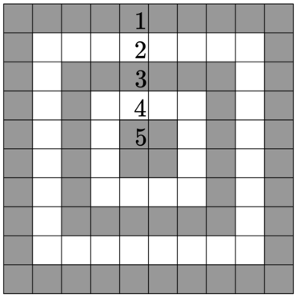

<h1 style='text-align: center;'> C. Target Practice</h1>

<h5 style='text-align: center;'>time limit per test: 1 second</h5>
<h5 style='text-align: center;'>memory limit per test: 256 megabytes</h5>

A $10 \times 10$ target is made out of five "rings" as shown. Each ring has a different point value: the outermost ring — 1 point, the next ring — 2 points, ..., the center ring — 5 points.

  Vlad fired several arrows at the target. Help him determine how many points he got.

### Input

The input consists of multiple test cases. The first line of the input contains a single integer $t$ ($1 \leq t \leq 1000$) — the number of test cases.

Each test case consists of 10 lines, each containing 10 characters. Each character in the grid is either $\texttt{X}$ (representing an arrow) or $\texttt{.}$ (representing no arrow).

### Output

For each test case, output a single integer — the total number of points of the arrows.

## Example

### Input


```text
4X..........................X.......X..........X......................X..X..........................X................................................................................................................................................X.......................................................XXXXXXXXXXXXXXXXXXXXXXXXXXXXXXXXXXXXXXXXXXXXXXXXXXXXXXXXXXXXXXXXXXXXXXXXXXXXXXXXXXXXXXXXXXXXXXXXXXXX
```
### Output

```text

17
0
5
220

```
## Note

In the first test case, there are three arrows on the outer ring worth 1 point each, two arrows on the ring worth 3 points each, and two arrows on the ring worth 4 points each. The total score is $3 \times 1 + 2 \times 3 + 2 \times 4 = 17$. 

In the second test case, there aren't any arrows, so the score is $0$.


#### Tags 

#800 #NOT OK #implementation #math 

## Blogs
- [All Contest Problems](../Codeforces_Round_898_(Div._4).md)
- [Announcement (en)](../blogs/Announcement_(en).md)
- [Tutorial (en)](../blogs/Tutorial_(en).md)
