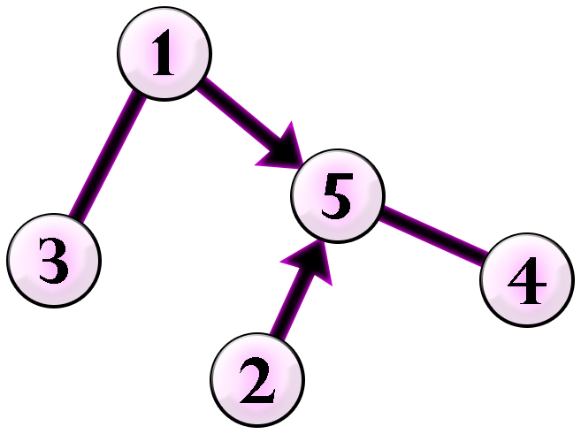
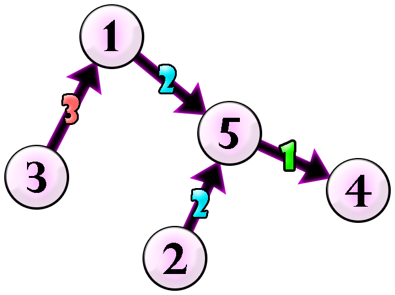

<h1 style='text-align: center;'> E. Ball-Stackable</h1>

<h5 style='text-align: center;'>time limit per test: 2 seconds</h5>
<h5 style='text-align: center;'>memory limit per test: 512 megabytes</h5>

With a problem title like that, there is no way this is going to be a graph problem.

Chaneka has a graph with $n$ vertices and $n-1$ edges. Some of the edges are directed and some of the edges are undirected. Edge $i$ connects vertex $u_i$ to vertex $v_i$. If $t_i=0$, edge $i$ is undirected. If $t_i=1$, edge $i$ is directed in the direction from $u_i$ to $v_i$. It is known that if you make all edges undirected, the graph becomes a tree$^\dagger$.

Chaneka wants to direct all undirected edges and colour each edge (different edges can have the same colour).

After doing that, suppose Chaneka starts a walk from an arbitrary vertex $x$ to an arbitrary vertex $y$ (it is possible that $x=y$) going through one or more edges. She is allowed to go through each edge either following the direction or opposite to the direction of the edge. She is also allowed to visit a vertex or an edge more than once. During the walk, Chaneka maintains a stack of balls that is initially empty before the walk. Each time Chaneka goes through an edge, she does the following: 

* If Chaneka goes through it in the right direction, she puts a new ball with a colour that is the same as the edge's colour to the top of the stack.
* If Chaneka goes through it in the opposite direction, she removes the ball that is on the top of the stack.

A walk is stackable if and only if the stack is not empty before each time Chaneka goes through an edge in the opposite direction.

A walk is ball-stackable if and only if it is stackable and each time Chaneka goes through an edge in the opposite direction, the colour of the ball removed from the stack is the same as the colour of the edge traversed.

Is it possible to direct all undirected edges and colour each edge such that all stackable walks are also ball-stackable? If it is possible, find a construction example that uses the maximum number of different colours among all valid ways of directing and colouring. If there are multiple such solutions, output any of them.

$^\dagger$ A tree is a connected graph with no cycles.

### Input

The first line contains a single integer $n$ ($2\leq n\leq10^5$) — the number of vertices in the graph.

The $i$-th of the next $n-1$ lines contains three integers $u_i$, $v_i$, and $t_i$ ($1 \leq u_i,v_i \leq n$; $0\leq t_i\leq1$) — an undirected edge connecting vectices $u_i$ and $v_i$ if $t_i=0$, or a directed edge from vertex $u_i$ to vertex $v_i$ if $t_i=1$. If you make all edges undirected, the graph becomes a tree.

### Output

A single line containing $-1$ if it is impossible.

Otherwise, the output consists of $n$ lines describing your construction. The first line contains an integer $z$ representing the number of different colours used. The $i$-th of the next $n-1$ lines contains three integers $p$, $q$, and $c$ ($1\leq p,q\leq n$; $1\leq c\leq z$) — the edge connecting vertices $p$ and $q$ in the graph is directed from vertex $p$ to vertex $q$ and is coloured with colour $c$. If there are multiple such solutions, output any of them.

## Note

 that since there should be $z$ different colours in your construction, that means each colour from $1$ to $z$ must appear at least once in the graph.

## Example

### Input


```text
5
2 5 1
1 3 0
5 4 0
1 5 1
```
### Output


```text
3
1 5 2
5 4 1
2 5 2
3 1 3
```
## Note

The following is the given graph.

 

Chaneka can direct all undirected edges and colour each edge as follows.

 

As an example, consider a stackable walk $3→1→5→2→5→4→5$. Let's show that that walk is ball-stackable. 

1. Chaneka starts in vertex $3$. The stack is $[]$.
2. Chaneka moves to vertex $1$. She puts a ball of colour $3$. The stack is $[3]$.
3. Chaneka moves to vertex $5$. She puts a ball of colour $2$. The stack is $[3,2]$.
4. Chaneka moves to vertex $2$. She removes a ball of colour $2$ (same colour as the edge). The stack is $[3]$.
5. Chaneka moves to vertex $5$. She puts a ball of colour $2$. The stack is $[3,2]$.
6. Chaneka moves to vertex $4$. She puts a ball of colour $1$. The stack is $[3,2,1]$.
7. Chaneka moves to vertex $5$. She removes a ball of colour $1$ (same colour as the edge). The stack is $[3,2]$.

Since every time Chaneka removes a ball from the stack, it has the same colour as the edge traversed, then the walk above is ball-stackable. It can be shown that if we direct and colour the edges as shown above, any possible stackable walk is also ball-stackable.


#### Tags 

#3300 #NOT OK #constructive_algorithms #data_structures #dp #trees 

## Blogs
- [All Contest Problems](../Codeforces_Round_902_(Div._1,_based_on_COMPFEST_15_-_Final_Round).md)
- [Announcement (en)](../blogs/Announcement_(en).md)
- [Tutorial (en)](../blogs/Tutorial_(en).md)
