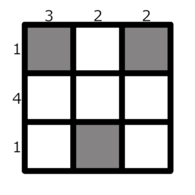

<h1 style='text-align: center;'> B. Chips on the Board</h1>

<h5 style='text-align: center;'>time limit per test: 2 seconds</h5>
<h5 style='text-align: center;'>memory limit per test: 256 megabytes</h5>

You are given a board of size $n \times n$ ($n$ rows and $n$ colums) and two arrays of positive integers $a$ and $b$ of size $n$.

Your task is to place the chips on this board so that the following condition is satisfied for every cell $(i, j)$:

* there exists at least one chip in the same column or in the same row as the cell $(i, j)$. I. e. there exists a cell $(x, y)$ such that there is a chip in that cell, and either $x = i$ or $y = j$ (or both).

The cost of putting a chip in the cell $(i, j)$ is equal to $a_i + b_j$. 

For example, for $n=3$, $a=[1, 4, 1]$ and $b=[3, 2, 2]$. One of the possible chip placements is as follows:

  White squares are empty The total cost of that placement is $(1+3) + (1+2) + (1+2) = 10$.

Calculate the minimum possible total cost of putting chips according to the rules above.

### Input

The first line contains a single integer $t$ ($1 \le t \le 10^4$) — the number of test cases.

The first line of each test case contains a single integer $n$ ($1 \le n \le 3 \cdot 10^5$).

The second line contains $n$ integers $a_1, a_2, \dots, a_n$ ($1 \le a_i \le 10^9$).

The third line contains $n$ integers $b_1, b_2, \dots, b_n$ ($1 \le b_i \le 10^9$).

The sum of $n$ over all test cases doesn't exceed $3 \cdot 10^5$.

### Output

For each test case, print a single integer — the minimum possible total cost of putting chips according to the rules.

## Example

### Input


```text
431 4 13 2 214524 52 355 2 4 5 33 4 2 1 5
```
### Output

```text

10
9
13
24

```
## Note

The first test case of the example is described in the statement.


#### Tags 

#900 #OK #constructive_algorithms #greedy 

## Blogs
- [All Contest Problems](../Educational_Codeforces_Round_155_(Rated_for_Div._2).md)
- [Announcement](../blogs/Announcement.md)
- [Tutorial](../blogs/Tutorial.md)
