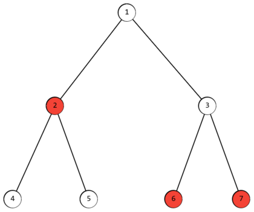

<h1 style='text-align: center;'> F. Minimum Maximum Distance</h1>

<h5 style='text-align: center;'>time limit per test: 2 seconds</h5>
<h5 style='text-align: center;'>memory limit per test: 256 megabytes</h5>

You have a tree with $n$ vertices, some of which are marked. A tree is a connected undirected graph without cycles.

Let $f_i$ denote the maximum distance from vertex $i$ to any of the marked vertices.

Your task is to find the minimum value of $f_i$ among all vertices.

  For example, in the tree shown in the example, vertices $2$, $6$, and $7$ are marked. Then the array $f(i) = [2, 3, 2, 4, 4, 3, 3]$. The minimum $f_i$ is for vertices $1$ and $3$.

#### Input

The first line contains an integer $t$ ($1 \le t \le 10^4$) — the number of test cases.

The first line of each test case contains two integers $n$ and $k$ ($1 \le k \le n \le 2 \cdot 10^5$) — the number of vertices in the tree and the number of marked vertices, respectively.

The second line of each test case contains $k$ integers $a_i$ ($1 \le a_i \le n, a_{i-1} < a_i$) — the indices of the marked vertices.

The next $n - 1$ lines contain two integers $u_i$ and $v_i$ — the indices of vertices connected by the $i$-th edge.

It is guaranteed that the sum of $n$ over all test cases does not exceed $2 \cdot 10^5$.

#### Output

For each test case, output a single integer — the minimum value of $f_i$ among all vertices.

## Examples

#### Input


```text
67 32 6 71 21 32 42 53 63 74 41 2 3 41 22 33 45 111 21 31 41 55 24 51 22 31 44 510 81 2 3 4 5 8 9 102 1010 55 33 11 77 44 98 96 110 91 2 4 5 6 7 8 9 101 33 99 44 1010 66 77 22 55 8
```
#### Output

```text

2
2
0
1
4
5

```
#### Input


```text
36 131 21 33 43 52 65 31 2 51 21 32 43 57 123 22 66 15 67 64 5
```
#### Output

```text

0
2
0

```


#### Tags 

#1700 #NOT OK #dfs_and_similar #dp #graphs #shortest_paths #trees 

## Blogs
- [All Contest Problems](../Codeforces_Round_903_(Div._3).md)
- [Announcement](../blogs/Announcement.md)
- [Tutorial](../blogs/Tutorial.md)
