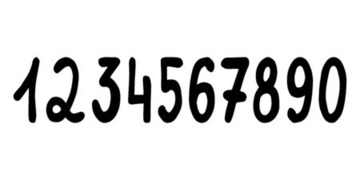

<h1 style='text-align: center;'> A. Morning</h1>

<h5 style='text-align: center;'>time limit per test: 2 seconds</h5>
<h5 style='text-align: center;'>memory limit per test: 256 megabytes</h5>

You are given a four-digit pin code consisting of digits from $0$ to $9$ that needs to be entered. Initially, the cursor points to the digit $1$. In one second, you can perform exactly one of the following two actions:

* Press the cursor to display the current digit,
* Move the cursor to any adjacent digit.

  The image above shows the device you are using to enter the pin code. For example, for the digit $5$, the adjacent digits are $4$ and $6$, and for the digit $0$, there is only one adjacent digit, $9$.

Determine the minimum number of seconds required to enter the given four-digit pin code.

### Input

Each test consists of multiple test cases. The first line contains a single integer $t$ ($1 \leq t \leq 10^4$) - the number of the test cases. This is followed by their description.

The single line of each test case describes the pin code as a string of length $4$, consisting of digits from $0$ to $9$.

### Output

For each test case, output the minimum number of seconds required to enter the given pin code.

## Example

### Input


```text
101111123610101920927300007492854302948361
```
### Output

```text

4
9
31
27
28
13
25
16
33
24

```
## Note

In the first test case, the cursor needs to be pressed $4$ times.

In the second test case, it can be done in $9$ seconds as follows:

* Press the cursor.
* Move the cursor to the digit $2$.
* Press the cursor.
* Move the cursor to the digit $3$.
* Press the cursor.
* Move the cursor to the digit $4$.
* Move the cursor to the digit $5$.
* Move the cursor to the digit $6$.
* Press the cursor.


#### Tags 

#800 #NOT OK #math 

## Blogs
- [All Contest Problems](../Codeforces_Round_905_(Div._3).md)
- [Announcement](../blogs/Announcement.md)
- [Tutorial](../blogs/Tutorial.md)
