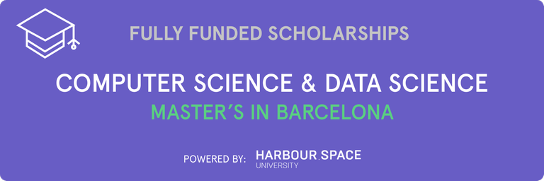

# Announcement

Hello Codeforces!

On [Monday, October 9, 2023 at 20:35UTC+6](https://codeforces.com/https://www.timeanddate.com/worldclock/fixedtime.html?day=9&month=10&year=2023&hour=17&min=35&sec=0&p1=166) [Educational Codeforces Round 156 (Rated for Div. 2)](https://codeforces.com/contest/1886 "Educational Codeforces Round 156 (Rated for Div. 2)") will start.

Series of Educational Rounds continue being held as [Harbour.Space University](https://codeforces.com/https://harbour.space/) initiative! You can read the details about the cooperation between [Harbour.Space University](https://codeforces.com/https://harbour.space/) and Codeforces in the [blog post](https://mirror.codeforces.com/blog/entry/51208).

This round will be **rated for the participants with rating lower than 2100**. It will be held on extended ICPC rules. The penalty for each incorrect submission until the submission with a full solution is 10 minutes. After the end of the contest, you will have 12 hours to hack any solution you want. You will have access to copy any solution and test it locally.

You will be given **6 or 7 problems** and **2 hours** to solve them.

The problems were invented and prepared by Adilbek [adedalic](https://codeforces.com/profile/adedalic "International Master adedalic") Dalabaev, Ivan [BledDest](https://codeforces.com/profile/BledDest "International Grandmaster BledDest") Androsov, Maksim [Neon](https://codeforces.com/profile/Neon "Candidate Master Neon") Mescheryakov, Roman [Roms](https://codeforces.com/profile/Roms "Master Roms") Glazov, Alex [fcspartakm](https://codeforces.com/profile/fcspartakm "Candidate Master fcspartakm") Frolov and me. Also, huge thanks to Mike [MikeMirzayanov](https://codeforces.com/profile/MikeMirzayanov "Headquarters, MikeMirzayanov") Mirzayanov for great systems Polygon and Codeforces.

**Please note that the problems of this round partially intersect with the problems of the Qualification stage of the Southern and Volga Russian Regional Contest. If you took part in the qualification, please refrain from participating in the round.**

Good luck to all the participants!

Our friends at Harbour.Space also have a message for you:

  **FULLY FUNDED SCHOLARSHIPS for Masters in Data Science and Computer Science** *Scholarships for Master's students in [Computer Science](https://codeforces.com/https://harbour.space/computer-science) and [Data Science](https://codeforces.com/https://harbour.space/data-science) are available in [Harbour.Space University](https://codeforces.com/https://harbour.space) Barcelona campus!* 

**Scholarship Summary:**

 * *Fully funded scholarship (29.900 €/year) to study a Master’s degree in Data Science or Computer Science for two years*
* *Successful applicants will become part of the University’s “Talent pool” and will be shown to the sponsoring companies. In case the candidate is picked for the Work&Study Program from our industry partner, the student starts an internship with a commitment to study 3 hours/day and work for 4 hour/day*

*Please note preselected candidates will be requested to pay a non-refundable application fee of 85€ to study at Harbour.Space University.*

***Candidate’s commitment:***

*You will complete 15 modules (each three weeks long) in one year. The daily class workload is 3 hours, plus homework to complete in your own time.*

***Candidate’s requirements:*** 

 * *Bachelor's degree in the field of Mathematics, Statistics, Data Science, Computer Science or similar*
* *English proficiency*
* *Advanced knowledge and experience in Python, SQL, Spark/Scala, and bash*
* *Experienced use of Big Data technologies: Spark, HDFS, Kafka, etc.*
* *Hands-on experience with Data Science techniques: feature engineering,*
* *Strong ML knowledge*
* *Strong Software Engineering Background*
* *Problem-solving aptitude*

Note: These scholarships are only available for qualified applicants with a bachelor’s degree.

  [Apply here →](https://scholarship.harbour.space/codeforces-talentpool?utm_source=codeforces&utm_medium=partner&utm_campaign=bcn_b2b) **UPD:** [Editorial is out](Tutorial.md)

