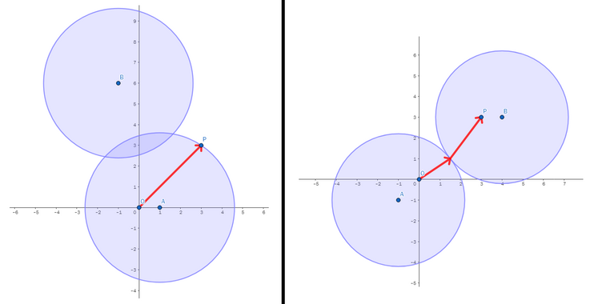

<h1 style='text-align: center;'> B. Fear of the Dark</h1>

<h5 style='text-align: center;'>time limit per test: 2 seconds</h5>
<h5 style='text-align: center;'>memory limit per test: 256 megabytes</h5>

Monocarp tries to get home from work. He is currently at the point $O = (0, 0)$ of a two-dimensional plane; his house is at the point $P = (P_x, P_y)$.

Unfortunately, it is late in the evening, so it is very dark. Monocarp is afraid of the darkness. He would like to go home along a path illuminated by something.

Thankfully, there are two lanterns, located in the points $A = (A_x, A_y)$ and $B = (B_x, B_y)$. You can choose any non-negative number $w$ and set the power of both lanterns to $w$. If a lantern's power is set to $w$, it illuminates a circle of radius $w$ centered at the lantern location (including the borders of the circle).

You have to choose the minimum non-negative value $w$ for the power of the lanterns in such a way that there is a path from the point $O$ to the point $P$ which is completely illuminated. You may assume that the lanterns don't interfere with Monocarp's movement.

  The picture for the first two test cases 
### Input

The first line of the input contains one integer $t$ ($1 \le t \le 10^4$) — the number of test cases.

Each test case consists of three lines:

* the first line contains two integers $P_x$ and $P_y$ ($-10^3 \le P_x, P_y \le 10^3$) — the location of Monocarp's house;
* the second line contains two integers $A_x$ and $A_y$ ($-10^3 \le A_x, A_y \le 10^3$) — the location of the first lantern;
* the third line contains two integers $B_x$ and $B_y$ ($-10^3 \le B_x, B_y \le 10^3$) — the location of the second lantern.

Additional constraint on the input:

* in each test case, the points $O$, $P$, $A$ and $B$ are different from each other.
### Output

For each test case, print the answer on a separate line — one real number equal to the minimum value of $w$ such that there is a completely illuminated path from the point $O$ to the point $P$.

Your answer will be considered correct if its absolute or relative error does not exceed $10^{-6}$ — formally, if your answer is $a$, and the jury's answer is $b$, your answer will be accepted if $\dfrac{|a - b|}{\max(1, b)} \le 10^{-6}$.

## Example

### Input


```text
23 31 0-1 63 3-1 -14 3
```
### Output

```text

3.6055512755
3.2015621187

```


#### Tags 

#1200 #NOT OK #binary_search #geometry #math 

## Blogs
- [All Contest Problems](../Educational_Codeforces_Round_156_(Rated_for_Div._2).md)
- [Announcement](../blogs/Announcement.md)
- [Tutorial](../blogs/Tutorial.md)
