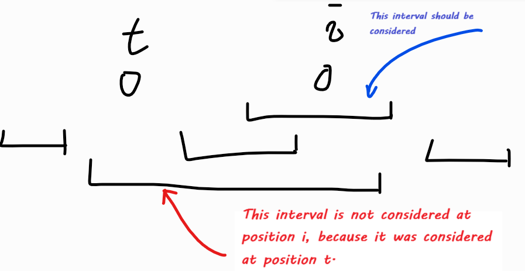

# Tutorial_(en)

[1890A - Doremy's Paint 3](../problems/A._Doremy's_Paint_3.md "Codeforces Round 906 (Div. 2)")

idea: [Cocoly1990](https://codeforces.com/profile/Cocoly1990 "Grandmaster Cocoly1990")

 **Solution**
### [1890A - Doremy's Paint 3](../problems/A._Doremy's_Paint_3.md "Codeforces Round 906 (Div. 2)")

Statement says b1+b2=b2+b3=…=bn−1+bn=k. Let's write it as bi+bi+1=bi+1+bi+2. This is just bi=bi+2, which means the positions with the same parity should contain same value.

b1=b3=b5=⋯b2=b4=b6=⋯

We know that there are ⌈n2⌉ odd numbers and ⌊n2⌋ even numbers in [1,n]. Therefore, if and only if we can find ⌊n2⌋ same numbers, and the remaining are also the same numbers, the answer is YES. All cases can be classified into these categories:

1. All numbers are the same, like [3,3,3,3,3,3]. The answer is YES.
2. There are two different numbers, like [1,2,1,2,1]. The answer is YES if and only if one of the number appears exactly ⌊n2⌋ times. For example [1,2,1,2,1] and [2,3,2,3] are YES while [1,1,1,2] and [3,3,3,3,4,4] is NO.
3. There are three or more different numbers, like [1,2,3,2,3]. The answer is NO.

Time complexity O(n).

 **Code**By [Cocoly1990](https://codeforces.com/profile/Cocoly1990 "Grandmaster Cocoly1990")

 
```cpp
// Time complexity O(nlogn) because of map
#include <bits/stdc++.h>

const int MX = 100 + 5;

int main() {
  int t;
  std::cin >> t;
  while (t--) {
    int n;
    std::cin >> n;
    std::map<int ,int> occ;
    for (int i = 1; i <= n; ++i) {
      int x;
      std::cin >> x;
      occ[x]++;
    }
    if (occ.size() >= 3) puts("No");
    else {
      if (std::abs(occ.begin()->second - occ.rbegin()->second) <= 1) {
        puts("Yes");
      } else {
        puts("No");
      }
    }
  }
  return 0;
}
```
[1890B - Qingshan Loves Strings](../problems/B._Qingshan_Loves_Strings.md "Codeforces Round 906 (Div. 2)")

idea: [Imakf](https://codeforces.com/profile/Imakf "Grandmaster Imakf")

 **Solution**
### [1890B - Qingshan Loves Strings](../problems/B._Qingshan_Loves_Strings.md "Codeforces Round 906 (Div. 2)")

There are three circumstances where the answer is "Yes".

1. s is good initially.
2. t is good, t= "10...01", and there is no substring 11 in s.
3. t is good, t= "01...10", and there is no substring 00 in s.
 **Code**By [Imakf](https://codeforces.com/profile/Imakf "Grandmaster Imakf")

 
```cpp
#include <bits/stdc++.h>

bool ok(std::string s) {
  for (size_t i = 1; i < s.length(); ++i)
    if (s[i] == s[i - 1])
      return false;
  return true;
}

void solve() {
  std::string s, t;
  int l1, l2;
  std::cin >> l1 >> l2;
  std::cin >> s >> t;
  if (ok(s)) {
    std::cout << "Yes" << std::endl;
    return;
  }

  if (!ok(t) || *t.begin() != *t.rbegin()) {
    std::cout << "No" << std::endl;
    return;
  }

  int zz = 0, oo = 0;
  for (size_t i = 1; i < s.length(); ++i) {
    if (s[i] == s[i - 1]) {
      if (s[i] == '0') zz = true;
      if (s[i] == '1') oo = true;
    }
  }

  if (zz && t[0] == '0') {
    std::cout << "No" << std::endl;
    return;
  }
  if (oo && t[0] == '1') {
    std::cout << "No" << std::endl;
    return;
  }  

  std::cout << "Yes" << std::endl;
  return;
}

int main() {
  int t;
  std::cin >> t;
  while (t--) solve();
  return 0;
}
```
[1889A - Qingshan Loves Strings 2](https://codeforces.com/contest/1889/problem/A "Codeforces Round 906 (Div. 1)")

idea: [Imakf](https://codeforces.com/profile/Imakf "Grandmaster Imakf")

 **Solution**
### [1889A - Qingshan Loves Strings 2](https://codeforces.com/contest/1889/problem/A "Codeforces Round 906 (Div. 1)")

First, there is no solution when the number of 0's and 1's are different.

Otherwise, the construction follows:

If the s1≠sn now, we can ignore s1 and sn, and consider s2..n−1 as a new s. If s is empty, the algorithm ends.

Now s1=sn. If they are 1, insert 01 to the front; otherwise, insert 01 to the end. Look at this example:

1. "110010"
2. "1001"
3. "011001"
4. "1100"
5. "10"
6. ""

This operation is actually equivalent to moving the last 1 to the front or moving the first 0 to the end. For example, in step 2 to 4 above, we succeed moving the last 1 to the front. So in the worst case, every character in the string are moved, and we need n moves.

Actually, we don't need n moves but n/2 moves. Because for the 0 and 1 deleted in the same operation, at most one of them need to be moved.

Time complexity O(n).

 **Code**By [Imakf](https://codeforces.com/profile/Imakf "Grandmaster Imakf")

 
```cpp
#include <bits/stdc++.h>

bool ok(std::string s) {
  for (size_t i = 1; i < s.length(); ++i)
    if (s[i] == s[i - 1])
      return false;
  return true;
}


std::string s;
void solve() {
  int n; std::cin >> n;
  std::cin >> s;
  int cnt0 = 0, cnt1 = 0;
  for (int i = 0; i < s.length(); ++i) {
    cnt0 += s[i] == '0';
    cnt1 += s[i] == '1';
  }
  if (cnt0 != cnt1) {
    std::cout << -1 << std::endl;
    return;
  }
  std::vector<int> z;
  std::deque<char> q;
  for (int i = 0; i < s.length(); ++i)
    q.push_back(s[i]);
  
  int d = 0;
  while (!q.empty()) {
    if (q.front() == q.back()) {
      if (q.front() == '0') {
        q.push_back('0');
        q.push_back('1');
        z.push_back(n - d);
      } else {
        q.push_front('1');
        q.push_front('0');
        z.push_back(0 + d);
      }
      n += 2;
    }
    while (!q.empty() && q.front() != q.back()) {
      q.pop_back();
      q.pop_front();
      ++d;
    }
  }

  std::cout << z.size() << std::endl;
  for (int i = 0; i < z.size(); ++i) {
    std::cout << z[i];
    if (i + 1 == z.size()) std::cout << std::endl;
    else std::cout << " ";
  }
}

int main() {
  int t;
  std::cin >> t;
  while (t--) solve();
  return 0;
}
```
[1889B - Doremy's Connecting Plan](https://codeforces.com/contest/1889/problem/B "Codeforces Round 906 (Div. 1)")

idea: [Cocoly1990](https://codeforces.com/profile/Cocoly1990 "Grandmaster Cocoly1990")

 **Solution**
### [1889B - Doremy's Connecting Plan](https://codeforces.com/contest/1889/problem/B "Codeforces Round 906 (Div. 1)")

First, we can just solve c=1. Because letting a′i=aic reduces c≠1 to c=1.

For convenience, let si=∑aj, where j is currently connected with i.

Let's see if you can add an edge between i and j (i≠1,j≠1) right now, it means

si+sj≥i⋅j≥i+j

This actually implies at least one of si≥i and sj≥j holds (otherwise si+sj<i+j). WLOG, let si≥i be true. Therefore si+s1≥1⋅i, which means you can add an edge between 1 and i.

Moreover, adding a new edge does not cause other edges that can be added to become unable to be added. So it's always good to add the edge between 1 and i. Now we only need to decide the order.

Consider this inequality si+s1≥1⋅i. You can see that larger si−i is, faster node i is able to be linked with 1. So we can sort i by ai−i in descending order, and that is the order we need.

Time complexity O(nlogn).

Bonus: Time complexity can be O(n) based on this observation: If you link (1,i), then any j<i can be linked to 1.

 **Code**By [Cocoly1990](https://codeforces.com/profile/Cocoly1990 "Grandmaster Cocoly1990")

 
```cpp
#include<bits/stdc++.h>
using i64 = long long;
using namespace std;
const int N = 5e5 + 7;
int T, n, C, p[N]; i64 a[N];
void solve () {
	cin >> n >> C;
	for (int i = 1; i <= n; i ++) cin >> a[i];
	iota (p + 1, p + n + 1, 1);
	sort (p + 1, p + n + 1, [&] (const int &u, const int &v) {
		return 1ll * u * C - a[u] < 1ll * v * C - a[v];
	});
	i64 now = a[1];
	for (int i = 1, u; i <= n; i ++) {
		u = p[i];
		if (u == 1) continue;
		if (1ll * u * C > now + a[u]) return cout << "Non", void ();
		now += a[u];
	}
	return cout << "Yesn", void ();
}
int main () {
	ios :: sync_with_stdio (false); cin.tie (0); cout.tie (0);
	cin >> T; while (T --) solve ();
}
```
[1889C2 - Doremy's Drying Plan (Hard Version)](https://codeforces.com/contest/1889/problem/C2 "Codeforces Round 906 (Div. 1)")

idea: [waaitg](https://codeforces.com/profile/waaitg "International Grandmaster waaitg"), [Imakf](https://codeforces.com/profile/Imakf "Grandmaster Imakf")

 **Easy Solution**
### [1889C1 - Doremy's Drying Plan (Easy Version)](https://codeforces.com/contest/1889/problem/C1 "Codeforces Round 906 (Div. 1)")

We consider a brute force solution first.

At the beginning, we calculate number of intervals that cover position i for each i=1,2,…,n by prefix sum. Now we can know the number uncovered positions. Let it be A. Then we need to calculate the number of new uncovered position after removing two intervals. Let it be B. So the answer in the end is A+maxB.

For calculating B, let's enumerate two intervals I1,I2.

* If they have no intersection, B is equal to the number of positions that are covered exactly once in interval I1 and I2;
* If they have intersection. Let the intersection be J (It is an interval). B is equal to the number of positions that are covered exactly once in interval I1 and I2 plus the number of positions that are covered exactly twice in interval J;

The algorithm can be done in O(n+m2) time by prefix sum. For optimization, we should notice that:

In the "no intersection" case, we can just simply pick two best intervals.

In the "intersection" case, there are at most n useful interval pairs. The proof and algorithm goes: for each position i, if it is covered by exactly 2 intervals, then this interval pair is useful and may update the answer.

Great, but for code implementation, how do we find those interval pairs? For each interval [l,r], we consider it as two events (like difference and prefix sum): it appears at position l, and disappears at position r+1. That way, set or just array is able to handle. 

Time complexity O(n+m).

 **Hard Solution**
### [1889C2 - Doremy's Drying Plan (Hard Version)](https://codeforces.com/contest/1889/problem/C2 "Codeforces Round 906 (Div. 1)")

k is bigger in this version. However, it is still small, which leads us to a DP approach. 

Let dpi,j be the number of uncovered positions in [1,i], and the last uncovered position is i, and the number of deleted intervals is j.

For transition, we need to get all the intervals that covers position i. We've mentioned this in the editorial of the easy version. 

Let's iterate the last uncovered position t, and calculate the number of intervals that need to be deleted in this transition. Let it be dt and it is the number of interval [l,r] such that t<l≤i≤r. Check this for example:



And the transition goes:

dpi,j←1+i−1maxt=0dpt,j−dt

The time complexity is O(n2k) now. We need to speed the transition up.

Note that dt is increasing while t is decreasing, and dt is at most k. It actually splits the transition interval [0,i−1] into at most k+1 intervals [s0,s1],[s1+1,s2],⋯,[sl−1+1,sl] such that 0=s0≤s1<s2<⋯<sl=i−1 and for t in the same interval, dt is the same.

So the sparse table can be used for transition.

Time complexity O(nk2). Memory complexity O(knlogn).

 **Code**By [Imakf](https://codeforces.com/profile/Imakf "Grandmaster Imakf")

 
```cpp
#include <bits/stdc++.h>

#define debug(...) fprintf(stderr, __VA_ARGS__)
#define LL long long

const int MX = 2e5 + 23;
const int INF = 1e9;

void chkmax(int &x, int y) {
  x = std::max(x, y);
}

struct Interval {
  int l, r;
} I[MX];

bool cmp(int x, int y) {
  return I[x].l > I[y].l;
}

std::vector<int> add[MX], del[MX];
int n, m, k, ban[MX];

int st[21][MX][18], lg[MX];

int query(int d, int l, int r) {
  int len = lg[r - l + 1];
  return std::max(st[d][l][len], st[d][r - (1 << len) + 1][len]);
}

void change(int d, int p, int val) {
  chkmax(st[d][p][0], val);
  for (int i = 1; p - (1 << i) + 1 >= 0; ++i) {
    st[d][p - (1 << i) + 1][i] = std::max(
          st[d][p - (1 << i) + 1][i - 1],
          st[d][p - (1 << (i - 1)) + 1][i - 1]);
  }
}

void init() {
  lg[0] = -1;
  for (int i = 1; i <= n + 1; ++i)
    lg[i] = lg[i - 1] + ((i & -i) == i); 
  for (int i = 1; i <= m; ++i) ban[i] = false;
  for (int i = 1; i <= n + 1; ++i) {
    add[i].clear();
    del[i].clear();
  }
  for (int i = 0; i <= k; ++i)
    for (int j = 0; j <= n; ++j)
      for (int _k = 0; _k < 18; ++_k)
        st[i][j][_k] = -INF;
}

void solve() {
  scanf("%d%d%d", &n, &m, &k);
  init();
  for (int i = 1; i <= m; ++i) {
    int l, r;
    scanf("%d%d", &l, &r);
    I[i] = (Interval){l, r};
    add[l].push_back(i);
    del[r + 1].push_back(i);
  }
  
  std::vector<int> cur, tmp;

  change(0, 0, 0);
  
  int uncover = 0, ans = 0;
  int cnti = 0;
  for (int i = 1; i <= n; ++i) {
    for (auto j : add[i]) {
      cur.push_back(j);
      ++cnti;
    }

    for (auto j : del[i]) {
      ban[j] = true;
      --cnti;
    }

    if (cnti > k) {
      for (int j = 0; j <= k; ++j)
        change(j, i, -INF);
      continue;
    }

    tmp.clear();
    for (auto j : cur) {
      if (!ban[j]) {
        tmp.push_back(j);
      }
    }
    cur = tmp;
    std::sort(cur.begin(), cur.end(), cmp);
    
    if (cur.empty()) {
      for (int j = 0; j <= k; ++j)
        change(j, i, -INF);
      ++uncover;
      continue;
    }
    
    if (I[cur[0]].l <= i - 1)
      for (int g = 0; g <= k; ++g) {
        int z = query(g, I[cur[0]].l, i - 1);
        chkmax(ans, z + 1);
        change(g, i, z + 1);
      }
    else {
      for (int g = 0; g <= k; ++g) {
        change(g, i, -INF);
      }
    }
    int cp = I[cur[0]].l - 1;
    

    for (int j = 0; j < cur.size(); ++j) {
      if (j + 1 != cur.size() && I[cur[j]].l == I[cur[j + 1]].l)
        continue;
      int np = (j + 1 == cur.size() ? 0 : I[cur[j + 1]].l);
      for (int g = j + 1; g <= k; ++g) {
        int z = query(g - (j + 1), np, cp);
        chkmax(ans, z + 1);
        change(g, i, z + 1);
        // change(root[g], i, z + 1);
      }
      cp = np - 1;
    }
  }
  printf("%dn", ans + uncover);
}

int main() {
  int t; scanf("%d", &t);

  while (t--) solve();
  return 0;
}
```
[1889D - Game of Stacks](https://codeforces.com/contest/1889/problem/D "Codeforces Round 906 (Div. 1)")

idea: [waaitg](https://codeforces.com/profile/waaitg "International Grandmaster waaitg")

 **Solution**
### [1889D - Game of Stacks](https://codeforces.com/contest/1889/problem/D "Codeforces Round 906 (Div. 1)")

Let's first consider an easy version of the problem: what if there is only one element in each stack?

Let pi be the element in stack i. If we link i→pi, these edges will form several directed pseudo trees. For each pseudo tree, there is a cycle. It's not hard to find that those cycles actually can be ignored, because if we go on the cycle, we will come back to the first node on the cycle and the cycle will be eliminated. After deleting (the edges) on the cycle, there are only trees left. Thus the root of each tree is the answer of nodes on the tree.

When it comes back to the original problem, similarly, let pi be the top element of stack i. The rest are the same — cycles can be eliminated. In this case, we should run cycle elimination process many times until there is no cycle in the graph.

Time complexity O(n+∑k).

 **Code**By [waaitg](https://codeforces.com/profile/waaitg "International Grandmaster waaitg")

 
```cpp
#include<stack>
#include<cstdio>
#include<cstring>
#include<iostream>
#include<algorithm>
using namespace std;
const int maxn=100005;
stack<int>s[maxn];
int re[maxn],st[maxn],vis[maxn],tp;
int dfs(int u){
    if(re[u])
        return re[u];
    if(s[u].empty())
        return u;
    if(vis[u]){
        st[tp+1]=0;
        while(st[tp+1]!=u){
            s[st[tp]].pop();
            vis[st[tp]]=0;
            --tp;
        }
        return dfs(u);
    }
    st[vis[u]=++tp]=u;
    return dfs(s[u].top());
}
int main(){
    int n;scanf("%d",&n);
    for(int i=1;i<=n;++i){
        int k;scanf("%d",&k);
        while(k--){
            int c;scanf("%d",&c);
            s[i].push(c);
        }
    }
    for(int i=1;i<=n;++i){
        tp=0;int ok=dfs(i);
        for(int j=1;j<=tp;++j)
            re[st[j]]=ok;
        printf("%d%c",ok," n"[i==n]);
    }
    return 0;
}
```
[1889E - Doremy's Swapping Trees](https://codeforces.com/contest/1889/problem/E "Codeforces Round 906 (Div. 1)")

idea: [waaitg](https://codeforces.com/profile/waaitg "International Grandmaster waaitg")

 **Solution**
### [1889E - Doremy's Swapping Trees](https://codeforces.com/contest/1889/problem/E "Codeforces Round 906 (Div. 1)")

We can construct a new directed graph, where we can consider each edge in T1 and T2 as a node. Let the node representing the edge (u,v) in tree Ti be N(u,v,Ti).

For each node N(u,v,T1), let the simple path between u and v in T2 be (u1,v1),…,(um,vm), and for all 1≤i≤m we add an edge from N(T1,u,v) to N(T2,ui,vi) in the new graph. And for each node N(u,v,T2), let the simple path between u and v in T1 be (u1,v1),…,(um,vm), and for all 1≤i≤m we add an edge from N(T2,u,v) to N(T1,ui,vi) in the new graph.

Then we calculate the number of strongly connected components with the size bigger than 2 in the new graph. If it is t, the answer is 2t.

To reduce the time complexity to O(nlogn), we need to build the new graph with binary lifting or heavy-light decomposition or centroid decomposition or something like those. More specifically, we just build the data structure as normal, but replace the "modify" operation with "add edge" operation, which allows us to add edges from one node to a range of nodes with low time complexity.

Proof: it is obviously that the edge set we choose in each operation must be a closed subgraph in the new graph. And at the same time, it can be easily proved that every closed subgraph in the new graph is a valid edge set. The another thing we need to prove is that the set of valid closed subgraph won't change after an operation. We can easily prove this by the relationship between the number of edges and the number of nodes in a tree.

 **Code**By [waaitg](https://codeforces.com/profile/waaitg "International Grandmaster waaitg")

 
```cpp
#include<vector>
#include<cstdio>
#include<cstring>
#include<iostream>
#include<algorithm>
using namespace std;
const int maxn=100005;
struct Edge{
    int v,nt;
    Edge(int v=0,int nt=0):
        v(v),nt(nt){}
}eG[maxn*160];
int hdG[maxn*40],numG;
void qwqG(int u,int v){
    eG[++numG]=Edge(v,hdG[u]);hdG[u]=numG;
}
int tot;
struct AnTree{
    struct Edge{
        int v,nt;
        Edge(int v=0,int nt=0):
            v(v),nt(nt){}
    }e[maxn*2];
    int hd[maxn],num;
    void qwq(int u,int v){
        e[++num]=Edge(v,hd[u]),hd[u]=num;
    }
    int n;
    void init(int n){
        this->n=n;
        for(int i=1;i<n;++i){
            int u,v;
            scanf("%d%d",&u,&v);
            qwq(u,v);qwq(v,u);
        }
    }
    int pa[maxn][20],id[maxn][20],dp[maxn];
    void dfs(int u,int p){
        if(p==0)dp[u]=0;
        for(int i=1;(1<<i)<=dp[u];++i)
            pa[u][i]=pa[pa[u][i-1]][i-1];
        for(int i=hd[u];i;i=e[i].nt){
            int v=e[i].v;
            if(v==p)continue;
            dp[v]=dp[u]+1;
            pa[v][0]=u;
            id[v][0]=++tot;
            dfs(v,u);
        }
    }
    int getid(int u,int d){
        int&re=id[u][d];
        if(re)return re;
        re=++tot;
        qwqG(re,getid(u,d-1));
        qwqG(re,getid(pa[u][d-1],d-1));
        return re;
    }
    void link(int x,int u,int v){
        if(dp[u]<dp[v])swap(u,v);
        for(int t=dp[u]-dp[v],cn=0;t;t>>=1,++cn)
            if(t&1)qwqG(x,getid(u,cn)),u=pa[u][cn];
        if(u==v)return;
        int t=0;while(dp[u]>>t)++t;
        while(t--){
            if(pa[u][t]!=pa[v][t]){
                qwqG(x,getid(u,t));
                qwqG(x,getid(v,t));
                u=pa[u][t];v=pa[v][t];
            }
        }
        qwqG(x,getid(u,0));
        qwqG(x,getid(v,0));
    }
    void erase(void){
        for(int i=1;i<=n;++i){
            hd[i]=0,dp[i]=0;int j=0;
            while(pa[i][j])pa[i][j++]=0;
            j=0;while(id[i][j])id[i][j++]=0;
        }
        num=0;
    }
    int parent(int u){
        return pa[u][0];
    }
    int identity(int u){
        return id[u][0];
    }
}T1,T2;
int dfn[maxn*40],low[maxn*40],cnt;
int st[maxn*40],tp,in[maxn*40];
int scc[maxn*40],scn;
int vis[maxn*40];
void tarjan(int u){
    dfn[u]=low[u]=++cnt;
    in[st[++tp]=u]=true;
    for(int i=hdG[u];i;i=eG[i].nt){
        int v=eG[i].v;
        if(!dfn[v]){
            tarjan(v);
            low[u]=min(low[u],low[v]);
        }
        else if(in[v])
            low[u]=min(low[u],dfn[v]);
    }
    if(dfn[u]==low[u]){
        ++scn;
        st[tp+1]=0;
        while(st[tp+1]!=u){
            in[st[tp]]=false;
            scc[st[tp]]=scn;
            --tp;
        }
    }
}
const int mod=1e9+7;
int power(int a,int x){
    int re=1;
    while(x){
        if(x&1)re=1ll*re*a%mod;
        a=1ll*a*a%mod,x>>=1;
    }
    return re;
}
void solve(void){
    int n;scanf("%d",&n);
    T1.init(n);T2.init(n);
    T1.dfs(1,0);T2.dfs(1,0);
    int rec=tot;
    for(int i=2;i<=n;++i){
        T2.link(T1.identity(i),i,T1.parent(i));
        T1.link(T2.identity(i),i,T2.parent(i));
    }
    for(int i=1;i<=tot;++i)
        if(!dfn[i])tarjan(i);
    for(int i=1;i<=rec;++i)
        ++vis[scc[i]];
    int ANS=0;
    for(int i=1;i<=scn;++i){
        if(vis[i])++ANS;
        vis[i]=0;
    }
    for(int u=1;u<=rec;++u){
        if(eG[hdG[u]].nt==0){
            int v=eG[hdG[u]].v;
            if(u<v&&eG[hdG[v]].nt==0){
                if(eG[hdG[v]].v==u){
                    --ANS;
                }
            }
        }
    }
    ANS=power(2,ANS);
    printf("%dn",ANS);
    for(int i=1;i<=tot;++i){
        hdG[i]=0;
        dfn[i]=low[i]=scc[i]=0;
    }
    tot=cnt=scn=numG=0;
    T1.erase();T2.erase();
}
int main(){
    // freopen("test","r",stdin);
    // freopen("out","w",stdout);
    int T;scanf("%d",&T);
    while(T--)solve();
    return 0;
}
```
[1889F - Doremy's Average Tree](https://codeforces.com/contest/1889/problem/F "Codeforces Round 906 (Div. 1)")

idea: [waaitg](https://codeforces.com/profile/waaitg "International Grandmaster waaitg"), [Imakf](https://codeforces.com/profile/Imakf "Grandmaster Imakf")

 **Solution**
### [1889F - Doremy's Average Tree](https://codeforces.com/contest/1889/problem/F "Codeforces Round 906 (Div. 1)")

Let fi,j be the array with the smallest lexicographical order if you do at most j operations in the subtree of i (only consisting of the elements in the subtree of i). Let gi,j be the first position k where fi,j[k] is different from fi,j−1[k]. To get the answer, we just need to calculate gi,j which gives us enough information to compare the lexicographical order between two choice. At the same time we need to record the first number of fi,j (let the number be t) and its label, and the first number in fi,j such that it is different from t and its label, which gives us enough information to decide whether to do an operation on i. The time complexity is O(nk).

 **Code**By [waaitg](https://codeforces.com/profile/waaitg "International Grandmaster waaitg")

 
```cpp
#include<cstdio>
#include<cstring>
#include<iostream>
#include<algorithm>
#define ch() getchar()
#define pc(x) putchar(x)
using namespace std;
template<typename T>void read(T&x){
	static char c;static int f;
	for(f=1,c=ch();c<'0'||c>'9';c=ch())if(c=='-')f=-f;
	for(x=0;c>='0'&&c<='9';c=ch()){x=x*10+(c&15);}x*=f;
}
template<typename T>void write(T x){
	static char q[64];int cnt=0;
	if(x==0)return pc('0'),void();
	if(x<0)pc('-'),x=-x;
	while(x)q[cnt++]=x%10+'0',x/=10;
	while(cnt--)pc(q[cnt]);
}
long long gcd(long long a,long long b){
	if(b==0)return a;
	return gcd(b,a%b);
}
struct Frac{
	long long a;
	int b;// a/b
	Frac(long long a=0,int b=1):
		a(a),b(b){}
	bool operator < (const Frac o)const{
		return a*o.b<o.a*b;
	}
	bool operator > (const Frac o)const{
		return a*o.b>o.a*b;
	}
	bool operator == (const Frac o)const{
		return a*o.b==o.a*b;
	}
	void output(){
		printf("%lld/%d",a,b);
	}
};
const int inf=0x3f3f3f3f;
struct Val{
	int p1,p2;Frac v1,v2;
	Val(int p1=inf,int p2=inf,Frac v1=Frac(),Frac v2=Frac()):
		p1(p1),p2(p2),v1(v1),v2(v2){}
	void output(void){
		printf("%d : ",p1);v1.output();puts("");
		printf("%d : ",p2);v2.output();puts("n");
	}
};
Val Comb(Val A,Val B){
	if(A.p1>B.p1)swap(A,B);
	if(B.v1==A.v1)
		return Val(A.p1,A.p2<B.p2?A.p2:B.p2,A.v1,A.p2<B.p2?A.v2:B.v2);
	return Val(A.p1,A.p2<B.p1?A.p2:B.p1,A.v1,A.p2<B.p1?A.v2:B.v1);
}
const int maxn=10005,maxk=505;
struct Edge{
	int v,nt;
	Edge(int v=0,int nt=0):
		v(v),nt(nt){}
}e[maxn*2];
int hd[maxn],num;
void qwq(int u,int v){
	e[++num]=Edge(v,hd[u]),hd[u]=num;
}
long long sm[maxn];int sz[maxn];
int dp[maxn][maxk],wp[maxn][maxk],k,n;
Val va[maxn][maxk];
void Merge(int x,int l,int r,int L,int R){
	wp[x][0]=0;
	va[x][0]=Comb(va[l][0],va[r][0]);
	L=min(L,k);R=min(R,k);
	int up=min(L+R,k);
	for(int i=1;i<=up;++i){
		int t=wp[x][i]=min(L,i),cl=inf,cr=inf;
		while(t>0&&i-t<R){
			cl=min(cl,dp[l][t]);--t;
			cr=min(cr,dp[r][i-t]);
			if(cr<cl)wp[x][i]=t,cl=cr=inf;
		}
		t=wp[x][i-1];cl=cr=inf;
		if(wp[x][i-1]<wp[x][i]){
			while(t<wp[x][i])cl=min(cl,dp[l][++t]);
			dp[x][i]=cl;
		}
		else{
			while(i-t-1<i-wp[x][i])cr=min(cr,dp[r][i-(t--)]);
			dp[x][i]=cr;
		}
		va[x][i]=Comb(va[l][wp[x][i]],va[r][i-wp[x][i]]);
	}
}
int MN[maxn],rsz[maxn];
long long val[maxn];
void dfs(int u,int p){
	int l=0,fa=0;sm[u]=val[u];
	sz[u]=0;rsz[u]=1;MN[u]=0;
	for(int i=hd[u];i;i=e[i].nt){
		int v=e[i].v;
		if(v==p){fa=i;continue;}dfs(v,u);
		Merge(i,i^1,l,sz[v],sz[u]);
		sm[u]+=sm[v],sz[u]+=sz[v];
		rsz[u]+=rsz[v];
		l=i;
	}
	if(sz[u]==0){
		++sz[u];MN[u]=1;
		va[fa][0]=va[fa][1]=Val(u,inf,val[u]);
		dp[fa][1]=inf;
	}
	else{
		int up=min(sz[u],k);
		for(int i=0;i<=up;++i)
			va[fa][i]=Comb(va[l][i],Val(u,inf,val[u])),dp[fa][i]=dp[l][i];
		Frac tmp(sm[u],rsz[u]);
		for(int i=1;i<=up;++i)
			if(va[fa][i].v1>tmp||(va[fa][i].v1==tmp&&va[fa][i].v2>tmp))
				va[fa][i]=Val(va[fa][i].p1,inf,tmp),MN[u]=i;
		if(MN[u]){
			if(va[fa][0].v1==va[fa][1].v1)
				dp[fa][1]=va[fa][0].p2;
			else
				dp[fa][1]=va[fa][0].p1;
			for(int i=2;i<=MN[u];++i)
				dp[fa][i]=inf;
			if(MN[u]<up){
				if(va[fa][MN[u]].v1==va[fa][MN[u]+1].v1)
					dp[fa][MN[u]+1]=va[fa][MN[u]+1].p2;
				else
					dp[fa][MN[u]+1]=va[fa][MN[u]+1].p1;
			}
		}
	}/*
	int up=min(sz[u],k);
	printf("%d MN:%dn",u,MN[u]);
	for(int i=1;i<=up;++i)
		printf("dp %d = %dn",i,dp[fa][i]);*/
}
int st[maxn],ts;
int que[maxn],cnt;
void solve(int u,int p,int sk){
	if(sk==0)return;sk=min(sk,sz[u]);
	if(sk<=MN[u])return st[++ts]=u,void();
	int tnc=cnt;
	for(int i=hd[u];i;i=e[i].nt){
		int v=e[i].v;
		if(v==p)continue;
		que[cnt++]=i;
	}
	for(int j=cnt-1;j>=tnc;--j){
		int i=que[j];
		solve(e[i].v,u,wp[i][sk]);
		sk-=wp[i][sk];
	}
}
void imple(void){
	int r;
	read(n),read(r),read(k);
	for(int i=1;i<=n;++i)
		read(val[i]);
	qwq(r,0);
	for(int i=1;i<n;++i){
		int u,v;read(u),read(v);
		qwq(u,v);qwq(v,u);
	}
	dfs(r,0);
	solve(r,0,k);
	printf("%dn",ts);
	for(int i=1;i<=ts;++i)
		printf("%d%c",st[i]," n"[i==ts]);
	for(int i=0;i<=n;++i)hd[i]=0;
	num=cnt=ts=0;
}
int main(){
	// freopen("test","r",stdin);
	int T;read(T);
	while(T--)imple();
	return 0;
}
```
