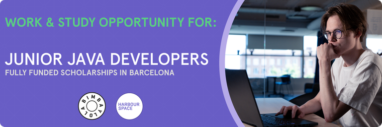

# Announcement

Hello Codeforces!

On [Friday, November 3, 2023 at 20:35UTC+6](https://codeforces.com/https://www.timeanddate.com/worldclock/fixedtime.html?day=3&month=11&year=2023&hour=17&min=35&sec=0&p1=166) [Educational Codeforces Round 157 (Rated for Div. 2)](https://codeforces.com/contest/1895 "Educational Codeforces Round 157 (Rated for Div. 2)") will start.

Series of Educational Rounds continue being held as [Harbour.Space University](https://codeforces.com/https://harbour.space/) initiative! You can read the details about the cooperation between [Harbour.Space University](https://codeforces.com/https://harbour.space/) and Codeforces in the [blog post](https://mirror.codeforces.com/blog/entry/51208).

This round will be **rated for the participants with rating lower than 2100**. It will be held on extended ICPC rules. The penalty for each incorrect submission until the submission with a full solution is 10 minutes. After the end of the contest, you will have 12 hours to hack any solution you want. You will have access to copy any solution and test it locally.

You will be given **6 or 7 problems** and **2 hours** to solve them.

The problems were invented and prepared by Adilbek [adedalic](https://codeforces.com/profile/adedalic "International Master adedalic") Dalabaev, Ivan [BledDest](https://codeforces.com/profile/BledDest "International Grandmaster BledDest") Androsov, Maksim [Neon](https://codeforces.com/profile/Neon "Candidate Master Neon") Mescheryakov, Artem [Ferume](https://codeforces.com/profile/Ferume "Master Ferume") Ilikaev, Ruslan [AcidWrongGod](https://codeforces.com/profile/AcidWrongGod "International Master AcidWrongGod") Kapralov, Alexey [ashmelev](https://codeforces.com/profile/ashmelev "Grandmaster ashmelev") Shmelev, Alex [fcspartakm](https://codeforces.com/profile/fcspartakm "Candidate Master fcspartakm") Frolov, Dmitry [DmitryKlenov](https://codeforces.com/profile/DmitryKlenov "Expert DmitryKlenov") Klenov, Dmitry [dmitryme](https://codeforces.com/profile/dmitryme "Unrated, dmitryme") Mescheryakov, Elena [elena](https://codeforces.com/profile/elena "Unrated, elena") Rogacheva and me. Also, huge thanks to Mike [MikeMirzayanov](https://codeforces.com/profile/MikeMirzayanov "Headquarters, MikeMirzayanov") Mirzayanov for great systems Polygon and Codeforces.

**Please note that the problems of this round partially intersect with the problems of the Southern and Volga Russian Regional Contest. If you took part in that contest, please refrain from participating in the round.**

Good luck to all the participants!

Our friends at Harbour.Space also have a message for you:

  **WORK & STUDY OPPORTUNITY IN BARCELONA — BIMBA Y LOLA x HARBOUR.SPACE UNIVERSITY** *BIMBA Y LOLA has partnered with Harbour.Space University to offer a **Master's Degree scholarship in Computer Science**, as well as work experience as a **Junior Java Developer** at the Development Team in BIMBA y LOLA.* 

*At BIMBA Y LOLA, they understand the importance of counting on the most creative professionals, those with an enterprising spirit and passion for their work. They are seduced by talent, sensibility, initiative, an analytical nature, commitment to quality, a keen eye and a love for detail. And, of course, a clear vocation for fashion.*

*If you share these values, we are offering a young, dynamic and stimulating environment; one in which to progress and develop professionally; a company present in over 18 countries and embarked on an ambitious international expansion plan.*

*All successful applicants will be eligible for a 100% Tuition Fee Scholarship (29,900€/year) provided by BIMBA Y LOLA.*

***Requirements:***

 * ***Spanish** and English language proficiency is a **MUST***
* *Bachelor's degree in the field of Mathematics, Statistics, Data Science, Computer Science or similar*

*The candidate should be familiar with:*

 * *Agile Methodologies (scrum)*
* *GIT*
* *Java 8/11+*
* *Spring*
* *Maven*
* *JUnit*
* *Mockito*
* *UML*
* *HTML*
* *CSS*
* *Javascript*
* *ReactJS*
* *SQL Server/MySQL*

*Desirable skills:*

 * *Azure*
* *Azure DevOps — Pipelines*
* *Docker*
* *Kubernetes*
* *Helm*
* *Jira*
* *Confluence*

***Apprenticeship Summary:***

 * *100% Tuition Fee Scholarship to study a Master’s Degree in Computer Science for one year.*
* *4 hours/day internship on campus.*
* *Competitive compensation.*
* *Opportunity to join the company full-time after graduation.*
* ***Please note** that preselected candidates will be requested to pay a non-refundable Application Fee of 125€ for assessment.*

***Candidate’s commitment:***

 * *Study Commitment: 4 hours/day*
* *‍You will complete 15 modules (each three weeks long) in one year.*
* *Daily class workload is 3 hours, plus homework to complete in your own time.*
* *Work Commitment: 4+ hours/day*

*Immerse yourself in the professional world during your apprenticeship. You’ll learn from the best and get to apply your newly acquired knowledge in the field from day one.*

  [Apply here →](https://scholarship.harbour.space/work-study/java-developer-bimba?utm_source=codeforces&utm_medium=partner&utm_campaign=bcn_b2b) **UPD:** [Editorial is out](Tutorial.md)

