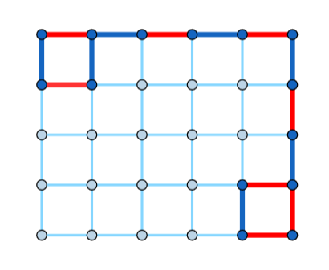
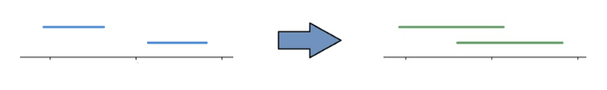
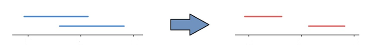
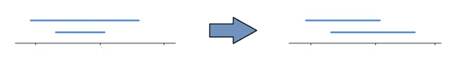
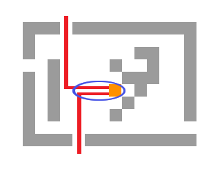

# Tutorial_(en)

[1898A *-* Milica and String](../problems/A._Milica_and_String.md)
-----------------------------------------------------------------------------

Author: [n0sk1ll](https://codeforces.com/profile/n0sk1ll "Master n0sk1ll")

 **Hint**In one move, Milica can replace the whole string with AA…A. In her second move, she can replace a prefix of length k with BB…B. The process takes no more than 2 operations. The question remains — when can we do better?

 **Solution**In the *hint* section, we showed that the minimum number of operations is 0, 1, or 2. We have 3 cases:

 1. No operations are needed if s already contains k characters B.
2. Else, we can use brute force to check if changing some prefix leads to s having k Bs. If we find such a prefix, we print it as the answer, and use only one operation. There are O(n) possibilities. Implementing them takes O(n) or O(n2) time.
3. Else, we use the two operations described in the hint section.
 **Bonus**A fun fact is that only one operation is enough. Can you prove it?

[1898B - Milena and Admirer](../problems/B._Milena_and_Admirer.md "Codeforces Round 910 (Div. 2)")
------------------------------------------------------------------------------------------------------------

Author: [BULLMCHOW](https://codeforces.com/profile/BULLMCHOW "Expert BULLMCHOW") & [n0sk1ll](https://codeforces.com/profile/n0sk1ll "Master n0sk1ll")

 **Hint**Try a greedy approach. That is, split each ai only as many times as necessary (and try to create almost equal parts).

 **Solution**We will iterate over the array from right to left. Then, as described in the hint section, we will split the current ai and create almost equal parts. For example, 5 split into three parts forms the subarray [1,2,2]. Splitting 8 into four parts forms the subarray [2,2,2,2]. Notice that the subarrays must be sorted. Because we want to perform as few splits as possible, the rightmost endpoint value should be as high as possible (as long as it is lower than or equal to the leftmost endpoint of the splitting of ai+1 if it exists).

When we iterate over the array, it is enough to set the current ai to the leftmost endpoint of the splitting (the smallest current value). It will help to calculate the optimal splitting of ai−1. For the current ai, we want to find the least k such that we can split ai−1 into k parts so the rightmost endpoint is less than or equal to ai. More formally, we want ⌈ai−1k⌉≤ai to hold. Afterwards, we set ai−1 to ⌊ai−1k⌋ and continue with our algorithm. The simplest way to find the desired k is to apply the following formula: 

 k=⌈ai−1ai⌉The answer is the sum over all k−1.

 **Bonus**There are q≤2⋅105 queries: given an index i and an integer x>1, set ai:=⌈aix⌉. Modify the array and print the answer to the original problem. Please note that the queries stack.

[1898C - Colorful Grid](../problems/C._Colorful_Grid.md "Codeforces Round 910 (Div. 2)")
-------------------------------------------------------------------------------------------------------

Author: [n0sk1ll](https://codeforces.com/profile/n0sk1ll "Master n0sk1ll")

 **Hint**The solution does not exist only for "small" k or when n+m−k is an odd integer. Try to find a construction otherwise.

 **Solution**Read the hint for the condition of the solution's existence. We present a single construction that solves the problem for each valid k.

One can verify that the pattern holds in general.

 **Bonus**How would you write a checker? That is, how would you check that a valid walk of length k+1 exists in the given grid (with all the edges colored beforehand)?

[1898D - Absolute Beauty](../problems/D._Absolute_Beauty.md "Codeforces Round 910 (Div. 2)")
---------------------------------------------------------------------------------------------------------

Author: [n0sk1ll](https://codeforces.com/profile/n0sk1ll "Master n0sk1ll")

 **Hint**If ai>bi, swap them. Imagine the pairs (ai,bi) as intervals. How can we visualize the problem?

 **Solution**The pair (ai,bi) represents some interval, and |ai−bi| is its length. Let us try to maximize the sum of the intervals' lengths. We present three cases of what a swap does to two arbitrary intervals.

Notice how the sum of the lengths increases only in the first case. We want the distance between the first interval's right endpoint and the second interval's left endpoint to be as large as possible. So we choose integers i and j such that i≠j and aj−bi is maximized. We add twice the value, if it is positive, to the original absolute beauty. If the value is 0 or negative, we simply do nothing.

To quickly find the maximum of aj−bi over all i and j, we find the maximum of a1,a2,…an and the minimum of b1,b2,…bn. Subtracting the two extremum values produces the desired result.

 **Bonus**How to handle point updates? (change a single value in either a or b, and print the answer after each query.)

[1898E - Sofia and Strings](../problems/E._Sofia_and_Strings.md "Codeforces Round 910 (Div. 2)")
-----------------------------------------------------------------------------------------------------------

Author: [BULLMCHOW](https://codeforces.com/profile/BULLMCHOW "Expert BULLMCHOW")

 **Hint**Notice how sorting only the substrings of length 2 is enough. Try a greedy approach.

 **Solution**We sort only the substrings of length 2. We can swap two adjacent characters if the first is greater than or equal to the second. Let us fix some character si and presume we want to change its position to j. We have to perform the described swaps if they are possible. More formally:

 * if j<i, then every character in the segment sjsj+1…si−1 must be greater than or equal to si;
* if i<j, then every character in the segment si+1si+2…sj must be smaller than or equal to si.

We want to reorder the string s and get the string s′. Then, we check if we can delete some characters in s′ to achieve t. In other words, we want t to be a subsequence of s′. A general algorithm that checks if the string a is a subsequence of the string b is as follows. We iterate through a, and for each character, we find its first next appearance in b. If such a character does not exist, we conclude that a is not a subsequence of b. If we complete the iteration gracefully, then a is a subsequence of b. We will try to check if t is a subsequence of s, but we allow ourselves to modify s along the way.

We maintain 26 queues for positions of each lowercase English letter in the string s. We iterate through the string t, and for every character ti, we try to move the first available equivalent character in s to position i. In other words, at every moment, the prefix of string s is equal to the prefix of string t (if possible). For the current character ti and the corresponding sj, prefixes t1t2…ti−1 and s1s2…si−1 are the same, which means that j≥i. To move sj to position i, we need to delete all characters between si and sj that are smaller than sj. We will delete them and all characters from the current prefix s1s2…si−1 from the queues because they are no longer candidates for sj. By doing so, sj will be the first character in the corresponding queue. If at some moment in our greedy algorithm, the queue we are looking for becomes empty, then the answer is "NO". Otherwise, we will make the prefix s1s2…sm equal to the t and delete the remaining characters from s.

Why is this greedy approach optimal? Let's suppose for some character ti1 we chose sj1 and for ti2 we chose sj2, such that i1<i2, j1>j2 and ti1=ti2=sj1=sj2. We need to prove that if we can move sj1 to position i1 and ti2 to position i2, when we can move sj2 to i1 and sj1 to i2. In the moment when we chose sj1, prefixes t1t2…ti1−1 and s1s2…si1−1 are the same, so j1≥i1. Similarly, j2≥i2, which means the only possibility is i1<i2≤j2<j1.

If we can move sj1 to position i1, than we can also move sj2 to i1 because sj1=sj2 and j2<j1. Also, if we can move sj1 to i1, than we can move sj1 to i2 because i1<i2, from which it follows that we can move sj2 to i2, because sj2=sj1 and j2<j1.

The overall complexity is O(α⋅(n+m)), where α is the alphabet size (α=26 in this problem).

 **Bonus**Solve the problem when the size of the alphabet is arbitrary (up to n).

[1898F - Vova Escapes the Matrix](../problems/F._Vova_Escapes_the_Matrix.md "Codeforces Round 910 (Div. 2)")
-----------------------------------------------------------------------------------------------------------------

Author: [n0sk1ll](https://codeforces.com/profile/n0sk1ll "Master n0sk1ll")

 **Hint**To solve the problem for matrices of 3-rd type, find the shortest path to 2 closest exits with a modification of BFS. Block all cells not belonging to the path with obstacles.

 **Solution**For a matrix of type 1, Misha can block all empty cells (except the one Vova stands on).

For a matrix of type 2, Misha finds the shortest path to some exit with a single BFS and then blocks every other cell.

Matrices of type 3 are more complicated. We want to find two shortest paths to the two closest exits and block the remaining empty cells.

But, notice how the paths will likely share their beginnings. We do not have to count those cells twice. Let's take a look at the junction where the two paths merge. If we first fix the junction, finding the shortest path to Vova can be done by running a single BFS and precalculating the shortest distances from each cell to Vova. Finding the shortest path from the junction to the two closest exits can also be done with BFS and precalculation. We modify the BFS, making it multi-source, with a source in each exit. Also, we will allow each cell to be visited twice (but by different exits). We will need to maintain the following data for each cell:

 * How many times was it visited;
* The last exit/source that visited it;
* The sum of paths from all exits/sources that visited the cell so far.

Running the BFS with proper implementation produces the answer. When everything said is precalculated, we fix the junction in O(nm) ways (each empty cell can be a valid junction), and then calculate the shortest path from Vova to the two closest cells in O(1) per junction.

Total complexity is O(nm).

 **Bonus**Solve the problem with LCA, or report that such a solution does not exist.

