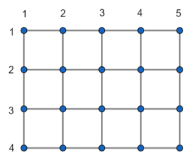
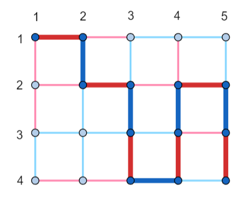

<h1 style='text-align: center;'> C. Colorful Grid</h1>

<h5 style='text-align: center;'>time limit per test: 2 seconds</h5>
<h5 style='text-align: center;'>memory limit per test: 256 megabytes</h5>

Elena has a grid formed by $n$ horizontal lines and $m$ vertical lines. The horizontal lines are numbered by integers from $1$ to $n$ from top to bottom. The vertical lines are numbered by integers from $1$ to $m$ from left to right. For each $x$ and $y$ ($1 \leq x \leq n$, $1 \leq y \leq m$), the notation $(x, y)$ denotes the point at the intersection of the $x$-th horizontal line and $y$-th vertical line.

Two points $(x_1,y_1)$ and $(x_2,y_2)$ are adjacent if and only if $|x_1-x_2| + |y_1-y_2| = 1$.

  The grid formed by $n=4$ horizontal lines and $m=5$ vertical lines. Elena calls a sequence of points $p_1, p_2, \ldots, p_g$ of length $g$ a walk if and only if all the following conditions hold: 

* The first point $p_1$ in this sequence is $(1, 1)$.
* The last point $p_g$ in this sequence is $(n, m)$.
* For each $1 \le i < g$, the points $p_i$ and $p_{i+1}$ are adjacent.

## Note

 that the walk may contain the same point more than once. In particular, it may contain point $(1, 1)$ or $(n, m)$ multiple times.

There are $n(m-1)+(n-1)m$ segments connecting the adjacent points in Elena's grid. Elena wants to color each of these segments in blue or red color so that there exists a walk $p_1, p_2, \ldots, p_{k+1}$ of length $k+1$ such that 

* out of $k$ segments connecting two consecutive points in this walk, no two consecutive segments have the same color (in other words, for each $1 \le i < k$, the color of the segment between points $p_i$ and $p_{i+1}$ differs from the color of the segment between points $p_{i+1}$ and $p_{i+2}$).

Please find any such coloring or report that there is no such coloring.

### Input

Each test contains multiple test cases. The first line contains the number of test cases $t$ ($1 \leq t \leq 32$). The description of test cases follows.

The only line of each test case contains three integers $n$, $m$, and $k$ ($3 \leq n,m \leq 16$, $1 \leq k \leq 10^9$) — the dimensions of the grid and the number of segments in the walk Elena is looking for.

### Output

For each test case, output "NO" if it is not possible to color each of the $n(m-1)+(n-1)m$ segments in blue or red color, so that there exists a walk of length $k+1$ satisfying the condition from the statement.

Otherwise, output in the first line "YES", and then provide the required coloring.

In each of the first $n$ lines of coloring description, output $m-1$ space-separated characters. The $j$-th character in the $i$-th of these $n$ lines should denote the color of the segment between points $(i,j)$ and $(i,j+1)$. Here, use 'B' to denote the blue color and 'R' to denote the red color.

In each of the next $n-1$ lines of coloring description, output $m$ space-separated characters. The $j$-th character in the $i$-th of these $n-1$ lines should denote the color of the segment between points $(i,j)$ and $(i+1,j)$. Similarly, use 'B' to denote the blue color and 'R' to denote the red color.

You can output each letter in the answer in any case (upper or lower). For example, the strings "yEs", "yes", "Yes", and "YES" will be recognized as positive responses, and both 'R' and 'r' are valid notation of red.

## Example

### Input


```text
54 5 113 3 23 4 10000000003 3 125884 4 8
```
### Output

```text

YES
R R B B
R R R R
B B B R
R R B B
R B B R B
R B B B B
B B R R R
NO
NO
YES
R B
B B
B R
B B R
R B B
YES
B B R
R B R
B R R
R R B
B R R B
B B B B
B R R R

```
## Note

In the first test case, one of the correct answers is shown in the picture below. The color-alternating walk of length $12$ is highlighted.

  In the second and the third test cases, it can be shown that there is no coloring satisfying the condition from the statement.


#### Tags 

#1700 #OK #constructive_algorithms 

## Blogs
- [All Contest Problems](../Codeforces_Round_910_(Div._2).md)
- [Announcement (en)](../blogs/Announcement_(en).md)
- [Tutorial (en)](../blogs/Tutorial_(en).md)
