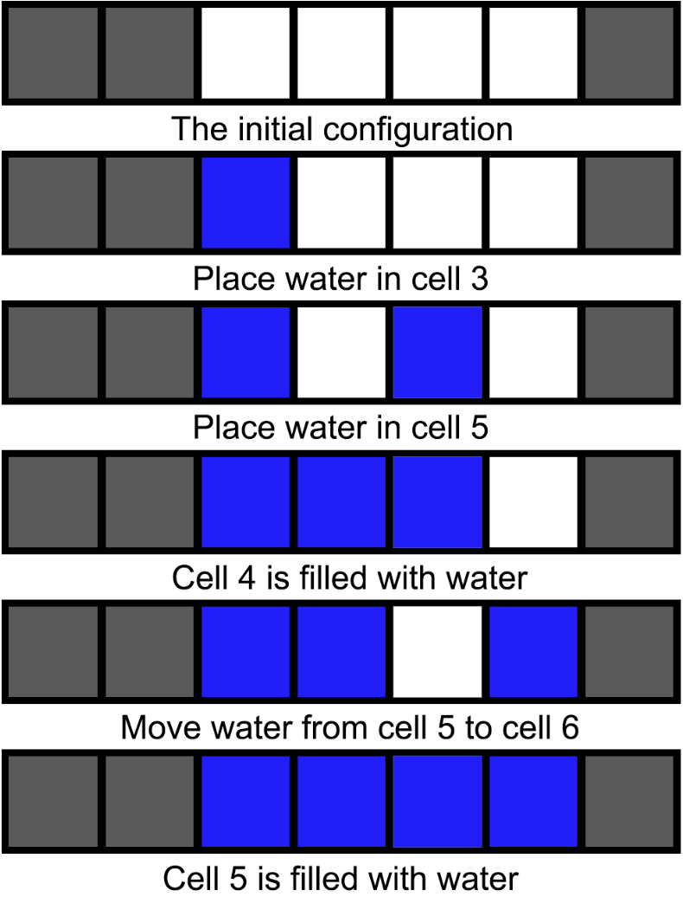

<h1 style='text-align: center;'> A. Cover in Water</h1>

<h5 style='text-align: center;'>time limit per test: 1 second</h5>
<h5 style='text-align: center;'>memory limit per test: 256 megabytes</h5>

Filip has a row of cells, some of which are blocked, and some are empty. He wants all empty cells to have water in them. He has two actions at his disposal:

* $1$ — place water in an empty cell.
* $2$ — remove water from a cell and place it in any other empty cell.

If at some moment cell $i$ ($2 \le i \le n-1$) is empty and both cells $i-1$ and $i+1$ contains water, then it becomes filled with water.

Find the minimum number of times he needs to perform action $1$ in order to fill all empty cells with water. 

## Note

 that you don't need to minimize the use of action $2$. 
## Note

 that blocked cells neither contain water nor can Filip place water in them.

### Input

Each test contains multiple test cases. The first line contains the number of test cases $t$ ($1 \le t \le 100$). The description of the test cases follows.

The first line of each test case contains a single integer $n$ ($1 \le n \le 100$) — the number of cells. 

The next line contains a string $s$ of length $n$. The $i$-th character of $s$ is '.' if the cell $i$ is empty and '#' if cell $i$ is blocked.

### Output

For each test case, output a single number — the minimal amount of actions $1$ needed to fill all empty cells with water.

## Example

### Input


```text
53...7##....#7..#.#..4####10#...#..#.#
```
### Output

```text

2
2
5
0
2

```
## Note

Test Case 1

In the first test case, Filip can put water in cells $1$ and $3$. As cell $2$ is between $2$ cells with water, it gets filled with water too.

Test Case 2

In the second case, he can put water sources in cells $3$ and $5$. That results in cell $4$ getting filled with water. Then he will remove water from cell $5$ and place it into cell $6$. As cell $5$'s neighbors, cell $4$ and cell $6$, have water in them, cell $5$ also gets filled with water. You can see the illustration of this case below.

  Operations in the second test case. White cells are empty, grey ones are blocked, and blue ones are water. Test Case 3

In the third case, he can put water in all the empty cells. That requires $5$ actions of type $1$.

Test Case 4

In the fourth case, there are no empty cells. Therefore, he does not have to put any water in them.

Test Case 5

In the fifth test case, there exists a sequence of actions that requires only $2$ type $1$ actions.


#### Tags 

#800 #NOT OK #constructive_algorithms #greedy #implementation #strings 

## Blogs
- [All Contest Problems](../Codeforces_Round_911_(Div._2).md)
- [Announcement (en)](../blogs/Announcement_(en).md)
- [Tutorial (en)](../blogs/Tutorial_(en).md)
