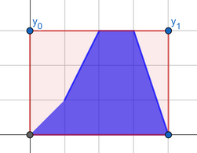
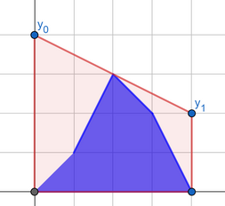

<h1 style='text-align: center;'> F. Landscaping</h1>

<h5 style='text-align: center;'>time limit per test: 2 seconds</h5>
<h5 style='text-align: center;'>memory limit per test: 256 megabytes</h5>

You are appointed to a very important task: you are in charge of flattening one specific road.

The road can be represented as a polygonal line starting at $(0, 0)$, ending at $(n - 1, 0)$ and consisting of $n$ vertices (including starting and ending points). The coordinates of the $i$-th vertex of the polyline are $(i, a_i)$.

"Flattening" road is equivalent to choosing some line segment from $(0, y_0)$ to $(n - 1, y_1)$ such that all points of the polyline are below the chosen segment (or on the same height). Values $y_0$ and $y_1$ may be real.

You can imagine that the road has some dips and pits, and you start pouring pavement onto it until you make the road flat. Points $0$ and $n - 1$ have infinitely high walls, so pavement doesn't fall out of segment $[0, n - 1]$.

  The cost of flattening the road is equal to the area between the chosen segment and the polyline. You want to minimize the cost, that's why the flattened road is not necessary horizontal.

But there is a problem: your data may be too old, so you sent a person to measure new heights. The person goes from $0$ to $n - 1$ and sends you new heights $b_i$ of each vertex $i$ of the polyline.

Since measuring new heights may take a while, and you don't know when you'll be asked, calculate the minimum cost (and corresponding $y_0$ and $y_1$) to flatten the road after each new height $b_i$ you get.

#### Input

The first line contains a single integer $n$ ($3 \le n \le 2 \cdot 10^5$) — the number of vertices of the polyline.

The second line contains $n$ integers $a_0, a_1, \dots, a_{n - 1}$ ($0 \le a_i \le 10^9$; $a_0 = a_{n - 1} = 0$) — the heights of the corresponding vertices.

The third line contains $n$ integers $b_0, b_1, \dots, b_{n - 1}$ ($0 \le b_i \le 10^9$; $b_0 = b_{n - 1} = 0$) — the new heights of the corresponding vertices.

#### Output

Print $n$ numbers: as the $i$-th number ($0$-indexed) print $y_0 + y_1$ of the "best segment" (i. e. the sum of coordinates of the segment that gives the minimum cost) if you already know actual heights $b_0, \dots, b_i$.

If there are several "best segments", print the minimum possible $y_0 + y_1$ among them.

Your answer is considered correct if its absolute or relative error does not exceed $10^{-9}$.

Formally, let your answer be $x$, and the jury's answer be $y$. Your answer is accepted if and only if $\frac{|x - y|}{\max{(1, |y|)}} \le 10^{-9}$.

## Examples

#### Input


```text
50 5 1 3 00 1 3 2 0
```
#### Output

```text

8.000000000000 4.000000000000 6.000000000000 6.000000000000 6.000000000000

```
#### Input


```text
60 4 1 3 3 00 1 4 0 1 0
```
#### Output

```text

7.000000000000 5.000000000000 7.500000000000 7.500000000000 6.666666666667 6.666666666667

```
## Note

The first answer in the first example is shown on the picture above.

You can achieve the second answer with the following "best segment": 

  You can achieve the third answer using the following "best segment": 

  You can achieve the fourth answer with the "best segment" shown below: 

  

#### Tags 

#2900 #NOT OK #binary_search #geometry #two_pointers 

## Blogs
- [All Contest Problems](../Educational_Codeforces_Round_158_(Rated_for_Div._2).md)
- [Announcement](../blogs/Announcement.md)
- [Tutorial](../blogs/Tutorial.md)
