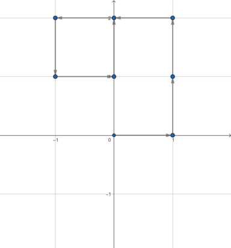
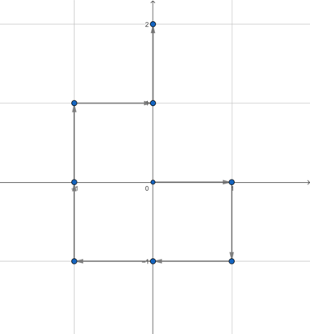
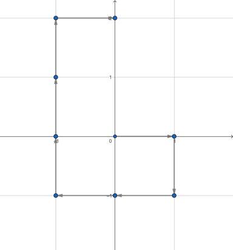

<h1 style='text-align: center;'> D. Robot Queries</h1>

<h5 style='text-align: center;'>time limit per test: 2 seconds</h5>
<h5 style='text-align: center;'>memory limit per test: 256 megabytes</h5>

There is an infinite $2$-dimensional grid. Initially, a robot stands in the point $(0, 0)$. The robot can execute four commands:

* U — move from point $(x, y)$ to $(x, y + 1)$;
* D — move from point $(x, y)$ to $(x, y - 1)$;
* L — move from point $(x, y)$ to $(x - 1, y)$;
* R — move from point $(x, y)$ to $(x + 1, y)$.

You are given a sequence of commands $s$ of length $n$. Your task is to answer $q$ independent queries: given four integers $x$, $y$, $l$ and $r$; determine whether the robot visits the point $(x, y)$, while executing a sequence $s$, but the substring from $l$ to $r$ is reversed (i. e. the robot performs commands in order $s_1 s_2 s_3 \dots s_{l-1} s_r s_{r-1} s_{r-2} \dots s_l s_{r+1} s_{r+2} \dots s_n$).

##### Input

The first line contains two integers $n$ and $q$ ($1 \le n, q \le 2 \cdot 10^5$) — the length of the command sequence and the number of queries, respectively.

The second line contains a string $s$ of length $n$, consisting of characters U, D, L and/or R.

Then $q$ lines follow, the $i$-th of them contains four integers $x_i$, $y_i$, $l_i$ and $r_i$ ($-n \le x_i, y_i \le n$; $1 \le l \le r \le n$) describing the $i$-th query.

##### Output

For each query, print YES if the robot visits the point $(x, y)$, while executing a sequence $s$, but the substring from $l$ to $r$ is reversed; otherwise print NO.

## Examples

##### Input


```text
8 3RDLLUURU-1 2 1 70 0 3 40 1 7 8
```
##### Output

```text

YES
YES
NO

```
##### Input


```text
4 2RLDU0 0 2 2-1 -1 2 3
```
##### Output

```text

YES
NO

```
##### Input


```text
10 6DLUDLRULLD-1 0 1 10-1 -2 2 5-4 -2 6 10-1 0 3 90 1 4 7-3 -1 5 8
```
##### Output

```text

YES
YES
YES
NO
YES
YES

```
## Note

In the first query of the first sample, the path of the robot looks as follows: 

  In the second query of the first sample, the path of the robot looks as follows: 

  In the third query of the first sample, the path of the robot looks as follows: 

  

#### Tags 

#1900 #OK #binary_search #data_structures #dp #implementation 

## Blogs
- [All Contest Problems](../Educational_Codeforces_Round_159_(Rated_for_Div._2).md)
- [Announcement](../blogs/Announcement.md)
- [Tutorial](../blogs/Tutorial.md)
